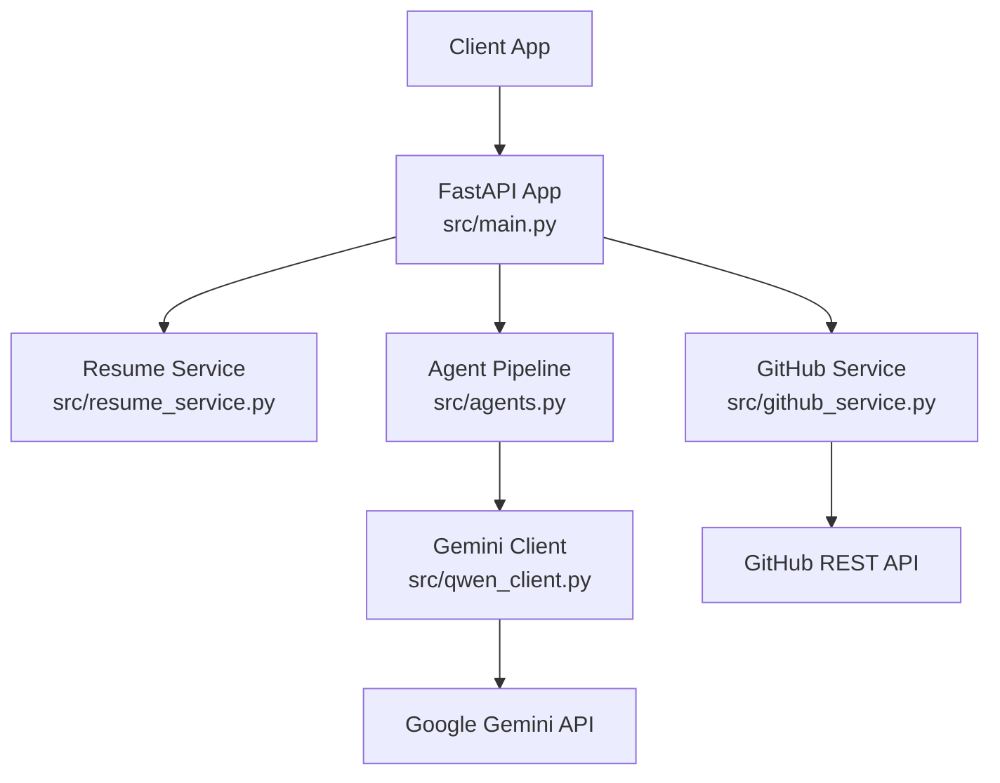
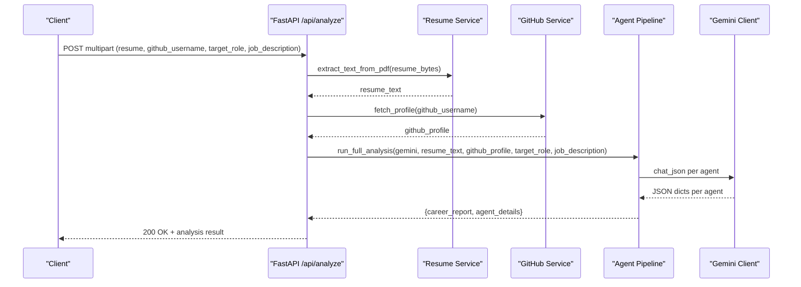
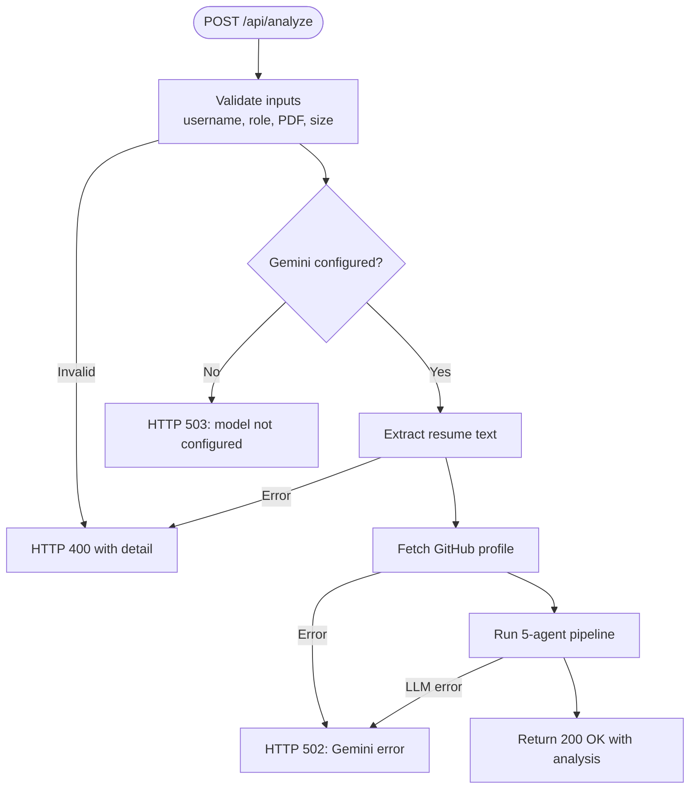
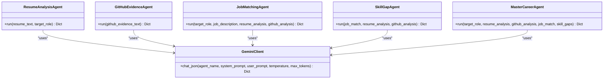
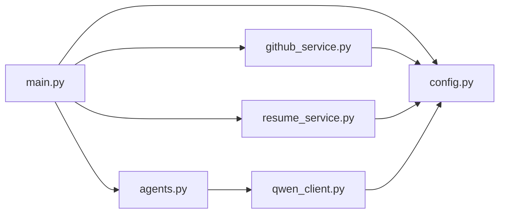

# API Reference

<cite>
**Referenced Files in This Document**
- [main.py](file://src/main.py)
- [config.py](file://src/config.py)
- [agents.py](file://src/agents.py)
- [github_service.py](file://src/github_service.py)
- [resume_service.py](file://src/resume_service.py)
- [qwen_client.py](file://src/qwen_client.py)
- [README.md](file://README.md)
</cite>

## Update Summary
**Changes Made**
- Updated LLM provider from Alibaba Cloud Qwen to Google Gemini throughout the documentation
- Enhanced error handling documentation with comprehensive HTTP status codes
- Added complete API endpoint specifications with detailed request/response schemas
- Updated authentication methods to reflect current implementation (no built-in auth)
- Expanded rate limiting considerations for both GitHub API and Gemini API
- Added concrete examples for curl and JavaScript fetch requests
- Documented complete multi-agent pipeline response structure

## Table of Contents
1. [Introduction](#introduction)
2. [Project Structure](#project-structure)
3. [Core Components](#core-components)
4. [Architecture Overview](#architecture-overview)
5. [Detailed Component Analysis](#detailed-component-analysis)
6. [Dependency Analysis](#dependency-analysis)
7. [Performance Considerations](#performance-considerations)
8. [Troubleshooting Guide](#troubleshooting-guide)
9. [Conclusion](#conclusion)
10. [Appendices](#appendices)

## Introduction
CareerOS AI is a FastAPI-based service that performs multi-agent career readiness analysis by combining resume text and GitHub profile evidence, optionally matched against a target job description. It exposes:
- POST /api/analyze: multipart form endpoint to run the full 5-agent analysis pipeline using Google Gemini.
- GET /health: lightweight status check including configuration validation for external services.

The system uses Google Gemini via the google-generativeai SDK and fetches public GitHub data to verify skills beyond resume claims.

## Project Structure
The application is organized into clear modules:
- API layer: FastAPI endpoints in main.py
- Configuration: environment-driven settings in config.py
- Services: resume PDF parsing and GitHub profile fetching
- Agents: five specialized agents orchestrated to produce a final report
- LLM client: Gemini wrapper with JSON extraction and retry logic

**Diagram sources**
- [main.py:28-147](file://src/main.py#L28-L147)
- [agents.py:295-334](file://src/agents.py#L295-L334)
- [qwen_client.py:74-161](file://src/qwen_client.py#L74-L161)
- [github_service.py:63-89](file://src/github_service.py#L63-L89)
- [resume_service.py:24-57](file://src/resume_service.py#L24-L57)

**Section sources**
- [main.py:28-147](file://src/main.py#L28-L147)
- [config.py:23-72](file://src/config.py#L23-L72)

## Core Components
- POST /api/analyze
  - Accepts multipart/form-data fields: resume (PDF), github_username, target_role, and optional job_description.
  - Validates inputs, enforces file type and size limits, checks Gemini configuration, extracts resume text, fetches GitHub profile, runs the agent pipeline, and returns a structured response.
- GET /health
  - Returns application metadata and configuration status flags (model configured, GitHub token presence).

Authentication
- No built-in authentication middleware is implemented. Access control must be provided at the deployment boundary (e.g., reverse proxy, WAF, or gateway).

Rate limiting
- No server-side rate limiting is implemented. External rate limits apply:
  - GitHub REST API: 60 requests/hour without token; up to 5000/hour with GITHUB_TOKEN.
  - Google Gemini API: subject to provider rate limits and quotas based on your Google AI Studio account.

Response status codes
- 200 OK: successful analysis.
- 400 Bad Request: invalid input (missing fields, non-PDF, empty file, too large).
- 502 Bad Gateway: upstream failures (GitHub API errors, Gemini API errors).
- 503 Service Unavailable: Gemini not configured.

Error handling strategy
- Input validation raises HTTPException with descriptive messages.
- Upstream errors are wrapped as domain exceptions and converted to appropriate HTTP status codes.
- The frontend expects a JSON body with a detail field on error responses.

**Section sources**
- [main.py:58-147](file://src/main.py#L58-L147)
- [github_service.py:22-60](file://src/github_service.py#L22-L60)
- [resume_service.py:17-57](file://src/resume_service.py#L17-L57)
- [qwen_client.py:31-161](file://src/qwen_client.py#L31-L161)

## Architecture Overview
The analyze endpoint orchestrates a 5-agent pipeline:
1. Resume Analysis Agent: extracts claimed skills and experience from resume text.
2. GitHub Evidence Agent: derives verified skills from public GitHub activity.
3. Job Matching Agent: matches candidate against target role requirements (optional job description).
4. Skill Gap Agent: identifies critical and moderate gaps with actionable insights.
5. Master Career Agent: synthesizes all outputs into a final career report with scores, strengths, gaps, roadmap, and project recommendations.

**Diagram sources**
- [main.py:58-147](file://src/main.py#L58-L147)
- [agents.py:295-334](file://src/agents.py#L295-L334)
- [qwen_client.py:98-161](file://src/qwen_client.py#L98-L161)
- [github_service.py:63-89](file://src/github_service.py#L63-L89)
- [resume_service.py:24-57](file://src/resume_service.py#L24-L57)

## Detailed Component Analysis

### Endpoint: POST /api/analyze
- Purpose: Run the full 5-agent career analysis using resume and GitHub evidence.
- Request format: multipart/form-data
  - resume: PDF file (required)
  - github_username: string (required)
  - target_role: string (required)
  - job_description: string (optional)
- Validation and constraints:
  - github_username and target_role must be non-empty after trimming.
  - resume filename must end with .pdf.
  - File size limited by MAX_RESUME_MB (default 10 MB).
  - Empty files are rejected.
  - Gemini must be configured (GOOGLE_API_KEY set); otherwise returns 503.
- Processing flow:
  - Extract resume text (resume_service.extract_text_from_pdf).
  - Fetch GitHub profile (github_service.fetch_profile).
  - Run agent pipeline (agents.run_full_analysis).
- Response schema:
  - status: "success"
  - target_role: string
  - github_username: string
  - analysis: object containing the final career report produced by the Master Career Agent
    - career_readiness_score: number (0–100)
    - score_breakdown: object with resume_quality, evidence_strength, job_match, skill_coverage (each 0–100)
    - verified_skills: array of objects {skill, evidence}
    - unverified_skills: array of objects {skill, reason}
    - strengths: array of strings
    - skill_gaps: array of objects {skill, severity, why_it_matters}
    - evidence: array of objects {source, detail}
    - recommendations: array of strings
    - roadmap_30_days: array of exactly 4 weekly plans {week, focus, tasks, outcome}
    - recommended_project: object {title, description, skills_practiced, why_it_helps}
    - hiring_readiness_summary: string
  - agent_details: object with raw outputs from each specialist agent
    - resume_analysis
    - github_analysis
    - job_match
    - skill_gaps

**Diagram sources**
- [main.py:58-147](file://src/main.py#L58-L147)
- [resume_service.py:24-57](file://src/resume_service.py#L24-L57)
- [github_service.py:63-89](file://src/github_service.py#L63-L89)
- [agents.py:295-334](file://src/agents.py#L295-L334)
- [qwen_client.py:98-161](file://src/qwen_client.py#L98-L161)

**Section sources**
- [main.py:58-147](file://src/main.py#L58-L147)
- [agents.py:295-334](file://src/agents.py#L295-L334)

### Endpoint: GET /health
- Purpose: Lightweight health check and configuration validation.
- Response fields:
  - status: "ok"
  - app: application name
  - version: application version
  - model: active Gemini model name
  - gemini_configured: boolean indicating whether GOOGLE_API_KEY is set
  - github_token_set: boolean indicating whether GITHUB_TOKEN is present

Use this endpoint to validate service availability and configuration before invoking analysis.

**Section sources**
- [main.py:45-55](file://src/main.py#L45-L55)
- [config.py:23-72](file://src/config.py#L23-L72)

### Agent Pipeline and Data Models
- ResumeAnalysisAgent: produces candidate_name, summary, years_of_experience, claimed_skills, education, experience_highlights, resume_quality_notes.
- GitHubEvidenceAgent: produces verified_skills (with evidence and confidence), activity_summary, project_quality_score, project_quality_notes, repo_highlights.
- JobMatchingAgent: produces required_skills (with importance), match_percentage, matched_skills, missing_skills, role_insights.
- SkillGapAgent: produces critical_gaps, moderate_gaps, quick_wins.
- MasterCareerAgent: synthesizes final report with career_readiness_score, score_breakdown, verified_skills, unverified_skills, strengths, skill_gaps, evidence, recommendations, roadmap_30_days, recommended_project, hiring_readiness_summary.

**Diagram sources**
- [agents.py:30-289](file://src/agents.py#L30-L289)
- [qwen_client.py:74-161](file://src/qwen_client.py#L74-L161)

**Section sources**
- [agents.py:30-289](file://src/agents.py#L30-L289)

## Dependency Analysis
- main.py depends on:
  - config.Settings for runtime parameters
  - resume_service.extract_text_from_pdf for PDF parsing
  - github_service.fetch_profile for GitHub data
  - qwen_client.GeminiClient for LLM calls
  - agents.run_full_analysis for orchestration
- github_service depends on:
  - config.settings for token and timeouts
  - requests for HTTP calls
  - Raises GitHubError on API issues
- resume_service depends on:
  - pypdf.PdfReader for PDF parsing
  - Raises ResumeError on invalid or unreadable PDFs
- qwen_client depends on:
  - google.generativeai for Gemini API calls
  - Raises GeminiError on network/auth/rate-limit/timeouts or invalid JSON

**Diagram sources**
- [main.py:11-21](file://src/main.py#L11-L21)
- [agents.py:21-24](file://src/agents.py#L21-L24)
- [github_service.py:12-17](file://src/github_service.py#L12-L17)
- [resume_service.py:9-14](file://src/resume_service.py#L9-L14)
- [qwen_client.py:18-24](file://src/qwen_client.py#L18-L24)

**Section sources**
- [main.py:11-21](file://src/main.py#L11-L21)
- [agents.py:21-24](file://src/agents.py#L21-L24)
- [github_service.py:12-17](file://src/github_service.py#L12-L17)
- [resume_service.py:9-14](file://src/resume_service.py#L9-L14)
- [qwen_client.py:18-24](file://src/qwen_client.py#L18-L24)

## Performance Considerations
- Concurrency: Endpoints are synchronous; FastAPI runs them in worker threads so long LLM calls do not block other requests. Ensure adequate worker count for your deployment.
- Latency: Each request triggers multiple LLM calls across five agents. Expect longer processing times; consider client-side retries with exponential backoff.
- Upload limits: Enforced by MAX_RESUME_MB and MAX_RESUME_CHARS to control prompt size and cost.
- External dependencies: GitHub API rate limits can throttle analysis; configure GITHUB_TOKEN to increase limits.
- Optimization tips:
  - Use smaller models (e.g., gemini-flash-latest) for faster responses when acceptable.
  - Tune GEMINI_TEMPERATURE and GEMINI_MAX_TOKENS for balance between quality and speed.
  - Cache repeated analyses if applicable (outside current scope).
  - Implement client-side queuing and progress indicators for long-running requests.

## Troubleshooting Guide
Common issues and resolutions:
- Missing or invalid resume:
  - Non-PDF file or empty file results in HTTP 400 with a descriptive detail message.
  - Scanned/image-only PDFs cannot be parsed; ensure text-based PDFs.
- Invalid GitHub username:
  - Empty or whitespace-only usernames raise GitHubError, surfaced as HTTP 400.
  - Unknown users return 404 from GitHub, mapped to HTTP 400.
- GitHub rate limit exceeded:
  - Without GITHUB_TOKEN, limit is 60 requests/hour; with token, up to 5000/hour.
  - When rate-limited, the service returns HTTP 502 with guidance to add a token.
- Gemini not configured:
  - If GOOGLE_API_KEY is missing, endpoint returns HTTP 503 with instructions.
- LLM call failures:
  - Network errors, auth failures, timeouts, or invalid JSON responses result in HTTP 502.
  - The client attempts one repair round for malformed JSON before failing.

Debugging steps:
- Call GET /health to confirm service availability and configuration flags.
- Inspect error.detail in responses for precise failure reasons.
- Verify environment variables: GOOGLE_API_KEY, GITHUB_TOKEN, GEMINI_MODEL.
- Test with minimal payloads and known-good resumes to isolate issues.

**Section sources**
- [main.py:74-131](file://src/main.py#L74-L131)
- [github_service.py:48-60](file://src/github_service.py#L48-L60)
- [resume_service.py:17-57](file://src/resume_service.py#L17-L57)
- [qwen_client.py:85-161](file://src/qwen_client.py#L85-L161)

## Conclusion
CareerOS AI provides a robust, evidence-based career readiness analysis through a well-structured API. The POST /api/analyze endpoint accepts multipart form data and returns a comprehensive report with scores, verified/unverified skills, strengths, gaps, evidence, recommendations, and a 30-day roadmap. The GET /health endpoint enables simple health and configuration checks. While no built-in authentication or rate limiting is implemented, the service integrates cleanly with standard deployment patterns to secure and scale access.

## Appendices

### Authentication Methods
- Not implemented in code. Deploy behind an authenticating gateway or reverse proxy to enforce API key, JWT, or IP allowlisting as needed.

### Error Handling Strategies
- Input validation errors: HTTP 400 with human-readable detail.
- Upstream failures (GitHub/Gemini): HTTP 502 with actionable detail.
- Missing model configuration: HTTP 503 with setup instructions.

### Rate Limiting Considerations
- GitHub API: use GITHUB_TOKEN to raise limits.
- Gemini API: adhere to Google AI Studio quotas; implement client-side backoff and retries.

### Response Status Codes Summary
- 200: success
- 400: bad request (validation errors)
- 502: bad gateway (upstream errors)
- 503: service unavailable (model not configured)

### Example Requests and Responses

Basic career analysis (curl)
- Send a PDF resume, GitHub username, and target role. Optionally include a job description.
- Expected success: 200 with analysis object containing career_readiness_score, score_breakdown, verified_skills, unverified_skills, strengths, skill_gaps, evidence, recommendations, roadmap_30_days, recommended_project.
- Expected errors: 400 for invalid inputs; 503 if Gemini not configured; 502 for upstream failures.

JavaScript fetch example
- Construct FormData with resume file and fields, POST to /api/analyze, handle JSON responses and errors.

Health check (curl)
- GET /health returns status, app info, model, and configuration flags.

Integration guidelines
- Always call GET /health before analysis to validate configuration.
- Handle retries with exponential backoff for transient 5xx errors.
- Respect upload size limits and provide user feedback for invalid files.
- For progress tracking workflows, poll or queue jobs externally if needed; the current endpoint is synchronous but may take time due to LLM calls.