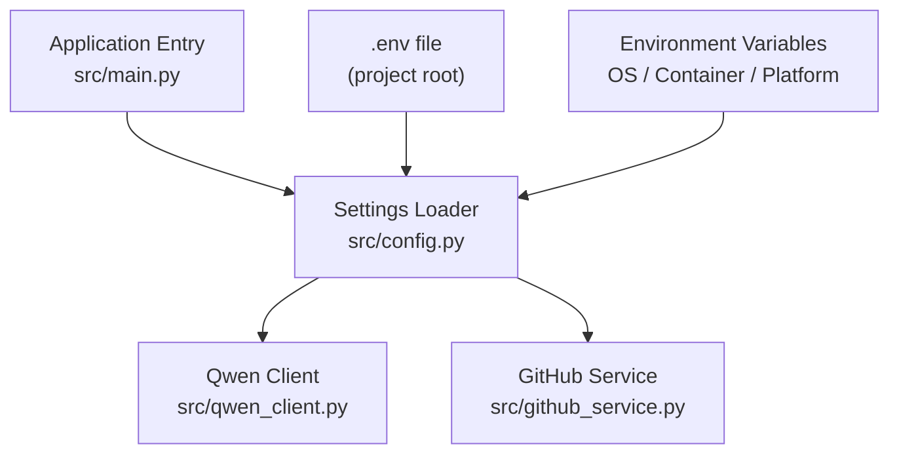
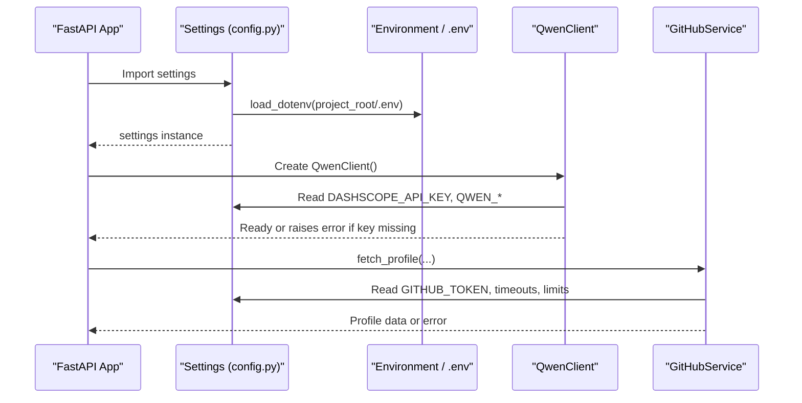
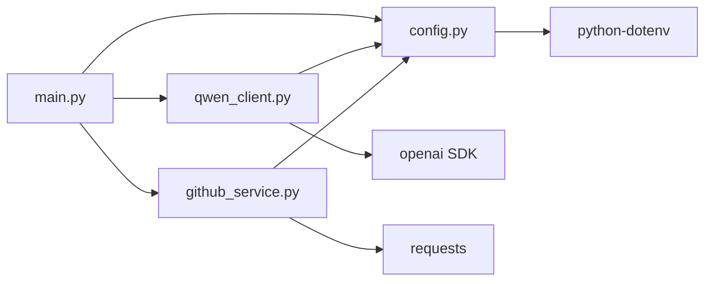

# Configuration Management

<cite>
**Referenced Files in This Document**
- [config.py](file://src/config.py)
- [main.py](file://src/main.py)
- [qwen_client.py](file://src/qwen_client.py)
- [github_service.py](file://src/github_service.py)
- [.env.example](file://.env.example)
- [requirements.txt](file://requirements.txt)
- [README.md](file://README.md)
</cite>

## Table of Contents
1. Introduction
2. Project Structure
3. Core Components
4. Architecture Overview
5. Detailed Component Analysis
6. Dependency Analysis
7. Performance Considerations
8. Troubleshooting Guide
9. Conclusion
10. Appendices

## Introduction
This document explains how CareerOS AI loads and validates configuration from environment variables, focusing on Alibaba Cloud Model Studio (Qwen) authentication via DASHSCOPE_API_KEY and GitHub API access via GITHUB_TOKEN. It covers the python-dotenv loading mechanism, default values, validation rules, security best practices, environment-specific configurations, deployment scenarios, error handling, debugging tips, and migration guidance for evolving configuration schemas while maintaining backward compatibility.

## Project Structure
Configuration is centralized in a single module that reads environment variables at import time and exposes a shared settings object consumed by other modules. The application entry point uses these settings to initialize the server and expose health endpoints that report configuration status.

**Diagram sources**
- [main.py:28-36](file://src/main.py#L28-L36)
- [config.py:11-20](file://src/config.py#L11-L20)
- [qwen_client.py:70-95](file://src/qwen_client.py#L70-L95)
- [github_service.py:26-45](file://src/github_service.py#L26-L45)

**Section sources**
- [config.py:11-20](file://src/config.py#L11-L20)
- [main.py:28-36](file://src/main.py#L28-L36)

## Core Components
- Settings loader: Reads .env and environment variables into a flat Settings class with defaults.
- Qwen client: Validates presence of DASHSCOPE_API_KEY and configures the OpenAI-compatible client using QWEN_BASE_URL, model, temperature, max tokens, and timeout.
- GitHub service: Optionally uses GITHUB_TOKEN to increase rate limits; configurable timeouts and repository limits.
- Application entry: Exposes a health endpoint reporting whether Qwen is configured and whether a GitHub token is set.

Key environment variables:
- DASHSCOPE_API_KEY: Required for Alibaba Cloud Model Studio authentication.
- QWEN_BASE_URL: Endpoint for Qwen’s OpenAI-compatible API (international or mainland China).
- QWEN_MODEL: Model name (e.g., qwen-plus).
- QWEN_TEMPERATURE, QWEN_MAX_TOKENS, QWEN_TIMEOUT: Sampling and request behavior.
- GITHUB_TOKEN: Optional personal access token for higher GitHub API rate limits.
- GITHUB_TIMEOUT, GITHUB_MAX_REPOS: GitHub request behavior and scope.
- MAX_RESUME_MB, MAX_RESUME_CHARS: Upload size constraints.
- API_HOST, API_PORT: Server binding.

Defaults are defined in code and documented in the example environment template.

**Section sources**
- [config.py:23-73](file://src/config.py#L23-L73)
- [.env.example:10-51](file://.env.example#L10-L51)
- [qwen_client.py:70-95](file://src/qwen_client.py#L70-L95)
- [github_service.py:26-45](file://src/github_service.py#L26-L45)
- [main.py:45-55](file://src/main.py#L45-L55)

## Architecture Overview
The configuration system follows a simple, robust pattern:
- Load .env once at import time from the project root so the app works regardless of launch directory.
- Populate a Settings instance with typed values and sensible defaults.
- Consumers read settings directly; optional validations occur at runtime where needed (e.g., Qwen client initialization).

**Diagram sources**
- [config.py:11-20](file://src/config.py#L11-L20)
- [qwen_client.py:70-95](file://src/qwen_client.py#L70-L95)
- [github_service.py:26-45](file://src/github_service.py#L26-L45)
- [main.py:45-55](file://src/main.py#L45-L55)

## Detailed Component Analysis

### Settings Loader (config.py)
- Loads .env from the project root using python-dotenv before reading any environment variables.
- Defines a flat Settings class with typed attributes and defaults aligned with .env.example.
- Provides a helper to check if Qwen is configured based on the presence of an API key.

Validation and typing:
- Numeric fields are cast to int/float during assignment; invalid values will raise conversion errors at import time.
- String fields accept empty strings when not provided; consumers should validate business requirements.

Security:
- Secrets are never hard-coded; they must be supplied via environment variables or .env.
- .env is excluded from version control via .gitignore.

Extensibility:
- New settings can be added as new attributes with clear defaults and corresponding entries in .env.example.

**Section sources**
- [config.py:11-20](file://src/config.py#L11-L20)
- [config.py:23-73](file://src/config.py#L23-L73)
- [config.py:76-78](file://src/config.py#L76-L78)

### Qwen Client (qwen_client.py)
- Initializes with api_key, base_url, model, temperature, max_tokens, and timeout sourced from settings.
- Enforces presence of DASHSCOPE_API_KEY; otherwise raises a specific error type.
- Wraps OpenAI SDK calls and normalizes responses to JSON dicts, with retry logic for malformed JSON outputs.

Error handling:
- Network/auth/rate-limit errors are wrapped into a domain-specific exception with actionable messages.
- Invalid JSON output triggers one repair attempt before failing.

**Section sources**
- [qwen_client.py:70-95](file://src/qwen_client.py#L70-L95)
- [qwen_client.py:120-157](file://src/qwen_client.py#L120-L157)

### GitHub Service (github_service.py)
- Uses GITHUB_TOKEN optionally to increase rate limits; falls back to unauthenticated requests when unset.
- Configurable timeouts and maximum number of repositories to analyze.
- Converts HTTP errors into friendly exceptions with guidance (e.g., adding a token to raise limits).

**Section sources**
- [github_service.py:26-45](file://src/github_service.py#L26-L45)
- [github_service.py:48-60](file://src/github_service.py#L48-L60)
- [github_service.py:63-89](file://src/github_service.py#L63-L89)

### Application Entry (main.py)
- FastAPI app metadata (title, version) comes from settings.
- Health endpoint reports configuration state: model name, whether Qwen is configured, and whether a GitHub token is set.
- Analyze endpoint enforces required inputs and checks Qwen configuration before proceeding.

**Section sources**
- [main.py:28-36](file://src/main.py#L28-L36)
- [main.py:45-55](file://src/main.py#L45-L55)
- [main.py:58-107](file://src/main.py#L58-L107)

## Dependency Analysis
- config.py depends on python-dotenv and standard library os/pathlib.
- qwen_client.py depends on openai SDK and config.
- github_service.py depends on requests and config.
- main.py depends on FastAPI, uvicorn, and the above modules.

**Diagram sources**
- [requirements.txt:1-8](file://requirements.txt#L1-L8)
- [config.py:11-14](file://src/config.py#L11-L14)
- [qwen_client.py:18-24](file://src/qwen_client.py#L18-L24)
- [github_service.py:12-17](file://src/github_service.py#L12-L17)
- [main.py:14-21](file://src/main.py#L14-L21)

**Section sources**
- [requirements.txt:1-8](file://requirements.txt#L1-L8)

## Performance Considerations
- QWEN_TIMEOUT: Tune to balance responsiveness and reliability under network latency.
- GITHUB_TIMEOUT: Adjust for GitHub API responsiveness; too low may cause unnecessary retries.
- GITHUB_MAX_REPOS: Limit analysis scope to reduce processing time and token usage.
- QWEN_MAX_TOKENS: Cap response length to control cost and latency.
- QWEN_TEMPERATURE: Lower values produce more deterministic outputs suitable for structured JSON.

[No sources needed since this section provides general guidance]

## Troubleshooting Guide

Common issues and resolutions:
- Missing DASHSCOPE_API_KEY:
  - Symptom: Qwen client initialization fails with a clear error message instructing to set the key.
  - Resolution: Add DASHSCOPE_API_KEY to your .env or environment.
- Incorrect QWEN_BASE_URL:
  - Symptom: Authentication or connection errors when calling Qwen.
  - Resolution: Use the international endpoint by default; switch to mainland China endpoint if applicable.
- GitHub rate limit reached:
  - Symptom: Error indicating rate limit exceeded.
  - Resolution: Set GITHUB_TOKEN to increase the limit to 5000 requests/hour.
- Invalid numeric settings:
  - Symptom: Startup failure due to type casting errors.
  - Resolution: Ensure all numeric environment variables contain valid numbers.
- Resume upload too large:
  - Symptom: Request rejected with size error.
  - Resolution: Increase MAX_RESUME_MB or compress the resume.

Debugging steps:
- Use GET /health to verify configuration state at runtime.
- Check logs around Qwen and GitHub calls for detailed error messages.
- Validate environment variables locally by printing them in a safe context (never log secrets).

**Section sources**
- [qwen_client.py:85-95](file://src/qwen_client.py#L85-L95)
- [github_service.py:48-60](file://src/github_service.py#L48-L60)
- [main.py:45-55](file://src/main.py#L45-L55)
- [main.py:90-107](file://src/main.py#L90-L107)

## Conclusion
CareerOS AI centralizes configuration in a simple, secure, and extensible manner using environment variables and python-dotenv. Sensitive credentials are kept out of source code, defaults are sensible, and runtime checks provide clear feedback. By following the guidance here, you can confidently configure the application for local development, cloud deployments, and containerized environments while maintaining security and performance.

## Appendices

### Environment Variables Reference
- DASHSCOPE_API_KEY: Required. Alibaba Cloud Model Studio API key.
- QWEN_BASE_URL: Endpoint for Qwen’s OpenAI-compatible API. Defaults to international endpoint.
- QWEN_MODEL: Model name (e.g., qwen-plus).
- QWEN_TEMPERATURE: Sampling randomness (float).
- QWEN_MAX_TOKENS: Maximum tokens per response (int).
- QWEN_TIMEOUT: Timeout seconds for Qwen requests (int).
- GITHUB_TOKEN: Optional. Personal access token for higher GitHub API rate limits.
- GITHUB_TIMEOUT: Timeout seconds for GitHub requests (int).
- GITHUB_MAX_REPOS: Number of top repos to analyze (int).
- MAX_RESUME_MB: Maximum resume upload size in MB (float).
- MAX_RESUME_CHARS: Maximum resume text length (int).
- API_HOST: Server bind address (string).
- API_PORT: Server port (int).

**Section sources**
- [.env.example:10-51](file://.env.example#L10-L51)
- [config.py:23-73](file://src/config.py#L23-L73)

### Configuration Loading Mechanism
- python-dotenv loads .env from the project root at import time, ensuring consistent behavior regardless of working directory.
- Settings are read immediately into a shared instance consumed throughout the app.

**Section sources**
- [config.py:11-20](file://src/config.py#L11-L20)

### Validation Rules and Defaults
- Numeric settings are cast to their expected types; invalid values cause startup failures.
- String settings default to empty when absent; business logic validates presence where required.
- Helper function indicates whether Qwen is configured based on the presence of an API key.

**Section sources**
- [config.py:23-73](file://src/config.py#L23-L73)
- [config.py:76-78](file://src/config.py#L76-L78)

### Security Best Practices
- Never commit .env to version control; it is already ignored.
- Store secrets in platform secret managers (e.g., Alibaba Cloud ECS instance profiles, container secret stores, CI/CD vaults).
- Rotate keys regularly and restrict permissions to minimum necessary scopes.
- Avoid logging sensitive values; use structured logs with redaction.

**Section sources**
- [.gitignore:1-2](file://.gitignore#L1-L2)
- [config.py:1-9](file://src/config.py#L1-L9)

### Environment-Specific Configurations
- Development:
  - Use local .env with test keys or placeholders.
  - Keep API_HOST bound to loopback unless explicitly exposing services.
- Production (Alibaba Cloud ECS):
  - Inject secrets via environment variables or ECS-managed secrets.
  - Use mainland China QWEN_BASE_URL if your account is region-restricted.
  - Tune timeouts and limits according to expected load.
- Containers:
  - Pass secrets through container environment variables or mounted secret files.
  - Ensure .env is not baked into images; rely on runtime injection.

[No sources needed since this section provides general guidance]

### Deployment Scenarios

- Local Development:
  - Copy .env.example to .env and fill in DASHSCOPE_API_KEY (and optionally GITHUB_TOKEN).
  - Run the app directly; health endpoint confirms configuration.

- Cloud Deployment on Alibaba Cloud ECS:
  - Configure environment variables via ECS instance user-data or secret management.
  - Select appropriate QWEN_BASE_URL for your account region.
  - Set API_HOST to 0.0.0.0 if exposing publicly behind a reverse proxy.

- Containerized Environments:
  - Provide secrets via Docker run-time env vars or orchestration platforms (Kubernetes Secrets, etc.).
  - Do not include .env in images; mount secrets at runtime.

[No sources needed since this section provides general guidance]

### Migration and Backward Compatibility
- Adding new variables:
  - Add attribute to Settings with a safe default.
  - Update .env.example with documentation comments.
  - Introduce optional feature flags to avoid breaking existing deployments.
- Deprecating variables:
  - Keep old names temporarily with deprecation warnings in logs.
  - Migrate consumers to new names gradually.
- Schema validation:
  - Consider adding explicit validation functions to catch misconfigurations early.
  - Use health endpoint to surface configuration readiness.

[No sources needed since this section provides general guidance]