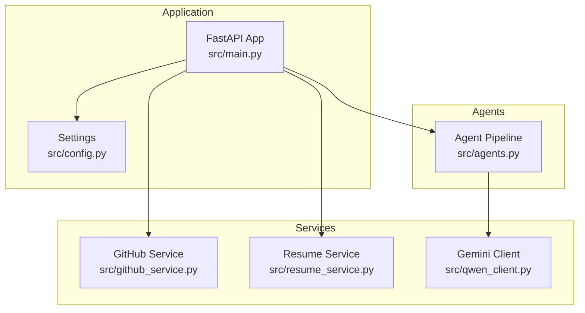
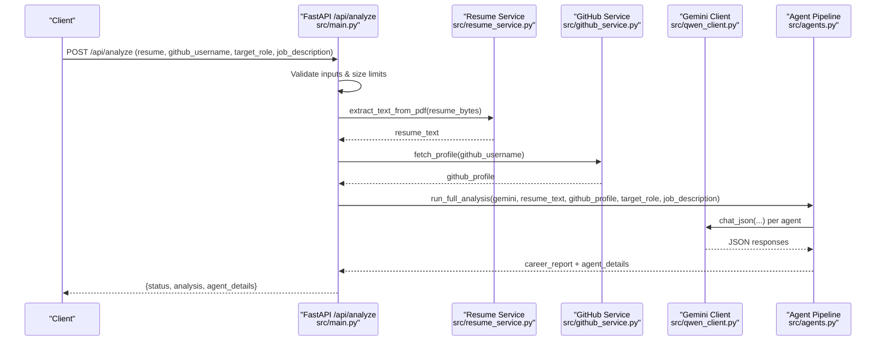
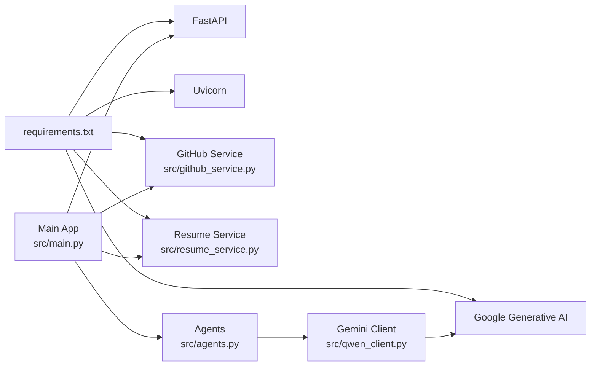

# Deployment Guide

<cite>
**Referenced Files in This Document**
- [README.md](file://README.md)
- [src/main.py](file://src/main.py)
- [src/config.py](file://src/config.py)
- [requirements.txt](file://requirements.txt)
- [src/agents.py](file://src/agents.py)
- [src/qwen_client.py](file://src/qwen_client.py)
- [src/github_service.py](file://src/github_service.py)
- [src/resume_service.py](file://src/resume_service.py)
- [.gitignore](file://.gitignore)
</cite>

## Update Summary
**Changes Made**
- Updated LLM integration from Alibaba Cloud Qwen to Google Gemini
- Enhanced FastAPI server configuration with proper environment variable handling
- Added comprehensive health check endpoint for production monitoring
- Updated deployment instructions for current technology stack
- Enhanced security considerations for API key management
- Improved error handling and production readiness

## Table of Contents
1. [Introduction](#introduction)
2. [Project Structure](#project-structure)
3. [Core Components](#core-components)
4. [Architecture Overview](#architecture-overview)
5. [Detailed Component Analysis](#detailed-component-analysis)
6. [Dependency Analysis](#dependency-analysis)
7. [Performance Considerations](#performance-considerations)
8. [Troubleshooting Guide](#troubleshooting-guide)
9. [Conclusion](#conclusion)
10. [Appendices](#appendices)

## Introduction
This guide provides production deployment instructions for CareerOS AI, covering standalone Python hosting on Alibaba Cloud ECS, Docker containerization, and cloud platform deployments. It includes environment configuration for secure API key management, logging and monitoring setup, scaling strategies, health checks, graceful shutdowns, error handling, security considerations, backup and recovery procedures, and maintenance tasks for long-term operation.

CareerOS AI is a FastAPI application that orchestrates five specialized AI agents to analyze resumes and GitHub profiles using Google Gemini via the google-generativeai SDK. The app serves a single-page frontend and exposes REST endpoints for analysis and health checks.

**Section sources**
- [README.md:74-104](file://README.md#L74-L104)
- [README.md:108-150](file://README.md#L108-L150)
- [README.md:286-326](file://README.md#L286-L326)

## Project Structure
The application is organized into a small, focused set of modules:
- Application entry point and HTTP routes
- Configuration loaded from environment variables
- Services for external integrations (GitHub, PDF extraction)
- A client wrapper for the Google Gemini LLM
- Agent orchestration for multi-agent analysis

**Diagram sources**
- [src/main.py:28-55](file://src/main.py#L28-L55)
- [src/config.py:23-73](file://src/config.py#L23-L73)
- [src/github_service.py:63-89](file://src/github_service.py#L63-L89)
- [src/resume_service.py:24-57](file://src/resume_service.py#L24-L57)
- [src/qwen_client.py:74-97](file://src/qwen_client.py#L74-97)
- [src/agents.py:295-334](file://src/agents.py#L295-L334)

**Section sources**
- [README.md:173-202](file://README.md#L173-L202)
- [src/main.py:1-36](file://src/main.py#L1-L36)
- [src/config.py:1-20](file://src/config.py#L1-L20)

## Core Components
- FastAPI application with endpoints for home page, health check, and analysis
- Environment-driven settings for API keys, model parameters, timeouts, and server binding
- External services for GitHub profile data and PDF text extraction
- Gemini client wrapper for Google AI Studio calls
- Multi-agent pipeline orchestrating resume analysis, GitHub evidence, job matching, skill gap detection, and final synthesis

Key runtime behaviors:
- Health endpoint reports app status and configuration readiness
- Analysis endpoint validates inputs, enforces upload limits, gathers evidence, runs agent pipeline, and returns structured results
- Configuration is loaded from environment variables with sensible defaults

**Section sources**
- [src/main.py:45-55](file://src/main.py#L45-L55)
- [src/main.py:58-147](file://src/main.py#L58-L147)
- [src/config.py:23-73](file://src/config.py#L23-L73)
- [src/agents.py:295-334](file://src/agents.py#L295-L334)

## Architecture Overview
The system processes user submissions through validation, parallel evidence gathering, multi-agent analysis, and synthesis into a career report.

**Diagram sources**
- [src/main.py:58-147](file://src/main.py#L58-L147)
- [src/resume_service.py:24-57](file://src/resume_service.py#L24-L57)
- [src/github_service.py:63-89](file://src/github_service.py#L63-L89)
- [src/qwen_client.py:98-161](file://src/qwen_client.py#L98-L161)
- [src/agents.py:295-334](file://src/agents.py#L295-L334)

## Detailed Component Analysis

### FastAPI Application and Endpoints
- Serves the static frontend at root
- Provides a lightweight health endpoint reporting app name, version, model, and configuration flags
- Implements the main analysis endpoint with input validation, file size enforcement, and error mapping to HTTP status codes
- Uses sync handler so long-running LLM calls do not block the event loop

Operational notes:
- Host and port are configurable via environment variables
- Uvicorn is used for development; production should use a process manager or container orchestration

**Section sources**
- [src/main.py:28-55](file://src/main.py#L28-L55)
- [src/main.py:58-147](file://src/main.py#L58-L147)
- [src/main.py:150-160](file://src/main.py#L150-L160)
- [src/config.py:61-62](file://src/config.py#L61-L62)

### Configuration Management
- Loads .env from project root automatically
- Exposes a flat Settings class with defaults and environment overrides for:
  - Google API key, Gemini model, temperature, max tokens
  - GitHub token and timeouts
  - Upload limits (MB and characters)
  - Server host and port
- Provides a helper to detect if Gemini is configured

Security best practices:
- Never hard-code secrets; rely on environment variables
- Keep .env out of version control (already ignored)

**Section sources**
- [src/config.py:1-20](file://src/config.py#L1-L20)
- [src/config.py:23-73](file://src/config.py#L23-L73)
- [src/config.py:69-72](file://src/config.py#L69-L72)
- [.gitignore:1-2](file://.gitignore#L1-L2)

### Gemini Client Wrapper
- Thin wrapper around the Google Generative AI SDK
- Enforces strict JSON output rules and attempts one repair round if parsing fails
- Raises domain-specific errors for network/auth/timeout issues

Production implications:
- Configure appropriate model selection based on cost/performance needs
- Ensure API key is present before starting requests

**Section sources**
- [src/qwen_client.py:1-20](file://src/qwen_client.py#L1-L20)
- [src/qwen_client.py:74-97](file://src/qwen_client.py#L74-97)
- [src/qwen_client.py:98-161](file://src/qwen_client.py#L98-L161)

### GitHub Service
- Fetches public profile and repositories, builds a compact summary and evidence text
- Handles rate limiting and authentication via optional token
- Converts API errors into friendly exceptions

Scaling considerations:
- Use a personal access token to increase rate limits
- Tune timeouts and maximum repos analyzed

**Section sources**
- [src/github_service.py:1-10](file://src/github_service.py#L1-L10)
- [src/github_service.py:26-60](file://src/github_service.py#L26-L60)
- [src/github_service.py:63-89](file://src/github_service.py#L63-L89)
- [src/github_service.py:92-173](file://src/github_service.py#L92-L173)

### Resume Service
- Extracts text from uploaded PDFs using pypdf
- Validates pages and content, truncates very long resumes to control prompt size and cost

Error handling:
- Raises specific errors for unreadable or empty PDFs

**Section sources**
- [src/resume_service.py:1-7](file://src/resume_service.py#L1-L7)
- [src/resume_service.py:24-57](file://src/resume_service.py#L24-L57)

### Agent Pipeline
- Orchestrates five agents: resume analysis, GitHub evidence, job matching, skill gaps, and master synthesis
- Runs independent analyses first, then compares requirements, and finally synthesizes a comprehensive report

Design notes:
- Each agent uses the Gemini client to produce structured JSON
- Pipeline returns both the headline report and detailed agent outputs

**Section sources**
- [src/agents.py:1-19](file://src/agents.py#L1-L19)
- [src/agents.py:295-334](file://src/agents.py#L295-L334)

## Dependency Analysis
Runtime dependencies include FastAPI, Uvicorn, Google Generative AI SDK, requests, PyPDF, python-multipart, and pydantic. These are declared in the requirements file.

**Diagram sources**
- [requirements.txt:1-8](file://requirements.txt#L1-L8)
- [src/main.py:14-21](file://src/main.py#L14-L21)
- [src/qwen_client.py:26-28](file://src/qwen_client.py#L26-L28)
- [src/github_service.py:15-17](file://src/github_service.py#L15-L17)
- [src/resume_service.py:12-14](file://src/resume_service.py#L12-L14)
- [src/agents.py:24-24](file://src/agents.py#L24-L24)

**Section sources**
- [requirements.txt:1-8](file://requirements.txt#L1-L8)

## Performance Considerations
- Concurrency: The analysis endpoint is synchronous; FastAPI executes it in a worker thread, preventing blocking of other requests. For high concurrency, deploy multiple workers behind a reverse proxy or load balancer.
- Timeouts: Configure GitHub timeouts to balance responsiveness and reliability.
- Payload limits: Enforce resume size and character limits to control memory and prompt costs.
- External service resilience: Handle GitHub rate limits and Gemini API errors gracefully.
- Caching: Consider caching GitHub profile summaries for repeated usernames to reduce external calls.
- Resource sizing: Allocate sufficient CPU/memory for concurrent LLM calls and PDF processing.

[No sources needed since this section provides general guidance]

## Troubleshooting Guide
Common issues and resolutions:
- Missing Google API key: Ensure GOOGLE_API_KEY is set; the health endpoint indicates configuration status.
- Invalid or empty resume: Validate file type and size; ensure PDF contains extractable text.
- GitHub API failures: Check username validity, rate limits, and token presence; adjust timeouts.
- LLM call errors: Inspect Gemini client errors for auth, rate limit, or network issues; verify model availability.

Health checks:
- GET /health returns status, app metadata, model, and configuration flags for readiness.

Graceful shutdown:
- Use a process manager (e.g., systemd, supervisor) or container orchestrator to handle SIGTERM/SIGINT and stop workers cleanly.

Logging:
- Add application-level logging to capture request traces, errors, and performance metrics.
- Centralize logs in a log aggregation service for observability.

Monitoring:
- Track request latency, error rates, and external API success/failure.
- Set alerts for unhealthy states, high error rates, and slow responses.

**Section sources**
- [src/main.py:45-55](file://src/main.py#L45-L55)
- [src/main.py:74-107](file://src/main.py#L74-L107)
- [src/qwen_client.py:120-161](file://src/qwen_client.py#L120-L161)
- [src/github_service.py:48-60](file://src/github_service.py#L48-L60)
- [src/resume_service.py:31-49](file://src/resume_service.py#L31-L49)

## Conclusion
CareerOS AI can be deployed reliably in production by configuring environment variables securely, running behind a reverse proxy or load balancer, and implementing robust logging and monitoring. The modular architecture supports scaling through horizontal replication and careful tuning of timeouts and resource limits. Follow the appendices for step-by-step deployment across platforms and operational best practices.

[No sources needed since this section summarizes without analyzing specific files]

## Appendices

### Appendix A: Standalone Python Hosting on Alibaba Cloud ECS
Steps:
1. Provision an ECS instance with adequate CPU and memory.
2. Install Python 3.9+ and create a virtual environment.
3. Clone the repository and install dependencies from requirements.txt.
4. Create a .env file in the project root with required variables:
   - GOOGLE_API_KEY (required)
   - GEMINI_MODEL (optional; default is gemini-3.6-flash)
   - GEMINI_TEMPERATURE, GEMINI_MAX_TOKENS (optional)
   - GITHUB_TOKEN (optional; increases rate limit)
   - MAX_RESUME_MB, MAX_RESUME_CHARS (optional)
   - API_HOST, API_PORT (optional; bind to 0.0.0.0 for external access)
5. Start the application using Uvicorn directly or via a process manager:
   - Direct: python src/main.py
   - Process manager example: gunicorn --workers N --bind 0.0.0.0:8000 src.main:app
6. Place a reverse proxy (Nginx/Traefik) in front to terminate TLS and manage routing.
7. Configure firewall rules to allow only necessary ports (e.g., 443).

Environment variable management:
- Store secrets in ECS instance secret stores or OS-level environment variables.
- Avoid committing .env to version control (.gitignore already excludes it).

Database setup:
- No database is required by the current application.

**Section sources**
- [README.md:108-150](file://README.md#L108-L150)
- [src/config.py:34-62](file://src/config.py#L34-L62)
- [src/main.py:150-160](file://src/main.py#L150-L160)
- [.gitignore:1-2](file://.gitignore#L1-L2)

### Appendix B: Docker Containerization
Dockerfile (conceptual):
- Base image: python:3.9-slim
- Copy requirements.txt and install dependencies
- Copy application source
- Expose port 8000
- Run uvicorn bound to 0.0.0.0:8000

Compose (conceptual):
- Define service for the app
- Mount environment variables via env_file or secrets
- Optionally add a sidecar for logging/metrics

Deployment:
- Build and push image to a registry
- Deploy to ECS Container Service or Kubernetes
- Configure health checks against /health
- Use rolling updates and resource limits

**Section sources**
- [requirements.txt:1-8](file://requirements.txt#L1-L8)
- [src/main.py:150-160](file://src/main.py#L150-L160)
- [src/config.py:61-62](file://src/config.py#L61-L62)

### Appendix C: Cloud Platform Deployments
Options:
- Alibaba Cloud ECS with Nginx/Traefik reverse proxy
- Managed containers (ECS Container Service, ACK/Kubernetes)
- Serverless platforms (if adapted to async handlers)

Configuration:
- Bind to 0.0.0.0 and expose port 8000 internally
- Terminate TLS at the proxy
- Use environment variables or secret managers for API keys
- Enable health checks on /health

Scaling:
- Horizontal scaling by replicating instances behind a load balancer
- Tune worker count and timeouts based on observed load

**Section sources**
- [src/main.py:150-160](file://src/main.py#L150-L160)
- [src/config.py:61-62](file://src/config.py#L61-L62)

### Appendix D: Security Considerations
Input validation:
- Enforce PDF-only uploads and size limits
- Validate required fields and sanitize inputs

Rate limiting:
- Apply rate limiting at the reverse proxy or gateway layer
- Protect against abuse and external API rate limits

Secret protection:
- Store API keys in environment variables or secret managers
- Ensure .env is excluded from version control

Network security:
- Restrict inbound traffic to necessary ports
- Use HTTPS termination at the proxy

**Section sources**
- [src/main.py:74-107](file://src/main.py#L74-L107)
- [src/config.py:34-62](file://src/config.py#L34-L62)
- [.gitignore:1-2](file://.gitignore#L1-L2)

### Appendix E: Monitoring and Logging
Logging:
- Add structured logging for requests, errors, and performance metrics
- Aggregate logs centrally for analysis and alerting

Monitoring:
- Track HTTP metrics (latency, error rates), external API success/failure
- Monitor resource usage (CPU, memory) and queue lengths if adding async processing

Alerting:
- Alert on unhealthy status from /health
- Alert on elevated error rates and slow responses
- Alert on external API failures (GitHub, Gemini)

**Section sources**
- [src/main.py:45-55](file://src/main.py#L45-L55)
- [src/qwen_client.py:120-161](file://src/qwen_client.py#L120-L161)
- [src/github_service.py:48-60](file://src/github_service.py#L48-L60)

### Appendix F: Backup and Recovery
Data storage:
- The application does not persist data to a database; no backups are required for state.

Disaster recovery:
- Maintain infrastructure-as-code templates for quick redeployment
- Keep environment variable definitions in a secure secret store
- Test recovery procedures regularly

Maintenance:
- Regularly update dependencies
- Rotate API keys periodically
- Review and tune timeouts and limits based on usage patterns

**Section sources**
- [src/config.py:34-62](file://src/config.py#L34-L62)

### Appendix G: Step-by-Step Deployment Guides

#### Standalone Python on ECS
1. Provision ECS instance and configure security groups.
2. Install Python and create virtual environment.
3. Clone repo and install requirements.
4. Create .env with secrets and configuration.
5. Start app with Uvicorn or Gunicorn.
6. Configure reverse proxy and TLS.
7. Verify /health endpoint.

#### Docker
1. Write Dockerfile and docker-compose.yml.
2. Build image and push to registry.
3. Deploy to container platform with environment variables.
4. Configure health checks and autoscaling.

#### Cloud Platform
1. Choose platform (ECS, Kubernetes, etc.).
2. Deploy with environment variables and secrets.
3. Configure ingress and TLS.
4. Set up monitoring and alerting.

**Section sources**
- [README.md:108-150](file://README.md#L108-L150)
- [src/main.py:150-160](file://src/main.py#L150-L160)
- [src/config.py:34-62](file://src/config.py#L34-L62)