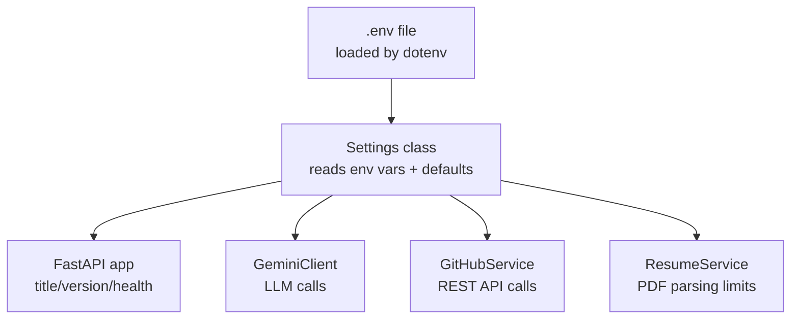
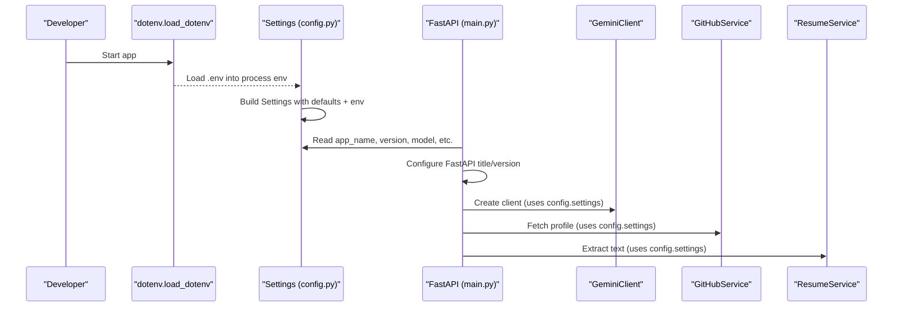
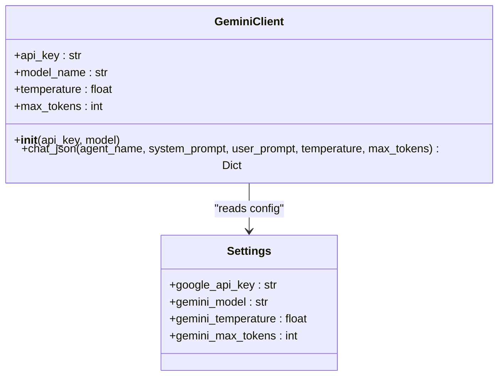
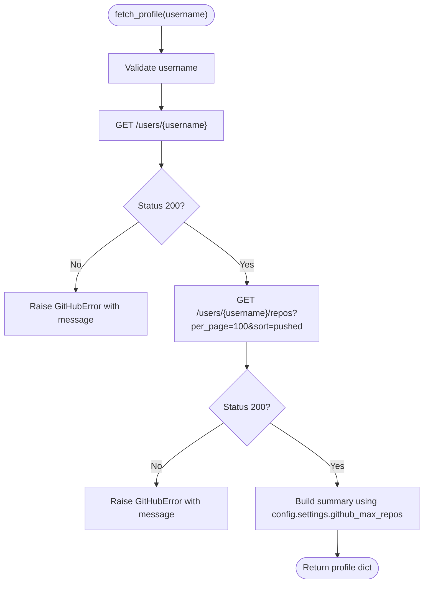
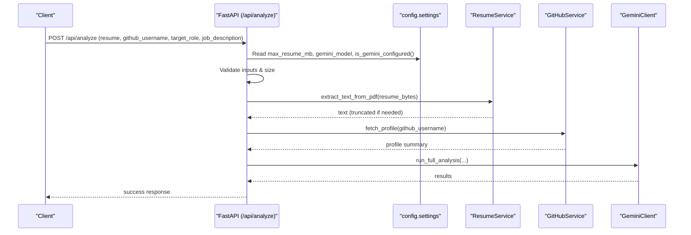
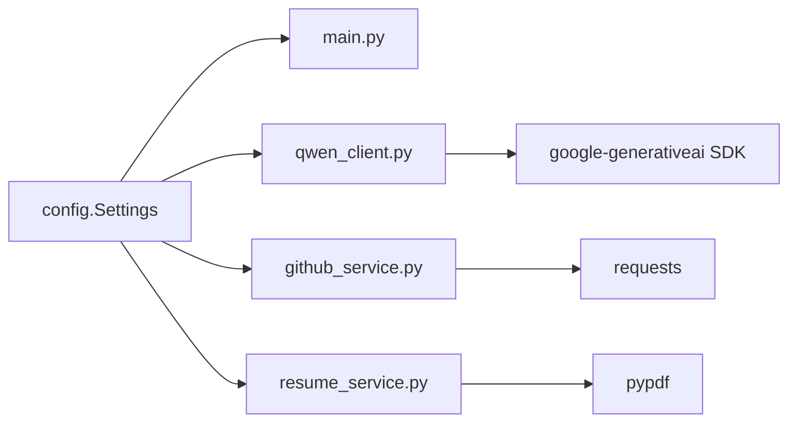

# Configuration Management

<cite>
**Referenced Files in This Document**
- [config.py](file://src/config.py)
- [main.py](file://src/main.py)
- [qwen_client.py](file://src/qwen_client.py)
- [github_service.py](file://src/github_service.py)
- [resume_service.py](file://src/resume_service.py)
- [.env.example](file://.env.example)
- [.gitignore](file://.gitignore)
- [README.md](file://README.md)
</cite>

## Update Summary
**Changes Made**
- Updated to reflect migration from Qwen API to Google Gemini for LLM functionality
- Revised environment variable names and configuration structure for Gemini integration
- Updated all references from Qwen to Gemini throughout the documentation
- Enhanced security practices with proper .env file handling
- Improved configuration validation and error handling

## Table of Contents
1. [Introduction](#introduction)
2. [Project Structure](#project-structure)
3. [Core Components](#core-components)
4. [Architecture Overview](#architecture-overview)
5. [Detailed Component Analysis](#detailed-component-analysis)
6. [Dependency Analysis](#dependency-analysis)
7. [Performance Considerations](#performance-considerations)
8. [Troubleshooting Guide](#troubleshooting-guide)
9. [Conclusion](#conclusion)
10. [Appendices](#appendices)

## Introduction
This document explains the centralized configuration management system for CareerOS AI. It focuses on how environment-based settings are loaded and consumed across the application using python-dotenv, with a focus on type-safe configuration loading, default values, environment variable mapping for external services (Google Gemini API keys, GitHub tokens, service endpoints), secure credential handling, naming conventions, validation mechanisms, .env structure, environment-specific examples, override behavior, hot-reloading considerations, debugging tools, adding new parameters, and troubleshooting common issues.

## Project Structure
The configuration is centralized in a single module that loads environment variables at import time and exposes a shared Settings instance used by all components. The FastAPI app reads from this central source to configure itself and validate runtime readiness.

**Diagram sources**
- [config.py:11-20](file://src/config.py#L11-L20)
- [config.py:23-73](file://src/config.py#L23-L73)
- [main.py:28-36](file://src/main.py#L28-L36)
- [qwen_client.py:74-97](file://src/qwen_client.py#L74-L97)
- [github_service.py:26-45](file://src/github_service.py#L26-L45)
- [resume_service.py:51-55](file://src/resume_service.py#L51-L55)

**Section sources**
- [config.py:11-20](file://src/config.py#L11-L20)
- [main.py:28-36](file://src/main.py#L28-L36)

## Core Components
- Settings class: A flat, typed container for all configuration values. Each attribute maps to an environment variable with sensible defaults. Types are enforced via Python's type hints and explicit casting where needed.
- Shared instance: A single global settings object is created at import time and reused throughout the application.
- Environment loading: dotenv loads .env from the project root when config.py is imported, ensuring credentials are available before any other module runs.

Key responsibilities:
- Provide consistent access to configuration across modules.
- Centralize defaults and environment mappings.
- Expose helper functions to check configuration readiness (e.g., Gemini availability).

**Section sources**
- [config.py:23-73](file://src/config.py#L23-L73)
- [config.py:65-72](file://src/config.py#L65-L72)

## Architecture Overview
Configuration flows from environment files into a single source of truth, then propagates to services and the web server.

**Diagram sources**
- [config.py:11-20](file://src/config.py#L11-L20)
- [config.py:23-73](file://src/config.py#L23-L73)
- [main.py:28-36](file://src/main.py#L28-L36)
- [qwen_client.py:74-97](file://src/qwen_client.py#L74-L97)
- [github_service.py:26-45](file://src/github_service.py#L26-L45)
- [resume_service.py:51-55](file://src/resume_service.py#L51-L55)

## Detailed Component Analysis

### Settings Class and Type-Safe Loading
- Purpose: Centralized, typed configuration with defaults and environment overrides.
- Behavior:
  - Loads .env from the project root on import.
  - Reads environment variables with fallback defaults.
  - Casts numeric types explicitly to ensure runtime safety.
  - Provides a helper to detect if Gemini is configured.

Environment variables mapped:
- Google Gemini:
  - GOOGLE_API_KEY: Required API key string.
  - GEMINI_MODEL: Model name (e.g., gemini-3.6-flash).
  - GEMINI_TEMPERATURE: Sampling temperature (float).
  - GEMINI_MAX_TOKENS: Maximum tokens per response (int).
- GitHub:
  - GITHUB_TOKEN: Optional personal access token.
  - GITHUB_TIMEOUT: Timeout in seconds (int).
  - GITHUB_MAX_REPOS: Number of top repos to analyze (int).
- Upload limits:
  - MAX_RESUME_MB: Max resume size in MB (float).
  - MAX_RESUME_CHARS: Max resume text length (int).
- Server:
  - API_HOST: Host address (string).
  - API_PORT: Port number (int).

Validation and checks:
- is_gemini_configured(): Returns True if a non-empty API key is present.
- Runtime checks in main.py raise HTTP 503 when Gemini is not configured.

Type safety:
- Numeric fields use int() or float() casts to enforce types.
- String fields rely on os.getenv with empty-string defaults.

Security:
- Secrets are never hard-coded; they come from environment variables.
- .env is excluded from version control.

**Section sources**
- [config.py:11-20](file://src/config.py#L11-L20)
- [config.py:23-73](file://src/config.py#L23-L73)
- [config.py:65-72](file://src/config.py#L65-L72)
- [main.py:100-107](file://src/main.py#L100-L107)

### Gemini Client Integration
- Uses config.settings for API key, model, temperature, max tokens.
- Raises a clear error if the API key is missing.
- Wraps LLM calls and handles JSON parsing robustly.

**Diagram sources**
- [qwen_client.py:74-97](file://src/qwen_client.py#L74-L97)
- [config.py:23-73](file://src/config.py#L23-L73)

**Section sources**
- [qwen_client.py:74-97](file://src/qwen_client.py#L74-L97)
- [qwen_client.py:98-161](file://src/qwen_client.py#L98-L161)

### GitHub Service Integration
- Reads optional GITHUB_TOKEN to add Authorization headers.
- Uses config.settings for timeouts and maximum repositories to analyze.
- Converts API errors into friendly exceptions with actionable messages.

**Diagram sources**
- [github_service.py:63-89](file://src/github_service.py#L63-L89)
- [github_service.py:92-147](file://src/github_service.py#L92-L147)
- [github_service.py:26-45](file://src/github_service.py#L26-L45)

**Section sources**
- [github_service.py:26-45](file://src/github_service.py#L26-L45)
- [github_service.py:63-89](file://src/github_service.py#L63-L89)
- [github_service.py:92-147](file://src/github_service.py#L92-L147)

### Resume Service Integration
- Enforces character limit for extracted resume text using config.settings.max_resume_chars.
- Truncates long resumes to control prompt size and cost.

**Section sources**
- [resume_service.py:51-55](file://src/resume_service.py#L51-L55)

### FastAPI Application Usage
- Sets app title and version from config.settings.
- Health endpoint reports current model and whether Gemini/GitHub are configured.
- Analyze endpoint validates inputs, enforces upload limits, checks Gemini configuration, and orchestrates analysis.

**Diagram sources**
- [main.py:58-147](file://src/main.py#L58-L147)
- [config.py:23-73](file://src/config.py#L23-L73)
- [resume_service.py:24-57](file://src/resume_service.py#L24-L57)
- [github_service.py:63-89](file://src/github_service.py#L63-L89)
- [qwen_client.py:74-97](file://src/qwen_client.py#L74-L97)

**Section sources**
- [main.py:28-36](file://src/main.py#L28-L36)
- [main.py:45-55](file://src/main.py#L45-L55)
- [main.py:58-147](file://src/main.py#L58-L147)

## Dependency Analysis
- All modules depend on the central config module for configuration.
- No circular dependencies observed; config has no imports beyond standard library and dotenv.
- External integrations (Google Generative AI SDK, requests, pypdf) are isolated within their respective modules and consume configuration through config.settings.

**Diagram sources**
- [config.py:11-20](file://src/config.py#L11-L20)
- [main.py:17-21](file://src/main.py#L17-L21)
- [qwen_client.py:22-28](file://src/qwen_client.py#L22-L28)
- [github_service.py:12-17](file://src/github_service.py#L12-L17)
- [resume_service.py:9-14](file://src/resume_service.py#L9-L14)

**Section sources**
- [config.py:11-20](file://src/config.py#L11-L20)
- [main.py:17-21](file://src/main.py#L17-L21)

## Performance Considerations
- Timeouts:
  - GITHUB_TIMEOUT controls REST API timeouts.
- Token limits:
  - GEMINI_MAX_TOKENS caps response size to manage cost and latency.
- Input limits:
  - MAX_RESUME_MB prevents oversized uploads.
  - MAX_RESUME_CHARS truncates very long resumes to reduce processing time and cost.
- GitHub rate limiting:
  - Use GITHUB_TOKEN to increase rate limits from 60 to 5000 requests/hour.

## Troubleshooting Guide
Common issues and resolutions:

- Missing Gemini API key:
  - Symptom: Health endpoint shows Gemini not configured; /api/analyze returns 503.
  - Resolution: Set GOOGLE_API_KEY in .env and restart the app.
  - Reference: [config.py:65-72](file://src/config.py#L65-L72), [main.py:100-107](file://src/main.py#L100-L107)

- Invalid or unreachable Gemini endpoint:
  - Symptom: GeminiError with network/auth details.
  - Resolution: Verify GOOGLE_API_KEY and network connectivity; adjust GEMINI_MODEL if needed.
  - Reference: [qwen_client.py:98-161](file://src/qwen_client.py#L98-L161)

- GitHub rate limit exceeded:
  - Symptom: GitHubError indicating rate limit reached.
  - Resolution: Add GITHUB_TOKEN to .env to raise limits; retry later.
  - Reference: [github_service.py:48-60](file://src/github_service.py#L48-L60)

- Invalid resume file:
  - Symptom: HTTP 400 with details about unsupported PDF or empty content.
  - Resolution: Ensure the uploaded file is a valid, text-based PDF; check MAX_RESUME_MB and MAX_RESUME_CHARS.
  - Reference: [resume_service.py:24-57](file://src/resume_service.py#L24-L57)

- Wrong types in environment variables:
  - Symptom: Runtime errors due to invalid numeric strings.
  - Resolution: Ensure numeric env vars are valid integers/floats; defaults are applied if missing.
  - Reference: [config.py:34-62](file://src/config.py#L34-L62)

- Hot-reloading note:
  - Uvicorn is started with reload=False in development entry point. If you need hot-reload during development, enable it in your uvicorn invocation; however, note that reloading will re-import config and re-read .env each time.
  - Reference: [main.py:150-159](file://src/main.py#L150-L159)

**Section sources**
- [config.py:65-72](file://src/config.py#L65-L72)
- [main.py:100-107](file://src/main.py#L100-L107)
- [qwen_client.py:98-161](file://src/qwen_client.py#L98-L161)
- [github_service.py:48-60](file://src/github_service.py#L48-L60)
- [resume_service.py:24-57](file://src/resume_service.py#L24-L57)
- [config.py:34-62](file://src/config.py#L34-L62)
- [main.py:150-159](file://src/main.py#L150-L159)

## Conclusion
The configuration system centralizes all environment-based settings behind a simple, typed Settings class. It ensures secure handling of secrets, provides sensible defaults, and offers clear diagnostics for misconfiguration. Services consume configuration consistently, enabling predictable behavior across development and production environments.

## Appendices

### .env File Structure and Examples
- Location: Project root .env file is automatically loaded by config.py.
- Template: See .env.example for all supported variables and comments.
- Security: .env is ignored by Git to prevent accidental commits of secrets.

Environment variable reference:
- GOOGLE_API_KEY: Required. Your Google AI Studio API key.
- GEMINI_MODEL: Model name (gemini-3.6-flash, gemini-3.7-flash, gemini-2.5-pro, gemini-flash-latest).
- GEMINI_TEMPERATURE: Float sampling parameter (recommended 0.2 for reliable JSON output).
- GEMINI_MAX_TOKENS: Integer token cap (8192 recommended for complex reports).
- GITHUB_TOKEN: Optional token to increase rate limits.
- GITHUB_TIMEOUT: Integer seconds for GitHub API calls.
- GITHUB_MAX_REPOS: Integer count of top repos to analyze.
- MAX_RESUME_MB: Float MB limit for uploads.
- MAX_RESUME_CHARS: Integer character limit for resume text.
- API_HOST: String host for the server.
- API_PORT: Integer port for the server.

Example configurations:
- Development:
  - Use local defaults for API_HOST and API_PORT.
  - Set GOOGLE_API_KEY and optionally GITHUB_TOKEN.
  - Keep GEMINI_MODEL set to gemini-3.6-flash for balanced performance.
- Production:
  - Pin GEMINI_MODEL to appropriate model based on requirements.
  - Adjust GEMINI_TEMPERATURE and GEMINI_MAX_TOKENS based on use case.
  - Tune MAX_RESUME_MB and MAX_RESUME_CHARS to match capacity.
  - Ensure GITHUB_TOKEN is set to avoid rate limiting.

**Section sources**
- [config.py:11-20](file://src/config.py#L11-L20)
- [.env.example:10-49](file://.env.example#L10-L49)
- [.gitignore:1-2](file://.gitignore#L1-L2)

### Adding New Configuration Parameters
Steps:
1. Define a new attribute in Settings with a type hint and default value.
2. Map it to an environment variable using os.getenv with a sensible default.
3. Optionally add a helper function to validate presence or format.
4. Update .env.example to document the new variable.
5. Use config.settings.<new_attr> in relevant modules.

Guidelines:
- Prefer explicit casting for numeric types to enforce validity.
- Keep names uppercase and descriptive (e.g., NEW_SERVICE_TIMEOUT_SECONDS).
- Group related variables with comments for clarity.

**Section sources**
- [config.py:23-73](file://src/config.py#L23-L73)
- [.env.example:10-49](file://.env.example#L10-L49)

### Creating Environment-Specific Settings
Approaches:
- Use different .env files per environment (e.g., .env.development, .env.production) and load the appropriate one based on an environment flag.
- Or keep a single .env and switch values per deployment context.

Current behavior:
- The app loads a single .env from the project root at startup.

Recommendation:
- For multi-environment deployments, consider loading a specific .env file based on an environment variable (e.g., APP_ENV) and updating config.py accordingly.

**Section sources**
- [config.py:16-20](file://src/config.py#L16-L20)

### Implementing Configuration Validation Rules
Options:
- Extend Settings with validation methods to check ranges, formats, or required combinations.
- Raise explicit errors early if critical settings are missing or invalid.
- Use helper functions like is_gemini_configured() to expose readiness checks.

Examples:
- Validate numeric ranges (e.g., GEMINI_TEMPERATURE between 0 and 2).
- Ensure required keys are present before starting the server.

**Section sources**
- [config.py:65-72](file://src/config.py#L65-L72)

### Debugging Tools for Configuration Issues
- Health endpoint:
  - GET /health reports app name, version, model, and whether Gemini/GitHub are configured.
- Error messages:
  - GeminiError and GitHubError provide actionable details for misconfiguration.
- Logging:
  - Add logging around configuration reads to capture actual values during startup.

**Section sources**
- [main.py:45-55](file://src/main.py#L45-L55)
- [qwen_client.py:98-161](file://src/qwen_client.py#L98-L161)
- [github_service.py:48-60](file://src/github_service.py#L48-L60)

### Secure Credential Handling Practices
- Never hard-code secrets in source code.
- Store secrets in .env and ensure .env is listed in .gitignore.
- Use minimal permissions for tokens (e.g., GitHub token only needs public data access).
- Rotate secrets regularly and restrict access to production .env files.

**Section sources**
- [config.py:1-9](file://src/config.py#L1-L9)
- [.gitignore:1-2](file://.gitignore#L1-L2)
- [.env.example:10-49](file://.env.example#L10-L49)

### Environment Variable Naming Conventions
- Use uppercase, snake_case names.
- Prefix groupings logically (e.g., GEMINI_*, GITHUB_*, MAX_*).
- Include units or scope in names when helpful (e.g., _TIMEOUT, _MB, _CHARS).

**Section sources**
- [.env.example:10-49](file://.env.example#L10-L49)
- [config.py:23-73](file://src/config.py#L23-L73)

### Hot-Reloading Capabilities
- Current setup starts uvicorn with reload=False.
- To enable hot-reloading during development, start uvicorn with reload=True; note that reloading re-imports modules and re-reads .env.

**Section sources**
- [main.py:150-159](file://src/main.py#L150-L159)