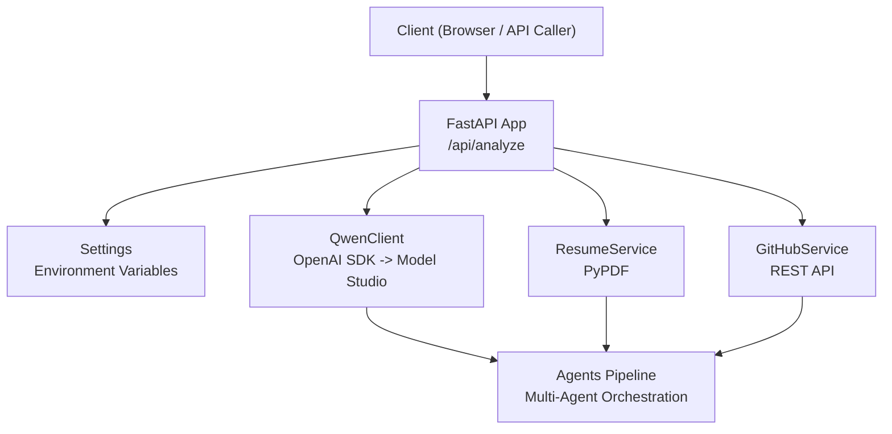
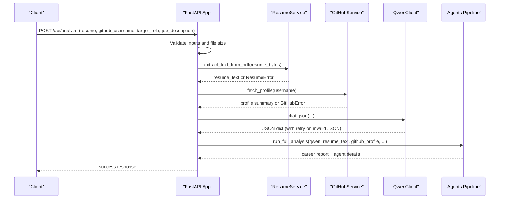
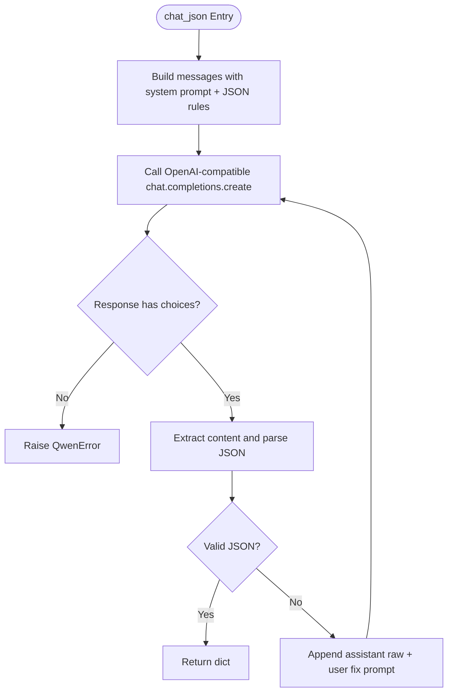
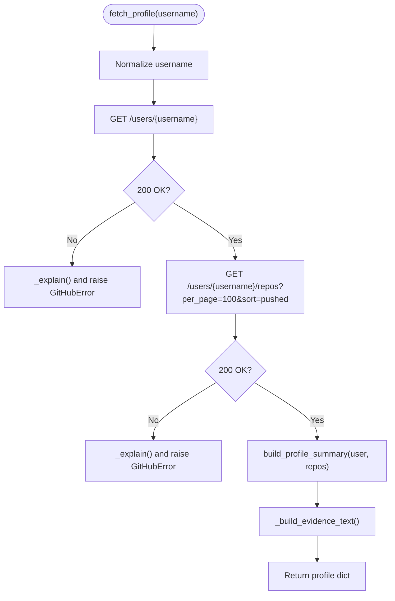
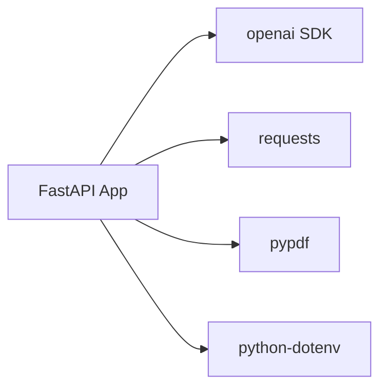

# External Integrations

<cite>
**Referenced Files in This Document**
- [config.py](file://src/config.py)
- [qwen_client.py](file://src/qwen_client.py)
- [github_service.py](file://src/github_service.py)
- [resume_service.py](file://src/resume_service.py)
- [main.py](file://src/main.py)
- [requirements.txt](file://requirements.txt)
- [README.md](file://README.md)
</cite>

## Table of Contents
1. Introduction
2. Project Structure
3. Core Components
4. Architecture Overview
5. Detailed Component Analysis
6. Dependency Analysis
7. Performance Considerations
8. Troubleshooting Guide
9. Conclusion
10. Appendices

## Introduction
This document explains the external service integrations used by CareerOS AI:
- Qwen LLM via Alibaba Cloud Model Studio using an OpenAI-compatible API
- GitHub REST API for public profile data and repository evidence
- PDF text extraction from resumes using PyPDF
It also covers configuration management, error handling, retry strategies, rate limiting, performance tips, monitoring, and how to extend or replace integrations.

## Project Structure
CareerOS AI is a FastAPI application that orchestrates three external integrations through dedicated modules:
- Configuration is centralized in a settings object loaded from environment variables
- Qwen client wraps the OpenAI SDK to call Alibaba Cloud Model Studio
- GitHub service fetches public profile and repository data
- Resume service extracts text from uploaded PDFs
- The main app wires these services into a single analysis endpoint

**Diagram sources**
- [main.py:28-147](file://src/main.py#L28-L147)
- [config.py:23-73](file://src/config.py#L23-L73)
- [qwen_client.py:70-157](file://src/qwen_client.py#L70-L157)
- [github_service.py:63-147](file://src/github_service.py#L63-L147)
- [resume_service.py:24-57](file://src/resume_service.py#L24-L57)

**Section sources**
- [main.py:28-147](file://src/main.py#L28-L147)
- [config.py:23-73](file://src/config.py#L23-L73)

## Core Components
- Settings and environment-driven configuration
- Qwen client with JSON enforcement and retry logic
- GitHub service with token-based rate limit handling
- Resume service with size limits and preprocessing truncation
- API entry point that validates inputs and orchestrates the pipeline

Key responsibilities:
- Centralize secrets and endpoints in environment variables
- Provide robust error handling and user-friendly messages
- Enforce safe defaults for timeouts, model selection, and input sizes
- Normalize external responses into structured data for agents

**Section sources**
- [config.py:23-79](file://src/config.py#L23-L79)
- [qwen_client.py:27-157](file://src/qwen_client.py#L27-L157)
- [github_service.py:22-173](file://src/github_service.py#L22-L173)
- [resume_service.py:17-57](file://src/resume_service.py#L17-L57)
- [main.py:58-147](file://src/main.py#L58-L147)

## Architecture Overview
The analysis flow integrates multiple external systems:

**Diagram sources**
- [main.py:58-147](file://src/main.py#L58-L147)
- [resume_service.py:24-57](file://src/resume_service.py#L24-L57)
- [github_service.py:63-147](file://src/github_service.py#L63-L147)
- [qwen_client.py:97-157](file://src/qwen_client.py#L97-L157)

## Detailed Component Analysis

### Qwen LLM Integration (Alibaba Cloud Model Studio)
- Uses the official OpenAI SDK pointed at Model Studio’s OpenAI-compatible base URL
- Supports model selection via environment variable (qwen-turbo, qwen-plus, qwen-max)
- Enforces strict JSON output rules appended to every system prompt
- Implements retry logic: if the first response is not valid JSON, it sends the raw output back to the model once to repair formatting
- Wraps all network errors into a domain-specific exception with actionable messages

Configuration highlights:
- API key from environment variable
- Base URL configurable for international vs mainland China endpoints
- Temperature, max tokens, and timeout are configurable
- Health check exposes whether the API key is configured

Error handling:
- Missing API key raises a clear initialization error
- Network/auth/rate-limit/timeouts raise a unified error with guidance to check credentials and network
- Invalid JSON after two attempts raises a detailed error including the beginning of the raw output

Retry strategy:
- One automatic retry when the initial response cannot be parsed as JSON
- No exponential backoff; retries are lightweight and bounded

Performance considerations:
- Use qwen-turbo for speed/cost-sensitive tasks
- Tune temperature and max_tokens per use case
- Keep prompts concise; the shared JSON rules help reduce verbosity

Extensibility:
- Swap base_url to another compatible provider while keeping the same interface
- Add additional retry/backoff logic around the chat call if needed

**Section sources**
- [config.py:29-48](file://src/config.py#L29-L48)
- [qwen_client.py:27-157](file://src/qwen_client.py#L27-L157)
- [main.py:45-55](file://src/main.py#L45-L55)

#### Qwen Chat Flow (JSON Repair Retry)

**Diagram sources**
- [qwen_client.py:97-157](file://src/qwen_client.py#L97-L157)

### GitHub REST API Integration
- Fetches public profile and repositories via the GitHub REST API
- Optional personal access token increases rate limits from 60 to 5000 requests/hour
- Builds a compact, LLM-friendly summary including languages, topics, top repos, and an evidence text block
- Handles common error codes:
  - 404: user not found
  - 403 with zero remaining: rate limit reached, suggests adding a token
  - Other errors: generic failure message

Rate limit handling:
- Detects X-RateLimit-Remaining header to provide specific remediation
- Token is optional; without it, users may hit limits under heavy usage

Data normalization:
- Filters out forks to focus on owned work
- Aggregates language counts and topics
- Selects top repositories by stars and recency
- Produces a human-readable evidence string for downstream agents

Extensibility:
- Add more fields from the GitHub API (e.g., organization memberships, gists)
- Introduce caching for repeated username lookups
- Replace with alternative providers by implementing the same interface

**Section sources**
- [github_service.py:22-173](file://src/github_service.py#L22-L173)

#### GitHub Profile Summary Flow

**Diagram sources**
- [github_service.py:63-173](file://src/github_service.py#L63-L173)

### PDF Text Extraction (Resumes)
- Extracts plain text from uploaded PDFs using PyPDF
- Validates that the file is readable and contains pages
- Raises descriptive errors for unreadable files or image-only scans
- Truncates very long resumes to a configurable character limit to control cost and latency
- Returns concatenated page text suitable for LLM processing

File size limitations:
- Enforced at the API layer based on a configurable maximum MB value
- Empty files are rejected early

Preprocessing techniques:
- Concatenates page text
- Strips whitespace
- Applies truncation with a marker indicating truncation occurred

Extensibility:
- Add OCR support for scanned PDFs
- Implement richer preprocessing (e.g., section detection, deduplication)
- Add checksums or hashing for duplicate detection

**Section sources**
- [resume_service.py:17-57](file://src/resume_service.py#L17-L57)
- [main.py:84-98](file://src/main.py#L84-L98)

### Configuration Management
- All secrets and runtime options are read from environment variables
- Environment file is automatically loaded from the project root
- Provides a flat settings object consumed across modules
- Includes a helper to detect whether the Qwen API key is configured

Key settings:
- Qwen: API key, base URL, model, temperature, max tokens, timeout
- GitHub: optional token, timeout, max repos to analyze
- Upload limits: resume MB and character limits
- Server host/port

Security practices:
- Never hard-code keys in source code
- .env is ignored by version control
- Health endpoint reports configuration status without exposing secrets

Extensibility:
- Add new settings by extending the Settings class
- Validate types and ranges at startup if desired

**Section sources**
- [config.py:1-79](file://src/config.py#L1-L79)
- [main.py:45-55](file://src/main.py#L45-L55)

### API Entry Point and Orchestration
- Validates inputs (required fields, file type, size)
- Checks Qwen configuration before proceeding
- Calls resume and GitHub services to gather evidence
- Invokes the multi-agent pipeline via the Qwen client
- Maps integration errors to appropriate HTTP status codes

Error mapping:
- Input validation errors: 400
- Qwen or GitHub failures: 502
- Missing configuration: 503

**Section sources**
- [main.py:58-147](file://src/main.py#L58-L147)

## Dependency Analysis
External dependencies and their roles:
- openai: Used to call Alibaba Cloud Model Studio via OpenAI-compatible API
- requests: Used to call GitHub REST API
- pypdf: Used to extract text from PDF resumes
- fastapi/uvicorn: Serve the API and static UI
- python-dotenv: Load environment variables from .env

**Diagram sources**
- [requirements.txt:1-8](file://requirements.txt#L1-L8)
- [main.py:14-21](file://src/main.py#L14-L21)
- [qwen_client.py:22-24](file://src/qwen_client.py#L22-L24)
- [github_service.py:15-17](file://src/github_service.py#L15-L17)
- [resume_service.py:12-14](file://src/resume_service.py#L12-L14)
- [config.py:11-20](file://src/config.py#L11-L20)

**Section sources**
- [requirements.txt:1-8](file://requirements.txt#L1-L8)

## Performance Considerations
- Model selection: Choose qwen-turbo for faster, cheaper calls; qwen-max for best quality when needed
- Prompt efficiency: Keep prompts concise; shared JSON rules reduce verbosity
- Timeouts: Adjust QWEN_TIMEOUT and GITHUB_TIMEOUT according to deployment constraints
- Rate limits: Provide a GitHub token to avoid throttling during bulk analyses
- Input limits: Enforce MAX_RESUME_MB and MAX_RESUME_CHARS to control costs and latency
- Concurrency: FastAPI runs sync endpoints in worker threads; consider async wrappers if scaling beyond current needs

[No sources needed since this section provides general guidance]

## Troubleshooting Guide
Common issues and resolutions:
- Missing Qwen API key:
  - Symptom: 503 Service Unavailable with guidance to configure DASHSCOPE_API_KEY
  - Resolution: Create .env with the key and restart the server
- Invalid or missing GitHub username:
  - Symptom: 502 Bad Gateway with “user not found”
  - Resolution: Verify the username and ensure the account is public
- GitHub rate limit exceeded:
  - Symptom: 502 with rate limit message
  - Resolution: Add GITHUB_TOKEN to .env to increase limits
- PDF upload errors:
  - Symptom: 400 with messages like “not a PDF,” “empty file,” or “no text extracted”
  - Resolution: Ensure the file is a text-based PDF within size limits; scanned images require OCR
- Invalid JSON from LLM:
  - Symptom: 502 with message about invalid JSON after two attempts
  - Resolution: Review prompts and model choice; adjust temperature/max_tokens; verify network stability

Monitoring approaches:
- Use the health endpoint to confirm configuration and model selection
- Log integration errors with context (agent name, status codes, headers)
- Track request durations and token usage for cost optimization
- Set up alerts for repeated 5xx responses from external services

**Section sources**
- [main.py:45-55](file://src/main.py#L45-L55)
- [main.py:58-147](file://src/main.py#L58-L147)
- [qwen_client.py:27-157](file://src/qwen_client.py#L27-L157)
- [github_service.py:48-60](file://src/github_service.py#L48-L60)
- [resume_service.py:17-57](file://src/resume_service.py#L17-L57)

## Conclusion
CareerOS AI integrates three external services to deliver evidence-based career insights:
- Qwen via Alibaba Cloud Model Studio provides powerful reasoning with robust JSON enforcement and retry logic
- GitHub REST API supplies verifiable code evidence with optional token-based rate limit improvements
- PyPDF enables resume text extraction with sensible size and preprocessing controls
Centralized configuration ensures secure credential handling and flexible tuning. With the patterns described here, you can extend or replace integrations while maintaining reliability and performance.

[No sources needed since this section summarizes without analyzing specific files]

## Appendices

### Environment Variables Reference
- DASHSCOPE_API_KEY: Required for Qwen access
- QWEN_BASE_URL: OpenAI-compatible endpoint for Model Studio
- QWEN_MODEL: Model selection (qwen-turbo, qwen-plus, qwen-max)
- QWEN_TEMPERATURE: Creativity parameter
- QWEN_MAX_TOKENS: Maximum tokens per call
- QWEN_TIMEOUT: Timeout in seconds for Qwen calls
- GITHUB_TOKEN: Optional token to increase rate limits
- GITHUB_TIMEOUT: Timeout in seconds for GitHub calls
- GITHUB_MAX_REPOS: Number of top repos to analyze
- MAX_RESUME_MB: Maximum resume upload size in MB
- MAX_RESUME_CHARS: Maximum resume text length for analysis
- API_HOST, API_PORT: Server binding settings

**Section sources**
- [config.py:29-69](file://src/config.py#L29-L69)

### Extending Integrations
- Adding a new data source:
  - Create a service module similar to github_service.py
  - Define a consistent error type and return normalized data
  - Wire into the main endpoint and pass results to the agents pipeline
- Replacing an existing provider:
  - Maintain the same function signatures and error semantics
  - Update configuration if endpoints or auth differ
  - Test end-to-end flows to ensure compatibility

[No sources needed since this section provides general guidance]