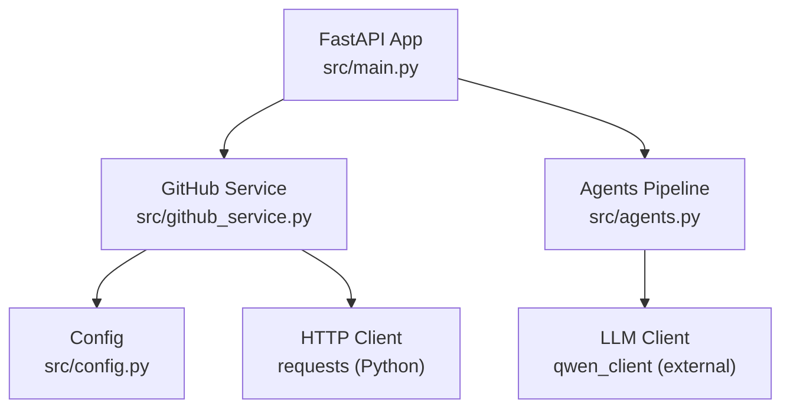
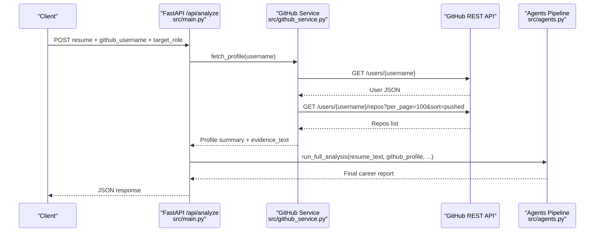
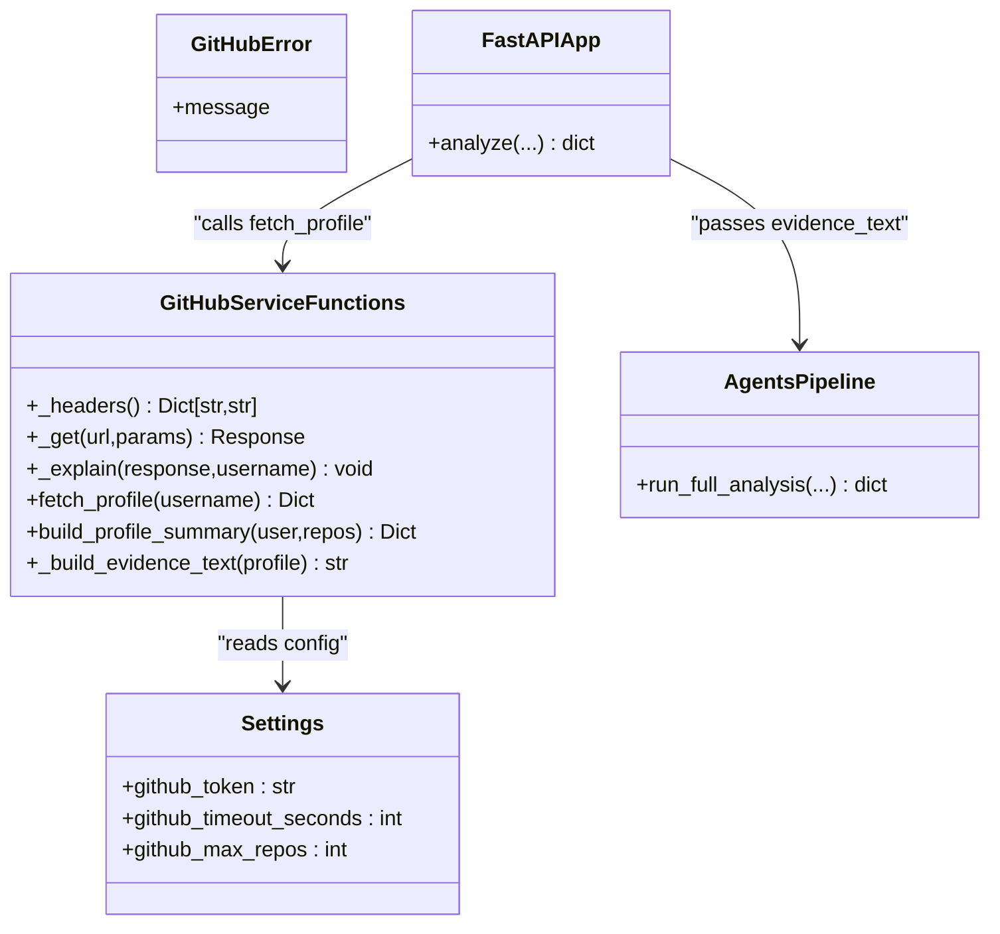
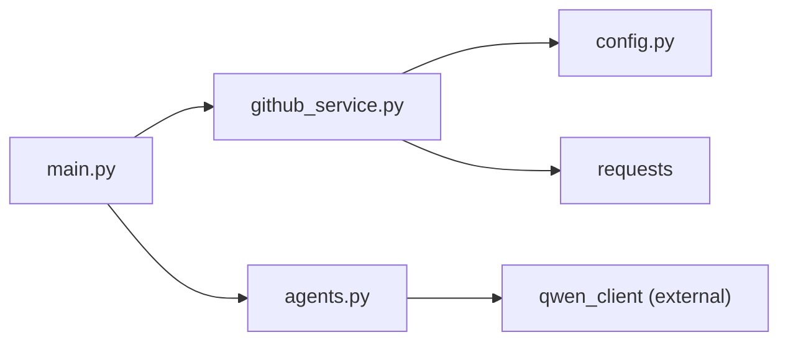

# GitHub API Integration

<cite>
**Referenced Files in This Document**
- [github_service.py](file://src/github_service.py)
- [config.py](file://src/config.py)
- [main.py](file://src/main.py)
- [agents.py](file://src/agents.py)
- [README.md](file://README.md)
- [requirements.txt](file://requirements.txt)
- [test_pipeline.py](file://tests/test_pipeline.py)
</cite>

## Table of Contents
1. [Introduction](#introduction)
2. [Project Structure](#project-structure)
3. [Core Components](#core-components)
4. [Architecture Overview](#architecture-overview)
5. [Detailed Component Analysis](#detailed-component-analysis)
6. [Dependency Analysis](#dependency-analysis)
7. [Performance Considerations](#performance-considerations)
8. [Troubleshooting Guide](#troubleshooting-guide)
9. [Conclusion](#conclusion)
10. [Appendices](#appendices)

## Introduction
This document explains the GitHub REST API integration used by CareerOS AI to fetch public profile data and repository information for skill verification. It focuses on how the system retrieves a developer’s profile, lists their public repositories, extracts programming languages and activity signals, and converts that into evidence text consumed by the analysis pipeline. It also documents authentication via an optional personal access token, rate limit handling, error handling strategies, and performance considerations. Examples are provided for querying profiles, analyzing contribution patterns, and extracting skill-related information from codebases.

## Project Structure
The GitHub integration is implemented as a small service module that:
- Builds authenticated requests to the GitHub REST API
- Fetches user profile and repository metadata
- Summarizes data into a compact structure with an evidence text block
- Raises domain-specific errors for client and server issues

**Diagram sources**
- [main.py:58-147](file://src/main.py#L58-L147)
- [github_service.py:26-89](file://src/github_service.py#L26-L89)
- [config.py:50-57](file://src/config.py#L50-L57)
- [agents.py:295-335](file://src/agents.py#L295-L335)

**Section sources**
- [main.py:58-147](file://src/main.py#L58-L147)
- [github_service.py:1-173](file://src/github_service.py#L1-L173)
- [config.py:1-79](file://src/config.py#L1-L79)
- [agents.py:1-335](file://src/agents.py#L1-L335)

## Core Components
- GitHubService-like functions in github_service.py:
  - Authentication headers with optional token
  - HTTP GET helper with timeout
  - Error explanation mapping to friendly exceptions
  - Profile fetching and summary building
  - Evidence text generation for LLM consumption
- Configuration in config.py:
  - Environment-driven settings for GitHub token, timeouts, and max repos
- API integration in main.py:
  - Validates inputs, calls GitHub service, and passes results to agents
- Agents pipeline in agents.py:
  - Consumes the GitHub evidence text to derive verified skills and insights

Key responsibilities:
- Data acquisition: retrieve public profile and repositories
- Data transformation: filter forks, count languages, sort by stars/activity
- Evidence synthesis: produce concise text for downstream agents
- Error handling: translate GitHub API responses into clear errors
- Rate limit awareness: detect and communicate limits

**Section sources**
- [github_service.py:22-89](file://src/github_service.py#L22-L89)
- [config.py:50-57](file://src/config.py#L50-L57)
- [main.py:109-118](file://src/main.py#L109-L118)
- [agents.py:69-103](file://src/agents.py#L69-L103)

## Architecture Overview
The end-to-end flow for GitHub-based evidence gathering:

**Diagram sources**
- [main.py:58-147](file://src/main.py#L58-L147)
- [github_service.py:63-89](file://src/github_service.py#L63-L89)
- [agents.py:295-335](file://src/agents.py#L295-L335)

## Detailed Component Analysis

### GitHub Service: Authentication and Requests
- Headers:
  - Accept and API version headers are set for all requests
  - Optional Authorization header added when a token is present
- Request helper:
  - Centralized GET with configurable timeout from settings
- Token source:
  - Loaded from environment via configuration; empty if not set

Authentication modes:
- Anonymous: no token; lower rate limit
- Authenticated: Bearer token; higher rate limit

**Section sources**
- [github_service.py:26-45](file://src/github_service.py#L26-L45)
- [config.py:50-57](file://src/config.py#L50-L57)

### GitHub Service: Error Handling and Rate Limits
- Non-200 responses are converted to friendly GitHubError messages
- Specific handling for:
  - 404: user not found
  - 403 with zero remaining: rate limit reached
  - Other errors: generic failure message
- Rate limit detection:
  - Inspects X-RateLimit-Remaining header when available

Error propagation:
- The FastAPI endpoint catches GitHubError and returns a 502 with details

**Section sources**
- [github_service.py:48-60](file://src/github_service.py#L48-L60)
- [main.py:115-118](file://src/main.py#L115-L118)

### GitHub Service: Profile Fetching and Summary
Profile fetching steps:
- Normalize username (strip whitespace, remove @ and trailing slash)
- Validate username presence and format
- Retrieve user profile and repositories (sorted by most recent push, up to 100)
- Build a compact summary including:
  - Basic user info
  - Aggregated stats (stars, forks)
  - Top repositories sorted by stars then recency
  - Language usage counts across own repositories
  - Topics aggregated across repositories
  - Evidence text for LLM consumption

Summary construction highlights:
- Forks are excluded from analysis
- Languages are counted per repository
- Top repositories limited by configuration setting

Evidence text:
- Human-readable summary of username, bio, followers, public repos, top repos, languages, topics
- Designed to be fed directly into the GitHub Evidence Agent

**Section sources**
- [github_service.py:63-147](file://src/github_service.py#L63-L147)
- [github_service.py:150-173](file://src/github_service.py#L150-L173)
- [config.py:55-57](file://src/config.py#L55-L57)

### Agents Integration: Using GitHub Evidence
- The pipeline consumes the evidence_text produced by the GitHub service
- The GitHub Evidence Agent analyzes this text to derive:
  - Verified skills with confidence levels
  - Activity summary and project quality notes
  - Repo highlights
- Subsequent agents use these outputs to match roles and identify gaps

**Section sources**
- [agents.py:69-103](file://src/agents.py#L69-L103)
- [agents.py:295-335](file://src/agents.py#L295-L335)

### Class and Function Relationships

**Diagram sources**
- [github_service.py:22-173](file://src/github_service.py#L22-L173)
- [config.py:23-73](file://src/config.py#L23-L73)
- [main.py:58-147](file://src/main.py#L58-L147)
- [agents.py:295-335](file://src/agents.py#L295-L335)

## Dependency Analysis
- External dependencies:
  - requests for HTTP calls
  - python-dotenv for loading .env
  - fastapi and uvicorn for the web server
  - pypdf for resume parsing (not part of GitHub integration)
- Internal dependencies:
  - config provides settings
  - main orchestrates the pipeline
  - agents consume GitHub evidence

**Diagram sources**
- [requirements.txt:1-8](file://requirements.txt#L1-L8)
- [main.py:17-21](file://src/main.py#L17-L21)
- [github_service.py:12-17](file://src/github_service.py#L12-L17)
- [config.py:11-20](file://src/config.py#L11-L20)

**Section sources**
- [requirements.txt:1-8](file://requirements.txt#L1-L8)
- [main.py:17-21](file://src/main.py#L17-L21)
- [github_service.py:12-17](file://src/github_service.py#L12-L17)
- [config.py:11-20](file://src/config.py#L11-L20)

## Performance Considerations
- Timeouts:
  - All GitHub requests use a configurable timeout to avoid hanging
- Pagination and scope:
  - Repository listing uses per_page=100 and sorts by pushed date to prioritize recent activity
  - Only top N repositories are included in the summary based on configuration
- Filtering:
  - Forks are ignored to focus on original contributions
  - Language counting aggregates across repositories to highlight dominant technologies
- No caching layer:
  - Current implementation does not cache API responses; repeated queries will hit GitHub limits faster
  - If needed, consider adding in-memory or disk caching keyed by username and timestamp

[No sources needed since this section provides general guidance]

## Troubleshooting Guide
Common issues and resolutions:

- Rate limiting:
  - Symptom: 403 with zero remaining requests
  - Resolution: Set GITHUB_TOKEN in .env to increase rate limit; retry after window resets
  - Detection: _explain checks X-RateLimit-Remaining header
- Authentication errors:
  - Symptom: Invalid token or unauthorized access
  - Resolution: Ensure token is valid and has appropriate scopes; verify environment variable is loaded
- Network failures:
  - Symptom: Timeout or connection errors
  - Resolution: Increase timeout via GITHUB_TIMEOUT; check network connectivity; retry with backoff
- Repository access restrictions:
  - Symptom: Missing repositories or incomplete data
  - Resolution: Confirm repositories are public; private repos are not accessible via public API
- Username validation:
  - Symptom: Invalid username errors
  - Resolution: Provide a clean username without spaces, @, or trailing slashes

Operational tips:
- Use the health endpoint to verify configuration status, including whether a GitHub token is set
- Log or surface GitHubError messages to users with actionable guidance

**Section sources**
- [github_service.py:48-60](file://src/github_service.py#L48-L60)
- [main.py:45-55](file://src/main.py#L45-L55)
- [config.py:50-57](file://src/config.py#L50-L57)

## Conclusion
The GitHub integration provides a focused, reliable mechanism to gather public evidence about developers’ skills through their GitHub profiles and repositories. It balances simplicity with robustness by using minimal external dependencies, clear error handling, and configuration-driven behavior. While it currently lacks caching, its design allows easy extension for performance improvements. The evidence text bridges raw API data to the multi-agent analysis pipeline, enabling objective skill verification grounded in real-world activity.

[No sources needed since this section summarizes without analyzing specific files]

## Appendices

### Example Workflows

- Query a specific repository’s owner profile:
  - Call fetch_profile with the username to get a summary including top repositories and languages
  - Use the returned top_repos to inspect notable projects and last push dates
  - Reference: [github_service.py:63-89](file://src/github_service.py#L63-L89)

- Analyze contribution patterns:
  - Examine language_counts derived from own repositories to identify primary languages
  - Review top_repos sorted by stars and recency to assess impact and maintenance
  - Reference: [github_service.py:99-114](file://src/github_service.py#L99-L114)

- Extract skill-related information:
  - Use evidence_text to feed the GitHub Evidence Agent for verified skills
  - Combine with job matching and skill gap agents to produce actionable insights
  - Reference: [agents.py:69-103](file://src/agents.py#L69-L103), [agents.py:295-335](file://src/agents.py#L295-L335)

### Unit Testing Notes
- build_profile_summary is tested with fixture data to ensure correct filtering and aggregation
- Tests validate fork exclusion, language ordering, and evidence text content
- Reference: [test_pipeline.py:79-118](file://tests/test_pipeline.py#L79-L118)

**Section sources**
- [test_pipeline.py:79-118](file://tests/test_pipeline.py#L79-L118)