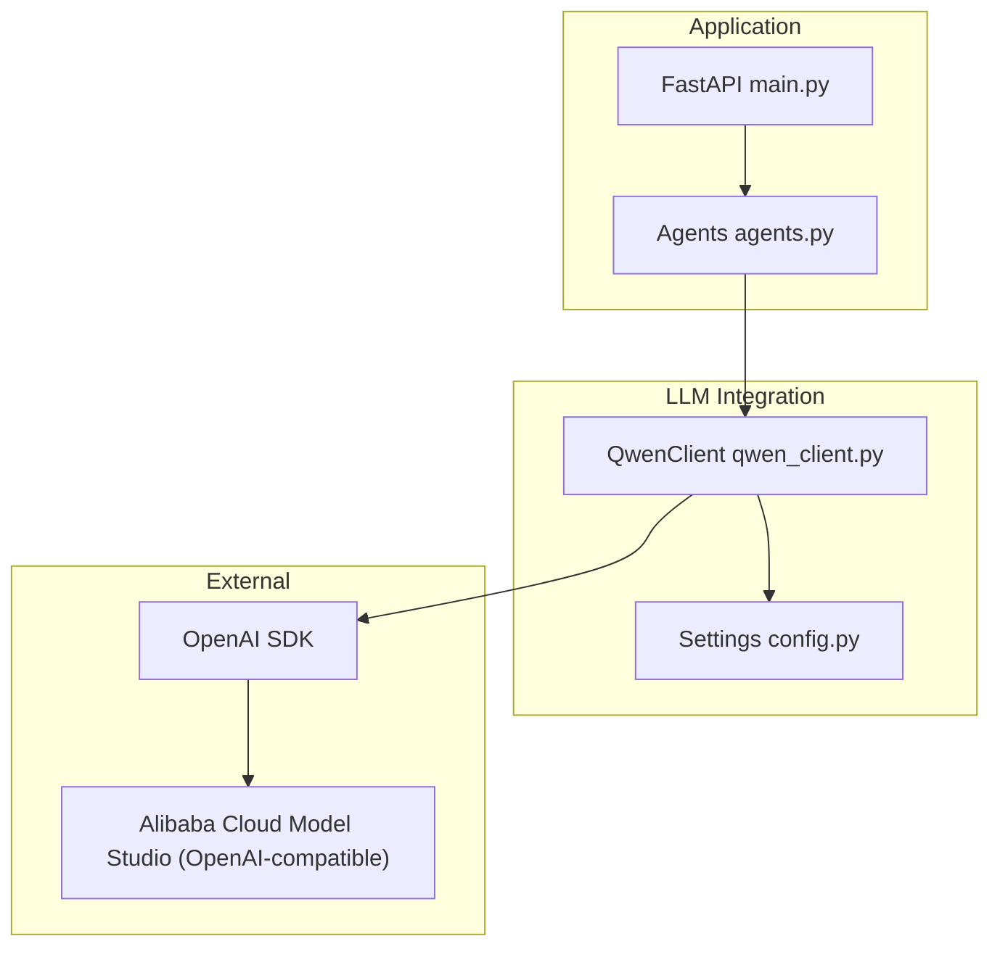
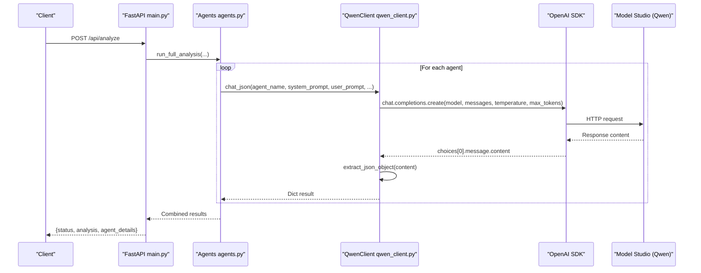
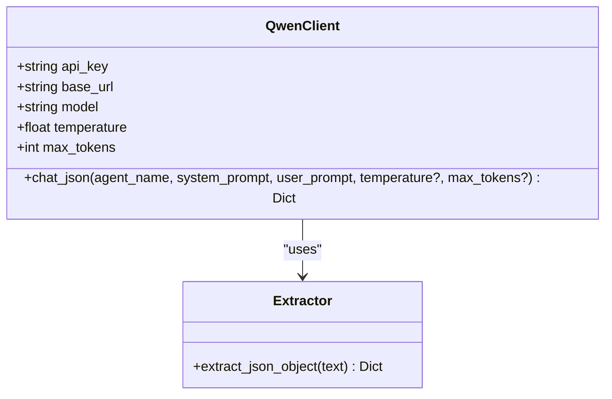
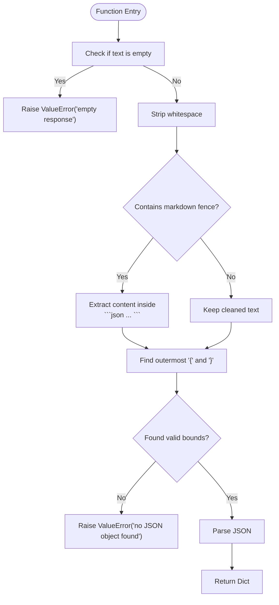
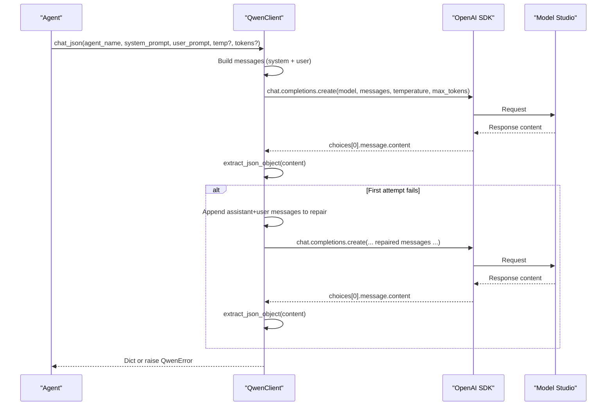
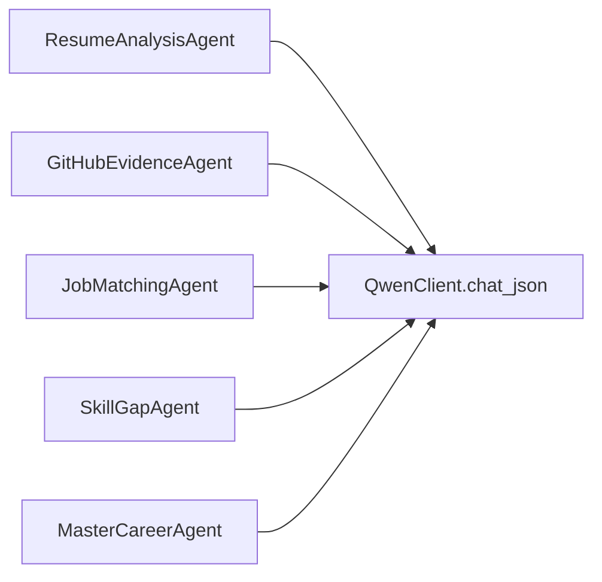
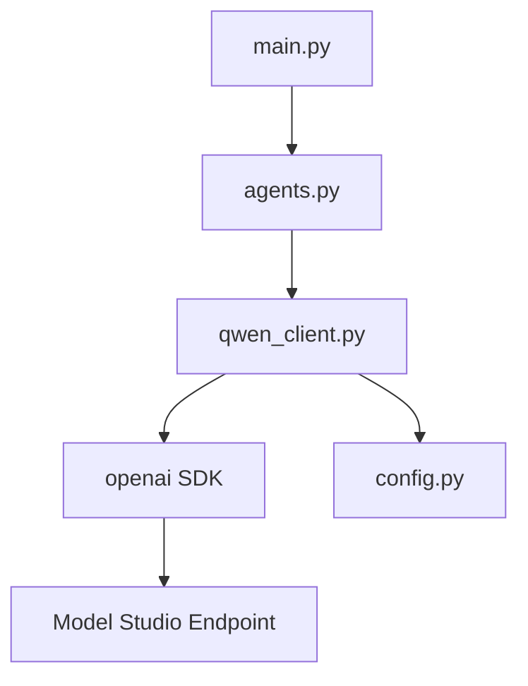

# Qwen LLM Integration

<cite>
**Referenced Files in This Document**
- [qwen_client.py](file://src/qwen_client.py)
- [config.py](file://src/config.py)
- [main.py](file://src/main.py)
- [agents.py](file://src/agents.py)
- [README.md](file://README.md)
- [requirements.txt](file://requirements.txt)
</cite>

## Table of Contents
1. [Introduction](#introduction)
2. [Project Structure](#project-structure)
3. [Core Components](#core-components)
4. [Architecture Overview](#architecture-overview)
5. [Detailed Component Analysis](#detailed-component-analysis)
6. [Dependency Analysis](#dependency-analysis)
7. [Performance Considerations](#performance-considerations)
8. [Troubleshooting Guide](#troubleshooting-guide)
9. [Conclusion](#conclusion)
10. [Appendices](#appendices)

## Introduction
This document explains how the project integrates Alibaba Cloud Model Studio’s Qwen models using an OpenAI-compatible API. It covers environment configuration, model selection, the QwenClient class and its chat_json method, JSON parsing robustness, error handling and retries, and troubleshooting guidance for common issues such as authentication failures, timeouts, and rate limits. It also provides examples for extending the client with custom models or integrating alternative LLM providers.

## Project Structure
The integration is implemented in a small set of focused modules:
- Configuration via environment variables (including DASHSCOPE_API_KEY and QWEN_BASE_URL).
- A thin QwenClient wrapper around the OpenAI SDK that targets the Model Studio endpoint.
- Agents that call QwenClient.chat_json to obtain structured JSON responses.
- A FastAPI entry point that orchestrates the pipeline and surfaces results.



**Diagram sources**
- [main.py:1-160](file://src/main.py#L1-L160)
- [agents.py:1-335](file://src/agents.py#L1-L335)
- [qwen_client.py:1-158](file://src/qwen_client.py#L1-L158)
- [config.py:1-79](file://src/config.py#L1-L79)

**Section sources**
- [main.py:1-160](file://src/main.py#L1-L160)
- [config.py:1-79](file://src/config.py#L1-L79)
- [qwen_client.py:1-158](file://src/qwen_client.py#L1-L158)
- [agents.py:1-335](file://src/agents.py#L1-L335)

## Core Components
- Environment-driven configuration:
  - DASHSCOPE_API_KEY: required API key for Alibaba Cloud Model Studio.
  - QWEN_BASE_URL: base URL for the OpenAI-compatible endpoint; defaults to the international endpoint.
  - QWEN_MODEL: model selection (qwen-turbo, qwen-plus, qwen-max); default is qwen-plus.
  - QWEN_TEMPERATURE and QWEN_MAX_TOKENS: control response generation behavior.
  - QWEN_TIMEOUT: timeout in seconds for API calls.
- QwenClient:
  - Validates presence of API key.
  - Initializes the OpenAI SDK client with base_url and timeout.
  - Provides chat_json to send prompts and return parsed JSON.
- JSON extraction:
  - extract_json_object handles markdown code fences and surrounding chatter to recover valid JSON from LLM responses.
- Agent orchestration:
  - Each agent builds system and user prompts and calls QwenClient.chat_json to receive structured outputs.

**Section sources**
- [config.py:23-49](file://src/config.py#L23-L49)
- [qwen_client.py:27-95](file://src/qwen_client.py#L27-L95)
- [qwen_client.py:42-67](file://src/qwen_client.py#L42-L67)
- [agents.py:27-289](file://src/agents.py#L27-L289)

## Architecture Overview
The application uses a multi-agent pipeline where each agent requests structured JSON from Qwen through QwenClient. The FastAPI layer validates inputs, gathers evidence, runs the pipeline, and returns results.



**Diagram sources**
- [main.py:58-147](file://src/main.py#L58-L147)
- [agents.py:295-335](file://src/agents.py#L295-L335)
- [qwen_client.py:97-157](file://src/qwen_client.py#L97-L157)

## Detailed Component Analysis

### QwenClient Class
Responsibilities:
- Initialize with API key, base URL, model, temperature, and max tokens from environment or overrides.
- Validate API key presence; raise a domain-specific error if missing.
- Provide chat_json to send messages and return a Python dict by parsing LLM output.

Key behaviors:
- Messages include a system prompt augmented with shared JSON output rules to enforce strict JSON-only responses.
- Temperature and max_tokens can be overridden per call; otherwise defaults are used.
- On first attempt, attempts to parse JSON; on failure, performs one retry by appending the raw output and asking for valid JSON again.
- Wraps OpenAI SDK errors into a consistent exception type with actionable messages.



**Diagram sources**
- [qwen_client.py:70-157](file://src/qwen_client.py#L70-L157)
- [qwen_client.py:42-67](file://src/qwen_client.py#L42-L67)

**Section sources**
- [qwen_client.py:70-157](file://src/qwen_client.py#L70-L157)

### JSON Parsing Mechanism: extract_json_object
Purpose:
- Robustly extract a single JSON object from LLM responses that may include markdown code fences or surrounding text.

Algorithm:
- Reject empty input.
- Strip whitespace.
- If wrapped in ```json ... ```, extract inner content.
- Find outermost { ... } block and parse it.
- Raise ValueError when no JSON object can be recovered.



**Diagram sources**
- [qwen_client.py:42-67](file://src/qwen_client.py#L42-L67)

**Section sources**
- [qwen_client.py:42-67](file://src/qwen_client.py#L42-L67)

### chat_json Method: Prompting and Retry Logic
Behavior:
- Constructs messages with a system prompt that includes shared JSON output rules and a user prompt.
- Sends a completion request with model, messages, temperature, and max_tokens.
- Attempts to parse JSON; if invalid, appends assistant and user messages to ask for corrected JSON once more.
- Raises a domain error after two failed attempts with context about the raw output.



**Diagram sources**
- [qwen_client.py:97-157](file://src/qwen_client.py#L97-L157)

**Section sources**
- [qwen_client.py:97-157](file://src/qwen_client.py#L97-L157)

### Agents Using QwenClient
Each agent defines a focused system and user prompt and calls QwenClient.chat_json to get structured JSON. Examples include:
- ResumeAnalysisAgent: extracts claimed skills and experience.
- GitHubEvidenceAgent: derives verified skills from public activity.
- JobMatchingAgent: matches candidate against role requirements.
- SkillGapAgent: identifies critical and moderate gaps.
- MasterCareerAgent: synthesizes final report with scores, roadmap, and recommendations.



**Diagram sources**
- [agents.py:27-289](file://src/agents.py#L27-L289)

**Section sources**
- [agents.py:27-289](file://src/agents.py#L27-L289)

### Configuration and Environment Variables
Key settings:
- DASHSCOPE_API_KEY: Required. Used to authenticate with Model Studio.
- QWEN_BASE_URL: Defaults to the international endpoint; mainland-China accounts should use the China endpoint.
- QWEN_MODEL: Supports qwen-turbo, qwen-plus (default), qwen-max.
- QWEN_TEMPERATURE: Controls randomness; default is low for deterministic outputs.
- QWEN_MAX_TOKENS: Limits response length; default is generous to accommodate complex JSON.
- QWEN_TIMEOUT: Network timeout for API calls.

These values are read at startup and consumed by QwenClient and other services.

**Section sources**
- [config.py:23-49](file://src/config.py#L23-L49)
- [qwen_client.py:73-95](file://src/qwen_client.py#L73-L95)

## Dependency Analysis
High-level dependencies:
- FastAPI application depends on agents and services.
- Agents depend on QwenClient.
- QwenClient depends on the OpenAI SDK and environment configuration.
- External dependency: Alibaba Cloud Model Studio endpoint.



**Diagram sources**
- [main.py:1-160](file://src/main.py#L1-L160)
- [agents.py:1-335](file://src/agents.py#L1-L335)
- [qwen_client.py:1-158](file://src/qwen_client.py#L1-L158)
- [config.py:1-79](file://src/config.py#L1-L79)

**Section sources**
- [main.py:1-160](file://src/main.py#L1-L160)
- [agents.py:1-335](file://src/agents.py#L1-L335)
- [qwen_client.py:1-158](file://src/qwen_client.py#L1-L158)
- [config.py:1-79](file://src/config.py#L1-L79)

## Performance Considerations
- Model selection:
  - qwen-turbo: faster, lower cost; suitable for simple tasks.
  - qwen-plus: balanced performance and quality; default choice.
  - qwen-max: highest quality; higher latency and cost.
- Temperature and max_tokens:
  - Lower temperature yields more deterministic outputs; useful for structured JSON.
  - Increase max_tokens for complex JSON payloads or detailed reports.
- Timeout:
  - Adjust QWEN_TIMEOUT based on network conditions and expected payload size.
- Parallelism:
  - The pipeline runs agents sequentially; consider parallelizing independent stages if needed.

[No sources needed since this section provides general guidance]

## Troubleshooting Guide
Common issues and resolutions:

- Authentication errors:
  - Symptom: QwenError indicating authentication failure.
  - Causes: Missing or invalid DASHSCOPE_API_KEY; incorrect base URL.
  - Actions: Ensure .env contains a valid key; verify QWEN_BASE_URL matches your region.

- Rate limiting:
  - Symptom: Errors indicating rate limit exceeded.
  - Causes: Too many requests in a short time window.
  - Actions: Implement backoff/retry at the caller level; reduce concurrency; consider upgrading plan.

- Timeouts:
  - Symptom: Timeout exceptions during API calls.
  - Causes: Slow network or large payloads.
  - Actions: Increase QWEN_TIMEOUT; reduce max_tokens; check network connectivity.

- Invalid JSON responses:
  - Symptom: QwenError after two attempts due to malformed JSON.
  - Causes: LLM returned non-JSON or included extra text.
  - Actions: Review prompts; ensure system prompt enforces strict JSON; increase max_tokens; inspect raw output in logs.

- Base URL misconfiguration:
  - Symptom: Connection errors or 4xx/5xx responses.
  - Causes: Wrong endpoint for your account region.
  - Actions: Use international endpoint by default; switch to China endpoint for mainland accounts.

- Health checks:
  - Use GET /health to confirm Qwen configuration status and model selection.

**Section sources**
- [qwen_client.py:85-95](file://src/qwen_client.py#L85-L95)
- [qwen_client.py:120-157](file://src/qwen_client.py#L120-L157)
- [main.py:45-55](file://src/main.py#L45-L55)
- [main.py:100-107](file://src/main.py#L100-L107)

## Conclusion
The Qwen integration leverages an OpenAI-compatible endpoint to provide reliable, structured JSON responses across a multi-agent pipeline. Configuration is centralized in environment variables, and QwenClient encapsulates prompting, parsing, and error handling. With careful tuning of model selection, temperature, and token limits, the system delivers consistent results while offering clear paths for troubleshooting and extension.

[No sources needed since this section summarizes without analyzing specific files]

## Appendices

### Environment Variables Reference
- DASHSCOPE_API_KEY: Required. Your Alibaba Cloud Model Studio API key.
- QWEN_BASE_URL: Base URL for the OpenAI-compatible endpoint. Default points to the international endpoint; use the China endpoint for mainland accounts.
- QWEN_MODEL: Model name. Supported options include qwen-turbo, qwen-plus (default), qwen-max.
- QWEN_TEMPERATURE: Float controlling randomness. Default is low for deterministic outputs.
- QWEN_MAX_TOKENS: Integer limiting response length. Default accommodates complex JSON.
- QWEN_TIMEOUT: Integer seconds for API call timeout.

**Section sources**
- [config.py:23-49](file://src/config.py#L23-L49)

### Extending the Client with Custom Models
- Change QWEN_MODEL to any supported model identifier exposed by the endpoint.
- Adjust QWEN_TEMPERATURE and QWEN_MAX_TOKENS to match model capabilities and payload size.
- If switching providers, update QWEN_BASE_URL and ensure the endpoint adheres to the OpenAI-compatible chat completions interface.

**Section sources**
- [config.py:39-48](file://src/config.py#L39-L48)
- [qwen_client.py:73-95](file://src/qwen_client.py#L73-L95)

### Integrating Alternative LLM Providers
- Replace or wrap the OpenAI SDK client initialization with another provider that exposes a compatible chat completions API.
- Maintain the same message format and parameters (model, messages, temperature, max_tokens).
- Preserve QwenClient.chat_json contract so existing agents remain unchanged.

[No sources needed since this section provides general guidance]