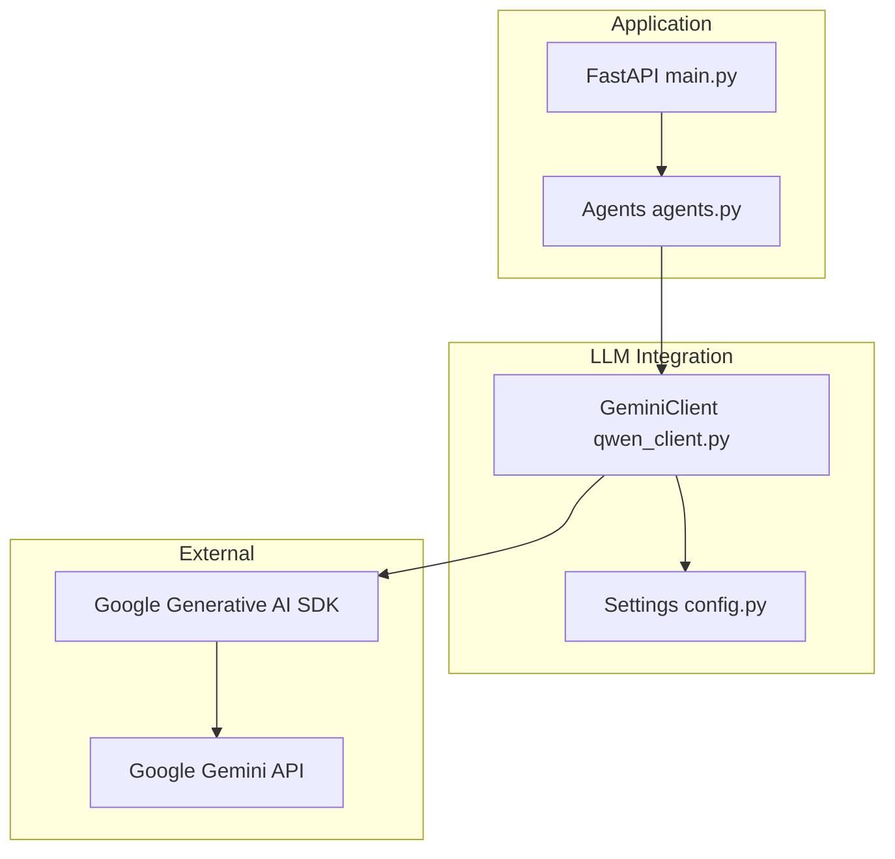
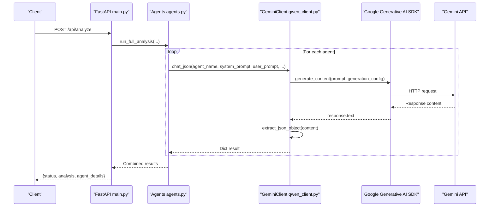
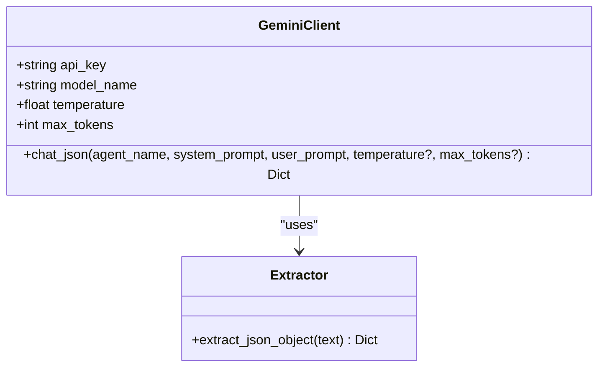
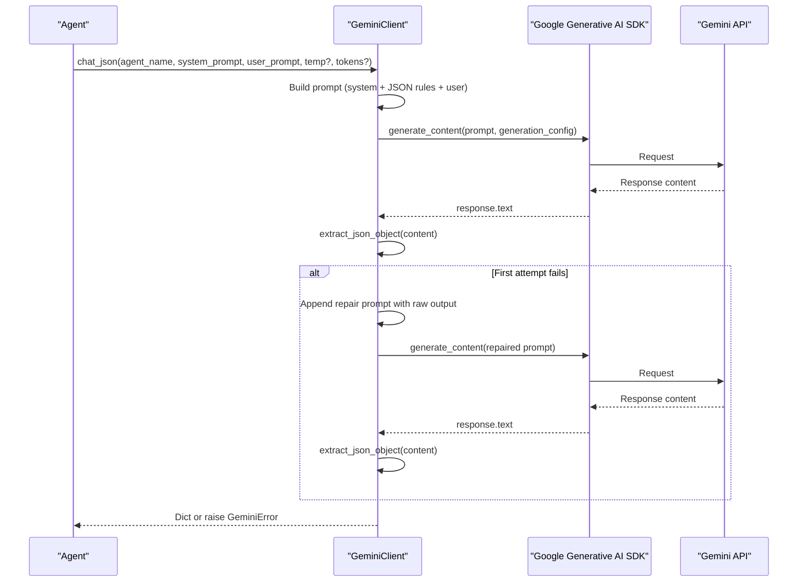
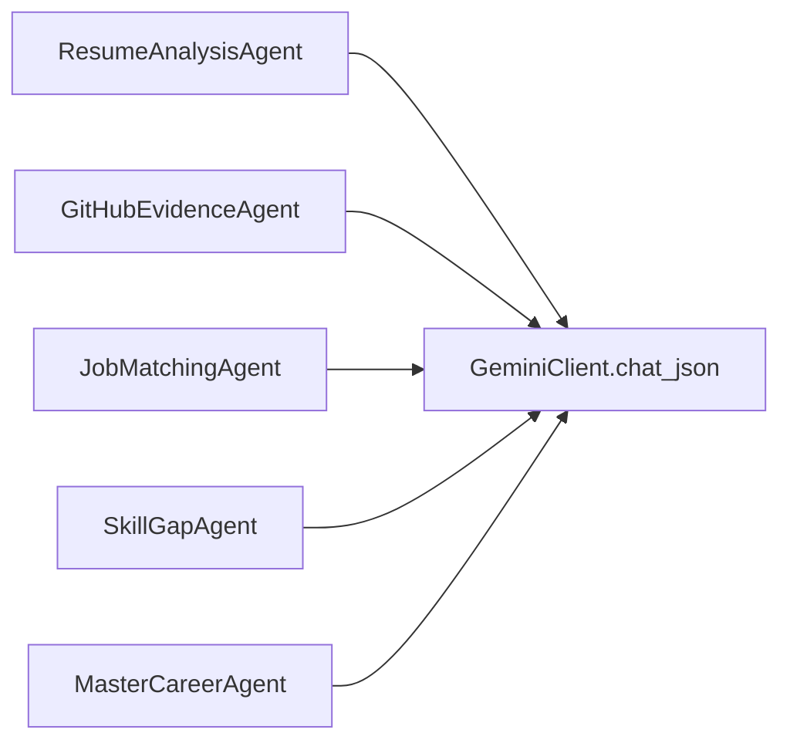
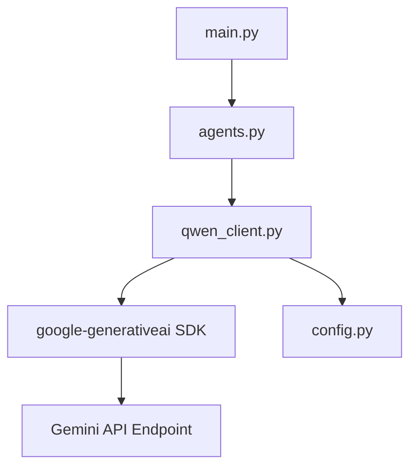

# Qwen LLM Integration

<cite>
**Referenced Files in This Document**
- [qwen_client.py](file://src/qwen_client.py)
- [config.py](file://src/config.py)
- [main.py](file://src/main.py)
- [agents.py](file://src/agents.py)
- [requirements.txt](file://requirements.txt)
</cite>

## Update Summary
**Changes Made**
- Updated to reflect complete migration from Alibaba Cloud Qwen to Google Gemini AI
- Replaced DASHSCOPE_API_KEY with GOOGLE_API_KEY environment variable
- Updated model configuration from QWEN_* to GEMINI_* variables
- Enhanced error handling with GeminiError exception type
- Improved JSON parsing with robust retry logic
- Updated all references to use Gemini-specific terminology and APIs

## Table of Contents
1. [Introduction](#introduction)
2. [Project Structure](#project-structure)
3. [Core Components](#core-components)
4. [Architecture Overview](#architecture-overview)
5. [Detailed Component Analysis](#detailed-component-analysis)
6. [Dependency Analysis](#dependency-analysis)
7. [Performance Considerations](#performance-considerations)
8. [Troubleshooting Guide](#troubleshooting-guide)
9. [Conclusion](#conclusion)
10. [Appendices](#appendices)

## Introduction
This document explains how the project integrates Google Gemini AI models using an OpenAI-compatible API wrapper. The system has been migrated from Alibaba Cloud Model Studio's Qwen models to Google's Gemini AI platform while maintaining the same interface architecture. It covers environment configuration with GOOGLE_API_KEY, model selection options (gemini-3.6-flash, gemini-flash-latest), the GeminiClient class and its chat_json method, strict JSON enforcement, comprehensive error handling with retry logic, and troubleshooting guidance for common issues such as authentication failures, rate limits, and network connectivity problems.

## Project Structure
The integration is implemented in a small set of focused modules:
- Configuration via environment variables (including GOOGLE_API_KEY and GEMINI_MODEL).
- A GeminiClient wrapper around the Google Generative AI SDK that targets the Gemini API endpoint.
- Agents that call GeminiClient.chat_json to obtain structured JSON responses.
- A FastAPI entry point that orchestrates the pipeline and surfaces results.



**Diagram sources**
- [main.py:1-160](file://src/main.py#L1-L160)
- [agents.py:1-337](file://src/agents.py#L1-L337)
- [qwen_client.py:1-161](file://src/qwen_client.py#L1-L161)
- [config.py:1-72](file://src/config.py#L1-L72)

**Section sources**
- [main.py:1-160](file://src/main.py#L1-L160)
- [config.py:1-72](file://src/config.py#L1-L72)
- [qwen_client.py:1-161](file://src/qwen_client.py#L1-L161)
- [agents.py:1-337](file://src/agents.py#L1-L337)

## Core Components
- Environment-driven configuration:
  - GOOGLE_API_KEY: required API key for Google AI Studio.
  - GEMINI_MODEL: model selection (gemini-3.6-flash default, gemini-flash-latest); supports various Gemini models.
  - GEMINI_TEMPERATURE: controls response generation behavior; default is 0.7.
  - GEMINI_MAX_TOKENS: limits response length; default is 2048 tokens.
- GeminiClient:
  - Validates presence of GOOGLE_API_KEY.
  - Initializes the Google Generative AI SDK client with configured model.
  - Provides chat_json to send prompts and return parsed JSON with retry logic.
- JSON extraction:
  - extract_json_object handles markdown code fences and surrounding chatter to recover valid JSON from LLM responses.
- Agent orchestration:
  - Each agent builds system and user prompts and calls GeminiClient.chat_json to receive structured outputs.

**Section sources**
- [config.py:29-41](file://src/config.py#L29-L41)
- [qwen_client.py:74-96](file://src/qwen_client.py#L74-L96)
- [qwen_client.py:46-71](file://src/qwen_client.py#L46-L71)
- [agents.py:27-291](file://src/agents.py#L27-L291)

## Architecture Overview
The application uses a multi-agent pipeline where each agent requests structured JSON from Gemini through GeminiClient. The FastAPI layer validates inputs, gathers evidence, runs the pipeline, and returns results.



**Diagram sources**
- [main.py:58-147](file://src/main.py#L58-L147)
- [agents.py:297-337](file://src/agents.py#L297-L337)
- [qwen_client.py:98-161](file://src/qwen_client.py#L98-L161)

## Detailed Component Analysis

### GeminiClient Class
Responsibilities:
- Initialize with API key, model, temperature, and max tokens from environment or overrides.
- Validate GOOGLE_API_KEY presence; raise a domain-specific GeminiError if missing.
- Provide chat_json to send messages and return a Python dict by parsing Gemini output.

Key behaviors:
- Messages include a system prompt augmented with shared JSON output rules to enforce strict JSON-only responses.
- Temperature and max_tokens can be overridden per call; otherwise defaults are used.
- On first attempt, attempts to parse JSON; on failure, performs one retry by appending the raw output and asking for valid JSON again.
- Wraps Google Generative AI SDK errors into a consistent GeminiError exception type with actionable messages.



**Diagram sources**
- [qwen_client.py:74-161](file://src/qwen_client.py#L74-L161)
- [qwen_client.py:46-71](file://src/qwen_client.py#L46-L71)

**Section sources**
- [qwen_client.py:74-161](file://src/qwen_client.py#L74-L161)

### JSON Parsing Mechanism: extract_json_object
Purpose:
- Robustly extract a single JSON object from Gemini responses that may include markdown code fences or surrounding text.

Algorithm:
- Reject empty input.
- Strip whitespace.
- If wrapped in ```json ... ```, extract inner content.
- Find outermost { ... } block and parse it.
- Raise ValueError when no JSON object can be recovered.


**Diagram sources**
- [qwen_client.py:46-71](file://src/qwen_client.py#L46-L71)

**Section sources**
- [qwen_client.py:46-71](file://src/qwen_client.py#L46-L71)

### chat_json Method: Prompting and Retry Logic
Behavior:
- Constructs messages with a system prompt that includes shared JSON output rules and a user prompt.
- Sends a completion request with model, messages, temperature, and max_output_tokens.
- Attempts to parse JSON; if invalid, appends assistant and user messages to ask for corrected JSON once more.
- Raises a GeminiError after two failed attempts with context about the raw output.



**Diagram sources**
- [qwen_client.py:98-161](file://src/qwen_client.py#L98-L161)

**Section sources**
- [qwen_client.py:98-161](file://src/qwen_client.py#L98-L161)

### Agents Using GeminiClient
Each agent defines a focused system and user prompt and calls GeminiClient.chat_json to get structured JSON. Examples include:
- ResumeAnalysisAgent: extracts claimed skills and experience.
- GitHubEvidenceAgent: derives verified skills from public activity.
- JobMatchingAgent: matches candidate against role requirements.
- SkillGapAgent: identifies critical and moderate gaps.
- MasterCareerAgent: synthesizes final report with scores, roadmap, and recommendations.



**Diagram sources**
- [agents.py:27-291](file://src/agents.py#L27-L291)

**Section sources**
- [agents.py:27-291](file://src/agents.py#L27-L291)

### Configuration and Environment Variables
Key settings:
- GOOGLE_API_KEY: Required. Used to authenticate with Google AI Studio.
- GEMINI_MODEL: Supports gemini-3.6-flash (default), gemini-flash-latest, and other Gemini models.
- GEMINI_TEMPERATURE: Controls randomness; default is 0.7 for balanced creativity.
- GEMINI_MAX_TOKENS: Limits response length; default is 2048 tokens.

These values are read at startup and consumed by GeminiClient and other services.

**Section sources**
- [config.py:29-41](file://src/config.py#L29-L41)
- [qwen_client.py:77-96](file://src/qwen_client.py#L77-L96)

## Dependency Analysis
High-level dependencies:
- FastAPI application depends on agents and services.
- Agents depend on GeminiClient.
- GeminiClient depends on the Google Generative AI SDK and environment configuration.
- External dependency: Google Gemini API endpoint.



**Diagram sources**
- [main.py:1-160](file://src/main.py#L1-L160)
- [agents.py:1-337](file://src/agents.py#L1-L337)
- [qwen_client.py:1-161](file://src/qwen_client.py#L1-L161)
- [config.py:1-72](file://src/config.py#L1-L72)

**Section sources**
- [main.py:1-160](file://src/main.py#L1-L160)
- [agents.py:1-337](file://src/agents.py#L1-L337)
- [qwen_client.py:1-161](file://src/qwen_client.py#L1-L161)
- [config.py:1-72](file://src/config.py#L1-L72)

## Performance Considerations
- Model selection:
  - gemini-3.6-flash: fast, cost-effective; suitable for most tasks.
  - gemini-flash-latest: auto-updating model with latest improvements.
  - Other Gemini models: available based on specific requirements.
- Temperature and max_tokens:
  - Lower temperature yields more deterministic outputs; useful for structured JSON.
  - Increase max_tokens for complex JSON payloads or detailed reports.
- Token budget:
  - The MasterCareerAgent uses 8192 tokens for comprehensive career reports.
- Parallelism:
  - The pipeline runs agents sequentially; consider parallelizing independent stages if needed.

## Troubleshooting Guide
Common issues and resolutions:

- Authentication errors:
  - Symptom: GeminiError indicating authentication failure.
  - Causes: Missing or invalid GOOGLE_API_KEY; incorrect model name.
  - Actions: Ensure .env contains a valid Google AI Studio API key; verify GEMINI_MODEL is supported.

- Rate limiting:
  - Symptom: Errors indicating rate limit exceeded.
  - Causes: Too many requests in a short time window.
  - Actions: Implement backoff/retry at the caller level; reduce concurrency; consider upgrading plan.

- Timeouts:
  - Symptom: Timeout exceptions during API calls.
  - Causes: Slow network or large payloads.
  - Actions: Increase timeout settings; reduce max_tokens; check network connectivity.

- Invalid JSON responses:
  - Symptom: GeminiError after two attempts due to malformed JSON.
  - Causes: Gemini returned non-JSON or included extra text.
  - Actions: Review prompts; ensure system prompt enforces strict JSON; increase max_tokens; inspect raw output in logs.

- Model configuration:
  - Symptom: Connection errors or unsupported model errors.
  - Causes: Wrong model name or unsupported region.
  - Actions: Use gemini-3.6-flash by default; verify model availability in your region.

- Health checks:
  - Use GET /health to confirm Gemini configuration status and model selection.

**Section sources**
- [qwen_client.py:87-96](file://src/qwen_client.py#L87-L96)
- [qwen_client.py:130-161](file://src/qwen_client.py#L130-L161)
- [main.py:45-55](file://src/main.py#L45-L55)
- [main.py:100-107](file://src/main.py#L100-L107)

## Conclusion
The Gemini integration leverages Google's AI platform to provide reliable, structured JSON responses across a multi-agent pipeline. Configuration is centralized in environment variables, and GeminiClient encapsulates prompting, parsing, and error handling with robust retry logic. With careful tuning of model selection, temperature, and token limits, the system delivers consistent results while offering clear paths for troubleshooting and extension.

## Appendices

### Environment Variables Reference
- GOOGLE_API_KEY: Required. Your Google AI Studio API key.
- GEMINI_MODEL: Model name. Supported options include gemini-3.6-flash (default), gemini-flash-latest.
- GEMINI_TEMPERATURE: Float controlling randomness. Default is 0.7 for balanced creativity.
- GEMINI_MAX_TOKENS: Integer limiting response length. Default is 2048 tokens.

**Section sources**
- [config.py:29-41](file://src/config.py#L29-L41)

### Extending the Client with Custom Models
- Change GEMINI_MODEL to any supported Gemini model identifier exposed by Google AI Studio.
- Adjust GEMINI_TEMPERATURE and GEMINI_MAX_TOKENS to match model capabilities and payload size.
- The GeminiClient maintains compatibility with existing agents through the same interface.

**Section sources**
- [config.py:36-41](file://src/config.py#L36-L41)
- [qwen_client.py:77-96](file://src/qwen_client.py#L77-L96)

### Integrating Alternative LLM Providers
- Replace or wrap the Google Generative AI SDK client initialization with another provider that exposes a compatible chat completions API.
- Maintain the same message format and parameters (model, messages, temperature, max_tokens).
- Preserve GeminiClient.chat_json contract so existing agents remain unchanged.

### Migration Notes from Qwen to Gemini
- Environment variables changed from DASHSCOPE_API_KEY to GOOGLE_API_KEY.
- Model configuration moved from QWEN_* to GEMINI_* variables.
- Error handling updated from QwenError to GeminiError.
- API calls changed from OpenAI-compatible to Google Generative AI SDK.
- All agent interfaces remain unchanged for backward compatibility.