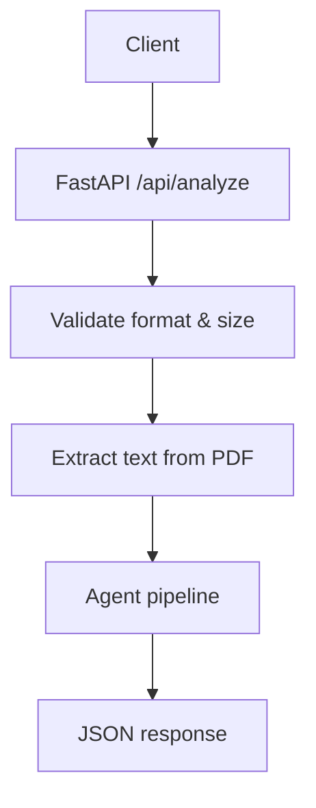
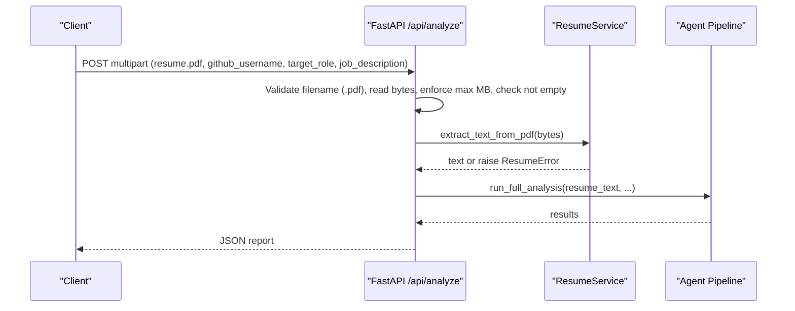
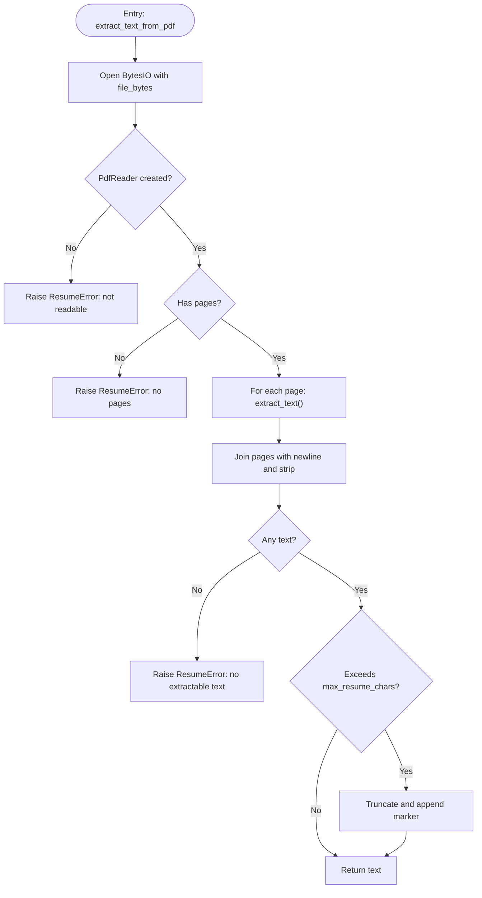
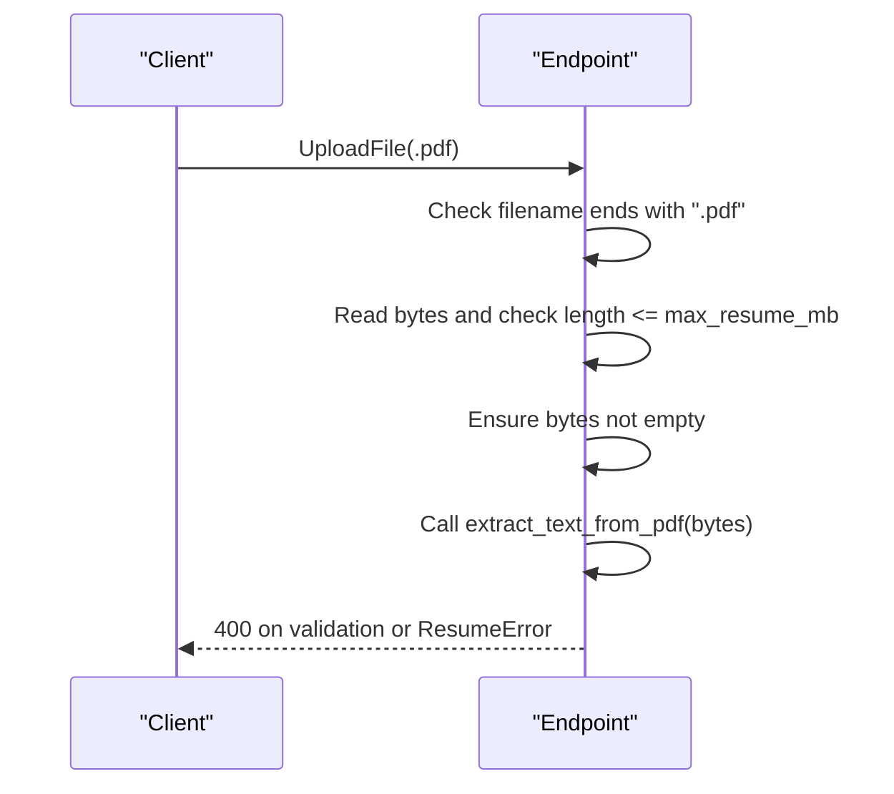
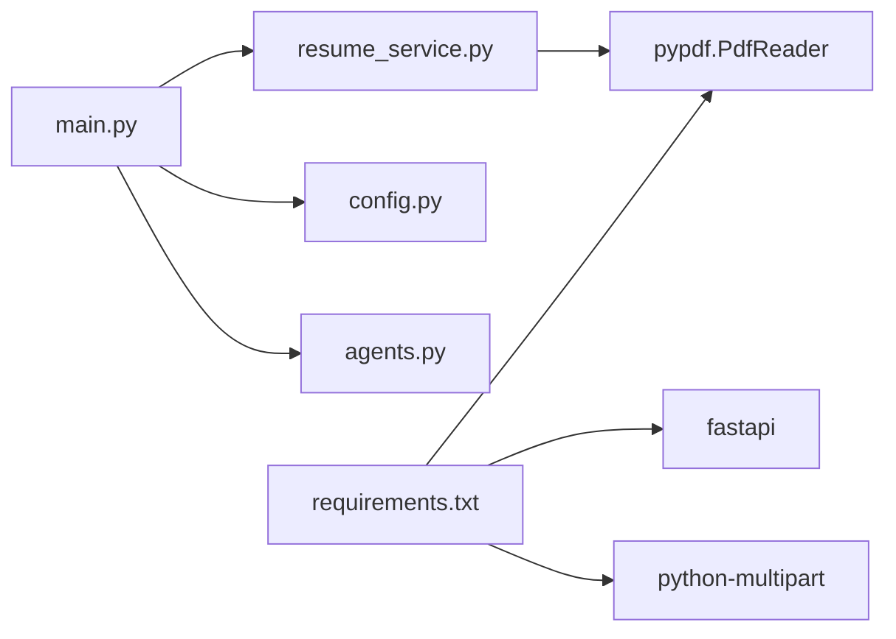

# Resume Processing

<cite>
**Referenced Files in This Document**
- [resume_service.py](file://src/resume_service.py)
- [main.py](file://src/main.py)
- [config.py](file://src/config.py)
- [requirements.txt](file://requirements.txt)
- [README.md](file://README.md)
- [test_pipeline.py](file://tests/test_pipeline.py)
</cite>

## Update Summary
**Changes Made**
- Updated PDF library references from PyPDF to pypdf (modern version)
- Enhanced error handling documentation with specific exception types
- Added comprehensive testing coverage details
- Improved troubleshooting guidance based on actual implementation
- Updated configuration examples with current environment variables

## Table of Contents
1. [Introduction](#introduction)
2. [Project Structure](#project-structure)
3. [Core Components](#core-components)
4. [Architecture Overview](#architecture-overview)
5. [Detailed Component Analysis](#detailed-component-analysis)
6. [Dependency Analysis](#dependency-analysis)
7. [Performance Considerations](#performance-considerations)
8. [Troubleshooting Guide](#troubleshooting-guide)
9. [Conclusion](#conclusion)
10. [Appendices](#appendices)

## Introduction
This document explains how the application processes PDF resumes using the pypdf library to extract text for downstream AI analysis. It covers file upload handling, validation (format and size), text extraction, truncation limits, error handling for corrupted or unsupported inputs, and guidance for preprocessing and troubleshooting. The focus is on the ResumeService implementation and its integration with the FastAPI endpoint that orchestrates the full analysis pipeline.

## Project Structure
The resume processing logic is implemented in a small, focused module and integrated into the main API entry point:
- Resume text extraction and validation are encapsulated in a dedicated service module.
- The FastAPI endpoint validates uploads, enforces size/format constraints, invokes the service, and forwards extracted text to the agent pipeline.
- Configuration controls upload limits and text truncation thresholds.

**Diagram sources**
- [main.py:58-147](file://src/main.py#L58-L147)
- [resume_service.py:24-57](file://src/resume_service.py#L24-L57)
- [config.py:55-56](file://src/config.py#L55-L56)

**Section sources**
- [main.py:58-147](file://src/main.py#L58-L147)
- [resume_service.py:24-57](file://src/resume_service.py#L24-L57)
- [config.py:55-56](file://src/config.py#L55-L56)

## Core Components
- **ResumeError**: Custom exception class inheriting from ValueError for user-input problems such as unreadable PDFs or empty content.
- **extract_text_from_pdf(file_bytes)**: Reads bytes via an in-memory BytesIO stream, constructs a PdfReader, iterates pages, extracts text, joins pages, strips whitespace, and applies a configurable character limit.
- **FastAPI analyze endpoint**: Validates filename extension, reads file bytes, enforces maximum MB, checks non-empty payload, calls extract_text_from_pdf, and passes the result to the agent pipeline.

Key responsibilities:
- Input validation at the API layer (extension, size, emptiness).
- Robust text extraction with clear error signaling for non-PDF or image-only PDFs.
- Controlled prompt size by truncating very long resumes to a configured maximum.

**Section sources**
- [resume_service.py:17-57](file://src/resume_service.py#L17-L57)
- [main.py:84-113](file://src/main.py#L84-L113)
- [config.py:55-56](file://src/config.py#L55-L56)

## Architecture Overview
The end-to-end flow for resume processing:

**Diagram sources**
- [main.py:58-147](file://src/main.py#L58-L147)
- [resume_service.py:24-57](file://src/resume_service.py#L24-L57)

## Detailed Component Analysis

### ResumeService: Text Extraction and Limits
- Reads uploaded bytes into an in-memory BytesIO buffer.
- Creates a PdfReader instance; any failure raises a custom ResumeError indicating the file could not be read as a PDF.
- Ensures at least one page exists; otherwise raises a ResumeError.
- Iterates pages and extracts text; concatenates with newlines and trims surrounding whitespace.
- If no text is found, raises a ResumeError indicating scanned/image-only PDFs are not supported.
- Applies a configurable character limit to control prompt size and cost; appends a truncation marker when exceeded.

**Diagram sources**
- [resume_service.py:24-57](file://src/resume_service.py#L24-L57)
- [config.py:55-56](file://src/config.py#L55-L56)

**Section sources**
- [resume_service.py:24-57](file://src/resume_service.py#L24-L57)
- [config.py:55-56](file://src/config.py#L55-L56)

### File Upload Handling and Validation
- Enforces .pdf extension only; other formats are rejected early with HTTP 400 responses.
- Reads entire file into memory and enforces a maximum size in megabytes.
- Rejects empty payloads.
- Converts ResumeError into HTTP 400 responses for client-friendly errors.

**Diagram sources**
- [main.py:84-113](file://src/main.py#L84-L113)

**Section sources**
- [main.py:84-113](file://src/main.py#L84-L113)

### Error Handling Summary
- **Unsupported format**: Rejected by extension check before reading with HTTP 400 response.
- **Oversized documents**: Rejected by size check against configured MB limit with descriptive error message.
- **Corrupted/unreadable PDF**: Raises ResumeError during PdfReader creation with specific error message.
- **Image-only or scanned PDFs**: Detected by absence of extractable text; returns clear message about OCR requirements.
- **Empty files**: Explicitly rejected with HTTP 400 response.

These behaviors are enforced both at the API boundary and within the extraction function, providing consistent error handling throughout the pipeline.

**Section sources**
- [main.py:84-113](file://src/main.py#L84-L113)
- [resume_service.py:24-57](file://src/resume_service.py#L24-L57)

### Text Preprocessing Pipeline
Current behavior:
- Page-wise extraction concatenated with newlines.
- Global strip of leading/trailing whitespace.
- Hard truncation to a configured maximum character count to control prompt size.

Notes:
- No explicit section detection or semantic cleaning is performed in this module.
- The resulting plain text is passed to the agent pipeline, which can perform higher-level parsing and sectioning.

Recommendations for future enhancement:
- Normalize multiple spaces and line breaks.
- Remove non-printable characters.
- Optionally split by common headings (e.g., Experience, Education, Skills) if needed by downstream agents.

**Section sources**
- [resume_service.py:39-57](file://src/resume_service.py#L39-L57)
- [config.py:55-56](file://src/config.py#L55-L56)

### Memory Optimization and Temporary Files
- Uses an in-memory BytesIO buffer for reading; avoids writing temporary files to disk.
- Entire file is loaded into memory; ensure server memory limits accommodate the configured maximum MB.
- For extremely large PDFs, consider streaming or chunked processing strategies beyond current scope.

**Section sources**
- [resume_service.py:31-33](file://src/resume_service.py#L31-L33)
- [main.py:90-98](file://src/main.py#L90-L98)
- [config.py:55-56](file://src/config.py#L55-L56)

### Examples and Usage Patterns
- **Single-page resume**: Works out of the box; text is extracted and truncated if necessary.
- **Multi-page resume**: Each page's text is appended; ensure total length remains within configured limits.
- **Different layouts**: Since extraction relies on embedded text, layout variations may affect ordering; downstream agents should handle normalization.
- **Scanned/image-only PDFs**: Not supported; users must provide text-based PDFs or use OCR tools first.

Validation and limits are enforced at the API layer; extraction errors surface as clear messages through HTTP 400 responses.

**Section sources**
- [main.py:84-113](file://src/main.py#L84-L113)
- [resume_service.py:36-57](file://src/resume_service.py#L36-L57)

## Dependency Analysis
External dependencies relevant to resume processing:
- **pypdf**: Used for reading PDFs and extracting text (modern replacement for PyPDF2).
- **fastapi + python-multipart**: Handles file uploads and form data.
- **python-dotenv**: Loads environment variables for configuration.

**Diagram sources**
- [requirements.txt:1-8](file://requirements.txt#L1-L8)
- [main.py:14-21](file://src/main.py#L14-L21)
- [resume_service.py:9-14](file://src/resume_service.py#L9-L14)
- [config.py:11-20](file://src/config.py#L11-L20)

**Section sources**
- [requirements.txt:1-8](file://requirements.txt#L1-L8)
- [main.py:14-21](file://src/main.py#L14-L21)
- [resume_service.py:9-14](file://src/resume_service.py#L9-L14)
- [config.py:11-20](file://src/config.py#L11-L20)

## Performance Considerations
- **Character truncation**: Prevents oversized prompts by limiting to a configured maximum; adjust MAX_RESUME_CHARS based on model token budgets and latency targets.
- **In-memory processing**: Avoids disk I/O overhead but consumes RAM proportional to file size; tune MAX_RESUME_MB accordingly.
- **Batch processing**: Process resumes sequentially per request; avoid concurrent large uploads unless resources allow.
- **Downstream efficiency**: Keep extracted text concise; rely on agents for structured parsing rather than heavy preprocessing here.

## Troubleshooting Guide
Common issues and resolutions:
- **Unsupported format**: Ensure the uploaded file has a .pdf extension; other types are rejected with HTTP 400 response.
- **Oversized document**: Reduce file size or increase MAX_RESUME_MB if appropriate for your deployment.
- **Corrupted or unreadable PDF**: The service will reject it with a ResumeError; re-export or repair the PDF.
- **Scanned/image-only PDF**: No text is embedded; use OCR tools to produce a text-based PDF before uploading.
- **Encoding/layout anomalies**: Extracted text may contain irregular spacing or order; downstream agents should normalize; consider adding post-processing steps if needed.
- **Performance bottlenecks**: Monitor memory usage and adjust limits; consider streaming or chunking strategies for very large PDFs.

Verification via tests:
- Tests confirm that non-PDF input and blank PDFs raise the expected ResumeError type.
- Use these patterns to validate your environment and configuration changes.

**Section sources**
- [main.py:84-113](file://src/main.py#L84-L113)
- [resume_service.py:24-57](file://src/resume_service.py#L24-L57)
- [test_pipeline.py:124-135](file://tests/test_pipeline.py#L124-L135)

## Conclusion
The resume processing path is intentionally simple and robust: validate inputs at the API boundary, extract text with pypdf, enforce safe limits, and pass clean text to the agent pipeline. This design minimizes complexity while providing clear error signals and predictable behavior for typical resume formats. Future enhancements can add richer preprocessing and section detection if required by downstream agents.

## Appendices

### Configuration Keys
- **MAX_RESUME_MB**: Maximum allowed resume size in megabytes (default: 10).
- **MAX_RESUME_CHARS**: Maximum number of characters to retain after extraction (default: 12000).

Adjust these values to balance performance, cost, and accuracy.

**Section sources**
- [config.py:55-56](file://src/config.py#L55-L56)

### API Reference Highlights
- **Endpoint**: POST /api/analyze
- **Inputs**: resume (PDF), github_username, target_role, optional job_description
- **Behavior**: Validates inputs, extracts resume text, runs multi-agent analysis, returns structured results

**Section sources**
- [main.py:58-147](file://src/main.py#L58-L147)

### Testing Coverage
The test suite includes comprehensive coverage for resume processing:
- **Non-PDF input validation**: Verifies that non-PDF files raise ResumeError.
- **Blank PDF handling**: Tests that empty PDFs are properly rejected.
- **Full pipeline integration**: Validates the complete analysis workflow with mocked LLM responses.

**Section sources**
- [test_pipeline.py:124-135](file://tests/test_pipeline.py#L124-L135)
- [test_pipeline.py:177-202](file://tests/test_pipeline.py#L177-L202)