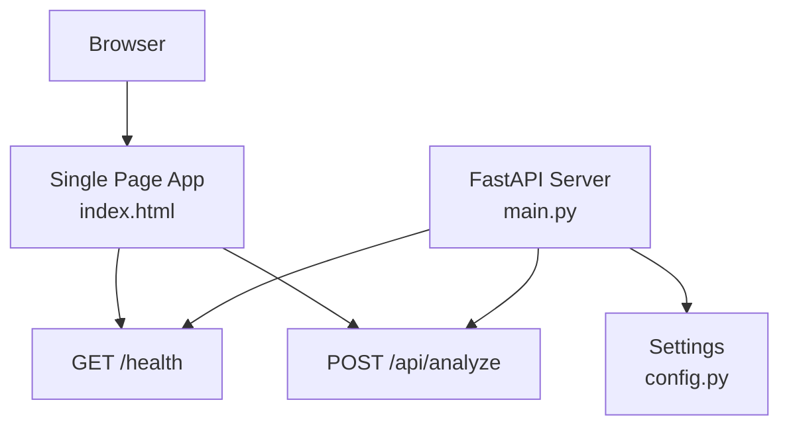
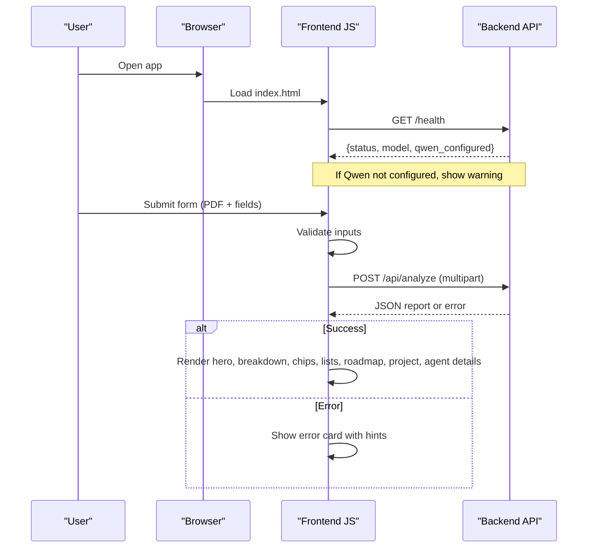
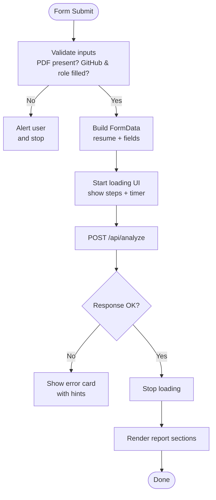
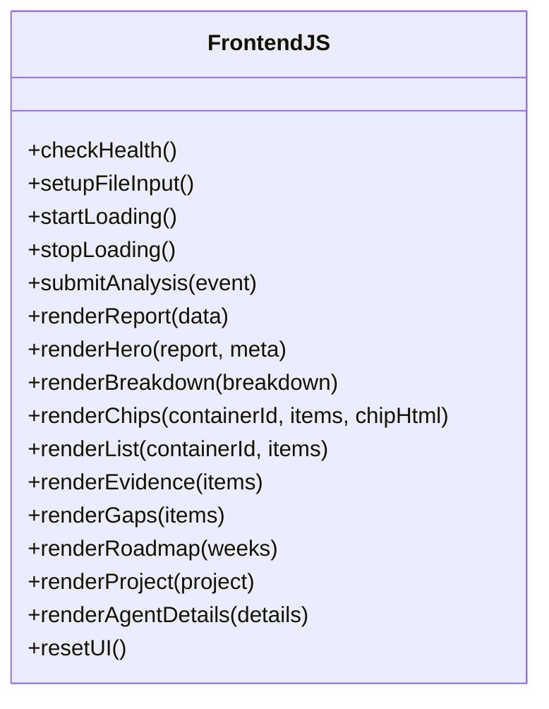
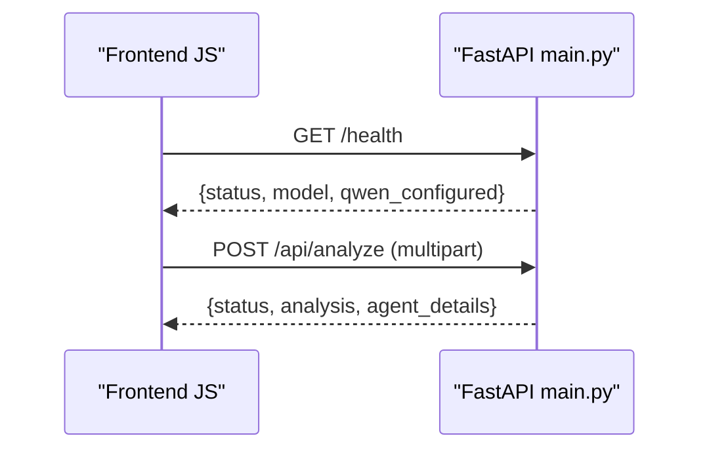
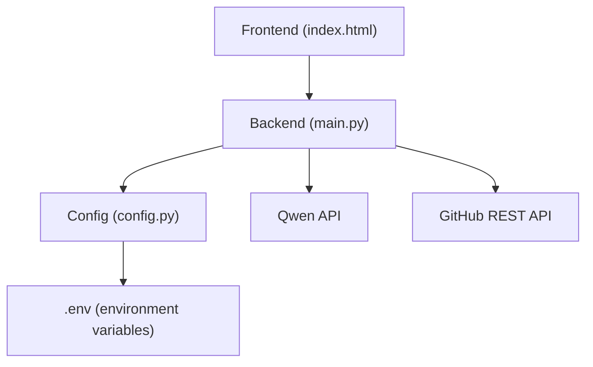

# Frontend Interface

<cite>
**Referenced Files in This Document**
- [index.html](file://src/static/index.html)
- [main.py](file://src/main.py)
- [config.py](file://src/config.py)
- [README.md](file://README.md)
- [requirements.txt](file://requirements.txt)
</cite>

## Table of Contents
1. [Introduction](#introduction)
2. [Project Structure](#project-structure)
3. [Core Components](#core-components)
4. [Architecture Overview](#architecture-overview)
5. [Detailed Component Analysis](#detailed-component-analysis)
6. [Dependency Analysis](#dependency-analysis)
7. [Performance Considerations](#performance-considerations)
8. [Troubleshooting Guide](#troubleshooting-guide)
9. [Conclusion](#conclusion)
10. [Appendices](#appendices)

## Introduction
This document describes the single-page frontend interface for CareerOS AI. It is a plain HTML/CSS/JavaScript page served by the backend without any build step or external frameworks. The interface guides users through resume upload, GitHub username input, target role specification, and optional job description entry. After submission, it displays an evidence-based career readiness report with interactive elements such as progress indicators and expandable sections.

The frontend communicates with the backend via REST endpoints:
- GET /health to check server status and model configuration
- POST /api/analyze to submit analysis requests with multipart form data (resume PDF plus text fields)

The design emphasizes simplicity, accessibility, and cross-browser compatibility while providing a responsive layout that works well on both desktop and mobile devices.

**Section sources**
- [index.html:1-736](file://src/static/index.html#L1-L736)
- [main.py:39-55](file://src/main.py#L39-L55)
- [main.py:58-147](file://src/main.py#L58-L147)
- [README.md:96-99](file://README.md#L96-L99)

## Project Structure
The frontend is a single file located under static assets and served directly by the FastAPI application. The backend exposes routes to serve the UI and handle API calls. Configuration is centralized and environment-driven.

**Diagram sources**
- [index.html:418-434](file://src/static/index.html#L418-L434)
- [index.html:523-555](file://src/static/index.html#L523-L555)
- [main.py:39-55](file://src/main.py#L39-L55)
- [main.py:58-147](file://src/main.py#L58-L147)
- [config.py:23-79](file://src/config.py#L23-L79)

**Section sources**
- [index.html:1-736](file://src/static/index.html#L1-L736)
- [main.py:1-160](file://src/main.py#L1-L160)
- [config.py:1-79](file://src/config.py#L1-L79)

## Core Components
- User Input Form: Accepts resume PDF, GitHub username, target role, and optional job description. Includes drag-and-drop support and validation feedback.
- Loading Indicator: Animated spinner with step-by-step status updates and elapsed timer during long-running analysis.
- Error Display: Shows user-friendly messages with HTTP status hints when requests fail.
- Results Dashboard: Renders score ring, verdict summary, breakdown bars, verified/unverified skills chips, strengths, evidence cards, skill gaps, recommendations, 30-day roadmap, recommended project, and agent workspace details.
- Reset Action: Clears results and returns to the form for another analysis.

Key JavaScript responsibilities:
- Health check on load to detect missing model configuration
- File input handling with drag-and-drop
- Multipart form submission to /api/analyze
- Dynamic rendering of report sections with safe HTML escaping
- Interactive loading steps and error handling

**Section sources**
- [index.html:264-315](file://src/static/index.html#L264-L315)
- [index.html:317-330](file://src/static/index.html#L317-L330)
- [index.html:332-382](file://src/static/index.html#L332-L382)
- [index.html:418-434](file://src/static/index.html#L418-L434)
- [index.html:436-506](file://src/static/index.html#L436-L506)
- [index.html:508-555](file://src/static/index.html#L508-L555)
- [index.html:557-732](file://src/static/index.html#L557-L732)

## Architecture Overview
The frontend follows a simple request-response flow:

**Diagram sources**
- [index.html:418-434](file://src/static/index.html#L418-L434)
- [index.html:523-555](file://src/static/index.html#L523-L555)
- [index.html:557-732](file://src/static/index.html#L557-L732)
- [main.py:39-55](file://src/main.py#L39-L55)
- [main.py:58-147](file://src/main.py#L58-L147)

## Detailed Component Analysis

### User Interaction Flows
- Resume Upload: Users can click or drag-and-drop a PDF into the drop zone. The selected filename is displayed. Validation ensures a file is chosen before submission.
- GitHub Username and Target Role: Required fields validated client-side; datalist provides suggested roles.
- Optional Job Description: Pasted text is included in the multipart payload if provided.
- Submission: A FormData object is constructed and sent to /api/analyze. The UI switches to a loading state with step indicators and a timer.
- Result Rendering: On success, the dashboard renders multiple sections based on the returned JSON structure.

**Diagram sources**
- [index.html:523-555](file://src/static/index.html#L523-L555)
- [index.html:458-506](file://src/static/index.html#L458-L506)
- [index.html:557-732](file://src/static/index.html#L557-L732)

**Section sources**
- [index.html:264-315](file://src/static/index.html#L264-L315)
- [index.html:523-555](file://src/static/index.html#L523-L555)

### Responsive Design Approach
- CSS Grid and Flexbox are used to create adaptive layouts for forms, breakdown bars, evidence cards, and roadmap items.
- Media queries collapse multi-column grids into single columns on smaller screens.
- The container width is constrained for readability on large displays.
- Touch-friendly interactions include large tap targets and clear visual states for focus and hover.

[No sources needed since this diagram shows conceptual workflow, not actual code structure]

**Section sources**
- [index.html:241-246](file://src/static/index.html#L241-L246)

### Accessibility Features
- Semantic HTML elements and proper labeling improve screen reader support.
- Focus styles are defined for inputs to aid keyboard navigation.
- Color contrast is designed for dark theme readability.
- Tooltips via title attributes provide additional context for chips.

**Section sources**
- [index.html:70-83](file://src/static/index.html#L70-L83)
- [index.html:164-172](file://src/static/index.html#L164-L172)

### Cross-Browser Compatibility Considerations
- Uses widely supported CSS features like CSS variables, gradients, and grid.
- Avoids experimental APIs; relies on standard DOM and Fetch API.
- Safe HTML escaping prevents XSS when rendering dynamic content.

**Section sources**
- [index.html:12-26](file://src/static/index.html#L12-L26)
- [index.html:402-406](file://src/static/index.html#L402-L406)

### JavaScript Functionality Details
- Health Check: Calls /health on load to display model info and warn if Qwen is not configured.
- File Handling: Click-to-open dialog and drag-and-drop events update the selected file and display its name.
- Loading Animation: Step list advances periodically with active/done states and an elapsed timer.
- API Communication: Submits multipart form to /api/analyze and handles JSON responses or errors.
- Result Rendering: Functions render hero score ring, breakdown bars, verified/unverified chips, strengths, evidence cards, skill gaps, recommendations, roadmap weeks, recommended project, and agent workspace details.
- Reset: Clears results and returns to the form.

**Diagram sources**
- [index.html:418-434](file://src/static/index.html#L418-L434)
- [index.html:436-506](file://src/static/index.html#L436-L506)
- [index.html:523-555](file://src/static/index.html#L523-L555)
- [index.html:557-732](file://src/static/index.html#L557-L732)

**Section sources**
- [index.html:418-434](file://src/static/index.html#L418-L434)
- [index.html:436-506](file://src/static/index.html#L436-L506)
- [index.html:523-555](file://src/static/index.html#L523-L555)
- [index.html:557-732](file://src/static/index.html#L557-L732)

### Backend Integration Points
- GET /health: Returns status, app metadata, model name, and configuration flags used by the frontend to inform users about setup requirements.
- POST /api/analyze: Accepts multipart form with resume PDF and text fields; validates inputs, gathers evidence, runs the agent pipeline, and returns a structured JSON report including analysis and agent_details.

**Diagram sources**
- [main.py:39-55](file://src/main.py#L39-L55)
- [main.py:58-147](file://src/main.py#L58-L147)
- [index.html:418-434](file://src/static/index.html#L418-L434)
- [index.html:523-555](file://src/static/index.html#L523-L555)

**Section sources**
- [main.py:39-55](file://src/main.py#L39-L55)
- [main.py:58-147](file://src/main.py#L58-L147)

## Dependency Analysis
The frontend depends on:
- The backend API endpoints for health checks and analysis submissions
- Standard browser APIs (Fetch, FormData, DOM manipulation)
- CSS features for styling and responsiveness

The backend depends on:
- FastAPI and Uvicorn for serving the app and API
- Environment-driven configuration for API keys and limits
- External services: Qwen (via OpenAI-compatible API) and GitHub REST API

**Diagram sources**
- [index.html:418-434](file://src/static/index.html#L418-L434)
- [index.html:523-555](file://src/static/index.html#L523-L555)
- [main.py:17-21](file://src/main.py#L17-L21)
- [main.py:28-36](file://src/main.py#L28-L36)
- [config.py:23-79](file://src/config.py#L23-L79)

**Section sources**
- [index.html:418-434](file://src/static/index.html#L418-L434)
- [index.html:523-555](file://src/static/index.html#L523-L555)
- [main.py:17-21](file://src/main.py#L17-L21)
- [main.py:28-36](file://src/main.py#L28-L36)
- [config.py:23-79](file://src/config.py#L23-L79)

## Performance Considerations
- Single-file frontend avoids build overhead and network latency from asset bundling.
- Client-side validation reduces unnecessary requests.
- Loading steps provide perceived performance improvements during long-running analysis.
- Efficient DOM updates using innerHTML with prebuilt strings minimize reflows.
- Escaping dynamic content prevents expensive security mitigations at runtime.

[No sources needed since this section provides general guidance]

## Troubleshooting Guide
Common issues and resolutions:
- Model not configured: The frontend warns when Qwen is not set up; ensure .env contains DASHSCOPE_API_KEY.
- Network unreachable: Errors indicate the server may not be running on port 8000; verify the backend is started.
- Invalid inputs: Ensure a PDF resume is selected and required fields are filled.
- Temporary service errors: 502 responses suggest transient issues with model or GitHub API; retry after a moment.

Error handling mechanisms:
- Frontend displays a dedicated error card with status-specific hints.
- Backend raises HTTP exceptions with descriptive details for validation and service failures.

**Section sources**
- [index.html:418-434](file://src/static/index.html#L418-L434)
- [index.html:508-521](file://src/static/index.html#L508-L521)
- [main.py:74-107](file://src/main.py#L74-L107)
- [main.py:110-131](file://src/main.py#L110-L131)

## Conclusion
The CareerOS AI frontend provides a streamlined, framework-free interface that integrates seamlessly with the backend API. It supports intuitive user workflows for resume uploads, GitHub profile linking, and role targeting, while delivering comprehensive, interactive results. Its responsive design, accessibility considerations, and robust error handling make it suitable for diverse environments. Extending the interface involves adding new result sections, enhancing interactivity, or customizing styles within the single-file architecture.

[No sources needed since this section summarizes without analyzing specific files]

## Appendices

### Customization Options
- Styling: Modify CSS variables in the root stylesheet to adjust colors, radii, and typography.
- Branding: Update header logo text, tagline, and footer content.
- Roles: Extend the datalist with additional role suggestions.
- Steps: Customize the loading step messages to reflect backend processes.

**Section sources**
- [index.html:12-26](file://src/static/index.html#L12-L26)
- [index.html:40-53](file://src/static/index.html#L40-L53)
- [index.html:293-304](file://src/static/index.html#L293-L304)
- [index.html:458-467](file://src/static/index.html#L458-L467)

### Adding New Result Visualizations
- Add a new section container in the results area.
- Implement a render function to populate it from the response data.
- Integrate the function into the main renderReport routine.
- Style the new visualization using existing CSS patterns.

**Section sources**
- [index.html:332-382](file://src/static/index.html#L332-L382)
- [index.html:557-732](file://src/static/index.html#L557-L732)

### Extending Interactivity
- Expandable sections: Use details/summary elements to reveal detailed information.
- Progress indicators: Enhance step animations or add real-time progress updates if backend supports streaming.
- Export functionality: Add buttons to download reports or share insights.

**Section sources**
- [index.html:223-229](file://src/static/index.html#L223-L229)
- [index.html:458-506](file://src/static/index.html#L458-L506)

### Backend API Reference Summary
- GET /health: Status and configuration info used by the frontend.
- POST /api/analyze: Multipart form submission returning a structured report with analysis and agent_details.

**Section sources**
- [main.py:39-55](file://src/main.py#L39-L55)
- [main.py:58-147](file://src/main.py#L58-L147)
- [README.md:286-326](file://README.md#L286-L326)