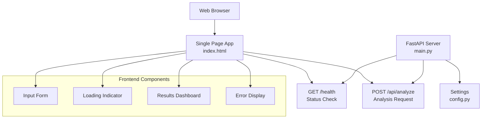
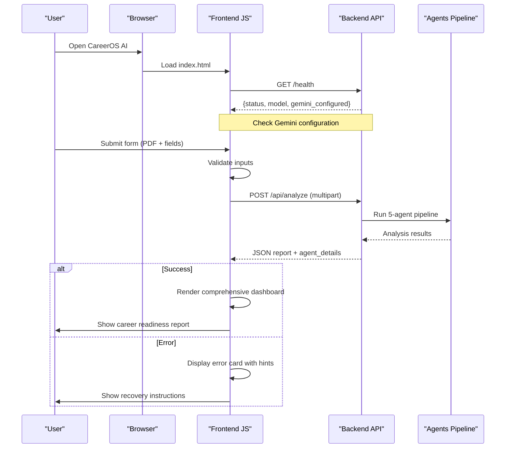
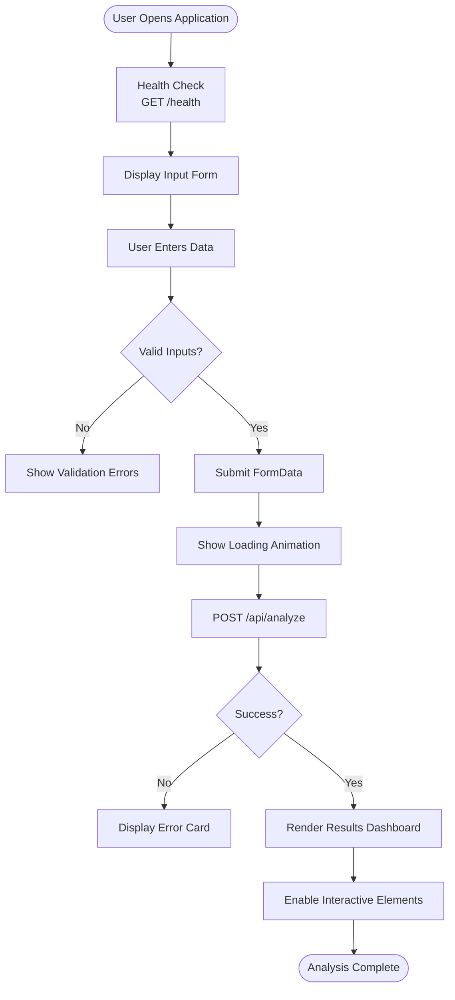
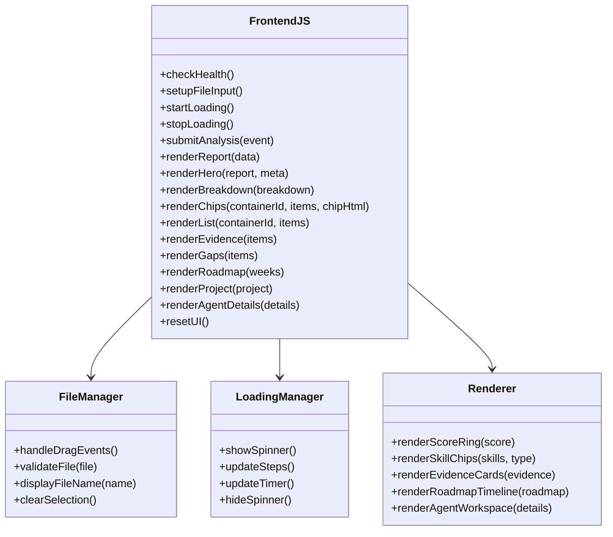

# Frontend Interface

<cite>
**Referenced Files in This Document**
- [index.html](file://src/static/index.html)
- [main.py](file://src/main.py)
- [config.py](file://src/config.py)
- [agents.py](file://src/agents.py)
- [github_service.py](file://src/github_service.py)
- [resume_service.py](file://src/resume_service.py)
- [qwen_client.py](file://src/qwen_client.py)
- [README.md](file://README.md)
</cite>

## Update Summary
**Changes Made**
- Updated to reflect the complete single-page frontend application implementation
- Added comprehensive documentation for the interactive UI components
- Enhanced coverage of multi-agent analysis result visualization
- Updated API integration details with current backend endpoints
- Expanded accessibility and responsive design documentation
- Added detailed JavaScript functionality analysis

## Table of Contents
1. [Introduction](#introduction)
2. [Project Structure](#project-structure)
3. [Core Components](#core-components)
4. [Architecture Overview](#architecture-overview)
5. [Detailed Component Analysis](#detailed-component-analysis)
6. [User Interaction Flows](#user-interaction-flows)
7. [Multi-Agent Analysis Results Display](#multi-agent-analysis-results-display)
8. [Responsive Design and Accessibility](#responsive-design-and-accessibility)
9. [JavaScript Functionality](#javascript-functionality)
10. [Backend Integration](#backend-integration)
11. [Customization and Extensibility](#customization-and-extensibility)
12. [Performance Considerations](#performance-considerations)
13. [Troubleshooting Guide](#troubleshooting-guide)
14. [Conclusion](#conclusion)

## Introduction
CareerOS AI features a sophisticated single-page frontend interface built entirely with vanilla HTML, CSS, and JavaScript—no build steps or external frameworks required. The interface provides an intuitive web experience for career analysis, guiding users through resume PDF upload, GitHub username input, target role specification, and optional job description entry. After submission, it displays comprehensive evidence-based career readiness reports with interactive elements including progress indicators, expandable sections, and dynamic visualizations.

The frontend communicates seamlessly with the backend via REST endpoints, handling multipart form submissions for file uploads and JSON responses for complex analysis results. The design emphasizes simplicity, accessibility, and cross-browser compatibility while providing a responsive layout that adapts to both desktop and mobile devices.

**Section sources**
- [index.html:1-736](file://src/static/index.html#L1-L736)
- [main.py:39-55](file://src/main.py#L39-L55)
- [README.md:96-99](file://README.md#L96-L99)

## Project Structure
The frontend is implemented as a single HTML file located under `src/static/index.html`, served directly by the FastAPI application without any build process. The architecture follows a clean separation between presentation (HTML/CSS), behavior (JavaScript), and data (API responses).

**Diagram sources**
- [index.html:264-315](file://src/static/index.html#L264-L315)
- [index.html:317-330](file://src/static/index.html#L317-L330)
- [index.html:332-382](file://src/static/index.html#L332-L382)
- [main.py:39-55](file://src/main.py#L39-L55)
- [main.py:58-147](file://src/main.py#L58-L147)

**Section sources**
- [index.html:1-736](file://src/static/index.html#L1-L736)
- [main.py:1-160](file://src/main.py#L1-L160)
- [config.py:1-72](file://src/config.py#L1-L72)

## Core Components
The frontend consists of several key interactive components that work together to provide a seamless user experience:

### User Input Form
- **Resume Upload**: Drag-and-drop PDF upload with file validation and size checking
- **GitHub Username**: Required field with autocomplete suggestions and validation
- **Target Role**: Required field with datalist suggestions for common roles
- **Job Description**: Optional text area for targeted job matching

### Loading Indicator System
- **Animated Spinner**: Visual feedback during long-running analysis
- **Step Progression**: Sequential status updates showing analysis stages
- **Elapsed Timer**: Real-time duration tracking with estimated completion time
- **Progress Steps**: Seven distinct analysis phases with active/done states

### Results Dashboard
- **Hero Section**: Score ring visualization with readiness percentage
- **Breakdown Bars**: Multi-dimensional scoring across different criteria
- **Skill Chips**: Verified vs unverified skills with evidence indicators
- **Evidence Cards**: Detailed proof points from resume and GitHub sources
- **Roadmap Visualization**: 30-day learning plan with weekly milestones
- **Agent Workspace**: Expandable raw output from each specialist agent

### Error Handling and Recovery
- **Validation Errors**: Client-side form validation with clear messaging
- **Network Errors**: User-friendly error messages with HTTP status hints
- **Service Errors**: Specific guidance for configuration issues
- **Recovery Actions**: Reset functionality to start fresh analysis

**Section sources**
- [index.html:264-315](file://src/static/index.html#L264-L315)
- [index.html:317-330](file://src/static/index.html#L317-L330)
- [index.html:332-382](file://src/static/index.html#L332-L382)
- [index.html:418-434](file://src/static/index.html#L418-L434)
- [index.html:436-506](file://src/static/index.html#L436-L506)
- [index.html:508-555](file://src/static/index.html#L508-L555)
- [index.html:557-732](file://src/static/index.html#L557-L732)

## Architecture Overview
The frontend follows a simple yet robust request-response architecture that handles the complexity of multi-agent analysis behind a clean user interface.

**Diagram sources**
- [index.html:418-434](file://src/static/index.html#L418-L434)
- [index.html:523-555](file://src/static/index.html#L523-L555)
- [main.py:39-55](file://src/main.py#L39-L55)
- [main.py:58-147](file://src/main.py#L58-L147)
- [agents.py:297-337](file://src/agents.py#L297-L337)

## Detailed Component Analysis

### Form Components and Validation
The input form provides a structured interface for collecting user data with real-time validation and enhanced user experience features.

**Resume Upload Component:**
- Drag-and-drop file zone with visual feedback
- Click-to-browse alternative for accessibility
- File type validation (PDF only)
- Size limit enforcement (10MB maximum)
- Selected file name display with confirmation

**Input Fields:**
- GitHub username with required validation
- Target role with datalist suggestions
- Optional job description textarea
- Real-time field validation and error indication

**Section sources**
- [index.html:264-315](file://src/static/index.html#L264-L315)

### Loading State Management
The loading system provides comprehensive feedback during the typically 1-2 minute analysis process.

**Progress Tracking:**
- Seven distinct analysis phases with sequential progression
- Active state highlighting for current step
- Completed state marking with checkmarks
- Elapsed time counter with performance expectations

**Visual Feedback:**
- Animated spinner with accent color branding
- Step-by-step status updates
- Estimated completion time messaging
- Smooth transitions between loading states

**Section sources**
- [index.html:317-330](file://src/static/index.html#L317-L330)
- [index.html:458-506](file://src/static/index.html#L458-L506)

### Results Rendering Engine
The results dashboard dynamically renders comprehensive career analysis data into interactive visual components.

**Score Visualization:**
- Circular progress indicator with gradient coloring
- Dynamic score calculation and display
- Color-coded readiness assessment (green/amber/red)
- Personalized verdict with candidate information

**Data Visualization Components:**
- Breakdown bars for multi-dimensional scoring
- Skill chips with verification status indicators
- Evidence cards with source attribution
- Roadmap timeline with weekly milestones
- Agent workspace with expandable raw outputs

**Section sources**
- [index.html:332-382](file://src/static/index.html#L332-L382)
- [index.html:557-732](file://src/static/index.html#L557-L732)

## User Interaction Flows
The frontend implements smooth user interaction flows that guide users through the complete analysis process with appropriate feedback at each stage.

### Resume Upload Flow
Users can interact with the resume upload component through multiple methods:

1. **Drag and Drop**: Users drag PDF files onto the designated drop zone, which provides visual feedback with border highlighting and background changes
2. **Click to Browse**: Alternative method for users who prefer traditional file selection dialogs
3. **File Validation**: Automatic validation ensures only PDF files are accepted with appropriate error messaging
4. **Confirmation Display**: Selected file names are displayed with "Selected:" prefix for user confirmation

### Analysis Submission Flow
The submission process includes comprehensive validation and user feedback:

1. **Form Validation**: Client-side validation checks for required fields (resume, GitHub username, target role)
2. **FormData Construction**: Multipart form data creation with all required and optional fields
3. **Loading State Activation**: Immediate transition to loading state with progress indicators
4. **API Communication**: Asynchronous POST request to `/api/analyze` endpoint
5. **Response Handling**: Conditional rendering based on success or error responses

### Result Display Flow
Upon successful analysis completion, the interface smoothly transitions to display comprehensive results:

1. **Dashboard Rendering**: Dynamic generation of all result sections based on API response structure
2. **Interactive Elements**: Enablement of expandable sections, hover effects, and navigation
3. **Scroll Management**: Automatic scrolling to top of results for immediate visibility
4. **Reset Capability**: Clear option to return to form for additional analyses

**Diagram sources**
- [index.html:523-555](file://src/static/index.html#L523-L555)
- [index.html:458-506](file://src/static/index.html#L458-L506)
- [index.html:557-732](file://src/static/index.html#L557-L732)

**Section sources**
- [index.html:264-315](file://src/static/index.html#L264-L315)
- [index.html:523-555](file://src/static/index.html#L523-L555)

## Multi-Agent Analysis Results Display
The frontend excels at presenting complex multi-agent analysis results in an accessible and informative manner, transforming technical AI outputs into actionable career insights.

### Hero Section and Readiness Score
The hero section provides immediate visual feedback about overall career readiness:

- **Circular Score Ring**: CSS conic-gradient implementation showing percentage-based readiness score
- **Dynamic Coloring**: Color transitions based on score thresholds (green ≥70%, amber ≥40%, red <40%)
- **Personalized Verdict**: Candidate name extraction from resume analysis combined with target role
- **Metadata Badges**: Display of experience years, GitHub username, and target role as contextual information

### Multi-Dimensional Breakdown
The breakdown section presents detailed scoring across four key dimensions:

- **Resume Quality**: Assessment of resume formatting, content quality, and ATS optimization
- **Evidence Strength**: Evaluation of GitHub activity and project quality as skill verification
- **Job Match**: Alignment between candidate profile and target role requirements
- **Skill Coverage**: Percentage of required skills demonstrated through actual evidence

### Skill Verification System
The frontend distinguishes between claimed and verified skills through visual indicators:

- **Verified Skills**: Green-themed chips with checkmark icons and evidence tooltips
- **Unverified Skills**: Amber-themed chips with question marks and reason explanations
- **Hover Interactions**: Tooltip display showing specific evidence or reasons for verification status
- **Categorization**: Clear separation between proven capabilities and aspirational skills

### Evidence-Based Assessment
Evidence cards provide concrete proof points supporting the analysis:

- **Source Attribution**: Clear labeling of evidence origin (resume vs GitHub)
- **Contextual Information**: Detailed descriptions of specific achievements or projects
- **Visual Differentiation**: Color-coded badges indicating evidence source type
- **Scalable Layout**: Grid-based responsive design for optimal viewing across devices

### Learning Roadmap Visualization
The 30-day roadmap transforms skill gaps into actionable learning plans:

- **Weekly Structure**: Four-week progression with focused learning objectives
- **Task Lists**: Concrete tasks for each week with measurable outcomes
- **Outcome Definitions**: Clear statements of what will be achieved by week's end
- **Progressive Difficulty**: Logical sequencing from foundational to advanced topics

### Agent Workspace Details
The expandable agent workspace provides transparency into the AI analysis process:

- **Collapsible Sections**: Each specialist agent's output in separate expandable panels
- **Raw JSON Display**: Formatted JSON output for technical inspection and debugging
- **Agent Identification**: Clear labeling of each agent's role and contribution
- **Accessibility**: Keyboard-navigable details/summary elements for screen readers

**Section sources**
- [index.html:332-382](file://src/static/index.html#L332-L382)
- [index.html:557-732](file://src/static/index.html#L557-L732)

## Responsive Design and Accessibility
The frontend implements comprehensive responsive design and accessibility features ensuring optimal user experience across all devices and assistive technologies.

### Responsive Layout Strategy
The interface uses modern CSS techniques to adapt seamlessly to different screen sizes:

- **CSS Grid Layout**: Flexible grid systems that reflow from multi-column to single-column layouts
- **Media Queries**: Breakpoints at 760px for tablet/mobile adaptation
- **Flexible Typography**: Scalable font sizes and spacing for readability across devices
- **Touch-Friendly Interactions**: Large tap targets and clear visual feedback for touch interfaces

### Mobile Optimization
Specific optimizations ensure excellent mobile experience:

- **Stacked Layouts**: Forms and results stack vertically on smaller screens
- **Optimized Spacing**: Reduced margins and padding for better space utilization
- **Readable Text**: Maintained minimum font sizes for legibility on small screens
- **Touch Gestures**: Support for drag-and-drop operations on mobile devices

### Accessibility Features
The implementation follows WCAG guidelines for inclusive design:

- **Semantic HTML**: Proper use of headings, labels, and form elements
- **Keyboard Navigation**: Full keyboard operability with visible focus indicators
- **Screen Reader Support**: Descriptive labels and ARIA attributes where needed
- **Color Contrast**: High contrast ratios for dark theme readability
- **Focus Management**: Logical tab order and focus restoration after interactions

### Cross-Browser Compatibility
The frontend maintains broad browser support through careful technology choices:

- **Modern CSS Features**: Use of widely supported features like CSS variables, gradients, and grid
- **Fallback Strategies**: Graceful degradation for unsupported features
- **Standard APIs**: Reliance on standard DOM and Fetch API implementations
- **Safe Content Rendering**: XSS prevention through HTML escaping of dynamic content

**Section sources**
- [index.html:241-246](file://src/static/index.html#L241-L246)
- [index.html:70-83](file://src/static/index.html#L70-L83)
- [index.html:164-172](file://src/static/index.html#L164-L172)
- [index.html:12-26](file://src/static/index.html#L12-L26)
- [index.html:402-406](file://src/static/index.html#L402-L406)

## JavaScript Functionality
The JavaScript layer implements sophisticated client-side functionality that enhances user experience and manages complex interactions with the backend API.

### Health Check and Configuration Detection
On page load, the frontend performs essential health checks to inform users about system status:

- **API Availability**: Checks if the backend server is running and accessible
- **Configuration Status**: Detects whether Google Gemini API is properly configured
- **Model Information**: Displays available model information in the header badge
- **Warning System**: Shows configuration warnings when critical settings are missing

### File Upload Management
Advanced file handling provides intuitive resume upload functionality:

- **Drag and Drop**: Event listeners for dragover, dragleave, and drop events with visual feedback
- **File Selection**: Click handlers for traditional file dialog invocation
- **Validation**: Client-side file type and size validation before submission
- **User Feedback**: Real-time display of selected file names and upload status

### Loading State Management
Sophisticated loading management keeps users informed during lengthy analysis processes:

- **Progressive Updates**: Sequential advancement through seven analysis phases
- **Timer Integration**: Real-time elapsed time tracking with performance expectations
- **Visual States**: Active, done, and pending states for each analysis phase
- **State Persistence**: Consistent loading state management across API calls

### API Communication Layer
Robust API communication handles the complexity of multipart form submissions and response processing:

- **FormData Construction**: Programmatic creation of multipart form data with file and text fields
- **Error Handling**: Comprehensive error detection and user-friendly error message display
- **Response Parsing**: JSON response parsing with fallback handling for malformed data
- **Network Resilience**: Graceful handling of network failures and timeout scenarios

### Dynamic Content Rendering
Advanced rendering engine transforms API responses into interactive visual components:

- **Template Generation**: Efficient string template construction for HTML generation
- **Data Binding**: Safe binding of API data to DOM elements with proper escaping
- **Conditional Rendering**: Logic for displaying different content based on data availability
- **Performance Optimization**: Batch DOM updates and efficient element manipulation

### Interactive Element Management
Rich interactivity enhances user engagement with analysis results:

- **Expandable Sections**: Details/summary elements for agent workspace exploration
- **Hover Effects**: CSS transitions and JavaScript-enhanced hover interactions
- **Navigation Controls**: Reset functionality and smooth scrolling between sections
- **Event Delegation**: Efficient event handling for dynamically created elements

**Diagram sources**
- [index.html:418-434](file://src/static/index.html#L418-L434)
- [index.html:436-506](file://src/static/index.html#L436-L506)
- [index.html:523-555](file://src/static/index.html#L523-L555)
- [index.html:557-732](file://src/static/index.html#L557-L732)

**Section sources**
- [index.html:418-434](file://src/static/index.html#L418-L434)
- [index.html:436-506](file://src/static/index.html#L436-L506)
- [index.html:523-555](file://src/static/index.html#L523-L555)
- [index.html:557-732](file://src/static/index.html#L557-L732)

## Backend Integration
The frontend integrates seamlessly with the backend API through well-defined endpoints and robust error handling mechanisms.

### API Endpoints
The frontend communicates with two primary backend endpoints:

**GET /health Endpoint:**
- Purpose: System health check and configuration status
- Response Format: JSON object with status, app metadata, and configuration flags
- Usage: Called on page load to detect missing API keys and display appropriate warnings
- Error Handling: Silent failure allows form submission even when health check fails

**POST /api/analyze Endpoint:**
- Purpose: Submit complete analysis request with resume and user data
- Request Format: Multipart form data containing PDF file and text fields
- Response Format: Complex JSON object with analysis results and agent details
- Error Handling: Comprehensive error display with HTTP status-specific guidance

### Data Flow Architecture
The data flow follows a clear pattern from user input to rendered results:

1. **Input Collection**: Form data gathered from user interactions
2. **Validation**: Client-side validation ensures data completeness
3. **API Submission**: Multipart form submission to backend analysis endpoint
4. **Response Processing**: JSON response parsing and data transformation
5. **Result Rendering**: Dynamic DOM manipulation to display analysis results
6. **Error Management**: Graceful error handling with user-friendly messages

### Error Handling Strategy
Comprehensive error handling provides clear feedback for various failure scenarios:

**Network Errors:**
- Connection failures display generic connectivity messages
- Timeout scenarios suggest retrying after brief delays
- CORS errors indicate deployment configuration issues

**Validation Errors:**
- Missing required fields prompt users to complete form
- Invalid file types show specific format requirements
- File size limits communicate maximum upload constraints

**Service Errors:**
- 503 errors indicate missing API key configuration
- 502 errors suggest temporary service unavailability
- 400 errors provide specific validation feedback

**Section sources**
- [main.py:39-55](file://src/main.py#L39-L55)
- [main.py:58-147](file://src/main.py#L58-L147)
- [index.html:418-434](file://src/static/index.html#L418-L434)
- [index.html:523-555](file://src/static/index.html#L523-L555)

## Customization and Extensibility
The frontend architecture supports easy customization and extension for branding modifications, feature additions, and interface enhancements.

### Styling Customization
The CSS architecture enables straightforward visual customization:

**CSS Variables:**
- Centralized color scheme definition using CSS custom properties
- Easy theme switching through variable modification
- Consistent styling across all components
- Dark theme optimized for reduced eye strain

**Layout Modifications:**
- Grid-based layout system for flexible component arrangement
- Responsive breakpoints for device-specific adaptations
- Modular component styles for independent customization
- Print-friendly styles for report export functionality

### Branding Enhancement
Simple modifications enable complete brand integration:

**Logo and Identity:**
- Header logo text customization through HTML content modification
- Tagline updates for messaging alignment
- Badge system for feature highlights and status indicators
- Footer content customization for company information

**Color Scheme Adaptation:**
- Accent color modification for brand consistency
- Background and panel color adjustments
- Status color customization (success, warning, error states)
- Gradient definitions for visual hierarchy

### Feature Extension Points
The architecture provides clear extension points for new functionality:

**Additional Result Sections:**
- Template patterns for adding new visualization components
- Data binding mechanisms for new API response fields
- Styling conventions for consistent component appearance
- Accessibility considerations for new interactive elements

**Enhanced Interactivity:**
- Event handler patterns for new user interactions
- Modal/dialog framework for additional information display
- Export functionality for report sharing and archiving
- Analytics integration for usage tracking and improvement

**Section sources**
- [index.html:12-26](file://src/static/index.html#L12-L26)
- [index.html:40-53](file://src/static/index.html#L40-L53)
- [index.html:293-304](file://src/static/index.html#L293-L304)
- [index.html:458-467](file://src/static/index.html#L458-L467)

## Performance Considerations
The frontend is optimized for performance through careful architectural decisions and efficient implementation strategies.

### Single-File Architecture Benefits
The single-file approach eliminates build overhead and reduces network latency:

- **Zero Build Time**: No compilation or bundling required for development or deployment
- **Reduced Requests**: Single HTTP request for entire application assets
- **Cache Efficiency**: Simple caching strategy with effective browser caching
- **Development Speed**: Instant hot reload capability without build processes

### Client-Side Optimization
Efficient client-side processing minimizes server load and improves responsiveness:

- **Client-Side Validation**: Immediate feedback without server round-trips
- **Efficient DOM Manipulation**: Batched updates and minimal reflows
- **Memory Management**: Proper cleanup of event listeners and timers
- **Resource Loading**: Optimized asset loading with progressive enhancement

### Network Optimization
Strategic network usage reduces bandwidth consumption and improves perceived performance:

- **Progressive Loading**: Initial form loads immediately, results render progressively
- **Conditional Rendering**: Only necessary components loaded and displayed
- **Error Prevention**: Client-side validation prevents unnecessary API calls
- **Caching Strategy**: Effective use of browser caching for static assets

### Accessibility Performance
Performance considerations extend to assistive technologies and slower connections:

- **Semantic HTML**: Native browser accessibility without JavaScript dependencies
- **Keyboard Navigation**: Full keyboard operability without mouse dependency
- **Screen Reader Support**: Proper ARIA attributes and semantic markup
- **Low Bandwidth Support**: Graceful degradation for limited connectivity

[No sources needed since this section provides general performance guidance]

## Troubleshooting Guide
Common issues and their resolutions for the CareerOS AI frontend interface.

### Configuration Issues
**Missing API Key:**
- **Symptom**: Warning banner appears at top of page with configuration instructions
- **Resolution**: Create `.env` file from `.env.example` and add `GOOGLE_API_KEY`
- **Verification**: Health check should show `gemini_configured: true`

**Server Connectivity:**
- **Symptom**: Error message indicates server unreachable on port 8000
- **Resolution**: Ensure backend server is running with `python src/main.py`
- **Verification**: Access `http://localhost:8000/health` directly in browser

### File Upload Problems
**Invalid File Type:**
- **Symptom**: Error message requesting PDF file upload
- **Resolution**: Ensure resume is saved as PDF format, not Word or other formats
- **Prevention**: Use professional resume builders that export to PDF

**File Size Limitations:**
- **Symptom**: Error message about file size exceeding 10MB limit
- **Resolution**: Compress PDF or create more concise resume
- **Optimization**: Remove large images or embedded documents from PDF

### Analysis Failures
**GitHub API Rate Limits:**
- **Symptom**: 502 error suggesting GitHub API rate limit exceeded
- **Resolution**: Add `GITHUB_TOKEN` to `.env` file for higher rate limits
- **Alternative**: Wait for rate limit reset or use different GitHub account

**Model Service Unavailable:**
- **Symptom**: 502 error indicating model service temporarily unavailable
- **Resolution**: Retry after brief delay; issue is typically transient
- **Monitoring**: Check backend logs for detailed error information

### Browser Compatibility
**Modern Browser Requirements:**
- **Supported Browsers**: Chrome, Firefox, Safari, Edge (latest versions)
- **Unsupported Features**: Internet Explorer 11 lacks required CSS/JS features
- **Mobile Support**: iOS Safari and Android Chrome fully supported

**JavaScript Features:**
- **Required APIs**: Fetch API, FormData, CSS Grid, CSS Variables
- **Fallbacks**: Graceful degradation for older browsers where possible
- **Polyfills**: None used to maintain simplicity and performance

**Section sources**
- [index.html:418-434](file://src/static/index.html#L418-L434)
- [index.html:508-521](file://src/static/index.html#L508-L521)
- [main.py:74-107](file://src/main.py#L74-L107)
- [main.py:110-131](file://src/main.py#L110-L131)

## Conclusion
The CareerOS AI frontend represents a sophisticated single-page application that successfully balances simplicity with powerful functionality. Built entirely with vanilla HTML, CSS, and JavaScript, it provides an intuitive interface for complex multi-agent career analysis without requiring build steps or external frameworks.

The interface excels in several key areas: comprehensive user input handling with validation, sophisticated loading state management during lengthy analysis processes, and rich visualization of complex AI-generated career insights. The responsive design ensures optimal user experience across desktop and mobile devices, while accessibility features make the application usable by people with diverse needs.

The modular architecture facilitates easy customization and extension, allowing developers to modify branding, add new visualization components, or integrate additional features without disrupting core functionality. The robust error handling and user feedback mechanisms ensure that users receive clear guidance when issues arise, maintaining a positive user experience even during failures.

Looking forward, the frontend provides a solid foundation for future enhancements including advanced analytics integration, export functionality, and expanded customization options. The clean separation between presentation, behavior, and data layers ensures that improvements can be made incrementally without major architectural changes.

The CareerOS AI frontend successfully demonstrates how modern web technologies can deliver enterprise-grade functionality through simple, maintainable code that prioritizes user experience and accessibility above all else.

[No sources needed since this section summarizes without analyzing specific files]