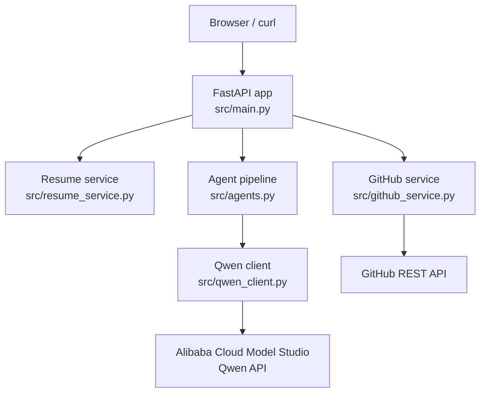
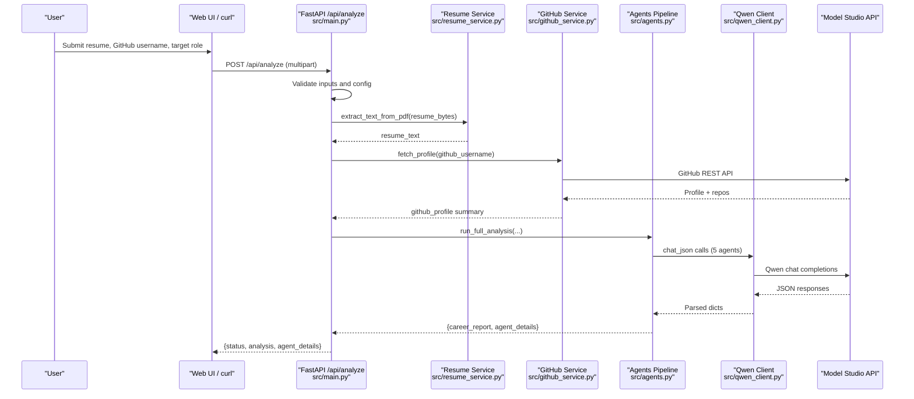
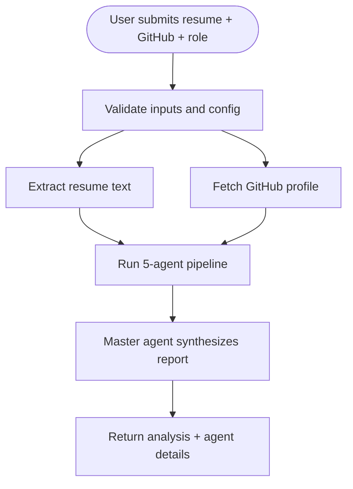
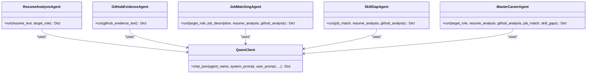

# Getting Started

<cite>
**Referenced Files in This Document**
- [README.md](file://README.md)
- [.env.example](file://.env.example)
- [requirements.txt](file://requirements.txt)
- [src/main.py](file://src/main.py)
- [src/config.py](file://src/config.py)
- [src/agents.py](file://src/agents.py)
- [src/qwen_client.py](file://src/qwen_client.py)
- [src/github_service.py](file://src/github_service.py)
- [src/resume_service.py](file://src/resume_service.py)
- [src/static/index.html](file://src/static/index.html)
</cite>

## Table of Contents
1. Introduction
2. Project Structure
3. Prerequisites
4. Installation
5. Environment Setup
6. Running the Application
7. Quick Start: Web UI
8. Quick Start: API with curl
9. Basic Analysis Workflow
10. Troubleshooting
11. Verification Checklist
12. Architecture Overview
13. Detailed Component Analysis
14. Performance Notes
15. Conclusion

## Introduction
CareerOS AI is a multi-agent career intelligence platform that analyzes your resume and GitHub profile to produce an evidence-based career readiness report. It uses Alibaba Cloud Model Studio (Qwen) via an OpenAI-compatible API and optionally integrates with the GitHub REST API for public code evidence. The application provides both a web UI and a REST API.

## Project Structure
The project is organized into a small, focused backend with a single-page frontend:
- src/main.py: FastAPI entry point, routes, and server startup
- src/config.py: Settings loaded from environment variables (including .env)
- src/agents.py: Five specialized agents and pipeline orchestration
- src/qwen_client.py: Qwen client wrapper around the OpenAI SDK
- src/github_service.py: Fetches and summarizes public GitHub data
- src/resume_service.py: Extracts text from uploaded PDF resumes
- src/static/index.html: Single-file frontend served at the root path
- requirements.txt: Python dependencies
- .env.example: Template for environment variables

**Diagram sources**
- [src/main.py:28-147](file://src/main.py#L28-L147)
- [src/agents.py:295-335](file://src/agents.py#L295-L335)
- [src/qwen_client.py:70-158](file://src/qwen_client.py#L70-L158)
- [src/github_service.py:63-147](file://src/github_service.py#L63-L147)
- [src/resume_service.py:24-58](file://src/resume_service.py#L24-L58)

**Section sources**
- [README.md:173-202](file://README.md#L173-L202)

## Prerequisites
- Python 3.9+
- An Alibaba Cloud Model Studio API key (Qwen). Create one at the Model Studio console.
- A GitHub personal access token (optional). It increases the GitHub API rate limit from 60 to 5000 requests per hour.

**Section sources**
- [README.md:108-113](file://README.md#L108-L113)
- [.env.example:10-16](file://.env.example#L10-L16)
- [.env.example:33-39](file://.env.example#L33-L39)

## Installation
1. Clone the repository and enter the project directory.
2. Create and activate a Python virtual environment.
3. Install dependencies listed in requirements.txt.
4. Set up environment variables by copying .env.example to .env and filling in values.
5. Run the application using the provided entry point.

Notes:
- The application listens on a configurable host and port (defaults are fine for local development).
- Interactive API documentation is available at the docs route when the server is running.

**Section sources**
- [README.md:115-149](file://README.md#L115-L149)
- [requirements.txt:1-8](file://requirements.txt#L1-L8)
- [src/main.py:150-159](file://src/main.py#L150-L159)

## Environment Setup
Create a .env file in the project root and set:
- DASHSCOPE_API_KEY: Required. Your Alibaba Cloud Model Studio API key.
- GITHUB_TOKEN: Optional. Personal access token for higher GitHub API limits.

Additional optional settings include model selection, sampling parameters, timeouts, upload limits, and server host/port.

How it works:
- The configuration module loads .env automatically from the project root so the app runs regardless of which directory you start it from.
- The health endpoint reports whether the Qwen API key is configured and whether a GitHub token is set.

**Section sources**
- [.env.example:10-31](file://.env.example#L10-L31)
- [.env.example:33-50](file://.env.example#L33-L50)
- [src/config.py:16-20](file://src/config.py#L16-L20)
- [src/config.py:23-70](file://src/config.py#L23-L70)
- [src/main.py:45-55](file://src/main.py#L45-L55)

## Running the Application
Start the server directly from the project root:
- python src/main.py

Then open:
- Web UI: http://127.0.0.1:8000
- API docs: http://127.0.0.1:8000/docs

The server binds to a configurable host and port defined in settings.

**Section sources**
- [README.md:142-149](file://README.md#L142-L149)
- [src/main.py:150-159](file://src/main.py#L150-L159)
- [src/config.py:68-69](file://src/config.py#L68-L69)

## Quick Start: Web UI
1. Open http://127.0.0.1:8000 in your browser.
2. Upload your resume as a PDF.
3. Enter your GitHub username.
4. Enter your target role (e.g., Backend Developer).
5. Optionally paste a job description to match against.
6. Click Analyze my career readiness.
7. Wait for the analysis to complete and view the results.

The UI performs a health check on load and will warn if the model is not configured.

**Section sources**
- [src/static/index.html:264-314](file://src/static/index.html#L264-L314)
- [src/static/index.html:418-434](file://src/static/index.html#L418-L434)
- [src/static/index.html:523-555](file://src/static/index.html#L523-L555)

## Quick Start: API with curl
Run a full analysis via multipart form:
- POST /api/analyze
- Fields:
  - resume: PDF file
  - github_username: Public GitHub username
  - target_role: Role to match against
  - job_description: Optional job description text

Example:
- curl -X POST http://localhost:8000/api/analyze -F "resume=@my_resume.pdf" -F "github_username=yourusername" -F "target_role=Senior Full-Stack Developer" -F "job_description=Optional job description text..."

Response includes:
- status
- target_role
- github_username
- analysis: headline career readiness report
- agent_details: raw outputs from each specialist agent

You can also check server health:
- GET /health

**Section sources**
- [README.md:155-169](file://README.md#L155-L169)
- [README.md:288-326](file://README.md#L288-L326)
- [src/main.py:58-147](file://src/main.py#L58-L147)
- [src/main.py:45-55](file://src/main.py#L45-L55)

## Basic Analysis Workflow
End-to-end flow:
1. User uploads resume PDF, enters GitHub username, and specifies target role (optionally adds a job description).
2. Server validates inputs and checks that the AI model is configured.
3. Resume text is extracted from the PDF.
4. GitHub profile data is fetched and summarized into structured evidence.
5. Five agents run in sequence:
   - Resume Analysis Agent extracts claimed skills and experience.
   - GitHub Evidence Agent verifies skills based on public repositories.
   - Job Matching Agent compares required skills for the target role.
   - Skill Gap Agent identifies missing competencies.
   - Master Career Agent synthesizes all insights into a final report.
6. Results are returned to the UI or API caller.

**Diagram sources**
- [src/main.py:58-147](file://src/main.py#L58-L147)
- [src/resume_service.py:24-58](file://src/resume_service.py#L24-L58)
- [src/github_service.py:63-147](file://src/github_service.py#L63-L147)
- [src/agents.py:295-335](file://src/agents.py#L295-L335)
- [src/qwen_client.py:97-158](file://src/qwen_client.py#L97-L158)

**Section sources**
- [src/main.py:58-147](file://src/main.py#L58-L147)
- [src/agents.py:295-335](file://src/agents.py#L295-L335)

## Troubleshooting
Common issues and fixes:
- Missing or invalid DASHSCOPE_API_KEY:
  - Ensure .env exists and contains a valid key.
  - The health endpoint indicates whether the model is configured.
  - The analyze endpoint returns a specific error if the model is not configured.
- Invalid or empty resume PDF:
  - Only text-based PDFs are supported; scanned/image-only PDFs will fail.
  - Very large files are truncated to control prompt size and cost.
- GitHub API rate limit:
  - Without a token, the limit is low. Add GITHUB_TOKEN to .env to increase the limit significantly.
  - If the user is not found or the API fails, friendly errors are returned.
- Network or model errors:
  - Check your internet connection and ensure the base URL matches your account region.
  - The client retries once if the LLM response is not valid JSON.

Where to look:
- Health endpoint shows configuration status.
- Error messages map to HTTP status codes and provide actionable hints.

**Section sources**
- [src/main.py:45-55](file://src/main.py#L45-L55)
- [src/main.py:74-107](file://src/main.py#L74-L107)
- [src/resume_service.py:24-58](file://src/resume_service.py#L24-L58)
- [src/github_service.py:48-60](file://src/github_service.py#L48-L60)
- [src/qwen_client.py:70-95](file://src/qwen_client.py#L70-L95)
- [src/qwen_client.py:120-158](file://src/qwen_client.py#L120-L158)

## Verification Checklist
- Python version is 3.9+.
- Virtual environment created and activated.
- Dependencies installed from requirements.txt.
- .env file created from .env.example with:
  - DASHSCOPE_API_KEY set
  - GITHUB_TOKEN set (optional but recommended)
- Server started and accessible at http://127.0.0.1:8000.
- Health endpoint returns ok and shows model configuration status.
- Web UI loads and allows submitting a resume, GitHub username, and target role.
- API call to /api/analyze returns a success response with analysis and agent details.

**Section sources**
- [README.md:108-149](file://README.md#L108-L149)
- [src/main.py:45-55](file://src/main.py#L45-L55)
- [src/main.py:58-147](file://src/main.py#L58-L147)

## Architecture Overview
CareerOS AI composes five specialized agents orchestrated by a master agent. Data flows from user input through validation, evidence gathering (resume and GitHub), parallel agent analysis, synthesis, and result delivery.

**Diagram sources**
- [src/main.py:58-147](file://src/main.py#L58-L147)
- [src/agents.py:295-335](file://src/agents.py#L295-L335)

## Detailed Component Analysis

### FastAPI Entry Point and Routes
- Serves the single-page frontend at the root path.
- Provides a health endpoint reporting app metadata and configuration status.
- Implements the main analysis endpoint that validates inputs, gathers evidence, runs the agent pipeline, and returns results.

Key behaviors:
- Enforces PDF-only resume uploads and size limits.
- Requires GitHub username and target role.
- Checks that the Qwen API key is configured before proceeding.
- Returns structured responses including agent details for debugging and demos.

**Section sources**
- [src/main.py:28-55](file://src/main.py#L28-L55)
- [src/main.py:58-147](file://src/main.py#L58-L147)

### Configuration Module
- Loads .env from the project root automatically.
- Exposes flat settings for API keys, model parameters, GitHub options, upload limits, and server binding.
- Provides a helper to check if the Qwen API key is configured.

**Section sources**
- [src/config.py:16-20](file://src/config.py#L16-L20)
- [src/config.py:23-70](file://src/config.py#L23-L70)
- [src/config.py:76-79](file://src/config.py#L76-L79)

### Qwen Client
- Thin wrapper around the OpenAI SDK pointing to Alibaba Cloud Model Studio’s OpenAI-compatible endpoint.
- Ensures a strict JSON output format and attempts one retry if the first response is malformed.
- Raises a clear error if no API key is present.

**Section sources**
- [src/qwen_client.py:18-39](file://src/qwen_client.py#L18-L39)
- [src/qwen_client.py:70-95](file://src/qwen_client.py#L70-L95)
- [src/qwen_client.py:97-158](file://src/qwen_client.py#L97-L158)

### GitHub Service
- Fetches public profile and repositories, ignoring forks.
- Builds a compact summary and an evidence text block used by the GitHub Evidence Agent.
- Handles common errors like user not found and rate limiting with helpful messages.

**Section sources**
- [src/github_service.py:19-60](file://src/github_service.py#L19-L60)
- [src/github_service.py:63-147](file://src/github_service.py#L63-L147)
- [src/github_service.py:150-173](file://src/github_service.py#L150-L173)

### Resume Service
- Extracts plain text from uploaded PDFs using pypdf.
- Validates that the PDF has pages and contains extractable text.
- Truncates very long resumes to keep prompts manageable.

**Section sources**
- [src/resume_service.py:24-58](file://src/resume_service.py#L24-L58)

### Agent Pipeline
- Five agents:
  - Resume Analysis Agent: extracts claimed skills and experience.
  - GitHub Evidence Agent: verifies skills from public activity.
  - Job Matching Agent: compares candidate against target role requirements.
  - Skill Gap Agent: identifies missing competencies.
  - Master Career Agent: synthesizes all outputs into a final report.
- Orchestrated by run_full_analysis, which sequences independent analyses and then combines them.

**Diagram sources**
- [src/agents.py:27-290](file://src/agents.py#L27-L290)
- [src/qwen_client.py:70-158](file://src/qwen_client.py#L70-L158)

**Section sources**
- [src/agents.py:27-290](file://src/agents.py#L27-L290)
- [src/agents.py:295-335](file://src/agents.py#L295-L335)

## Performance Notes
- The analysis involves multiple LLM calls and typically takes about one to two minutes.
- The endpoint is synchronous to avoid blocking the event loop during long LLM calls; FastAPI runs sync endpoints in worker threads.
- Prompt sizes are controlled by truncating very long resumes and limiting analyzed repositories.
- Using a GitHub token reduces rate-limiting delays.

**Section sources**
- [src/main.py:67-73](file://src/main.py#L67-L73)
- [src/resume_service.py:51-56](file://src/resume_service.py#L51-L56)
- [src/github_service.py:8-9](file://src/github_service.py#L8-L9)
- [src/github_service.py:114-118](file://src/github_service.py#L114-L118)

## Conclusion
You now have everything needed to install, configure, and run CareerOS AI locally. Use the web UI for a guided experience or call the API directly for automation. If you encounter issues, consult the troubleshooting section and verify your environment variables and network connectivity.