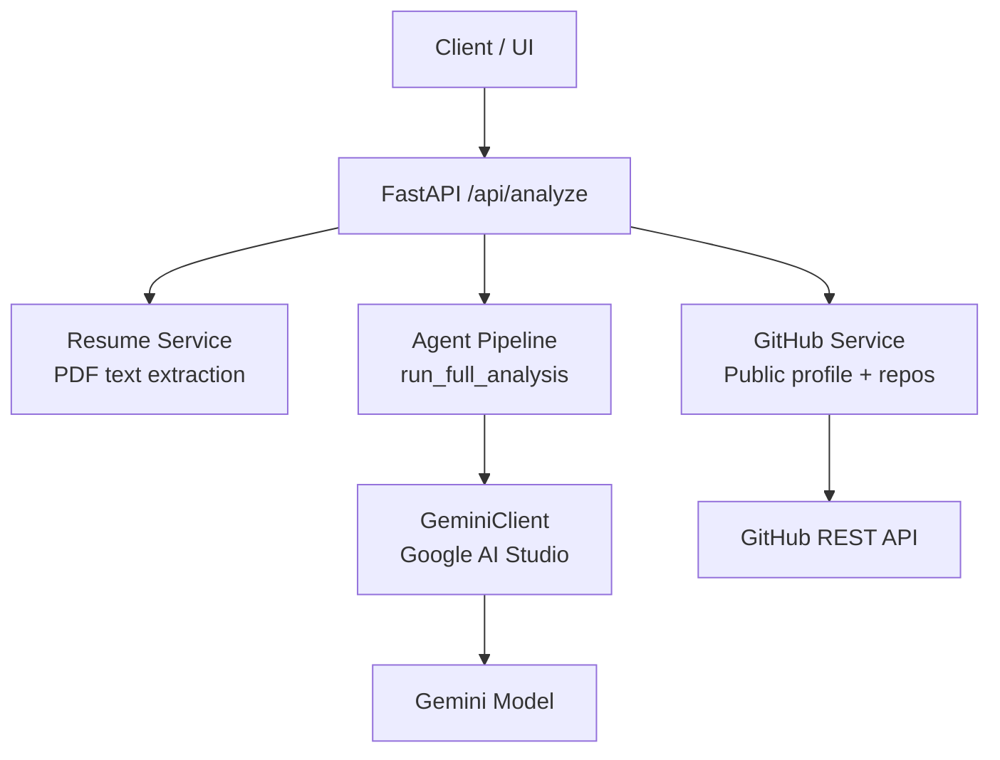
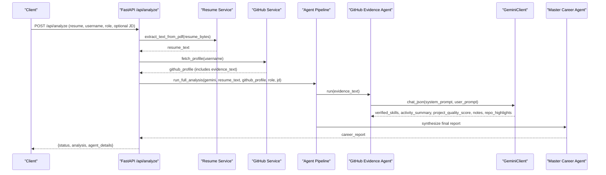
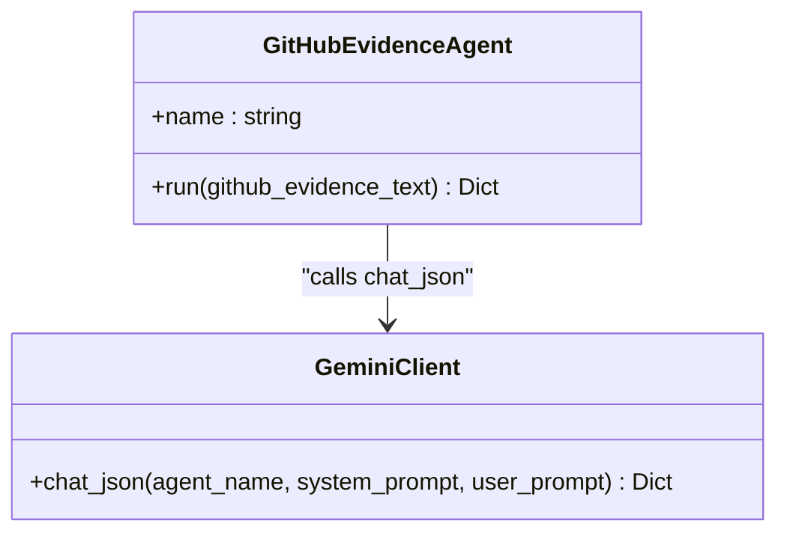
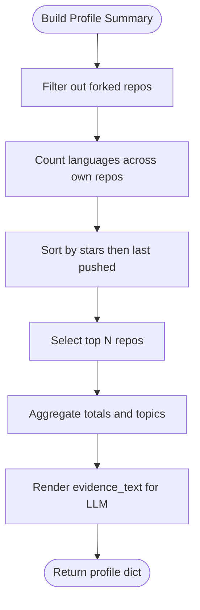
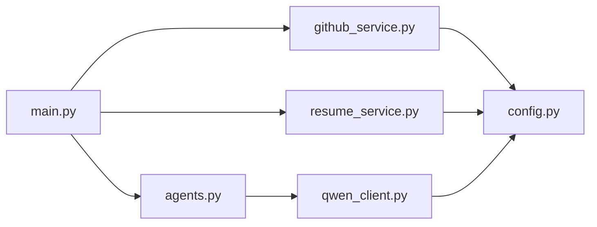

# GitHub Evidence Agent

<cite>
**Referenced Files in This Document**
- [main.py](file://src/main.py)
- [agents.py](file://src/agents.py)
- [github_service.py](file://src/github_service.py)
- [qwen_client.py](file://src/qwen_client.py)
- [resume_service.py](file://src/resume_service.py)
- [config.py](file://src/config.py)
- [README.md](file://README.md)
- [test_pipeline.py](file://tests/test_pipeline.py)
</cite>

## Update Summary
**Changes Made**
- Enhanced GitHub Evidence Agent documentation with detailed implementation specifics
- Updated evidence verification methodology with concrete filtering criteria
- Added comprehensive repository analysis and language tracking details
- Expanded activity metrics and skill validation processes
- Improved integration examples with multi-agent pipeline context

## Table of Contents
1. [Introduction](#introduction)
2. [Project Structure](#project-structure)
3. [Core Components](#core-components)
4. [Architecture Overview](#architecture-overview)
5. [Detailed Component Analysis](#detailed-component-analysis)
6. [Dependency Analysis](#dependency-analysis)
7. [Performance Considerations](#performance-considerations)
8. [Troubleshooting Guide](#troubleshooting-guide)
9. [Conclusion](#conclusion)
10. [Appendices](#appendices)

## Introduction
The GitHub Evidence Agent is a specialized component that transforms raw public GitHub data into objective, verifiable skill evidence. It distinguishes genuine skill evidence (real repositories, languages used, consistent pushes, quality projects) from noise (forks, empty repos) through sophisticated analysis of public GitHub activity. As part of a multi-agent pipeline, it provides credible proof that complements resume claims by cross-referencing what was claimed against what is demonstrably present in public code.

The agent positions itself as an engineering manager assessing developers based solely on their public GitHub activity, producing structured outputs including verified_skills with confidence levels (high/medium/low), activity_summary, project_quality_score (0–100), project_quality_notes, and repo_highlights. These outputs feed downstream agents for job matching, skill gap analysis, and final career readiness assessment.

## Project Structure
The application is a FastAPI service that orchestrates five agents powered by Google Gemini via an OpenAI-compatible client. Data sources include uploaded PDF resumes and public GitHub profile data. Configuration is loaded from environment variables with support for optional GitHub tokens to increase API rate limits.

**Diagram sources**
- [main.py:58-147](file://src/main.py#L58-L147)
- [agents.py:295-335](file://src/agents.py#L295-L335)
- [github_service.py:63-147](file://src/github_service.py#L63-L147)
- [qwen_client.py:70-158](file://src/qwen_client.py#L70-L158)

**Section sources**
- [main.py:1-160](file://src/main.py#L1-L160)
- [README.md:173-202](file://README.md#L173-L202)

## Core Components
- **GitHub Evidence Agent**: Builds a focused prompt to assess public GitHub activity and returns verified skills with confidence levels, activity summary, project quality score, notes, and repo highlights.
- **GitHub Service**: Fetches public profile and repositories, filters out forks, aggregates languages and topics, selects top repositories, and builds an LLM-friendly evidence text.
- **Gemini Client**: Wraps the Google Gemini chat API, enforces strict JSON output rules, and retries once if the model's response is not valid JSON.
- **Resume Service**: Extracts text from uploaded PDFs and truncates long content to control cost and latency.
- **Agent Pipeline**: Orchestrates the five agents in sequence, feeding each stage's outputs into the next.

**Section sources**
- [agents.py:66-104](file://src/agents.py#L66-L104)
- [github_service.py:63-173](file://src/github_service.py#L63-L173)
- [qwen_client.py:31-68](file://src/qwen_client.py#L31-68)
- [resume_service.py:24-58](file://src/resume_service.py#L24-L58)
- [agents.py:295-335](file://src/agents.py#L295-L335)

## Architecture Overview
The end-to-end flow starts at the API endpoint, which validates inputs, extracts resume text, fetches GitHub profile data, and runs the full agent pipeline. The GitHub Evidence Agent receives a compact "evidence_text" built from the user's public profile and repositories. It evaluates this data to produce verified skills and quality metrics. The Master Career Agent later synthesizes all agent outputs into a final report.

**Diagram sources**
- [main.py:58-147](file://src/main.py#L58-L147)
- [agents.py:295-335](file://src/agents.py#L295-L335)
- [github_service.py:63-147](file://src/github_service.py#L63-L147)
- [qwen_client.py:97-158](file://src/qwen_client.py#L97-L158)

## Detailed Component Analysis

### GitHub Evidence Agent
**Purpose:**
- Assess public GitHub activity to identify genuine skill evidence and filter noise.
- Produce a structured JSON response with verified skills, confidence levels, activity summary, project quality score, notes, and repo highlights.

**System Prompt Positioning:**
The agent acts as an engineering manager evaluating a developer strictly through public GitHub activity, distinguishing real evidence from noise such as forks or empty repositories.

**Structured Output Fields:**
- `verified_skills`: list of objects with skill, evidence, and confidence (high/medium/low), ordered by strength of evidence
- `activity_summary`: concise description of consistency, variety, and depth
- `project_quality_score`: integer 0–100 reflecting portfolio quality across repos, descriptions, stars, maintenance
- `project_quality_notes`: up to four short notes about polish, READMEs, variety, momentum
- `repo_highlights`: up to five standout repositories with brief rationale

**Evidence Input:**
Receives evidence_text constructed from the GitHub service, including username, bio, followers, public repos count, languages, topics, and top repositories with stars, forks, last push dates, and descriptions.

**Processing Logic:**
Uses the LLM to interpret the evidence_text and map observed languages and repository characteristics to concrete skills. Assigns confidence based on the strength and breadth of evidence (e.g., multiple repos, recent activity, meaningful descriptions).

**Integration Points:**
Called by the agent pipeline after resume analysis; its output feeds job matching and skill gap agents, and ultimately the master synthesis.

**Section sources**
- [agents.py:66-104](file://src/agents.py#L66-L104)
- [github_service.py:150-173](file://src/github_service.py#L150-L173)
- [test_pipeline.py:141-203](file://tests/test_pipeline.py#L141-L203)

#### Class and Prompt Flow

**Diagram sources**
- [agents.py:66-104](file://src/agents.py#L66-L104)
- [qwen_client.py:97-158](file://src/qwen_client.py#L97-L158)

### GitHub Service
**Purpose:**
- Retrieve public profile and repositories from GitHub.
- Build a compact, LLM-friendly summary that excludes forks and emphasizes meaningful signals.

**Key Behaviors:**
- Filters out forks to avoid counting borrowed work as personal evidence
- Counts primary languages across own repositories using Counter aggregation
- Sorts repositories by stars and recency to select top ones (configurable limit)
- Aggregates topics and computes total stars/forks
- Generates evidence_text containing essential facts for the LLM to evaluate

**Error Handling:**
Converts GitHub API errors (not found, rate limit exceeded, other failures) into friendly exceptions with actionable guidance.

**Configuration:**
Uses token from environment to raise rate limits when available. Limits number of analyzed repos via configuration (`GITHUB_MAX_REPOS`).

**Section sources**
- [github_service.py:22-60](file://src/github_service.py#L22-L60)
- [github_service.py:63-147](file://src/github_service.py#L63-L147)
- [github_service.py:150-173](file://src/github_service.py#L150-L173)
- [config.py:50-58](file://src/config.py#L50-L58)

#### Evidence Text Construction Flow

**Diagram sources**
- [github_service.py:92-147](file://src/github_service.py#L92-L147)
- [github_service.py:150-173](file://src/github_service.py#L150-L173)

### Gemini Client
**Purpose:**
- Provide a robust interface to the Google Gemini model via the google-generativeai SDK.
- Enforce strict JSON output and retry once if the first response is invalid.

**Key Behaviors:**
- Appends shared JSON rules to every system prompt to ensure parseable output
- Extracts JSON from responses even if wrapped in markdown fences or surrounded by chatter
- Retries with a corrective message if parsing fails
- Configures temperature and max tokens for controlled output generation

**Error Handling:**
Raises typed errors for missing API keys, network issues, timeouts, and repeated invalid JSON.

**Section sources**
- [qwen_client.py:31-68](file://src/qwen_client.py#L31-68)
- [qwen_client.py:70-158](file://src/qwen_client.py#L70-158)

### Resume Service
**Purpose:**
- Extract plain text from uploaded PDFs for resume analysis.
- Handle non-PDF files, blank pages, and scanned-only PDFs gracefully.

**Key Behaviors:**
- Reads PDF bytes, iterates pages, joins extracted text, and truncates very long resumes to manage cost and latency
- Supports configurable character limits via environment variables

**Error Handling:**
Raises specific errors for unreadable or empty PDFs.

**Section sources**
- [resume_service.py:24-58](file://src/resume_service.py#L24-L58)

### Agent Pipeline
**Purpose:**
- Orchestrate the five agents in a defined order to produce a comprehensive career readiness report.

**Pipeline Stages:**
1. **Resume Analysis Agent**: Extracts claimed skills and experience
2. **GitHub Evidence Agent**: Verifies skills using public GitHub activity
3. **Job Matching Agent**: Compares required skills against demonstrated skills
4. **Skill Gap Agent**: Identifies critical and moderate gaps with actionable insights
5. **Master Career Agent**: Synthesizes everything into a final report with scores, strengths, gaps, evidence, recommendations, and a 30-day roadmap

**Data Flow:**
- Stage 1 and 2 are independent analyses of resume and GitHub
- Stages 3 and 4 compare requirements with known capabilities
- Stage 5 produces the headline result for the UI

**Section sources**
- [agents.py:295-335](file://src/agents.py#L295-L335)

## Dependency Analysis
The system exhibits clear separation of concerns:
- API layer handles HTTP requests and validation
- Services encapsulate external integrations (GitHub, PDF parsing)
- Agents define domain-specific prompts and return structured results
- Gemini client abstracts LLM interactions and ensures reliable JSON parsing

**Diagram sources**
- [main.py:17-21](file://src/main.py#L17-L21)
- [agents.py:21-24](file://src/agents.py#L21-L24)
- [github_service.py:12-17](file://src/github_service.py#L12-L17)
- [resume_service.py:9-14](file://src/resume_service.py#L9-L14)
- [qwen_client.py:18-24](file://src/qwen_client.py#L18-L24)
- [config.py:23-79](file://src/config.py#L23-L79)

**Section sources**
- [main.py:17-21](file://src/main.py#L17-L21)
- [agents.py:21-24](file://src/agents.py#L21-L24)
- [github_service.py:12-17](file://src/github_service.py#L12-L17)
- [resume_service.py:9-14](file://src/resume_service.py#L9-L14)
- [qwen_client.py:18-24](file://src/qwen_client.py#L18-L24)
- [config.py:23-79](file://src/config.py#L23-L79)

## Performance Considerations
- **GitHub API calls** are limited by rate limits; providing a token increases capacity significantly (from 60 to 5000 requests/hour)
- **Repository analysis** is capped to a configurable maximum (`GITHUB_MAX_REPOS`) to reduce processing time and token usage
- **Resume text** is truncated to a configured character limit (`MAX_RESUME_CHARS`) to control prompt size and cost
- **LLM calls** use configurable temperature for deterministic JSON outputs and include a single retry for malformed responses
- **Memory efficiency**: Uses streaming where possible and avoids loading entire repositories into memory

## Troubleshooting Guide
Common issues and resolutions:
- **Missing or invalid Gemini API key**: The Gemini client raises an error during initialization; configure GOOGLE_API_KEY and model settings
- **GitHub API rate limit reached**: Add GITHUB_TOKEN to increase the request quota; otherwise, wait for the window to reset
- **Invalid or empty resume PDF**: Ensure the file is a readable PDF with extractable text; scanned images are not supported
- **Not found or invalid GitHub username**: Verify the username and try again; the service converts API errors into clear messages

Operational checks:
- Use the health endpoint to verify app status, model configuration, and whether GitHub token is set
- Monitor API response times and adjust timeout configurations as needed

**Section sources**
- [qwen_client.py:85-95](file://src/qwen_client.py#L85-L95)
- [github_service.py:48-60](file://src/github_service.py#L48-L60)
- [resume_service.py:31-58](file://src/resume_service.py#L31-L58)
- [main.py:45-55](file://src/main.py#L45-L55)

## Conclusion
The GitHub Evidence Agent transforms raw public GitHub data into objective, verifiable skill evidence. By filtering out noise like forks and focusing on real repositories, language usage, and activity patterns, it provides credible proof that complements resume claims. Its structured output—verified_skills with confidence levels, activity_summary, project_quality_score, project_quality_notes, and repo_highlights—feeds downstream agents to deliver a comprehensive, evidence-based career readiness assessment.

The agent's sophisticated analysis distinguishes between genuine technical competence (multiple repositories, consistent activity, meaningful contributions) and superficial presence (forks, empty repos, minimal activity), ensuring that career assessments are grounded in demonstrable evidence rather than self-reported claims.

## Appendices

### Evidence Verification Methodology
**Input Preparation:**
- Exclude forks to avoid attributing others' work
- Aggregate languages and topics to infer technical domains
- Select top repositories by stars and recency to emphasize quality and momentum
- Count language usage across own repositories using Counter aggregation

**Assessment Criteria:**
- Confidence levels reflect breadth and depth of evidence (multiple repos, consistent updates, meaningful descriptions)
- Project quality score considers stars, descriptions, maintenance cadence, and overall portfolio polish
- Repo highlights capture standout projects with clear value propositions
- Activity metrics analyze consistency, variety, and depth of work patterns

**Section sources**
- [github_service.py:92-147](file://src/github_service.py#L92-L147)
- [github_service.py:150-173](file://src/github_service.py#L150-L173)
- [agents.py:77-104](file://src/agents.py#L77-L104)

### Integration with Multi-Agent Pipeline
The GitHub Evidence Agent runs in parallel with resume analysis and feeds its verified skills into job matching and skill gap detection. The Master Career Agent cross-checks resume claims against GitHub-proven skills to produce verified vs unverified skill lists and a holistic readiness score.

**Pipeline Integration:**
- Independent analysis phase: Resume and GitHub data processed separately
- Comparative analysis phase: Requirements matched against demonstrated capabilities
- Synthesis phase: All agent outputs combined into final career report

**Section sources**
- [agents.py:295-335](file://src/agents.py#L295-L335)
- [main.py:120-147](file://src/main.py#L120-L147)

### Example Data Processing and Outputs
**GitHub Data Processing:**
- Username, bio, followers, public repos, languages, topics, and top repos are summarized into evidence_text
- Forks are ignored; languages are counted per own repo; top repos sorted by stars and last pushed
- Repository selection uses composite scoring: stargazers_count followed by pushed_at date

**Output Structure:**
- `verified_skills`: list of {skill, evidence, confidence} objects
- `activity_summary`: concise narrative of consistency and depth
- `project_quality_score`: 0–100 rating based on portfolio quality
- `project_quality_notes`: up to four notes about portfolio characteristics
- `repo_highlights`: up to five standout repos with reasons

**Section sources**
- [github_service.py:150-173](file://src/github_service.py#L150-L173)
- [agents.py:77-104](file://src/agents.py#L77-L104)
- [test_pipeline.py:141-203](file://tests/test_pipeline.py#L141-L203)

### Configuration and Environment Variables
**GitHub Configuration:**
- `GITHUB_TOKEN`: Optional personal access token for increased rate limits
- `GITHUB_TIMEOUT`: Request timeout in seconds (default: 15)
- `GITHUB_MAX_REPOS`: Maximum number of repositories to analyze (default: 8)

**Gemini Configuration:**
- `GOOGLE_API_KEY`: Required Google AI Studio API key
- `GEMINI_MODEL`: Model name (default: gemini-3.6-flash)
- `GEMINI_TEMPERATURE`: Temperature setting (default: 0.7)
- `GEMINI_MAX_TOKENS`: Maximum output tokens (default: 2048)

**Section sources**
- [config.py:23-79](file://src/config.py#L23-L79)
- [qwen_client.py:77-96](file://src/qwen_client.py#L77-L96)