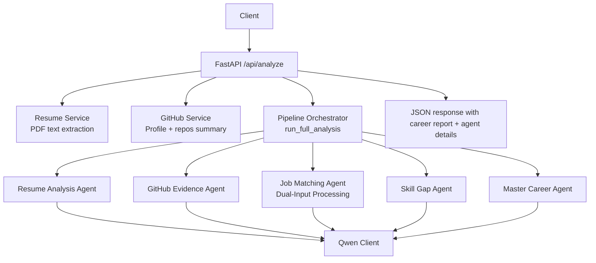
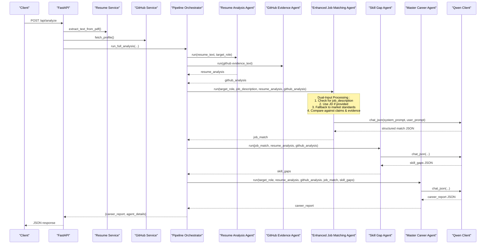
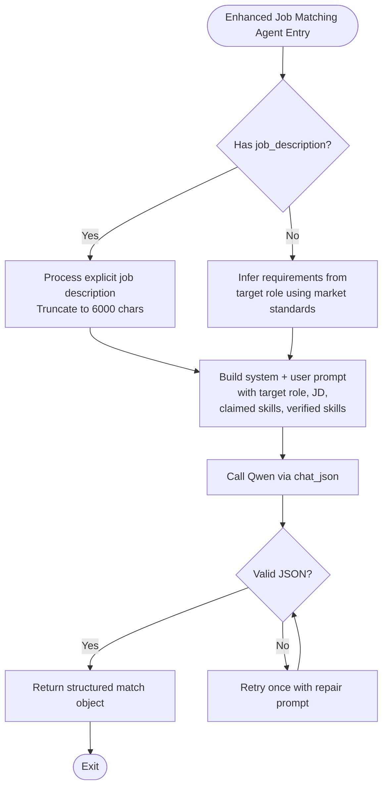
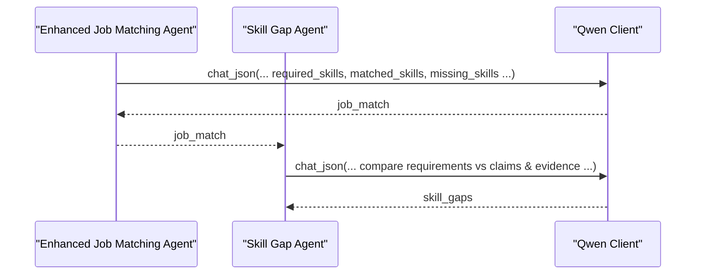
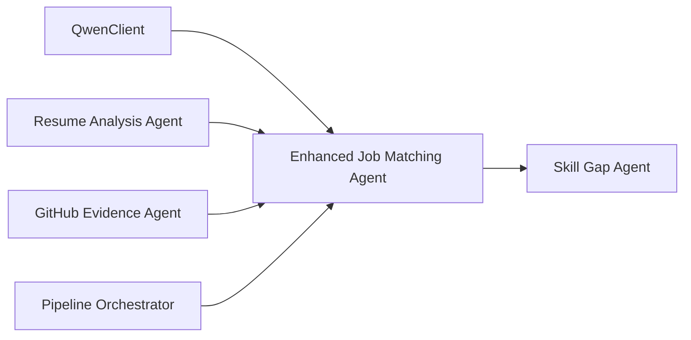

# Job Matching Agent

<cite>
**Referenced Files in This Document**
- [agents.py](file://src/agents.py)
- [main.py](file://src/main.py)
- [github_service.py](file://src/github_service.py)
- [resume_service.py](file://src/resume_service.py)
- [qwen_client.py](file://src/qwen_client.py)
- [config.py](file://src/config.py)
- [README.md](file://README.md)
</cite>

## Update Summary
**Changes Made**
- Enhanced Job Matching Agent with dual-input approach supporting both explicit job descriptions and market standards fallback
- Updated skill comparison methodology to handle comprehensive skill matching across resume claims and GitHub evidence
- Improved role requirement extraction with flexible input handling
- Updated architecture diagrams to reflect the enhanced dual-input processing
- Added detailed examples of both job description and market standards scenarios

## Table of Contents
1. [Introduction](#introduction)
2. [Project Structure](#project-structure)
3. [Core Components](#core-components)
4. [Architecture Overview](#architecture-overview)
5. [Detailed Component Analysis](#detailed-component-analysis)
6. [Dependency Analysis](#dependency-analysis)
7. [Performance Considerations](#performance-considerations)
8. [Troubleshooting Guide](#troubleshooting-guide)
9. [Conclusion](#conclusion)
10. [Appendices](#appendices)

## Introduction
The Job Matching Agent evaluates how well a candidate fits a target role by combining two complementary evidence sources:
- Resume claims (what the candidate says they can do)
- GitHub-verified skills (what public activity proves they can do)

It defines precise role requirements through a **dual-input approach**: either from an optional job description or, when none is provided, from current market standards for that role. The agent outputs a structured result including required_skills with importance levels, match_percentage, matched_skills, missing_skills, and role_insights. It then feeds into subsequent skill gap analysis to prioritize learning actions.

## Project Structure
CareerOS AI exposes a FastAPI endpoint that orchestrates a five-agent pipeline. The Job Matching Agent sits at stage 3, after resume and GitHub evidence are analyzed in parallel.

**Diagram sources**
- [main.py:58-147](file://src/main.py#L58-L147)
- [agents.py:295-334](file://src/agents.py#L295-L334)
- [qwen_client.py:97-157](file://src/qwen_client.py#L97-L157)
- [github_service.py:63-147](file://src/github_service.py#L63-L147)
- [resume_service.py:24-57](file://src/resume_service.py#L24-L57)

**Section sources**
- [main.py:58-147](file://src/main.py#L58-L147)
- [agents.py:295-334](file://src/agents.py#L295-L334)

## Core Components
- **Enhanced Job Matching Agent**: Builds a focused prompt positioning the model as a technical hiring manager, injects both optional job description and market-standard fallback, and compares against resume claims and GitHub-verified skills to produce a structured match report.
- Supporting services:
  - Resume service extracts text from PDFs for claim-based skill identification.
  - GitHub service fetches profile and repositories to derive verified skills.
  - Qwen client standardizes JSON responses and retries on malformed output.
  - Configuration centralizes environment-driven settings.

Key responsibilities:
- Define required skills with must-have/nice-to-have importance.
- Compute match_percentage across 0–100.
- Identify matched_skills and missing_skills.
- Provide role_insights summarizing fit.

**Updated** Enhanced with dual-input capability supporting both explicit job descriptions and market standards fallback.

**Section sources**
- [agents.py:106-163](file://src/agents.py#L106-L163)
- [resume_service.py:24-57](file://src/resume_service.py#L24-L57)
- [github_service.py:63-147](file://src/github_service.py#L63-L147)
- [qwen_client.py:97-157](file://src/qwen_client.py#L97-L157)
- [config.py:23-79](file://src/config.py#L23-L79)

## Architecture Overview
The Job Matching Agent integrates into a staged pipeline with enhanced dual-input processing:
1. Resume Analysis Agent extracts claimed skills.
2. GitHub Evidence Agent derives verified skills from public activity.
3. **Enhanced Job Matching Agent** processes dual inputs (job description OR market standards) and computes match metrics.
4. Skill Gap Agent prioritizes gaps based on the match results.
5. Master Career Agent synthesizes a final readiness report.

**Diagram sources**
- [main.py:58-147](file://src/main.py#L58-L147)
- [agents.py:295-334](file://src/agents.py#L295-L334)
- [qwen_client.py:97-157](file://src/qwen_client.py#L97-L157)

## Detailed Component Analysis

### Enhanced Job Matching Agent: Dual-Input Role Requirement Extraction
- **Dual-input approach**:
  - Optional job_description: If provided and non-empty, it is included in the prompt (truncated to a safe length).
  - Market standards fallback: If no job description is provided, the system instructs the model to infer requirements from the target role using current market standards.
- System prompt positions the model as a technical hiring manager who defines precise role requirements.
- Inputs injected into the user prompt:
  - TARGET ROLE
  - JOB DESCRIPTION (optional)
  - CANDIDATE'S CLAIMED SKILLS (from resume)
  - CANDIDATE'S VERIFIED SKILLS (from GitHub)
- Output schema enforced via shared JSON rules and parsing:
  - required_skills: list of objects with skill and importance (must-have | nice-to-have)
  - match_percentage: integer 0–100
  - matched_skills: list of skills present in candidate's profile
  - missing_skills: list of required skills absent from candidate's profile
  - role_insights: concise narrative on fit

**Updated** Enhanced with conditional logic for dual-input processing.

**Diagram sources**
- [agents.py:117-163](file://src/agents.py#L117-L163)
- [qwen_client.py:97-157](file://src/qwen_client.py#L97-L157)

**Section sources**
- [agents.py:117-163](file://src/agents.py#L117-L163)
- [qwen_client.py:31-67](file://src/qwen_client.py#L31-L67)

### Comprehensive Skill Comparison Methodology
- Claimed skills come from the Resume Analysis Agent's output.
- Verified skills are extracted from the GitHub Evidence Agent's verified_skills list.
- The Enhanced Job Matching Agent compares these against its derived required_skills to compute:
  - matched_skills: intersection of required_skills with candidate's combined profile (claims + verified)
  - missing_skills: required_skills not found in the candidate's profile
  - match_percentage: overall fit score reflecting coverage of required skills, weighted by importance where applicable

**Updated** Enhanced to handle both explicit job descriptions and market standards-based requirements with consistent comparison logic.

Note: The exact numerical formula is determined by the LLM based on the prompt context; the code enforces the structure and constraints rather than hard-coded arithmetic.

**Section sources**
- [agents.py:131-150](file://src/agents.py#L131-L150)
- [agents.py:152-163](file://src/agents.py#L152-L163)

### Handling Cases With and Without Explicit Job Descriptions
- **With job description**:
  - The provided text is inserted into the prompt (capped to 6000 characters) so the model extracts explicit requirements directly from the posting.
- **Without job description**:
  - The prompt instructs the model to infer requirements from the target role using current market standards, ensuring robustness even when no JD is supplied.

**Updated** Enhanced with specific truncation limits and improved fallback mechanisms.

This dual-mode design ensures consistent outputs regardless of input availability.

**Section sources**
- [agents.py:140-147](file://src/agents.py#L140-L147)
- [agents.py:124-129](file://src/agents.py#L124-L129)

### Integration With Subsequent Skill Gap Analysis
- The Enhanced Job Matching Agent's output becomes the primary input to the Skill Gap Agent.
- The Skill Gap Agent receives:
  - job_match (required_skills, matched_skills, missing_skills, match_percentage, role_insights)
  - resume_analysis.claimed_skills
  - github_analysis.verified_skills
- It returns critical and moderate gaps plus quick wins, enabling targeted development planning.

**Diagram sources**
- [agents.py:169-209](file://src/agents.py#L169-209)
- [agents.py:295-334](file://src/agents.py#L295-L334)

**Section sources**
- [agents.py:169-209](file://src/agents.py#L169-209)
- [agents.py:295-334](file://src/agents.py#L295-L334)

### Example Scenarios and Outputs
- **Scenario A: With job description**
  - Input includes a specific job posting.
  - Output includes required_skills with importance, match_percentage, matched_skills, missing_skills, role_insights.
- **Scenario B: Without job description**
  - Requirements inferred from target role using market standards.
  - Same structured output ensures downstream compatibility.

**Updated** Both scenarios now demonstrate the enhanced dual-input capability with consistent behavior and enable downstream skill gap analysis to proceed uniformly.

[No sources needed since this section summarizes behavior without quoting code]

## Dependency Analysis
The Enhanced Job Matching Agent depends on:
- QwenClient for reliable JSON responses and retry logic
- Resume Analysis Agent for claimed skills
- GitHub Evidence Agent for verified skills
- Pipeline orchestrator for sequencing and data passing

**Updated** Enhanced agent maintains same dependencies while adding dual-input processing capability.

**Diagram sources**
- [agents.py:106-163](file://src/agents.py#L106-L163)
- [agents.py:295-334](file://src/agents.py#L295-L334)
- [qwen_client.py:97-157](file://src/qwen_client.py#L97-L157)

**Section sources**
- [agents.py:106-163](file://src/agents.py#L106-L163)
- [agents.py:295-334](file://src/agents.py#L295-L334)

## Performance Considerations
- **Prompt truncation**:
  - Job descriptions are truncated to 6000 characters to control token usage and latency.
  - Resumes are truncated to a configured character limit to manage cost and speed.
- LLM call limits:
  - Temperature and max tokens are configurable to balance creativity and determinism.
  - Timeout settings prevent long hangs during network or model delays.
- External service rate limits:
  - GitHub API rate limiting is handled with clear error messages and optional token configuration.

**Updated** Enhanced with specific truncation limits for job descriptions.

Recommendations:
- Keep job descriptions concise and relevant to reduce token overhead.
- Use appropriate model selection (e.g., gemini-3.6-flash) for balanced performance.
- Monitor timeouts and adjust per deployment environment.

**Section sources**
- [agents.py:140-147](file://src/agents.py#L140-L147)
- [resume_service.py:51-57](file://src/resume_service.py#L51-L57)
- [qwen_client.py:73-95](file://src/qwen_client.py#L73-L95)
- [github_service.py:50-59](file://src/github_service.py#L50-L59)
- [config.py:37-63](file://src/config.py#L37-L63)

## Troubleshooting Guide
Common issues and resolutions:
- Missing or invalid Google API key:
  - Error surfaced by GeminiClient initialization; ensure GOOGLE_API_KEY is set.
- Invalid JSON from LLM:
  - Client attempts one retry with a repair prompt; if still invalid, raises a detailed error.
- GitHub API errors:
  - Handles 404 (user not found), 403 (rate limit), and other failures with friendly messages.
- Resume processing errors:
  - Non-PDF files, empty pages, or scanned-only PDFs raise descriptive errors.

Operational checks:
- Health endpoint reports whether Google Gemini is configured and GitHub token presence.
- Validate inputs early (non-empty fields, correct file type, size limits).

**Updated** Updated references to use Google Gemini instead of Qwen API.

**Section sources**
- [qwen_client.py:73-95](file://src/qwen_client.py#L73-L95)
- [qwen_client.py:120-157](file://src/qwen_client.py#L120-L157)
- [github_service.py:48-59](file://src/github_service.py#L48-L59)
- [resume_service.py:24-57](file://src/resume_service.py#L24-L57)
- [main.py:45-55](file://src/main.py#L45-L55)
- [main.py:74-107](file://src/main.py#L74-L107)

## Conclusion
The Enhanced Job Matching Agent provides a robust, evidence-based evaluation of candidate readiness for a target role. By combining resume claims with GitHub-verified skills and leveraging either explicit job descriptions or market standards through its dual-input approach, it produces a structured, actionable match report. Its integration with the Skill Gap Agent enables precise, prioritized development planning, while the overall pipeline ensures reliability through strict JSON enforcement, retries, and comprehensive error handling.

**Updated** Enhanced with dual-input capability for more flexible and robust role requirement processing.

[No sources needed since this section summarizes without analyzing specific files]

## Appendices

### API Contract for Job Matching
- Endpoint: POST /api/analyze
- Inputs:
  - resume: PDF file
  - github_username: string
  - target_role: string
  - job_description: optional string
- Response includes:
  - analysis: career report
  - agent_details.job_match: structured match object with required_skills, match_percentage, matched_skills, missing_skills, role_insights

**Updated** Enhanced job_match object now supports dual-input processing with consistent output format.

**Section sources**
- [main.py:58-147](file://src/main.py#L58-L147)
- [README.md:286-326](file://README.md#L286-L326)