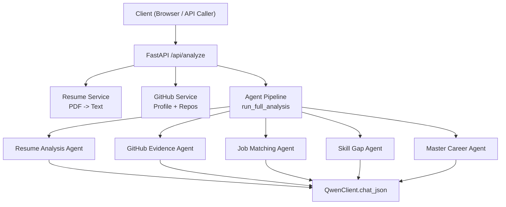
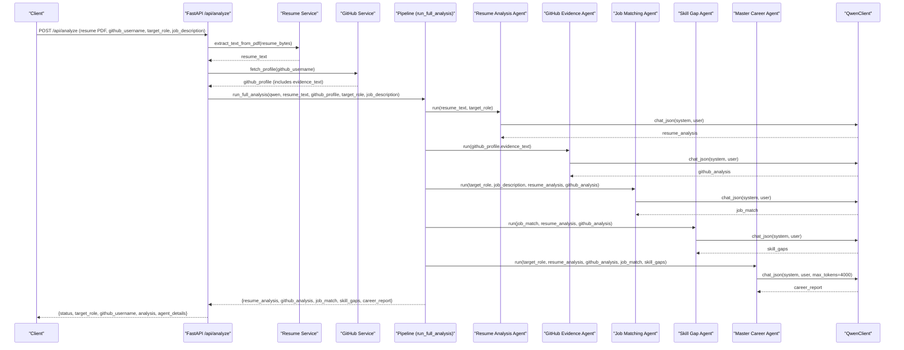
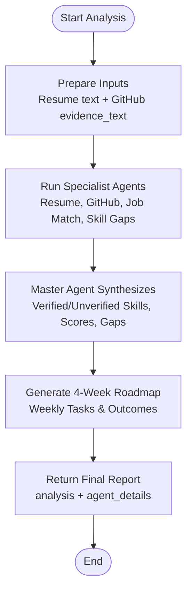
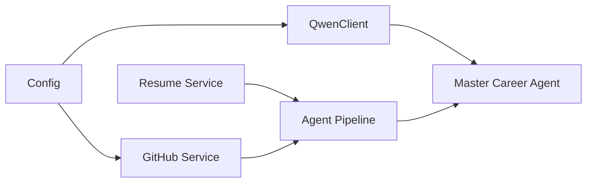

# Master Career Agent

<cite>
**Referenced Files in This Document**
- [agents.py](file://src/agents.py)
- [main.py](file://src/main.py)
- [github_service.py](file://src/github_service.py)
- [resume_service.py](file://src/resume_service.py)
- [qwen_client.py](file://src/qwen_client.py)
- [config.py](file://src/config.py)
- [test_pipeline.py](file://tests/test_pipeline.py)
- [README.md](file://README.md)
</cite>

## Table of Contents
1. Introduction
2. Project Structure
3. Core Components
4. Architecture Overview
5. Detailed Component Analysis
6. Dependency Analysis
7. Performance Considerations
8. Troubleshooting Guide
9. Conclusion
10. Appendices

## Introduction
This document explains the Master Career Agent, the final synthesis stage that combines outputs from four specialist agents into a single, evidence-based career intelligence report. The system’s core principle is strict verification: a skill is considered verified only when it is both claimed in the resume and proven by real GitHub activity. The Master agent orchestrates this cross-check to produce honest, realistic assessments, including a weighted readiness score, verified and unverified skills, strengths, gaps, evidence citations, recommendations, and a 4-week roadmap with weekly tasks and outcomes.

## Project Structure
The application is a FastAPI service that exposes an analysis endpoint. It orchestrates five specialized AI agents via a Qwen client, enriching inputs with resume text extraction and GitHub profile data.

**Diagram sources**
- [main.py:58-147](file://src/main.py#L58-L147)
- [agents.py:295-334](file://src/agents.py#L295-L334)
- [qwen_client.py:97-157](file://src/qwen_client.py#L97-L157)
- [github_service.py:63-147](file://src/github_service.py#L63-L147)
- [resume_service.py:24-57](file://src/resume_service.py#L24-L57)

**Section sources**
- [main.py:1-160](file://src/main.py#L1-L160)
- [README.md:173-258](file://README.md#L173-L258)

## Core Components
- Resume Analysis Agent: Extracts claimed skills and experience from resume text.
- GitHub Evidence Agent: Derives verified skills from public GitHub activity.
- Job Matching Agent: Matches candidate against target role requirements.
- Skill Gap Agent: Identifies and prioritizes missing competencies.
- Master Career Agent: Synthesizes all outputs into the final report with a weighted readiness score, verified/unverified skills, strengths, gaps, evidence, recommendations, and a 4-week roadmap.

Key orchestration function: run_full_analysis executes the pipeline in order and returns each agent’s output plus the final career report.

**Section sources**
- [agents.py:28-210](file://src/agents.py#L28-L210)
- [agents.py:212-334](file://src/agents.py#L212-L334)

## Architecture Overview
The Master Career Agent receives structured inputs from the other agents and produces a comprehensive report. Its system prompt positions it as the orchestrator that enforces evidence-based assessment: skills are verified only when resume claims align with GitHub proof.

**Diagram sources**
- [main.py:58-147](file://src/main.py#L58-L147)
- [agents.py:295-334](file://src/agents.py#L295-L334)
- [qwen_client.py:97-157](file://src/qwen_client.py#L97-L157)
- [github_service.py:63-147](file://src/github_service.py#L63-L147)
- [resume_service.py:24-57](file://src/resume_service.py#L24-L57)

## Detailed Component Analysis

### Master Career Agent: System Prompt and Role
- Positioning: The Master agent acts as the orchestrator that synthesizes outputs from four specialist agents into one honest, evidence-based career report.
- Core Principle: A skill is VERIFIED only when the resume claims it AND GitHub activity proves it; otherwise it is UNVERIFIED.
- Output Contract: The agent must return a JSON object with a defined structure including scores, lists, and a 4-week roadmap.

Evidence:
- The system prompt explicitly states the evidence-based principle and the requirement for realistic, non-inflated assessments.
- The user prompt defines the exact output schema, including career_readiness_score, score_breakdown, verified_skills, unverified_skills, strengths, skill_gaps, evidence, recommendations, roadmap_30_days, recommended_project, and hiring_readiness_summary.

**Section sources**
- [agents.py:212-289](file://src/agents.py#L212-L289)

### Synthesis Methodology
- Inputs:
  - Resume analysis: claimed skills, experience highlights, quality notes.
  - GitHub evidence: verified skills with confidence and repo highlights.
  - Job match: required skills, matched/missing skills, match percentage.
  - Skill gaps: critical/moderate gaps and quick wins.
- Process:
  - Cross-check resume claims against GitHub evidence to classify skills as verified or unverified.
  - Compare candidate’s demonstrated skills against job requirements to assess fit and identify gaps.
  - Aggregate insights to compute a holistic readiness score using specified weights.
  - Generate actionable recommendations and a 4-week roadmap tailored to close identified gaps.

**Section sources**
- [agents.py:223-289](file://src/agents.py#L223-L289)

### Score Calculation Logic
- Overall career_readiness_score is a 0–100 composite reflecting:
  - Resume quality: 25%
  - Evidence strength: 25%
  - Job match: 30%
  - Skill coverage: 20%
- The score_breakdown provides component scores so users can see where they stand on each dimension.
- Note: The precise numeric formula is not hardcoded; the agent computes the score based on the provided inputs and weights while adhering to the contract.

**Section sources**
- [agents.py:254-262](file://src/agents.py#L254-L262)

### Verified vs Unverified Skills
- Verified skills: Claims present in the resume AND supported by GitHub activity. Each entry includes the skill and concrete evidence.
- Unverified skills: Claims present in the resume but lacking public proof. Each entry includes the skill and reason (e.g., no repos found using it).
- This distinction ensures honesty and prevents inflated claims from skewing readiness.

**Section sources**
- [agents.py:263-268](file://src/agents.py#L263-L268)

### Strengths, Skill Gaps, and Evidence Citations
- Strengths: Up to six genuine strengths backed by data (resume and GitHub).
- Skill gaps: Up to eight gaps ranked by severity (critical, moderate, minor), with reasons why each matters.
- Evidence: Up to eight concrete facts sourced from either GitHub or resume to support the assessment.

**Section sources**
- [agents.py:269-275](file://src/agents.py#L269-L275)

### Recommendations and 4-Week Roadmap
- Recommendations: Up to six prioritized, specific next actions derived from gaps and opportunities.
- Roadmap: Exactly four entries (weeks 1–4), each with focus theme, concrete tasks, and expected outcome at week-end.

**Section sources**
- [agents.py:276-279](file://src/agents.py#L276-L279)

### Example Report Generation Flow
- Input preparation:
  - Resume text extracted from PDF.
  - GitHub profile summarized into evidence_text.
- Pipeline execution:
  - Four specialist agents produce structured outputs.
  - Master agent consumes these outputs and generates the final report.
- Output:
  - The API returns analysis (career report) and agent_details for transparency.

**Diagram sources**
- [main.py:58-147](file://src/main.py#L58-L147)
- [agents.py:295-334](file://src/agents.py#L295-L334)

**Section sources**
- [main.py:58-147](file://src/main.py#L58-L147)
- [agents.py:295-334](file://src/agents.py#L295-L334)

### Evidence Correlation and Final Assessment Formulation
- Evidence correlation:
  - The Master agent compares resume claims with GitHub evidence to determine verified skills.
  - It uses job matching results to contextualize which skills matter most for the target role.
  - It leverages skill gap analysis to prioritize development efforts.
- Final assessment formulation:
  - Produces a balanced, realistic verdict on hiring readiness.
  - Provides clear, actionable steps to improve weak areas and strengthen evidence.

**Section sources**
- [agents.py:223-289](file://src/agents.py#L223-L289)

## Dependency Analysis
The Master Career Agent depends on:
- QwenClient for LLM calls with strict JSON output rules and retry logic.
- Agent pipeline orchestration to sequence analyses and pass structured data between stages.
- Supporting services for input enrichment (resume text extraction and GitHub profile summarization).

**Diagram sources**
- [qwen_client.py:97-157](file://src/qwen_client.py#L97-L157)
- [agents.py:295-334](file://src/agents.py#L295-L334)
- [resume_service.py:24-57](file://src/resume_service.py#L24-L57)
- [github_service.py:63-147](file://src/github_service.py#L63-L147)
- [config.py:23-79](file://src/config.py#L23-L79)

**Section sources**
- [qwen_client.py:1-158](file://src/qwen_client.py#L1-L158)
- [agents.py:295-334](file://src/agents.py#L295-L334)
- [resume_service.py:1-58](file://src/resume_service.py#L1-L58)
- [github_service.py:1-173](file://src/github_service.py#L1-L173)
- [config.py:1-79](file://src/config.py#L1-L79)

## Performance Considerations
- LLM calls: Each agent invokes the Qwen API; the Master agent uses a higher token limit to accommodate the full report.
- Concurrency: The pipeline runs sequentially to ensure dependencies are met; parallelization could be considered if dependencies allow.
- Input limits: Resume text is truncated to control prompt size and cost; GitHub top repos are limited to a configurable number.
- Error handling: Robust retries for JSON parsing and explicit error messages for network/auth issues.

[No sources needed since this section provides general guidance]

## Troubleshooting Guide
Common issues and resolutions:
- Missing Qwen API key: Raises configuration error; set DASHSCOPE_API_KEY in .env.
- Invalid or empty resume PDF: Raises resume error; ensure a text-based PDF is uploaded.
- GitHub API rate limit: Add GITHUB_TOKEN to increase rate limit; handle errors gracefully.
- Invalid LLM output: QwenClient attempts one repair call; persistent failures raise detailed errors.

**Section sources**
- [main.py:100-131](file://src/main.py#L100-L131)
- [resume_service.py:24-57](file://src/resume_service.py#L24-L57)
- [github_service.py:48-60](file://src/github_service.py#L48-L60)
- [qwen_client.py:120-157](file://src/qwen_client.py#L120-L157)

## Conclusion
The Master Career Agent is the synthesis engine that transforms multi-source evidence into a credible, actionable career report. By enforcing strict verification—only counting skills as verified when both resume claims and GitHub activity align—it delivers honest assessments grounded in real-world data. The weighted readiness score, structured skill lists, targeted recommendations, and a practical 4-week roadmap provide candidates with a clear path to improve their job readiness.

[No sources needed since this section summarizes without analyzing specific files]

## Appendices

### API Response Shape (Abbreviated)
- status: success
- target_role: string
- github_username: string
- analysis: career report object (score, breakdown, skills, gaps, evidence, recommendations, roadmap, project, summary)
- agent_details: raw outputs from each specialist agent

**Section sources**
- [main.py:134-147](file://src/main.py#L134-L147)
- [README.md:286-327](file://README.md#L286-L327)

### Test Coverage Highlights
- Offline tests validate pipeline ordering, JSON parsing, GitHub summary construction, and resume service error paths without requiring live API keys.
- Tests confirm the Master agent receives all prior agent outputs and produces the expected career report fields.

**Section sources**
- [test_pipeline.py:141-203](file://tests/test_pipeline.py#L141-L203)