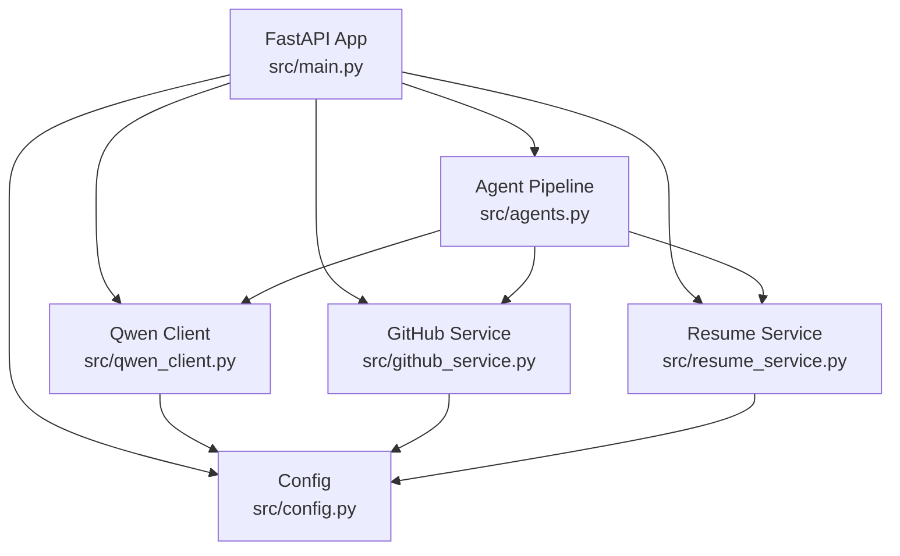
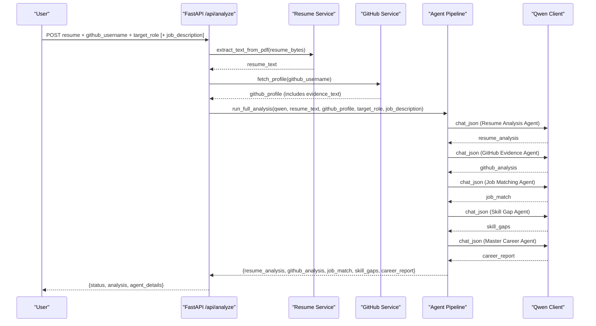
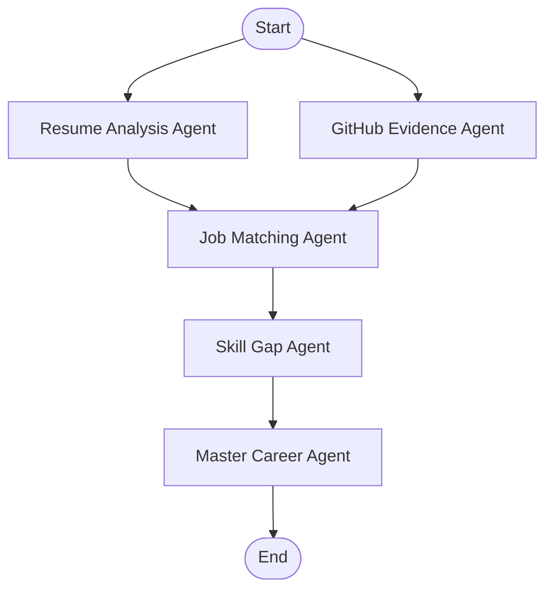
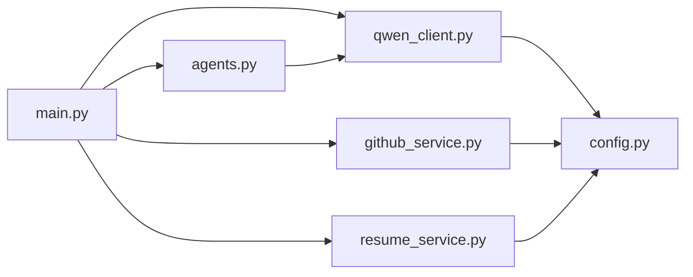

# Multi-Agent System

<cite>
**Referenced Files in This Document**
- [main.py](file://src/main.py)
- [agents.py](file://src/agents.py)
- [config.py](file://src/config.py)
- [qwen_client.py](file://src/qwen_client.py)
- [github_service.py](file://src/github_service.py)
- [resume_service.py](file://src/resume_service.py)
- [test_pipeline.py](file://tests/test_pipeline.py)
- [README.md](file://README.md)
- [requirements.txt](file://requirements.txt)
</cite>

## Table of Contents
1. [Introduction](#introduction)
2. [Project Structure](#project-structure)
3. [Core Components](#core-components)
4. [Architecture Overview](#architecture-overview)
5. [Detailed Component Analysis](#detailed-component-analysis)
6. [Dependency Analysis](#dependency-analysis)
7. [Performance Considerations](#performance-considerations)
8. [Troubleshooting Guide](#troubleshooting-guide)
9. [Conclusion](#conclusion)
10. [Appendices](#appendices)

## Introduction
This document explains the CareerOS AI multi-agent system that orchestrates five specialized AI agents to deliver an evidence-based career readiness report. The system ingests a resume PDF and a GitHub profile, then runs:
- Resume Analysis Agent for ATS optimization and keyword extraction
- GitHub Evidence Agent for code quality and architecture verification
- Job Matching Agent for requirement alignment against a target role (and optional job description)
- Skill Gap Agent for competency identification and prioritization
- Master Career Agent for synthesis and roadmap generation

The pipeline uses structured JSON communication between agents via a Qwen client wrapper, with configuration-driven model parameters and robust error handling.

## Project Structure
CareerOS AI is a FastAPI application with clear separation of concerns:
- API entrypoint and request handling
- Agent orchestration and prompt engineering
- LLM client abstraction over Qwen
- Data services for GitHub and resume text extraction
- Configuration loaded from environment variables
- Offline tests using a fake LLM client

**Diagram sources**
- [main.py:28-147](file://src/main.py#L28-L147)
- [agents.py:295-335](file://src/agents.py#L295-L335)
- [qwen_client.py:70-158](file://src/qwen_client.py#L70-L158)
- [github_service.py:63-147](file://src/github_service.py#L63-L147)
- [resume_service.py:24-58](file://src/resume_service.py#L24-L58)
- [config.py:23-79](file://src/config.py#L23-L79)

**Section sources**
- [main.py:1-160](file://src/main.py#L1-L160)
- [README.md:173-202](file://README.md#L173-L202)

## Core Components
- FastAPI endpoints: health check and analysis endpoint that validates inputs, gathers evidence, runs the agent pipeline, and returns structured results.
- Five agents: each encapsulates a focused prompt, calls Qwen via structured JSON, and returns typed dictionaries consumed by downstream agents.
- Qwen client: OpenAI-compatible wrapper with retry on invalid JSON output and strict parsing.
- GitHub service: fetches public profile data and builds a compact evidence summary for the GitHub Evidence Agent.
- Resume service: extracts text from uploaded PDFs with size limits and truncation to control prompt length.
- Configuration: environment-driven settings for model selection, timeouts, upload limits, and server binding.

Key responsibilities:
- Input validation and error mapping to HTTP status codes
- Evidence gathering from resume and GitHub
- Orchestrated execution of the five-agent pipeline
- Structured JSON responses including both headline report and per-agent details

**Section sources**
- [main.py:45-147](file://src/main.py#L45-L147)
- [agents.py:27-290](file://src/agents.py#L27-L290)
- [qwen_client.py:27-158](file://src/qwen_client.py#L27-L158)
- [github_service.py:22-173](file://src/github_service.py#L22-L173)
- [resume_service.py:17-58](file://src/resume_service.py#L17-L58)
- [config.py:23-79](file://src/config.py#L23-L79)

## Architecture Overview
The system follows a staged pipeline where independent analyses run first, followed by comparative analysis, gap detection, and final synthesis.

**Diagram sources**
- [main.py:58-147](file://src/main.py#L58-L147)
- [agents.py:295-335](file://src/agents.py#L295-L335)
- [qwen_client.py:97-158](file://src/qwen_client.py#L97-L158)
- [github_service.py:63-147](file://src/github_service.py#L63-L147)
- [resume_service.py:24-58](file://src/resume_service.py#L24-L58)

## Detailed Component Analysis

### Agent Orchestration and Communication Protocol
- Pipeline stages:
  - Stage 1 & 2: Independent analyses of resume and GitHub evidence
  - Stage 3 & 4: Comparative analysis (job matching and skill gaps)
  - Stage 5: Final synthesis into a comprehensive report
- Communication protocol:
  - Each agent constructs a system prompt and user prompt, then calls QwenClient.chat_json
  - Responses are strictly parsed JSON objects; malformed outputs trigger a single repair attempt
  - All agent outputs are plain Python dicts, enabling deterministic composition

**Diagram sources**
- [agents.py:295-335](file://src/agents.py#L295-L335)

**Section sources**
- [agents.py:295-335](file://src/agents.py#L295-L335)
- [qwen_client.py:97-158](file://src/qwen_client.py#L97-L158)

### Resume Analysis Agent
- Purpose: Extract claimed skills, experience highlights, education, and ATS-related notes from resume text
- Inputs: resume text and target role
- Outputs: candidate name, summary, years of experience, claimed skills, education, experience highlights, resume quality notes
- Prompt strategy: Role-play as a senior technical recruiter; enforce precise extraction without speculation

**Section sources**
- [agents.py:27-64](file://src/agents.py#L27-L64)

### GitHub Evidence Agent
- Purpose: Derive verified skills from real GitHub activity, distinguishing genuine evidence from noise
- Inputs: GitHub evidence text generated from profile and repositories
- Outputs: verified skills with evidence and confidence, activity summary, project quality score and notes, repo highlights
- Evidence methodology: Uses top repos sorted by stars and recent activity; ignores forks to focus on original work

**Section sources**
- [agents.py:66-104](file://src/agents.py#L66-L104)
- [github_service.py:92-147](file://src/github_service.py#L92-L147)

### Job Matching Agent
- Purpose: Align candidate profile with target role requirements, optionally grounded in a provided job description
- Inputs: target role, optional job description, resume analysis, github analysis
- Outputs: required skills with importance, match percentage, matched and missing skills, role insights
- Cross-references claimed vs verified skills to avoid inflated matches

**Section sources**
- [agents.py:106-164](file://src/agents.py#L106-L164)

### Skill Gap Agent
- Purpose: Identify and prioritize skill gaps based on role requirements and demonstrated capabilities
- Inputs: job match results, resume analysis, github analysis
- Outputs: critical and moderate gaps with impact and current/required levels, plus quick wins

**Section sources**
- [agents.py:166-210](file://src/agents.py#L166-L210)

### Master Career Agent
- Purpose: Synthesize all agent outputs into a final, evidence-based career report
- Inputs: target role, resume analysis, github analysis, job match, skill gaps
- Outputs: readiness score with breakdown, verified/unverified skills, strengths, gaps, evidence, recommendations, 30-day roadmap, recommended project, hiring readiness summary
- Evidence principle: Only skills claimed in resume AND proven on GitHub are considered verified

**Section sources**
- [agents.py:212-290](file://src/agents.py#L212-L290)

### Qwen Client and Model Parameters
- Abstraction: Thin wrapper around OpenAI SDK pointing to Alibaba Cloud Model Studio’s OpenAI-compatible endpoint
- Model configuration:
  - Model: qwen-plus by default (configurable to qwen-turbo or qwen-max)
  - Temperature: low (default 0.2) for deterministic outputs
  - Max tokens: configurable (default 4000), overridden per agent when needed
  - Timeout: configurable (default 90 seconds)
- Error handling:
  - Raises QwenError on network/auth/rate-limit issues
  - Parses JSON with robust extraction; retries once if initial response is not valid JSON
  - Provides detailed error messages including raw output snippet

**Section sources**
- [qwen_client.py:27-158](file://src/qwen_client.py#L27-L158)
- [config.py:23-79](file://src/config.py#L23-L79)

### GitHub Service
- Fetches public profile and repositories; filters out forks; computes language counts and topics
- Builds a compact evidence text block used by the GitHub Evidence Agent
- Handles rate limiting and authentication via optional token; raises descriptive errors

**Section sources**
- [github_service.py:22-173](file://src/github_service.py#L22-L173)

### Resume Service
- Extracts text from PDFs; enforces maximum file size and character limits
- Truncates very long resumes to control prompt length and cost
- Raises specific errors for unreadable or empty PDFs

**Section sources**
- [resume_service.py:17-58](file://src/resume_service.py#L17-L58)

### API Layer and Request Handling
- Health endpoint reports app status, configured model, and whether Qwen/GitHub credentials are set
- Analysis endpoint:
  - Validates inputs (PDF format, non-empty, size limits)
  - Checks Qwen configuration
  - Gathers resume text and GitHub profile
  - Runs full agent pipeline
  - Returns structured response with headline report and per-agent details

**Section sources**
- [main.py:45-147](file://src/main.py#L45-L147)

## Dependency Analysis
High-level dependencies and coupling:
- main.py depends on agents, config, github_service, qwen_client, resume_service
- agents.py depends on qwen_client and consumes outputs from github_service and resume_service indirectly via main
- qwen_client depends on config for model and timeout settings
- github_service depends on config for token and timeouts
- resume_service depends on config for size limits

**Diagram sources**
- [main.py:17-21](file://src/main.py#L17-L21)
- [agents.py:21-24](file://src/agents.py#L21-L24)
- [qwen_client.py:22-24](file://src/qwen_client.py#L22-L24)
- [github_service.py:12-17](file://src/github_service.py#L12-L17)
- [resume_service.py:9-14](file://src/resume_service.py#L9-L14)

**Section sources**
- [main.py:17-21](file://src/main.py#L17-L21)
- [agents.py:21-24](file://src/agents.py#L21-L24)
- [qwen_client.py:22-24](file://src/qwen_client.py#L22-L24)
- [github_service.py:12-17](file://src/github_service.py#L12-L17)
- [resume_service.py:9-14](file://src/resume_service.py#L9-L14)

## Performance Considerations
- Sequential pipeline design:
  - Stages 1 and 2 (Resume and GitHub analysis) are independent but currently executed sequentially in the pipeline function
  - Optimization opportunity: parallelize these two stages to reduce total latency
- LLM call costs and latency:
  - Low temperature and max tokens help control cost and improve determinism
  - Master Career Agent overrides max_tokens for longer synthesis
- External API constraints:
  - GitHub rate limits handled gracefully; recommend setting GITHUB_TOKEN for higher limits
  - Qwen timeouts configurable to balance responsiveness and reliability
- Resume size management:
  - Character truncation prevents oversized prompts and reduces processing time

[No sources needed since this section provides general guidance]

## Troubleshooting Guide
Common issues and resolutions:
- Missing Qwen API key:
  - Symptom: QwenError raised during initialization or analysis
  - Resolution: Set DASHSCOPE_API_KEY in .env and ensure base URL is correct
- Invalid or empty resume:
  - Symptom: ResumeError indicating unreadable or empty PDF
  - Resolution: Upload a text-based PDF within size limits; scanned/image-only resumes are not supported
- GitHub API failures:
  - Symptom: GitHubError due to rate limit or invalid username
  - Resolution: Add GITHUB_TOKEN to increase rate limit; verify username formatting
- Malformed LLM output:
  - Symptom: QwenError after two attempts due to invalid JSON
  - Resolution: Review prompts and model parameters; consider lowering temperature further

**Section sources**
- [qwen_client.py:27-158](file://src/qwen_client.py#L27-L158)
- [resume_service.py:17-58](file://src/resume_service.py#L17-L58)
- [github_service.py:22-60](file://src/github_service.py#L22-L60)
- [main.py:74-131](file://src/main.py#L74-L131)

## Conclusion
CareerOS AI implements a clear, extensible multi-agent architecture that combines resume analysis with objective GitHub evidence to produce actionable career insights. The pipeline’s structured JSON protocol, robust error handling, and configuration-driven model parameters enable reliable operation. Extensibility points allow adding new specialized agents and integrating additional data sources while maintaining composability and testability.

[No sources needed since this section summarizes without analyzing specific files]

## Appendices

### Custom Agent Development and Extension Points
To add a new specialized agent:
- Create a new class with a name attribute and a run method that accepts relevant inputs and returns a dict
- Build a focused system_prompt and user_prompt tailored to the agent’s purpose
- Call qwen.chat_json with the prompts; leverage shared JSON rules for consistent output
- Integrate the agent into run_full_analysis by inserting it at the appropriate stage and wiring its inputs/outputs
- Update tests to include the new agent’s expected response in the FakeQwen sequence

Example extension pattern:
- New agent class definition and run method
- Pipeline modification to call the new agent and pass its output downstream
- Test updates to assert ordering and result structure

**Section sources**
- [agents.py:27-290](file://src/agents.py#L27-L290)
- [test_pipeline.py:28-39](file://tests/test_pipeline.py#L28-L39)
- [test_pipeline.py:141-203](file://tests/test_pipeline.py#L141-L203)

### Evidence-Based Assessment Methodology
- Claims vs proof:
  - Resume Analysis Agent extracts claimed skills
  - GitHub Evidence Agent verifies skills through repository languages, descriptions, and activity
  - Master Career Agent cross-references claims with evidence to label skills as verified or unverified
- Objective scoring:
  - Readiness score integrates resume quality, evidence strength, job match, and skill coverage
  - Recommendations and roadmap are derived from identified gaps and strengths

**Section sources**
- [agents.py:212-290](file://src/agents.py#L212-L290)
- [github_service.py:92-147](file://src/github_service.py#L92-L147)

### API Reference Summary
- GET /health: Status check reporting app name, version, configured model, and credential availability
- POST /api/analyze: Multipart form with resume PDF, github_username, target_role, and optional job_description; returns success status, target role, username, analysis report, and per-agent details

**Section sources**
- [main.py:45-147](file://src/main.py#L45-L147)
- [README.md:286-327](file://README.md#L286-L327)

### Environment Variables and Configuration
- DASHSCOPE_API_KEY: Required for Qwen access
- QWEN_BASE_URL: Optional override for international or China endpoints
- QWEN_MODEL: Default qwen-plus; can be tuned to qwen-turbo or qwen-max
- QWEN_TEMPERATURE: Controls randomness; default 0.2
- QWEN_MAX_TOKENS: Default 4000; can be overridden per agent
- QWEN_TIMEOUT: Default 90 seconds
- GITHUB_TOKEN: Optional; increases rate limit
- GITHUB_TIMEOUT: Default 15 seconds
- GITHUB_MAX_REPOS: Default 8
- MAX_RESUME_MB: Default 10 MB
- MAX_RESUME_CHARS: Default 12000 characters
- API_HOST and API_PORT: Server binding defaults

**Section sources**
- [config.py:23-79](file://src/config.py#L23-L79)

### Dependencies
- fastapi, uvicorn[standard], openai, python-dotenv, requests, pypdf, python-multipart, pydantic

**Section sources**
- [requirements.txt:1-8](file://requirements.txt#L1-L8)