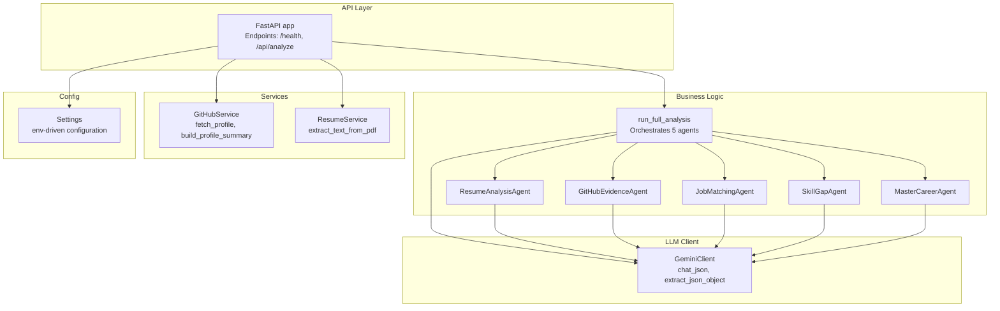
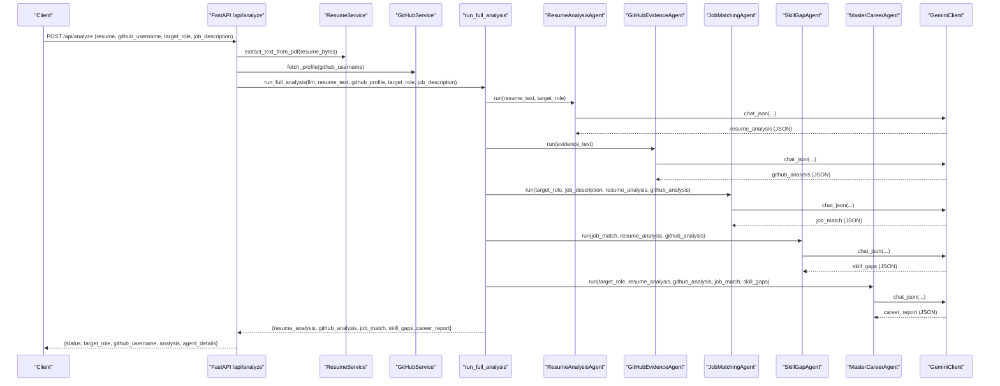
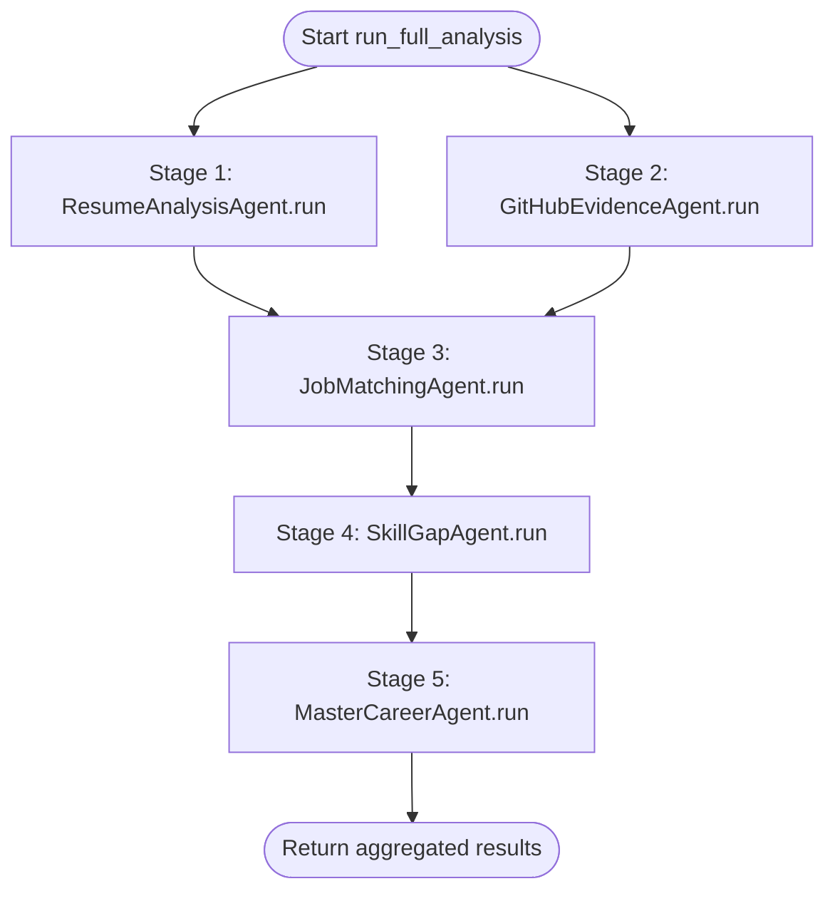
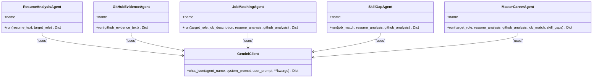
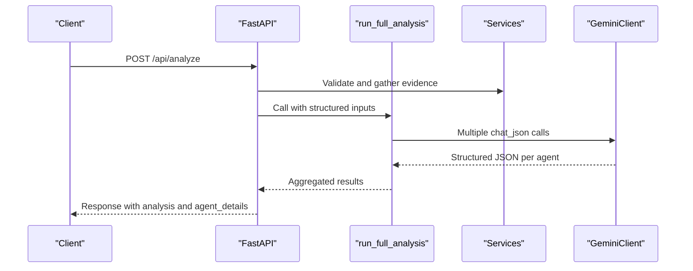
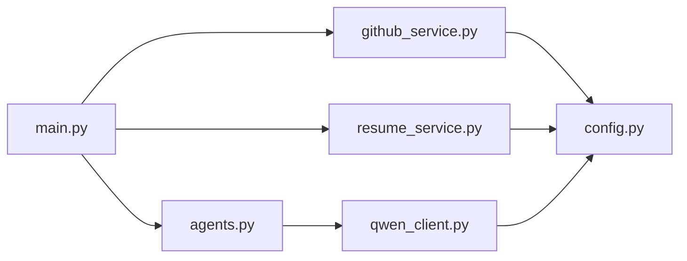

# Pipeline Orchestration

<cite>
**Referenced Files in This Document**
- [main.py](file://src/main.py)
- [agents.py](file://src/agents.py)
- [qwen_client.py](file://src/qwen_client.py)
- [github_service.py](file://src/github_service.py)
- [resume_service.py](file://src/resume_service.py)
- [config.py](file://src/config.py)
- [test_pipeline.py](file://tests/test_pipeline.py)
</cite>

## Update Summary
**Changes Made**
- Updated to reflect the complete five-agent pipeline orchestration system
- Enhanced documentation of the `run_full_analysis` function architecture
- Added detailed coverage of data flow between stages and error handling mechanisms
- Updated technical specifications to match current Gemini API implementation
- Expanded testing capabilities documentation with offline test framework

## Table of Contents
1. [Introduction](#introduction)
2. [Project Structure](#project-structure)
3. [Core Components](#core-components)
4. [Architecture Overview](#architecture-overview)
5. [Detailed Component Analysis](#detailed-component-analysis)
6. [Dependency Analysis](#dependency-analysis)
7. [Performance Considerations](#performance-considerations)
8. [Troubleshooting Guide](#troubleshooting-guide)
9. [Conclusion](#conclusion)
10. [Appendices](#appendices)

## Introduction
This document explains the multi-agent pipeline orchestration system that coordinates five specialized agents to produce an evidence-based career readiness report. The system ingests a resume PDF and a GitHub profile, analyzes them with domain-specific agents using Google Gemini AI, compares requirements against demonstrated skills, and synthesizes a final report. The core orchestrator is `run_full_analysis`, which manages agent lifecycles, data flow between stages, and error handling across the pipeline. It documents the three-stage execution pattern, structured JSON communication protocol, extensibility for adding new agents, performance considerations, and separation of concerns between API layer and business logic.

## Project Structure
The application is organized into clear layers:
- **API layer (FastAPI)**: HTTP endpoints, input validation, error mapping, and response formatting.
- **Business logic (agents)**: Five specialized agents plus the orchestrator `run_full_analysis`.
- **Services**: GitHub evidence fetching and resume text extraction.
- **Client**: Gemini client wrapper for LLM calls with robust JSON parsing and retry behavior.
- **Configuration**: Centralized settings from environment variables.
- **Tests**: Offline unit tests using a fake LLM client to validate pipeline behavior without network access.

**Diagram sources**
- [main.py:28-147](file://src/main.py#L28-L147)
- [agents.py:295-337](file://src/agents.py#L295-L337)
- [github_service.py:63-173](file://src/github_service.py#L63-L173)
- [resume_service.py:24-58](file://src/resume_service.py#L24-L58)
- [qwen_client.py:74-161](file://src/qwen_client.py#L74-L161)
- [config.py:23-72](file://src/config.py#L23-L72)

**Section sources**
- [main.py:28-160](file://src/main.py#L28-L160)
- [agents.py:295-337](file://src/agents.py#L295-L337)
- [github_service.py:63-173](file://src/github_service.py#L63-L173)
- [resume_service.py:24-58](file://src/resume_service.py#L24-L58)
- [qwen_client.py:74-161](file://src/qwen_client.py#L74-L161)
- [config.py:23-72](file://src/config.py#L23-L72)

## Core Components
- **Agents**: Each agent encapsulates a focused task, builds a prompt, calls Gemini through `chat_json`, and returns a structured dict.
- **Orchestrator**: `run_full_analysis` constructs agents, executes stages, and aggregates outputs.
- **GeminiClient**: Wraps Google Gemini API calls, enforces strict JSON output rules, and retries once on malformed responses.
- **GitHubService**: Fetches public profile and repositories, builds a compact summary including an `evidence_text` block for the GitHub Evidence Agent.
- **ResumeService**: Extracts text from uploaded PDFs, validates content, and truncates long resumes to control cost and latency.
- **Config**: Centralized settings loaded from environment variables; includes checks for required keys and timeouts.

Key responsibilities:
- Input validation and error mapping at the API layer.
- Data gathering and transformation in services.
- Domain analysis in agents.
- Final synthesis in MasterCareerAgent.
- Structured JSON protocol ensures consistent inter-agent communication.

**Section sources**
- [agents.py:29-292](file://src/agents.py#L29-L292)
- [agents.py:295-337](file://src/agents.py#L295-L337)
- [qwen_client.py:31-161](file://src/qwen_client.py#L31-L161)
- [github_service.py:22-173](file://src/github_service.py#L22-L173)
- [resume_service.py:17-58](file://src/resume_service.py#L17-L58)
- [config.py:23-72](file://src/config.py#L23-L72)

## Architecture Overview
The pipeline follows a staged execution model:
- **Stage 1 & 2**: Independent analyses of resume and GitHub evidence. These are conceptually parallelizable since they do not depend on each other.
- **Stage 3 & 4**: Requirement comparison and gap analysis, depending on outputs from Stages 1 & 2.
- **Stage 5**: Final synthesis by the Master Career Agent combining all prior results.

**Diagram sources**
- [main.py:58-147](file://src/main.py#L58-L147)
- [agents.py:295-337](file://src/agents.py#L295-L337)
- [qwen_client.py:98-161](file://src/qwen_client.py#L98-L161)
- [github_service.py:63-173](file://src/github_service.py#L63-L173)
- [resume_service.py:24-58](file://src/resume_service.py#L24-L58)

## Detailed Component Analysis

### Orchestrator: run_full_analysis
- **Responsibilities**:
  - Instantiate all five agents.
  - Execute Stage 1 & 2: independent resume and GitHub analyses.
  - Execute Stage 3 & 4: requirement comparison and gap analysis.
  - Execute Stage 5: final synthesis.
  - Aggregate outputs into a single result dict containing each agent's output and the headline career report.
- **Data dependencies**:
  - Stage 1 depends on resume_text and target_role.
  - Stage 2 depends on github_profile.evidence_text.
  - Stage 3 depends on target_role, optional job_description, resume_analysis, github_analysis.
  - Stage 4 depends on job_match, resume_analysis, github_analysis.
  - Stage 5 depends on target_role, resume_analysis, github_analysis, job_match, skill_gaps.
- **Error propagation**:
  - Exceptions raised by services or agents bubble up to the API layer where they are mapped to appropriate HTTP status codes.
  - GeminiError is caught and converted to HTTP 502.
  - GitHubError is caught and converted to HTTP 502.
  - ResumeError is caught and converted to HTTP 400.

**Diagram sources**
- [agents.py:295-337](file://src/agents.py#L295-L337)

**Section sources**
- [agents.py:295-337](file://src/agents.py#L295-L337)
- [main.py:120-131](file://src/main.py#L120-L131)

### Agents and Data Contracts
Each agent defines a strict JSON schema for its output, ensuring predictable downstream consumption:
- **ResumeAnalysisAgent**: candidate_name, summary, years_of_experience, claimed_skills, education, experience_highlights, resume_quality_notes.
- **GitHubEvidenceAgent**: verified_skills (list of objects with skill, evidence, confidence), activity_summary, project_quality_score, project_quality_notes, repo_highlights.
- **JobMatchingAgent**: required_skills (skill, importance), match_percentage, matched_skills, missing_skills, role_insights.
- **SkillGapAgent**: critical_gaps (skill, why_it_matters, current_level, required_level), moderate_gaps (same structure), quick_wins.
- **MasterCareerAgent**: career_readiness_score, score_breakdown, verified_skills, unverified_skills, strengths, skill_gaps, evidence, recommendations, roadmap_30_days, recommended_project, hiring_readiness_summary.

**Diagram sources**
- [agents.py:29-292](file://src/agents.py#L29-L292)
- [qwen_client.py:74-161](file://src/qwen_client.py#L74-L161)

**Section sources**
- [agents.py:29-292](file://src/agents.py#L29-L292)

### API Layer Integration and Separation of Concerns
- The FastAPI endpoint validates inputs, gathers evidence, invokes the orchestrator, and formats the response.
- **Separation of concerns**:
  - API layer handles HTTP concerns: request parsing, validation, error mapping, response structure.
  - Business logic resides in agents and orchestrator: domain analysis, data transformations, and synthesis.
- **Script-based usage**:
  - Because `run_full_analysis` is a pure function over inputs and outputs, it can be invoked directly from scripts or tests without starting the server.

**Diagram sources**
- [main.py:58-147](file://src/main.py#L58-L147)
- [agents.py:295-337](file://src/agents.py#L295-L337)
- [qwen_client.py:98-161](file://src/qwen_client.py#L98-L161)

**Section sources**
- [main.py:58-147](file://src/main.py#L58-L147)

### Data Transformation Between Stages
- Resume text extracted by ResumeService becomes input to ResumeAnalysisAgent.
- GitHub profile fetched by GitHubService is summarized into a compact dict with `evidence_text` used by GitHubEvidenceAgent.
- Outputs from Stage 1 & 2 feed into Stage 3 & 4:
  - JobMatchingAgent consumes resume_analysis.claimed_skills and github_analysis.verified_skills to derive required_skills, match_percentage, matched_skills, missing_skills.
  - SkillGapAgent uses job_match, resume_analysis, and github_analysis to identify critical and moderate gaps and quick wins.
- Stage 5 synthesizes all prior outputs into a comprehensive career report with scores, evidence, and actionable recommendations.

**Section sources**
- [resume_service.py:24-58](file://src/resume_service.py#L24-L58)
- [github_service.py:63-173](file://src/github_service.py#L63-L173)
- [agents.py:117-209](file://src/agents.py#L117-L209)
- [agents.py:223-292](file://src/agents.py#L223-L292)

### Extensibility for Adding New Agents
- **Pattern**:
  - Create a new agent class with a name attribute and a run method that builds prompts and calls llm.chat_json.
  - Define a strict JSON schema for the agent's output.
  - Integrate into `run_full_analysis` by invoking the new agent at the appropriate stage and passing necessary inputs from prior stages.
  - Update the orchestrator's return dict to include the new agent's output if needed.
- **Benefits**:
  - Clear separation of concerns keeps new agents testable and maintainable.
  - Structured JSON contracts ensure downstream compatibility.

**Section sources**
- [agents.py:29-292](file://src/agents.py#L29-L292)
- [agents.py:295-337](file://src/agents.py#L295-L337)

### Error Propagation Mechanisms
- **Service-level errors**:
  - ResumeError: Raised when PDF cannot be read or contains no text; mapped to HTTP 400.
  - GitHubError: Raised for invalid usernames or rate limits; mapped to HTTP 502.
- **LLM-level errors**:
  - GeminiError: Raised for API failures or repeated invalid JSON; mapped to HTTP 502.
- **Validation errors**:
  - Missing or invalid inputs raise HTTP 400 before invoking the pipeline.
- **Testing**:
  - Offline tests use FakeGemini to simulate agent calls and assert pipeline order and output structure without network access.

**Section sources**
- [resume_service.py:17-58](file://src/resume_service.py#L17-L58)
- [github_service.py:22-60](file://src/github_service.py#L22-L60)
- [qwen_client.py:31-161](file://src/qwen_client.py#L31-L161)
- [main.py:74-131](file://src/main.py#L74-L131)
- [test_pipeline.py:141-203](file://tests/test_pipeline.py#L141-L203)

## Dependency Analysis
- **Coupling**:
  - Orchestrator depends on all agents and GeminiClient.
  - Agents depend only on GeminiClient and their specific inputs.
  - API layer depends on services and orchestrator.
- **Cohesion**:
  - Each agent has a single responsibility and well-defined input/output contract.
  - Services encapsulate external integrations (GitHub REST API, PDF parsing).
- **External dependencies**:
  - Google Generative AI SDK for Gemini API calls.
  - requests for GitHub REST API.
  - pypdf for PDF text extraction.
  - dotenv for environment variable loading.

**Diagram sources**
- [main.py:17-21](file://src/main.py#L17-L21)
- [agents.py:21-24](file://src/agents.py#L21-L24)
- [github_service.py:12-17](file://src/github_service.py#L12-L17)
- [resume_service.py:9-14](file://src/resume_service.py#L9-L14)
- [qwen_client.py:18-24](file://src/qwen_client.py#L18-L24)
- [config.py:11-20](file://src/config.py#L11-L20)

**Section sources**
- [main.py:17-21](file://src/main.py#L17-L21)
- [agents.py:21-24](file://src/agents.py#L21-L24)
- [github_service.py:12-17](file://src/github_service.py#L12-L17)
- [resume_service.py:9-14](file://src/resume_service.py#L9-L14)
- [qwen_client.py:18-24](file://src/qwen_client.py#L18-L24)
- [config.py:11-20](file://src/config.py#L11-L20)

## Performance Considerations
- **Parallelization opportunities**:
  - Stage 1 and Stage 2 are independent and could be executed concurrently to reduce total pipeline time.
- **Cost and latency controls**:
  - Resume text is truncated to a configurable character limit to manage token usage and cost.
  - GitHub repos analyzed are limited to top repositories by stars and recency.
- **Retry behavior**:
  - GeminiClient retries once on malformed JSON to improve robustness without excessive retries.
- **Timeouts**:
  - Configurable timeouts for Gemini and GitHub calls prevent hanging requests.
- **Concurrency**:
  - FastAPI runs sync endpoints in worker threads, allowing long-running LLM calls without blocking the event loop.

## Troubleshooting Guide
Common issues and resolutions:
- **Missing or invalid API key**:
  - Symptom: GeminiError during initialization or chat_json.
  - Resolution: Ensure GOOGLE_API_KEY is set in .env and accessible to the app.
- **GitHub rate limit**:
  - Symptom: GitHubError indicating rate limit reached.
  - Resolution: Add GITHUB_TOKEN to .env to increase rate limit.
- **Invalid or empty resume**:
  - Symptom: ResumeError due to unreadable or empty PDF.
  - Resolution: Upload a valid, text-based PDF within size limits.
- **Malformed LLM output**:
  - Symptom: GeminiError after two attempts due to invalid JSON.
  - Resolution: Check prompts and model settings; consider adjusting temperature or max_tokens.
- **Pipeline order verification**:
  - Use offline tests with FakeGemini to assert agent call order and output structure.

**Section sources**
- [qwen_client.py:31-161](file://src/qwen_client.py#L31-L161)
- [github_service.py:22-60](file://src/github_service.py#L22-L60)
- [resume_service.py:17-58](file://src/resume_service.py#L17-L58)
- [test_pipeline.py:141-203](file://tests/test_pipeline.py#L141-L203)

## Conclusion
The multi-agent pipeline orchestrates five specialized agents through a staged workflow that separates concerns cleanly between API, services, and business logic. The `run_full_analysis` function manages agent lifecycles, enforces structured JSON protocols, and aggregates outputs for a comprehensive career readiness report. The design supports extensibility, robust error handling, and performance optimizations. Offline testing ensures reliability without external dependencies, while the API layer enables script-based usage and easy integration.

## Appendices

### Example Pipeline Execution
- Invoke the API:
  - POST /api/analyze with resume PDF, GitHub username, target role, and optional job description.
- Expected response:
  - status, target_role, github_username, analysis (career report), agent_details (individual agent outputs).

**Section sources**
- [main.py:58-147](file://src/main.py#L58-L147)

### Data Transformation Examples
- Resume text -> ResumeAnalysisAgent -> claimed_skills, experience highlights, quality notes.
- GitHub profile -> GitHubEvidenceAgent -> verified_skills with evidence and confidence.
- Combined inputs -> JobMatchingAgent -> required_skills, match_percentage, matched/missing skills.
- Gap analysis -> SkillGapAgent -> critical/moderate gaps and quick wins.
- Synthesis -> MasterCareerAgent -> career_readiness_score, roadmap, recommendations.

**Section sources**
- [agents.py:117-209](file://src/agents.py#L117-L209)
- [agents.py:223-292](file://src/agents.py#L223-L292)

### Testing Capabilities
- Offline tests validate:
  - JSON extraction robustness.
  - GeminiClient initialization behavior.
  - GitHub summary construction with fixtures.
  - Resume service error paths with generated PDFs.
  - Full pipeline execution order and output structure using FakeGemini.

**Section sources**
- [test_pipeline.py:44-203](file://tests/test_pipeline.py#L44-L203)