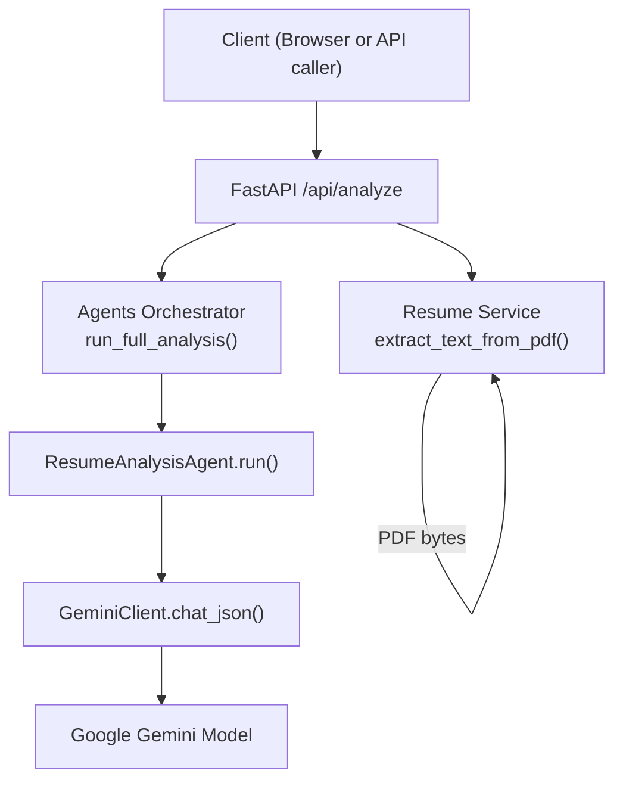
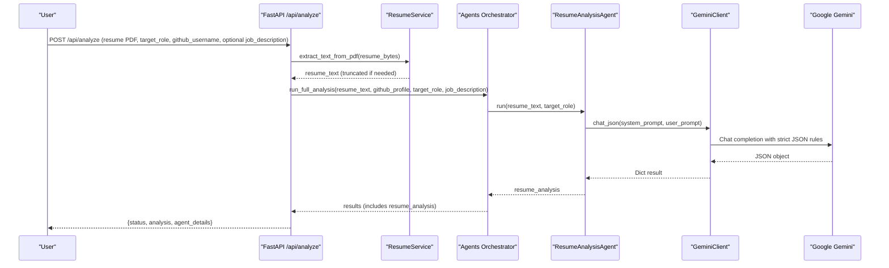
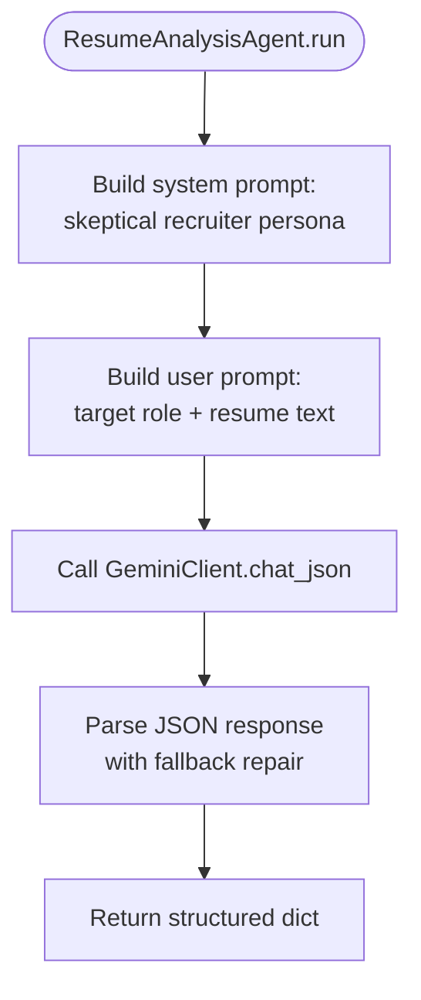
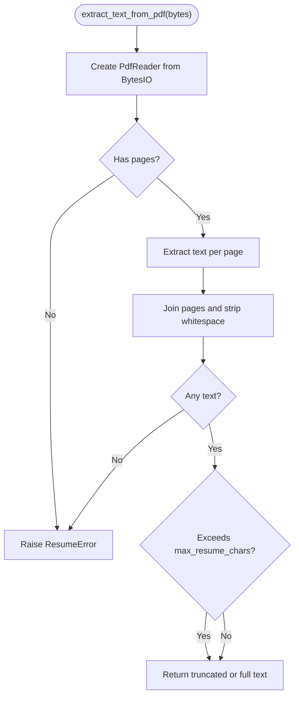
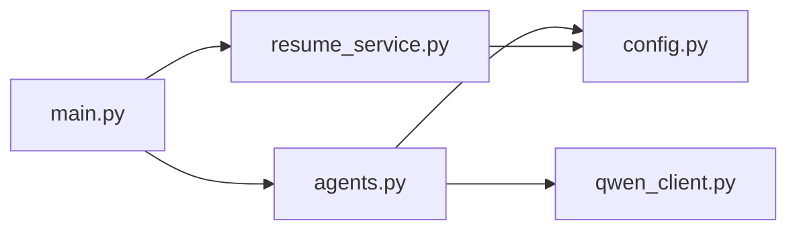

# Resume Analysis Agent

<cite>
**Referenced Files in This Document**
- [agents.py](file://src/agents.py)
- [resume_service.py](file://src/resume_service.py)
- [qwen_client.py](file://src/qwen_client.py)
- [config.py](file://src/config.py)
- [main.py](file://src/main.py)
- [README.md](file://README.md)
</cite>

## Update Summary
**Changes Made**
- Updated LLM integration from Qwen to Google Gemini for resume text extraction and skill identification
- Enhanced skeptical technical recruiter persona with precise and skeptical approach
- Improved ATS-focused analysis with explicit quality notes and keyword-oriented skill extraction
- Refined structured JSON output schema with specific field constraints
- Updated API orchestration to work with Gemini client instead of Qwen client
- Corrected model references throughout the documentation

## Table of Contents
1. [Introduction](#introduction)
2. [Project Structure](#project-structure)
3. [Core Components](#core-components)
4. [Architecture Overview](#architecture-overview)
5. [Detailed Component Analysis](#detailed-component-analysis)
6. [Dependency Analysis](#dependency-analysis)
7. [Performance Considerations](#performance-considerations)
8. [Troubleshooting Guide](#troubleshooting-guide)
9. [Conclusion](#conclusion)

## Introduction
The Resume Analysis Agent is the first stage of the CareerOS AI pipeline. It ingests a resume PDF, extracts plain text, and uses specialized prompt engineering with Google Gemini to produce a structured JSON profile of the candidate's claimed skills, experience, education, and quality notes. The agent adopts a skeptical technical recruiter persona to ensure only visible, resume-backed claims are reported. Its output becomes the baseline claim set that later stages cross-reference against GitHub evidence to distinguish verified from unverified skills.

## Project Structure
CareerOS AI is a FastAPI application with a multi-agent orchestration layer. The Resume Analysis Agent lives in the agents module and is invoked by the API endpoint after resume text extraction and optional GitHub data gathering.

**Diagram sources**
- [main.py:58-147](file://src/main.py#L58-L147)
- [resume_service.py:24-57](file://src/resume_service.py#L24-L57)
- [agents.py:295-334](file://src/agents.py#L295-L334)
- [qwen_client.py:97-157](file://src/qwen_client.py#L97-L157)

**Section sources**
- [main.py:58-147](file://src/main.py#L58-L147)
- [README.md:173-202](file://README.md#L173-L202)

## Core Components
- **Resume Analysis Agent**: Builds a system prompt positioning the model as a skeptical technical recruiter and a user prompt that includes the target role and resume text. It requests a strict JSON schema for consistent downstream processing using Google Gemini.
- **Resume Service**: Extracts text from uploaded PDFs, validates content, and truncates long resumes to control prompt size and cost.
- **Gemini Client**: Wraps the Google Gemini API through the google-generativeai SDK, enforces shared JSON output rules, and retries once if the response is not valid JSON.
- **Configuration**: Centralizes environment-driven settings such as model selection, token limits, timeouts, and resume size constraints.
- **API Endpoint**: Validates inputs, orchestrates evidence collection, runs the full agent pipeline, and returns both the headline report and per-agent outputs.

Key responsibilities:
- Enforce ATS-focused analysis via explicit resume quality notes and keyword-oriented skill extraction.
- Limit extracted skills to a maximum of 20 to keep outputs concise and actionable.
- Provide a compact professional summary, years-of-experience estimate, education line, and up to five experience highlights.

**Section sources**
- [agents.py:30-63](file://src/agents.py#L30-L63)
- [resume_service.py:24-57](file://src/resume_service.py#L24-L57)
- [qwen_client.py:31-67](file://src/qwen_client.py#L31-L67)
- [config.py:23-79](file://src/config.py#L23-L79)
- [main.py:58-147](file://src/main.py#L58-L147)

## Architecture Overview
The Resume Analysis Agent is part of a five-agent pipeline. In this stage, it produces the "claimed" profile that subsequent agents compare with GitHub-derived "verified" skills and job requirements.

**Diagram sources**
- [main.py:58-147](file://src/main.py#L58-L147)
- [resume_service.py:24-57](file://src/resume_service.py#L24-L57)
- [agents.py:295-334](file://src/agents.py#L295-L334)
- [qwen_client.py:97-157](file://src/qwen_client.py#L97-L157)

## Detailed Component Analysis

### Resume Analysis Agent
Purpose:
- Extract claimed skills, experience highlights, education, and a concise professional summary from resume text.
- Produce ATS-oriented quality notes to guide improvements.
- Constrain outputs to a fixed JSON schema for reliable downstream consumption.

Prompt design:
- System prompt positions the model as a senior technical recruiter who is precise and skeptical, reporting only skills visibly present in the resume.
- User prompt injects the target role context so the agent can tailor emphasis while still remaining grounded in the resume content.
- Output schema specifies fields: candidate_name, summary, years_of_experience, claimed_skills (up to 20), education, experience_highlights (up to 5), resume_quality_notes (up to 5).

Processing flow:
- The agent calls GeminiClient.chat_json with the system and user prompts.
- The client appends shared JSON rules to enforce single-object JSON responses without markdown or commentary.
- If the first response is invalid JSON, the client retries once with a repair message before raising an error.

**Diagram sources**
- [agents.py:30-63](file://src/agents.py#L30-L63)
- [qwen_client.py:97-157](file://src/qwen_client.py#L97-L157)

**Section sources**
- [agents.py:30-63](file://src/agents.py#L30-L63)
- [qwen_client.py:31-67](file://src/qwen_client.py#L31-L67)

### Resume Text Extraction and Truncation
Responsibilities:
- Read PDF bytes and extract text page-by-page using pypdf.
- Validate that pages exist and that text was successfully extracted.
- Truncate very long resumes to a configured character limit to manage prompt length and cost.

Error handling:
- Raises a domain-specific ResumeError for unreadable PDFs, empty pages, or image-only scans.
- The API layer converts these into HTTP 400 responses.

**Diagram sources**
- [resume_service.py:24-57](file://src/resume_service.py#L24-L57)

**Section sources**
- [resume_service.py:24-57](file://src/resume_service.py#L24-L57)

### Gemini Client and JSON Enforcement
Responsibilities:
- Wrap the Google Gemini API with consistent configuration from settings.
- Append shared JSON output rules to every system prompt to guarantee parseable JSON.
- Attempt one retry with a repair message if the initial response is not valid JSON.

Robustness:
- Catches network/auth errors and raises a typed GeminiError with actionable details.
- Extracts JSON even when wrapped in markdown fences or surrounded by chatter.

**Section sources**
- [qwen_client.py:31-67](file://src/qwen_client.py#L31-67)
- [qwen_client.py:97-157](file://src/qwen_client.py#L97-157)

### API Orchestration and Data Flow
Responsibilities:
- Validate inputs (PDF format, size, required fields).
- Extract resume text and fetch GitHub profile evidence.
- Run the full five-agent pipeline and return both the headline career report and per-agent outputs.

Integration points:
- Uses config settings for model, timeouts, and upload limits.
- Maps service exceptions to appropriate HTTP status codes.

**Section sources**
- [main.py:58-147](file://src/main.py#L58-147)
- [config.py:23-79](file://src/config.py#L23-79)

## Dependency Analysis
The Resume Analysis Agent depends on:
- Resume Service for PDF text extraction and truncation.
- Gemini Client for LLM interaction and JSON enforcement.
- Configuration for runtime parameters.
- API Layer for input validation and orchestration.

**Diagram sources**
- [main.py:17-21](file://src/main.py#L17-21)
- [agents.py:21-24](file://src/agents.py#L21-24)
- [resume_service.py:9-14](file://src/resume_service.py#L9-14)
- [qwen_client.py:18-24](file://src/qwen_client.py#L18-24)
- [config.py:11-20](file://src/config.py#L11-20)

**Section sources**
- [main.py:17-21](file://src/main.py#L17-21)
- [agents.py:21-24](file://src/agents.py#L21-24)
- [resume_service.py:9-14](file://src/resume_service.py#L9-14)
- [qwen_client.py:18-24](file://src/qwen_client.py#L18-24)
- [config.py:11-20](file://src/config.py#L11-20)

## Performance Considerations
- Resume truncation: Long resumes are truncated at a configurable character limit to reduce prompt size and cost while preserving key information.
- Token budgeting: The Gemini client respects configured max tokens; the Master agent explicitly sets a higher limit where needed.
- Retry logic: One retry on invalid JSON reduces failure rate without excessive overhead.
- Server threading: The FastAPI endpoint runs synchronously in a worker thread to avoid blocking during LLM calls.

## Troubleshooting Guide
Common issues and resolutions:
- Invalid or non-text PDF:
  - Symptom: Error indicating the file cannot be read as a PDF or contains no extractable text.
  - Cause: Scanned/image-only resumes or corrupted files.
  - Resolution: Upload a text-based PDF.
- Missing or misconfigured API key:
  - Symptom: 503 error stating the AI model is not configured.
  - Cause: GOOGLE_API_KEY not set in environment.
  - Resolution: Create .env with the correct key and restart the server.
- LLM JSON parsing failures:
  - Symptom: Errors about invalid JSON from the model.
  - Cause: Model returned malformed output.
  - Resolution: The client automatically retries once; if it fails again, check model settings and temperature.

Operational checks:
- Use the health endpoint to verify configuration and connectivity.
- Inspect agent_details in the API response to inspect raw outputs from each agent.

**Section sources**
- [resume_service.py:17-49](file://src/resume_service.py#L17-49)
- [main.py:100-131](file://src/main.py#L100-131)
- [qwen_client.py:120-157](file://src/qwen_client.py#L120-157)

## Conclusion
The Resume Analysis Agent establishes a rigorous, ATS-aware baseline of what a candidate claims from their resume. By enforcing a skeptical recruiter persona, constraining outputs to a strict JSON schema, and focusing on visible skills and quality notes, it creates a reliable foundation for later cross-referencing against GitHub evidence. This ensures that final assessments differentiate between claimed and proven capabilities, enabling more accurate readiness scoring and targeted development roadmaps. The integration with Google Gemini provides robust natural language processing capabilities for accurate resume analysis and skill identification.