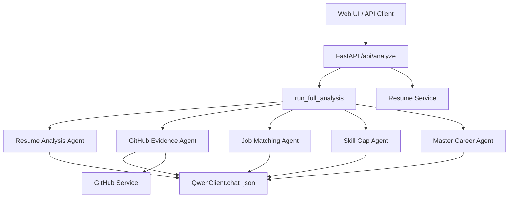
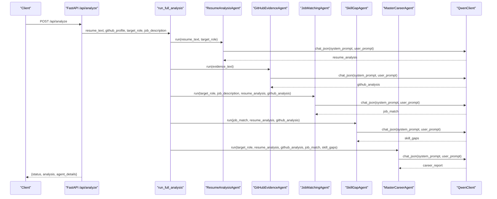
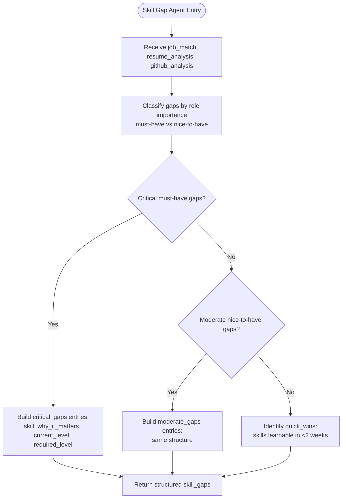
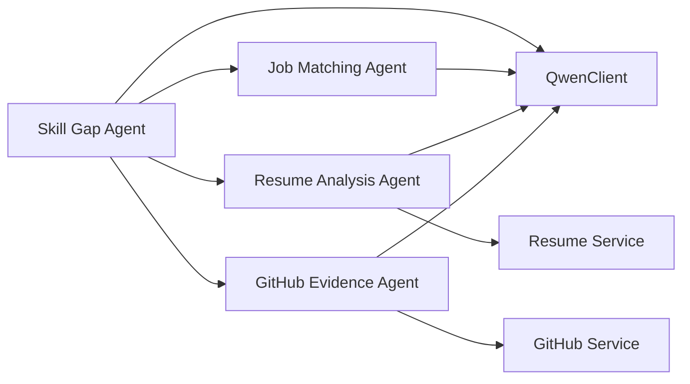

# Skill Gap Agent

<cite>
**Referenced Files in This Document**
- [agents.py](file://src/agents.py)
- [main.py](file://src/main.py)
- [config.py](file://src/config.py)
- [qwen_client.py](file://src/qwen_client.py)
- [github_service.py](file://src/github_service.py)
- [resume_service.py](file://src/resume_service.py)
- [test_pipeline.py](file://tests/test_pipeline.py)
- [README.md](file://README.md)
</cite>

## Table of Contents
1. [Introduction](#introduction)
2. [Project Structure](#project-structure)
3. [Core Components](#core-components)
4. [Architecture Overview](#architecture-overview)
5. [Detailed Component Analysis](#detailed-component-analysis)
6. [Dependency Analysis](#dependency-analysis)
7. [Performance Considerations](#performance-considerations)
8. [Troubleshooting Guide](#troubleshooting-guide)
9. [Conclusion](#conclusion)
10. [Appendices](#appendices)

## Introduction
This document explains the Skill Gap Agent within CareerOS AI, a multi-agent system that produces evidence-based career guidance. The Skill Gap Agent identifies and prioritizes competency gaps between what a role requires and what a candidate currently demonstrates through their resume and GitHub activity. It synthesizes outputs from earlier agents to create actionable development plans and contributes to the final career roadmap generated by the Master Career Agent.

The system positions the Skill Gap Agent as a career coach that provides specific, non-generic advice, converting identified gaps into concrete learning objectives with clear impact analysis and prioritization.

## Project Structure
CareerOS AI is organized around a FastAPI application that orchestrates five specialized agents: Resume Analyzer, GitHub Evidence, Job Matcher, Skill Gap Detector, and Master Career Agent. The Skill Gap Agent sits at the center of gap identification, receiving structured inputs from prior agents and producing a prioritized set of gaps and quick wins.

**Diagram sources**
- [main.py:58-147](file://src/main.py#L58-L147)
- [agents.py:295-335](file://src/agents.py#L295-L335)
- [qwen_client.py:97-157](file://src/qwen_client.py#L97-L157)
- [github_service.py:63-147](file://src/github_service.py#L63-L147)
- [resume_service.py:24-57](file://src/resume_service.py#L24-L57)

**Section sources**
- [README.md:173-257](file://README.md#L173-L257)
- [main.py:58-147](file://src/main.py#L58-L147)
- [agents.py:295-335](file://src/agents.py#L295-L335)

## Core Components
- Skill Gap Agent: Compares required skills (from Job Matching Agent) against claimed and verified skills (from Resume and GitHub Agents) to produce critical_gaps, moderate_gaps, and quick_wins.
- Job Matching Agent: Defines required skills for the target role and classifies them as must-have or nice-to-have.
- Resume Analysis Agent: Extracts claimed skills and experience from resume text.
- GitHub Evidence Agent: Derives verified skills from public GitHub activity.
- Master Career Agent: Synthesizes all agent outputs into a final report including readiness score, roadmap, and recommendations.

Key responsibilities of the Skill Gap Agent:
- Prioritize gaps based on role importance and hiring impact.
- Provide current vs required skill levels.
- Identify quick wins achievable in under two weeks.
- Convert gaps into concrete learning objectives via the Master Career Agent’s roadmap generation.

**Section sources**
- [agents.py:169-209](file://src/agents.py#L169-L209)
- [agents.py:109-163](file://src/agents.py#L109-L163)
- [agents.py:30-63](file://src/agents.py#L30-L63)
- [agents.py:69-103](file://src/agents.py#L69-L103)
- [agents.py:215-289](file://src/agents.py#L215-L289)

## Architecture Overview
The pipeline runs sequentially with parallelizable stages:
1. Resume Analysis and GitHub Evidence run independently.
2. Job Matching compares requirements against candidate profile.
3. Skill Gap Agent identifies and prioritizes gaps.
4. Master Career Agent synthesizes the final report and roadmap.

**Diagram sources**
- [main.py:58-147](file://src/main.py#L58-L147)
- [agents.py:295-335](file://src/agents.py#L295-L335)
- [qwen_client.py:97-157](file://src/qwen_client.py#L97-L157)

## Detailed Component Analysis

### Skill Gap Agent
Purpose:
- Compare role requirements with candidate’s claimed and verified skills.
- Produce critical_gaps, moderate_gaps, and quick_wins with structured fields.

System prompt positioning:
- Acts as a career coach focused on specific, actionable advice rather than generic guidance.

User prompt synthesis:
- Includes job_match output (required_skills with importance), resume_analysis.claimed_skills, and github_analysis.verified_skills.

Structured output:
- critical_gaps: list of missing must-have skills with why_it_matters, current_level, required_level.
- moderate_gaps: same structure for important but less critical gaps.
- quick_wins: skills learnable to a demonstrable level in under two weeks.

Prioritization methodology:
- Critical gaps are must-have skills where absence significantly impacts hiring chances.
- Moderate gaps are nice-to-have improvements that enhance competitiveness.
- Quick wins focus on rapid acquisition of demonstrable skills.

Development planning strategies:
- Each gap includes impact rationale and level targets to guide learning objectives.
- Quick wins provide immediate, high-visibility progress opportunities.

Conversion to learning objectives:
- The Master Career Agent uses these gaps to build a 30-day roadmap with weekly focuses, tasks, and outcomes, plus a recommended project to practice targeted skills.

**Diagram sources**
- [agents.py:169-209](file://src/agents.py#L169-L209)

**Section sources**
- [agents.py:169-209](file://src/agents.py#L169-L209)

### Job Matching Agent
Purpose:
- Define required skills for the target role and classify them as must-have or nice-to-have.
- Compute match percentage, matched skills, and missing skills.

Inputs:
- target_role, optional job_description, resume_analysis.claimed_skills, github_analysis.verified_skills.

Outputs:
- required_skills with importance labels, match_percentage, matched_skills, missing_skills, role_insights.

Role in Skill Gap Agent:
- Provides the authoritative requirement baseline used to identify critical vs moderate gaps.

**Section sources**
- [agents.py:109-163](file://src/agents.py#L109-L163)

### Resume Analysis Agent
Purpose:
- Extract claimed skills and experience from resume text.

Inputs:
- resume_text, target_role.

Outputs:
- candidate_name, summary, years_of_experience, claimed_skills, education, experience_highlights, resume_quality_notes.

Role in Skill Gap Agent:
- Supplies claimed_skills to contrast with verified_skills and required_skills.

**Section sources**
- [agents.py:30-63](file://src/agents.py#L30-L63)

### GitHub Evidence Agent
Purpose:
- Derive verified skills from public GitHub activity.

Inputs:
- github_evidence_text (structured summary of repositories, languages, topics).

Outputs:
- verified_skills with skill, evidence, confidence; activity_summary; project_quality_score; project_quality_notes; repo_highlights.

Role in Skill Gap Agent:
- Supplies verified_skills to validate claims and inform current_level assessments.

**Section sources**
- [agents.py:69-103](file://src/agents.py#L69-L103)

### Master Career Agent
Purpose:
- Synthesize all agent outputs into a final career intelligence report.

Inputs:
- target_role, resume_analysis, github_analysis, job_match, skill_gaps.

Outputs:
- career_readiness_score, score_breakdown, verified_skills, unverified_skills, strengths, skill_gaps, evidence, recommendations, roadmap_30_days, recommended_project, hiring_readiness_summary.

Role in Roadmap Generation:
- Converts skill_gaps into concrete weekly tasks and outcomes, ensuring alignment with identified gaps and quick wins.

**Section sources**
- [agents.py:215-289](file://src/agents.py#L215-L289)

## Dependency Analysis
The Skill Gap Agent depends on:
- Job Matching Agent for required_skills and importance classification.
- Resume Analysis Agent for claimed_skills.
- GitHub Evidence Agent for verified_skills.
- QwenClient for LLM calls with strict JSON output rules.
- Configuration for model settings and timeouts.

External integrations:
- GitHub REST API for evidence gathering.
- PDF extraction for resume content.

**Diagram sources**
- [agents.py:295-335](file://src/agents.py#L295-L335)
- [qwen_client.py:97-157](file://src/qwen_client.py#L97-L157)
- [github_service.py:63-147](file://src/github_service.py#L63-L147)
- [resume_service.py:24-57](file://src/resume_service.py#L24-L57)

**Section sources**
- [agents.py:295-335](file://src/agents.py#L295-L335)
- [qwen_client.py:97-157](file://src/qwen_client.py#L97-L157)
- [github_service.py:63-147](file://src/github_service.py#L63-L147)
- [resume_service.py:24-57](file://src/resume_service.py#L24-L57)

## Performance Considerations
- The pipeline executes LLM calls sequentially across agents; each call can take several seconds.
- QwenClient enforces shared JSON output rules and retries once if formatting fails.
- GitHub API rate limits apply without a token; configure GITHUB_TOKEN to increase limits.
- Resume size is truncated to control prompt length and cost.

Optimization tips:
- Use appropriate QWEN_MODEL and temperature settings for balance between speed and quality.
- Ensure valid input data to minimize retries and errors.
- Monitor timeout settings for external services.

[No sources needed since this section provides general guidance]

## Troubleshooting Guide
Common issues and resolutions:
- Missing Qwen API key: Configure DASHSCOPE_API_KEY in .env; health endpoint indicates configuration status.
- Invalid resume file: Upload a text-based PDF; scanned/image-only resumes are not supported.
- GitHub API failures: Check username validity and rate limits; add GITHUB_TOKEN to raise limits.
- Invalid JSON from LLM: QwenClient attempts one repair call; ensure prompts adhere to output rules.

Error handling paths:
- main.py raises HTTP exceptions for validation and service errors.
- QwenClient wraps OpenAI errors into QwenError with descriptive messages.
- GitHubService and ResumeService raise domain-specific exceptions for user-facing feedback.

**Section sources**
- [main.py:74-131](file://src/main.py#L74-L131)
- [qwen_client.py:27-39](file://src/qwen_client.py#L27-L39)
- [qwen_client.py:120-157](file://src/qwen_client.py#L120-L157)
- [github_service.py:48-60](file://src/github_service.py#L48-L60)
- [resume_service.py:17-57](file://src/resume_service.py#L17-L57)

## Conclusion
The Skill Gap Agent is central to CareerOS AI’s ability to transform raw resume and GitHub data into prioritized, actionable development plans. By synthesizing role requirements with demonstrated skills, it distinguishes critical must-have gaps from nice-to-have improvements and identifies quick wins for rapid progress. Its structured outputs feed directly into the Master Career Agent, which converts gaps into concrete learning objectives and a time-bound roadmap, laying the foundation for the final career roadmap generation.

[No sources needed since this section summarizes without analyzing specific files]

## Appendices

### Example Gap Analysis and Development Planning Strategies
- Critical gaps: Focus on must-have skills with significant hiring impact; define current vs required levels and explain why they matter.
- Moderate gaps: Address nice-to-have skills that improve competitiveness; include impact rationale and level targets.
- Quick wins: Identify skills that can be learned quickly to demonstrate competence; prioritize those with visible portfolio value.

These strategies align with the agent’s structured outputs and inform the Master Career Agent’s roadmap construction.

[No sources needed since this section provides conceptual guidance]

### System Prompt Positioning
- The Skill Gap Agent’s system prompt positions it as a career coach providing specific, non-generic advice.
- The Master Career Agent emphasizes evidence-based synthesis, distinguishing verified from unverified skills and maintaining realistic, encouraging tone.

**Section sources**
- [agents.py:183-187](file://src/agents.py#L183-L187)
- [agents.py:231-238](file://src/agents.py#L231-L238)

### Structured Output Reference
- critical_gaps: skill, why_it_matters, current_level, required_level.
- moderate_gaps: same structure.
- quick_wins: list of rapidly learnable skills.

These fields ensure consistent, machine-readable outputs consumed by downstream components.

**Section sources**
- [agents.py:200-207](file://src/agents.py#L200-L207)

### End-to-End Flow Validation
Tests verify the full pipeline order and expected outputs, including Skill Gap Agent execution and final report structure.

**Section sources**
- [test_pipeline.py:141-203](file://tests/test_pipeline.py#L141-L203)