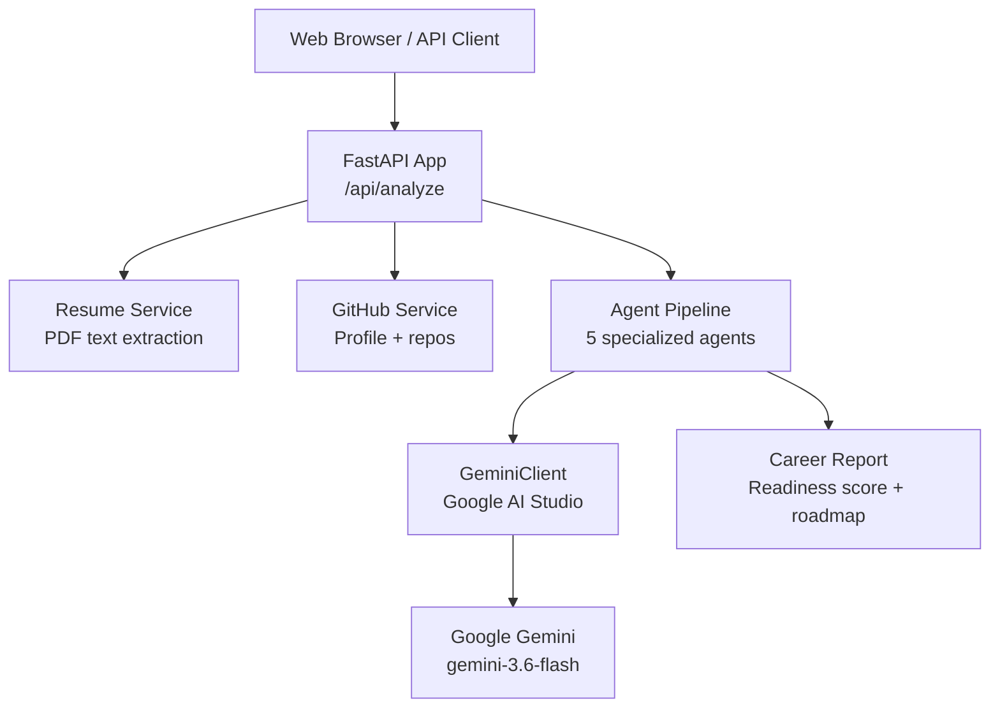
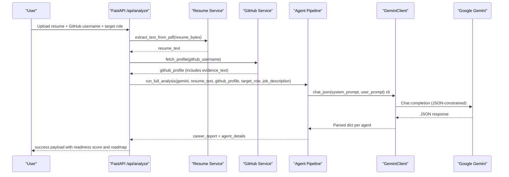
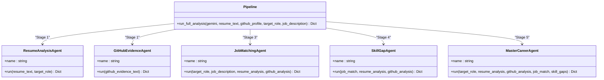
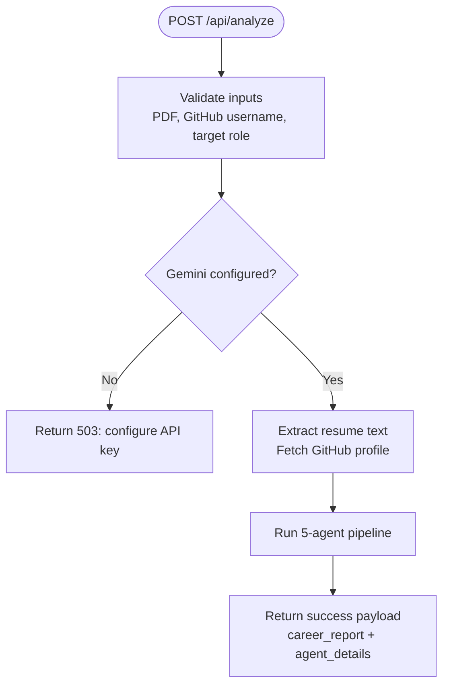
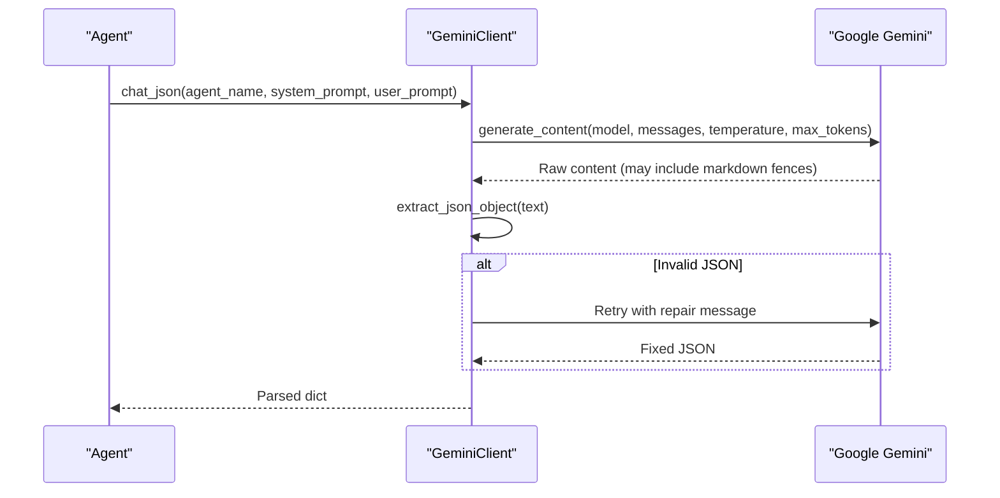
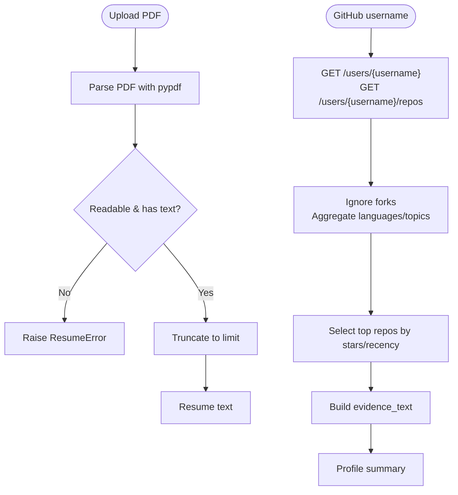
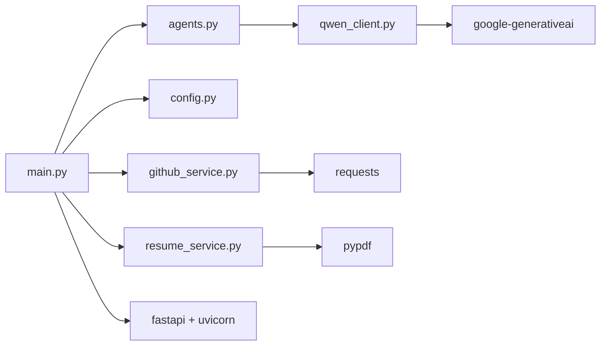

# Project Overview

<cite>
**Referenced Files in This Document**
- [README.md](file://README.md)
- [main.py](file://src/main.py)
- [agents.py](file://src/agents.py)
- [config.py](file://src/config.py)
- [qwen_client.py](file://src/qwen_client.py)
- [github_service.py](file://src/github_service.py)
- [resume_service.py](file://src/resume_service.py)
- [test_pipeline.py](file://tests/test_pipeline.py)
- [requirements.txt](file://requirements.txt)
</cite>

## Update Summary
**Changes Made**
- Updated to reflect complete transformation from basic placeholder to fully functional multi-agent career intelligence platform
- Enhanced documentation of the five specialized AI agents system
- Added comprehensive coverage of FastAPI web application architecture
- Documented evidence-based assessment system with GitHub verification
- Updated technical details for the Gemini LLM integration
- Enhanced practical examples and use cases

## Table of Contents
1. [Introduction](#introduction)
2. [Project Structure](#project-structure)
3. [Core Components](#core-components)
4. [Architecture Overview](#architecture-overview)
5. [Detailed Component Analysis](#detailed-component-analysis)
6. [Dependency Analysis](#dependency-analysis)
7. [Performance Considerations](#performance-considerations)
8. [Troubleshooting Guide](#troubleshooting-guide)
9. [Conclusion](#conclusion)
10. [Appendices](#appendices)

## Introduction
CareerOS AI is a sophisticated multi-agent career intelligence platform that provides evidence-based assessment and objective, data-driven career guidance. The platform revolutionizes traditional subjective career advice by analyzing real artifacts—your resume and your public GitHub activity—and matching them against target job requirements to produce verified skill profiles, personalized learning roadmaps, and comprehensive career readiness scoring.

The core mission addresses a critical problem: **78% of students don't understand their real skill gaps**. CareerOS AI solves this through a revolutionary approach that combines resume analysis, GitHub verification, job market matching, and skill gap detection within a robust multi-agent system powered by Google Gemini AI.

### Key Problem Solved
- **Subjective Advice Gap**: Traditional career guidance relies on opinions rather than data
- **Skill Verification Challenge**: Resume claims cannot be validated without examining actual work
- **Market Mismatch**: Candidates often lack awareness of what employers truly require
- **Learning Path Uncertainty**: Students struggle to identify which skills to prioritize

### Evidence-Based Solution
CareerOS AI transforms career guidance from subjective opinion to objective insight by:
- Extracting claimed skills from resumes with ATS optimization analysis
- Verifying those skills through actual code repositories on GitHub
- Matching candidate profiles against market-standard or provided job descriptions
- Identifying precise skill gaps with prioritized recommendations
- Synthesizing all insights into actionable, evidence-backed career reports

**Section sources**
- [README.md:15-31](file://README.md#L15-L31)
- [README.md:24-31](file://README.md#L24-L31)

## Project Structure
CareerOS AI is organized around a FastAPI backend that exposes a single analysis endpoint and serves a lightweight web UI. The application integrates three primary services:
- Resume text extraction from PDFs using PyPDF
- GitHub profile evidence retrieval via REST API
- Google Gemini LLM calls through an OpenAI-compatible client

At runtime, the API layer orchestrates a five-agent pipeline that produces a comprehensive career report with evidence-based scoring and personalized recommendations.

**Diagram sources**
- [main.py:28-147](file://src/main.py#L28-L147)
- [agents.py:295-335](file://src/agents.py#L295-L335)
- [qwen_client.py:74-161](file://src/qwen_client.py#L74-L161)
- [github_service.py:63-147](file://src/github_service.py#L63-L147)
- [resume_service.py:24-58](file://src/resume_service.py#L24-L58)

**Section sources**
- [README.md:173-202](file://README.md#L173-L202)
- [main.py:28-147](file://src/main.py#L28-L147)

## Core Components
CareerOS AI's power comes from its sophisticated multi-agent architecture:

### Multi-Agent System
Five specialized AI agents collaborate to provide comprehensive career analysis:
- **Resume Analysis Agent**: Extracts claimed skills, experience, and quality notes from resume text
- **GitHub Evidence Agent**: Derives verified skills from public repository activity and project quality indicators  
- **Job Matching Agent**: Compares required skills for target roles against candidate's claimed and verified skills
- **Skill Gap Agent**: Identifies critical and moderate gaps with impact-focused reasoning
- **Master Career Agent**: Synthesizes all outputs into final report with career readiness scoring

### Evidence-Based Assessment
Skills are only considered verified when both resume claims and GitHub activity align, ensuring objective assessment rather than self-reported information.

### Career Readiness Scoring
A composite score (0–100) reflects resume quality, evidence strength, job match, and skill coverage across multiple dimensions.

### Personalized Roadmap
Actionable weekly milestones and project recommendations tailored to close identified gaps with specific learning paths.

**Section sources**
- [agents.py:1-19](file://src/agents.py#L1-L19)
- [agents.py:215-289](file://src/agents.py#L215-L289)
- [README.md:37-52](file://README.md#L37-L52)

## Architecture Overview
CareerOS AI uses a layered architecture designed for reliability, scalability, and evidence-based analysis:

### Layered Design
- **API Layer**: Validates inputs, gathers evidence, and returns structured results
- **Services Layer**: Handles resume parsing and GitHub data fetching with error handling
- **Agent Layer**: Orchestrates the five-agent pipeline using structured prompts and JSON outputs
- **LLM Integration**: Uses Google Gemini via dedicated client with strict JSON output rules and retry logic

**Diagram sources**
- [main.py:58-147](file://src/main.py#L58-L147)
- [agents.py:295-335](file://src/agents.py#L295-L335)
- [qwen_client.py:98-161](file://src/qwen_client.py#L98-L161)
- [github_service.py:63-147](file://src/github_service.py#L63-L147)
- [resume_service.py:24-58](file://src/resume_service.py#L24-L58)

## Detailed Component Analysis

### Multi-Agent System Architecture
The platform employs five specialized agents, each with distinct responsibilities and structured outputs:

#### Agent 1: Resume Analysis Agent
Extracts claimed skills, experience, and quality notes from resume text using ATS optimization principles. Analyzes professional summaries, education, experience highlights, and provides improvement suggestions.

#### Agent 2: GitHub Evidence Agent  
Derives verified skills from real GitHub activity, distinguishing genuine skill evidence (real repositories, languages, consistent pushes, quality projects) from noise (forks, empty repos). Provides confidence levels for each verified skill.

#### Agent 3: Job Matching Agent
Compares required skills for target roles (from market standards or provided job descriptions) against candidate's claimed and verified skills. Calculates match percentages and identifies specific skill gaps.

#### Agent 4: Skill Gap Agent
Identifies critical and moderate gaps with impact-focused reasoning. Categorizes gaps by severity and provides quick wins for rapid skill acquisition.

#### Agent 5: Master Career Agent
Synthesizes all outputs into final report including career readiness scoring, strengths, gaps, evidence, recommendations, and a 30-day roadmap with weekly focuses.

**Diagram sources**
- [agents.py:30-63](file://src/agents.py#L30-L63)
- [agents.py:69-103](file://src/agents.py#L69-L103)
- [agents.py:109-163](file://src/agents.py#L109-L163)
- [agents.py:169-209](file://src/agents.py#L169-L209)
- [agents.py:215-289](file://src/agents.py#L215-L289)
- [agents.py:295-335](file://src/agents.py#L295-L335)

**Section sources**
- [agents.py:1-335](file://src/agents.py#L1-L335)

### API Layer and Orchestration
The FastAPI application validates inputs, enforces constraints (e.g., PDF-only uploads), gathers evidence from resume and GitHub services, and runs the agent pipeline. It returns both a headline career report and detailed agent outputs for transparency.

**Diagram sources**
- [main.py:58-147](file://src/main.py#L58-L147)
- [config.py:69-72](file://src/config.py#L69-L72)

**Section sources**
- [main.py:58-147](file://src/main.py#L58-L147)

### LLM Integration and JSON Enforcement
The Gemini client wraps the Google AI Studio API, enforces strict JSON output rules, and includes a repair loop to recover valid JSON if the first attempt fails. This ensures reliable downstream parsing across all agents.

**Diagram sources**
- [qwen_client.py:98-161](file://src/qwen_client.py#L98-L161)

**Section sources**
- [qwen_client.py:1-161](file://src/qwen_client.py#L1-L161)

### Data Sources: Resume and GitHub Services
- **Resume Service**: Extracts plain text from uploaded PDFs, handles errors (non-PDF, empty pages, scanned images), and truncates long texts to control cost and latency.
- **GitHub Service**: Fetches public profile and repositories, filters forks, aggregates languages and topics, selects top repositories by stars and recency, and builds a compact evidence text for the LLM.

**Diagram sources**
- [resume_service.py:24-58](file://src/resume_service.py#L24-L58)
- [github_service.py:63-147](file://src/github_service.py#L63-L147)

**Section sources**
- [resume_service.py:1-58](file://src/resume_service.py#L1-L58)
- [github_service.py:1-173](file://src/github_service.py#L1-L173)

### Configuration and Environment Management
Configuration is centralized and loaded from environment variables, including API keys, model selection, timeouts, upload limits, and server settings. This keeps secrets out of source and supports flexible deployment.

Key configuration areas:
- **Gemini Integration**: API key, model selection (default: gemini-3.6-flash), temperature, tokens, timeout
- **GitHub Integration**: Optional token for increased rate limits, timeouts, repo limits
- **Upload Limits**: Resume size (default 10MB) and character caps (default 12,000 chars)
- **Server Settings**: Host and port configuration

**Section sources**
- [config.py:1-72](file://src/config.py#L1-L72)

## Dependency Analysis
CareerOS AI depends on a focused set of libraries optimized for career intelligence:

### Core Dependencies
- **FastAPI and Uvicorn**: Web framework and ASGI server for high-performance API
- **Google Generative AI SDK**: Official interface to Google Gemini models
- **Requests**: HTTP client for GitHub REST API calls
- **PyPDF**: PDF text extraction for resume processing
- **Python-dotenv**: Environment variable management
- **Pydantic**: Data validation (used indirectly by FastAPI)

**Diagram sources**
- [main.py:11-21](file://src/main.py#L11-L21)
- [agents.py:21-24](file://src/agents.py#L21-L24)
- [qwen_client.py:22-28](file://src/qwen_client.py#L22-L28)
- [github_service.py:12-17](file://src/github_service.py#L12-L17)
- [resume_service.py:9-14](file://src/resume_service.py#L9-L14)
- [requirements.txt:1-8](file://requirements.txt#L1-L8)

**Section sources**
- [requirements.txt:1-8](file://requirements.txt#L1-L8)

## Performance Considerations
CareerOS AI is designed for optimal performance while maintaining accuracy:

### Analysis Performance
- **End-to-end runtime**: Typically 15-20 seconds for full pipeline execution
- **Sequential processing**: Five LLM calls executed in dependency order
- **Concurrent design**: FastAPI runs sync endpoints in worker threads to avoid blocking

### Resource Optimization
- **Token efficiency**: Resume text truncated to configurable limits (default 12,000 characters)
- **Model selection**: Optimized for balance between accuracy and speed (gemini-3.6-flash)
- **GitHub caching**: Top repositories selected by stars and recency to minimize API calls

### Scalability Considerations
- **Rate limiting**: GitHub API rate limits handled with optional personal access tokens
- **Error recovery**: Retry logic for LLM calls with JSON validation
- **Memory management**: Streaming responses and efficient data structures

Optimization opportunities:
- Parallelize independent agent stages where safe (resume and GitHub evidence analysis)
- Implement response caching for frequent GitHub usernames
- Add exponential backoff for transient network failures
- Consider async endpoints for improved throughput at scale

## Troubleshooting Guide
Common issues and their resolutions:

### Configuration Issues
- **Missing Gemini API key**: Ensure GOOGLE_API_KEY is set in .env file; health endpoint reports configuration status
- **Invalid model name**: Verify GEMINI_MODEL environment variable points to valid Gemini model
- **GitHub rate limits**: Add GITHUB_TOKEN to increase limits from 60 to 5000 requests/hour

### Input Validation Errors
- **Invalid resume file**: Only text-based PDFs supported; scanned/image-only PDFs raise specific errors
- **Empty or malformed LLM output**: Client includes repair loop; persistent failures indicate model or prompt issues
- **Invalid GitHub username**: Username must be publicly accessible and properly formatted

### Operational Checks
- Use GET /health to verify service status and configuration flags
- Inspect agent_details in API response to isolate problematic stages
- Monitor error logs for network connectivity and API quota issues

**Section sources**
- [main.py:45-55](file://src/main.py#L45-L55)
- [main.py:100-107](file://src/main.py#L100-L107)
- [github_service.py:48-60](file://src/github_service.py#L48-L60)
- [resume_service.py:24-58](file://src/resume_service.py#L24-L58)
- [qwen_client.py:120-161](file://src/qwen_client.py#L120-L161)

## Conclusion
CareerOS AI represents a significant advancement in career guidance technology, transforming subjective advice into evidence-based insights through sophisticated multi-agent AI analysis. By combining resume analysis, GitHub verification, job market matching, and skill gap detection within a robust architecture, it delivers comprehensive career readiness assessments and actionable development plans.

The platform's unique value proposition lies in its ability to move beyond generic career advice to provide personalized, data-driven guidance that helps candidates understand their true market position and develop targeted strategies for career advancement. With its modular architecture, comprehensive testing, and focus on evidence-based assessment, CareerOS AI provides a solid foundation for helping individuals make informed decisions about their professional development.

## Appendices

### Practical Use Cases
CareerOS AI serves multiple user scenarios:

#### Resume Analysis
Upload a PDF to extract claimed skills and receive ATS-oriented improvement notes with specific enhancement recommendations.

#### GitHub Verification  
Provide a public GitHub username to validate skills with real repository evidence, demonstrating actual coding ability beyond resume claims.

#### Job Matching
Enter a target role (and optionally a job description) to compare required skills against your profile and identify missing competencies with prioritized learning paths.

#### Roadmap Generation
Receive a 30-day plan with weekly focuses, tasks, and outcomes tailored to close identified gaps with measurable progress markers.

**Section sources**
- [README.md:153-169](file://README.md#L153-L169)
- [README.md:286-326](file://README.md#L286-L326)

### Testing and Validation
Comprehensive offline tests validate system reliability without requiring API keys or network access:

#### Test Coverage Areas
- **JSON extraction robustness**: Handles various LLM output formats including markdown fences and chatter
- **Gemini client initialization**: Validates API key requirements and configuration
- **GitHub profile summary construction**: Tests repository filtering, language aggregation, and evidence text generation
- **Resume service error paths**: Validates PDF parsing, empty file handling, and text extraction failures
- **Full agent pipeline execution**: Verifies correct agent ordering and data flow through the complete analysis process

#### Test Execution
Run tests without API keys or network access to ensure stability and reliability of core functionality.

**Section sources**
- [test_pipeline.py:1-207](file://tests/test_pipeline.py#L1-L207)

### Technology Stack Details
CareerOS AI leverages modern, well-supported technologies:

#### Backend Framework
- **FastAPI**: High-performance web framework with automatic API documentation
- **Uvicorn**: Production-ready ASGI server for serving the application
- **Python 3.9+**: Modern Python features and performance improvements

#### AI and Machine Learning
- **Google Gemini**: State-of-the-art AI models via google-generativeai SDK
- **Custom Multi-Agent System**: Five specialized agents with structured prompts and JSON outputs
- **Model Selection**: gemini-3.6-flash for optimal balance of capability and cost

#### Data Processing
- **PyPDF**: Reliable PDF text extraction for resume processing
- **Requests**: Robust HTTP client for GitHub API interactions
- **Python-dotenv**: Secure environment variable management

#### Frontend Interface
- **Single-page HTML**: Lightweight, no-build-step frontend served directly by FastAPI
- **Responsive Design**: Mobile-friendly interface for accessibility
- **Real-time Feedback**: Immediate response to user inputs and analysis progress