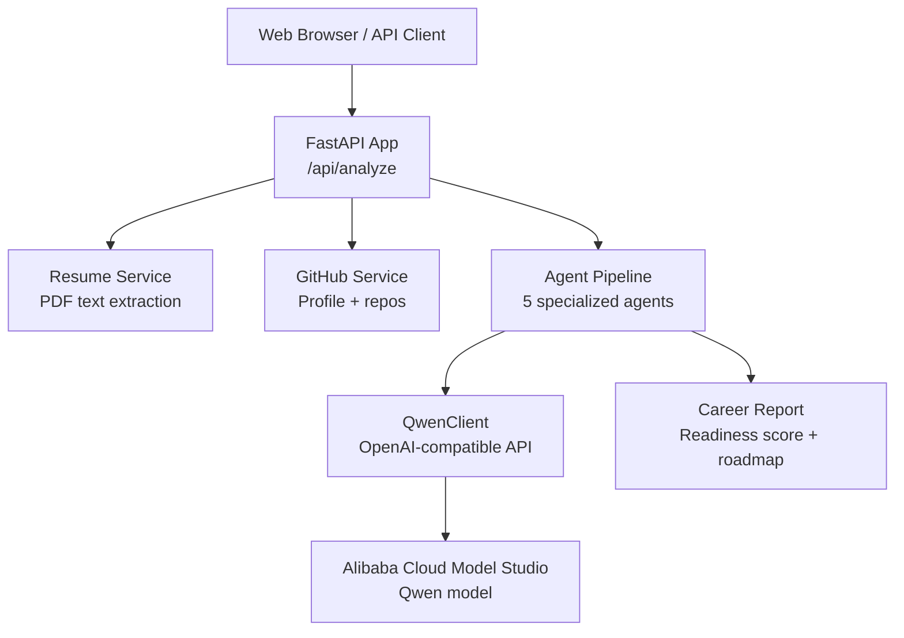
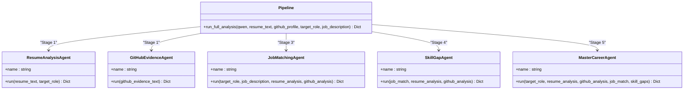
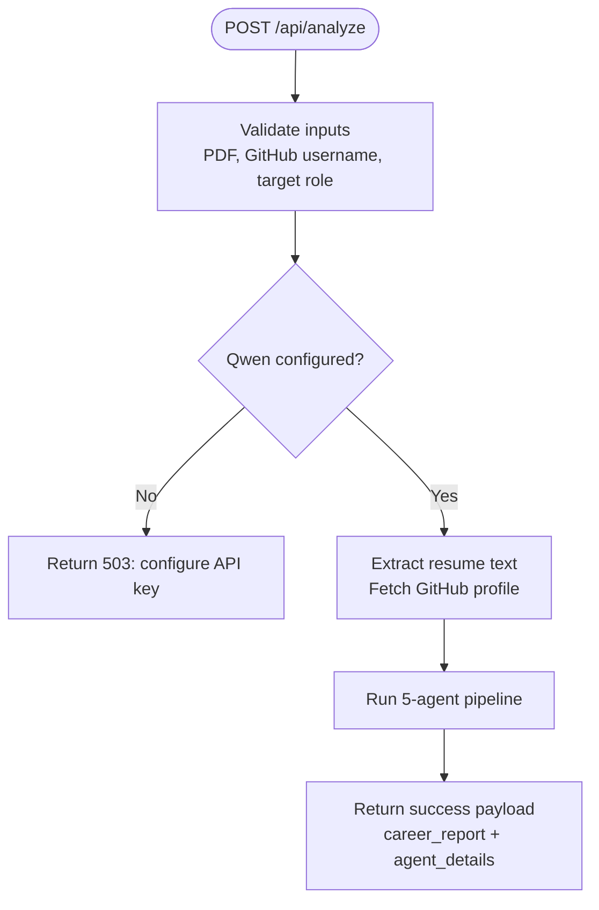
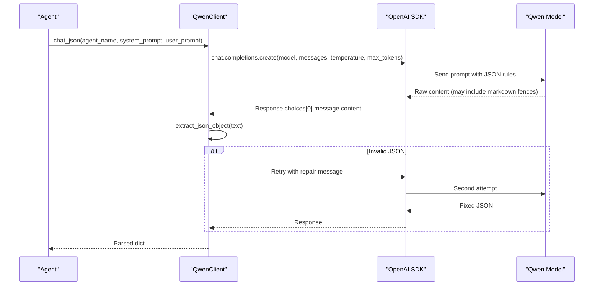
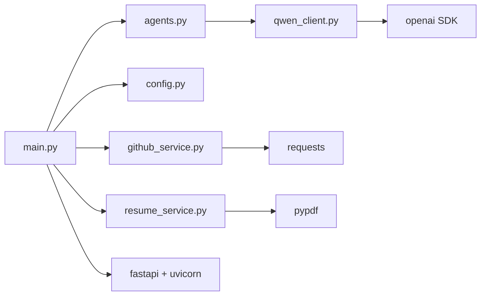

# Project Overview

<cite>
**Referenced Files in This Document**
- [README.md](file://README.md)
- [main.py](file://src/main.py)
- [agents.py](file://src/agents.py)
- [config.py](file://src/config.py)
- [qwen_client.py](file://src/qwen_client.py)
- [github_service.py](file://src/github_service.py)
- [resume_service.py](file://src/resume_service.py)
- [test_pipeline.py](file://tests/test_pipeline.py)
- [requirements.txt](file://requirements.txt)
</cite>

## Table of Contents
1. [Introduction](#introduction)
2. [Project Structure](#project-structure)
3. [Core Components](#core-components)
4. [Architecture Overview](#architecture-overview)
5. [Detailed Component Analysis](#detailed-component-analysis)
6. [Dependency Analysis](#dependency-analysis)
7. [Performance Considerations](#performance-considerations)
8. [Troubleshooting Guide](#troubleshooting-guide)
9. [Conclusion](#conclusion)
10. [Appendices](#appendices)

## Introduction
CareerOS AI is a multi-agent career intelligence platform that provides evidence-based assessment and objective, data-driven career guidance. It moves beyond subjective advice by analyzing real artifacts—your resume and your public GitHub activity—and matching them against target job requirements to produce a verified skill profile, personalized learning roadmap, and a career readiness scoring system.

The core mission is to solve the problem that 78% of students do not understand their real skill gaps. CareerOS AI addresses this by:
- Extracting claimed skills from resumes
- Verifying those skills through actual code repositories on GitHub
- Matching candidate profiles against market-standard or provided job descriptions
- Identifying precise skill gaps with prioritized recommendations
- Synthesizing all insights into an actionable, evidence-backed career report

This approach replaces guesswork with measurable signals, enabling candidates to focus on what truly matters for employability.

**Section sources**
- [README.md:15-31](file://README.md#L15-L31)

## Project Structure
CareerOS AI is organized around a FastAPI backend that exposes a single analysis endpoint and serves a lightweight web UI. The application integrates three primary services:
- Resume text extraction from PDFs
- GitHub profile evidence retrieval
- Qwen LLM calls via an OpenAI-compatible client

At runtime, the API layer orchestrates a five-agent pipeline that produces a comprehensive career report.

**Diagram sources**
- [main.py:28-147](file://src/main.py#L28-L147)
- [agents.py:295-335](file://src/agents.py#L295-L335)
- [qwen_client.py:70-158](file://src/qwen_client.py#L70-L158)
- [github_service.py:63-147](file://src/github_service.py#L63-L147)
- [resume_service.py:24-58](file://src/resume_service.py#L24-L58)

**Section sources**
- [README.md:173-202](file://README.md#L173-L202)
- [main.py:28-147](file://src/main.py#L28-L147)

## Core Components
- Multi-agent system: Five specialized agents collaborate to analyze resumes, verify GitHub evidence, match jobs, detect skill gaps, and synthesize a final report.
- Evidence-based assessment: Skills are only considered verified when both resume claims and GitHub activity align.
- Career readiness scoring: A composite score (0–100) reflects resume quality, evidence strength, job match, and skill coverage.
- Personalized roadmap: Actionable weekly milestones and project recommendations tailored to close identified gaps.

These components work together to deliver objective, data-driven career guidance rather than generic advice.

**Section sources**
- [agents.py:1-19](file://src/agents.py#L1-L19)
- [agents.py:215-289](file://src/agents.py#L215-L289)
- [README.md:37-52](file://README.md#L37-L52)

## Architecture Overview
CareerOS AI uses a layered architecture:
- API Layer: Validates inputs, gathers evidence, and returns results.
- Services Layer: Handles resume parsing and GitHub data fetching.
- Agent Layer: Orchestrates the five-agent pipeline using structured prompts and JSON outputs.
- LLM Integration: Uses Qwen via an OpenAI-compatible client with strict JSON output rules and retry logic.

**Diagram sources**
- [main.py:58-147](file://src/main.py#L58-L147)
- [agents.py:295-335](file://src/agents.py#L295-L335)
- [qwen_client.py:97-158](file://src/qwen_client.py#L97-L158)
- [github_service.py:63-147](file://src/github_service.py#L63-L147)
- [resume_service.py:24-58](file://src/resume_service.py#L24-L58)

## Detailed Component Analysis

### Multi-Agent System
The platform employs five specialized agents:
- Resume Analysis Agent: Extracts claimed skills, experience, and quality notes from resume text.
- GitHub Evidence Agent: Derives verified skills from public repository activity and project quality indicators.
- Job Matching Agent: Compares required skills for a target role (from market standards or provided job description) against candidate’s claimed and verified skills.
- Skill Gap Agent: Identifies critical and moderate gaps, plus quick wins, with impact-focused reasoning.
- Master Career Agent: Synthesizes all outputs into a final report including career readiness scoring, strengths, gaps, evidence, recommendations, and a 30-day roadmap.

**Diagram sources**
- [agents.py:30-63](file://src/agents.py#L30-L63)
- [agents.py:69-103](file://src/agents.py#L69-L103)
- [agents.py:109-163](file://src/agents.py#L109-L163)
- [agents.py:169-209](file://src/agents.py#L169-L209)
- [agents.py:215-289](file://src/agents.py#L215-L289)
- [agents.py:295-335](file://src/agents.py#L295-L335)

**Section sources**
- [agents.py:1-335](file://src/agents.py#L1-L335)

### API Layer and Orchestration
The FastAPI app validates inputs, enforces constraints (e.g., PDF-only uploads), gathers evidence from resume and GitHub services, and runs the agent pipeline. It returns both a headline career report and detailed agent outputs for transparency.

**Diagram sources**
- [main.py:58-147](file://src/main.py#L58-L147)
- [config.py:76-79](file://src/config.py#L76-L79)

**Section sources**
- [main.py:58-147](file://src/main.py#L58-L147)

### LLM Integration and JSON Enforcement
The Qwen client wraps the OpenAI-compatible API, enforces strict JSON output rules, and includes a repair loop to recover valid JSON if the first attempt fails. This ensures reliable downstream parsing across all agents.

**Diagram sources**
- [qwen_client.py:31-68](file://src/qwen_client.py#L31-L68)
- [qwen_client.py:97-158](file://src/qwen_client.py#L97-L158)

**Section sources**
- [qwen_client.py:1-158](file://src/qwen_client.py#L1-L158)

### Data Sources: Resume and GitHub
- Resume Service: Extracts plain text from uploaded PDFs, handles errors (non-PDF, empty pages, scanned images), and truncates long texts to control cost and latency.
- GitHub Service: Fetches public profile and repositories, filters forks, aggregates languages and topics, selects top repositories by stars and recency, and builds a compact evidence text for the LLM.

**Diagram sources**
- [resume_service.py:24-58](file://src/resume_service.py#L24-L58)
- [github_service.py:63-147](file://src/github_service.py#L63-L147)

**Section sources**
- [resume_service.py:1-58](file://src/resume_service.py#L1-L58)
- [github_service.py:1-173](file://src/github_service.py#L1-L173)

### Configuration and Environment
Configuration is centralized and loaded from environment variables, including API keys, model selection, timeouts, upload limits, and server settings. This keeps secrets out of source and supports flexible deployment.

Key configuration areas:
- Qwen integration: API key, base URL, model, temperature, tokens, timeout
- GitHub integration: optional token, timeouts, repo limits
- Upload limits: resume size and character caps
- Server: host and port

**Section sources**
- [config.py:1-79](file://src/config.py#L1-L79)

## Dependency Analysis
CareerOS AI depends on:
- FastAPI and Uvicorn for the web server and API
- OpenAI SDK to call Qwen via Alibaba Cloud Model Studio
- Requests for GitHub REST API calls
- PyPDF for resume text extraction
- python-dotenv for environment loading
- Pydantic for validation (used indirectly by FastAPI)

**Diagram sources**
- [main.py:11-21](file://src/main.py#L11-L21)
- [agents.py:21-24](file://src/agents.py#L21-L24)
- [qwen_client.py:18-24](file://src/qwen_client.py#L18-L24)
- [github_service.py:12-17](file://src/github_service.py#L12-L17)
- [resume_service.py:9-14](file://src/resume_service.py#L9-L14)
- [requirements.txt:1-8](file://requirements.txt#L1-L8)

**Section sources**
- [requirements.txt:1-8](file://requirements.txt#L1-L8)

## Performance Considerations
- Analysis time: The full pipeline involves multiple LLM calls; typical end-to-end runtime is on the order of tens of seconds due to sequential agent stages and network latency.
- Concurrency: The API endpoint is synchronous by design; FastAPI runs it in a worker thread to avoid blocking the event loop during long LLM calls.
- Token and cost controls: Resume text is truncated to a configurable limit; models and token counts are configurable to balance accuracy and cost.
- GitHub rate limits: An optional personal access token increases the rate limit significantly; error handling surfaces clear guidance when limits are reached.

Optimization opportunities:
- Parallelize independent agent stages where safe (e.g., resume and GitHub evidence can be analyzed concurrently).
- Cache frequent GitHub summaries for repeated usernames.
- Implement retries with exponential backoff for transient network failures.
- Stream responses or use async endpoints for improved throughput at scale.

[No sources needed since this section provides general guidance]

## Troubleshooting Guide
Common issues and resolutions:
- Missing or invalid Qwen API key: Ensure DASHSCOPE_API_KEY is set in .env; the health endpoint reports whether the model is configured.
- GitHub API rate limit: Add a GITHUB_TOKEN to increase limits; errors provide explicit instructions.
- Invalid resume file: Only text-based PDFs are supported; scanned/image-only PDFs will raise a specific error.
- Empty or malformed LLM output: The client includes a repair loop; persistent failures indicate model or prompt issues.

Operational checks:
- Use GET /health to verify service status and configuration flags.
- Inspect agent_details in the API response to isolate which stage produced unexpected results.

**Section sources**
- [main.py:45-55](file://src/main.py#L45-L55)
- [main.py:100-107](file://src/main.py#L100-L107)
- [github_service.py:48-60](file://src/github_service.py#L48-L60)
- [resume_service.py:24-58](file://src/resume_service.py#L24-L58)
- [qwen_client.py:120-158](file://src/qwen_client.py#L120-L158)

## Conclusion
CareerOS AI transforms career guidance from subjective opinion to evidence-based insight. By combining resume analysis, GitHub verification, job matching, and skill gap detection within a robust multi-agent system, it delivers a clear career readiness score and a practical roadmap to close gaps. The platform’s architecture emphasizes reliability, configurability, and transparency, making it suitable for both individual users and teams seeking data-driven career development.

[No sources needed since this section summarizes without analyzing specific files]

## Appendices

### Practical Use Cases
- Resume analysis: Upload a PDF to extract claimed skills and receive ATS-oriented improvement notes.
- GitHub verification: Provide a public GitHub username to validate skills with real repository evidence.
- Job matching: Enter a target role (and optionally a job description) to compare required skills against your profile and identify missing competencies.
- Roadmap generation: Receive a 30-day plan with weekly focuses, tasks, and outcomes tailored to your gaps.

**Section sources**
- [README.md:153-169](file://README.md#L153-L169)
- [README.md:286-326](file://README.md#L286-L326)

### Testing and Validation
Offline tests validate:
- JSON extraction robustness
- Qwen client initialization behavior
- GitHub profile summary construction
- Resume service error paths
- Full agent pipeline execution order and structure

Run tests without API keys or network access to ensure stability.

**Section sources**
- [test_pipeline.py:1-207](file://tests/test_pipeline.py#L1-L207)