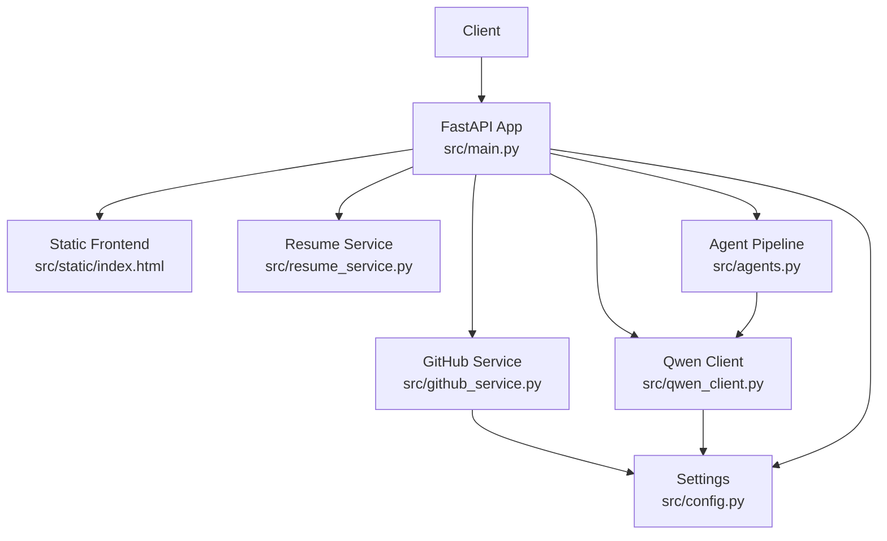
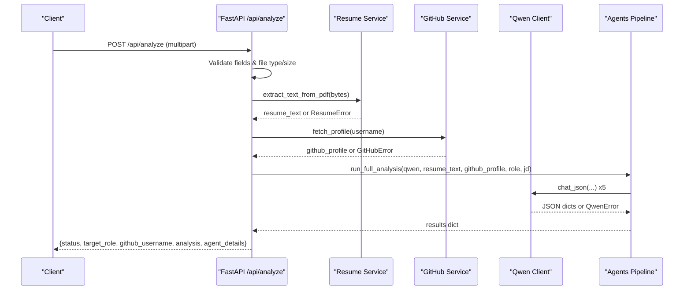
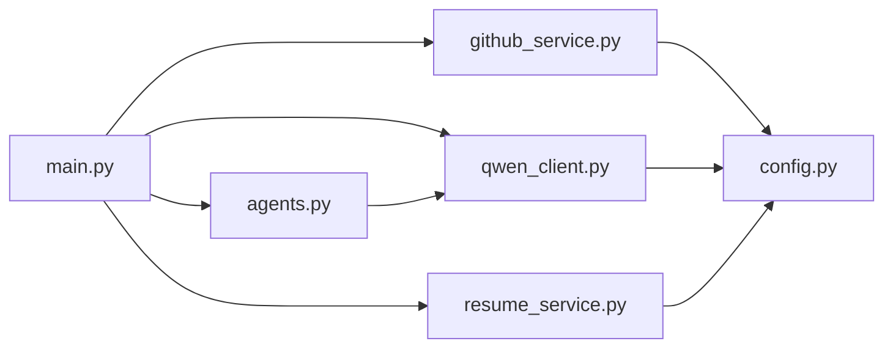

# API Layer and Request Handling

<cite>
**Referenced Files in This Document**
- [main.py](file://src/main.py)
- [config.py](file://src/config.py)
- [agents.py](file://src/agents.py)
- [github_service.py](file://src/github_service.py)
- [qwen_client.py](file://src/qwen_client.py)
- [resume_service.py](file://src/resume_service.py)
- [index.html](file://src/static/index.html)
- [test_pipeline.py](file://tests/test_pipeline.py)
- [requirements.txt](file://requirements.txt)
</cite>

## Table of Contents
1. [Introduction](#introduction)
2. [Project Structure](#project-structure)
3. [Core Components](#core-components)
4. [Architecture Overview](#architecture-overview)
5. [Detailed Component Analysis](#detailed-component-analysis)
6. [Dependency Analysis](#dependency-analysis)
7. [Performance Considerations](#performance-considerations)
8. [Troubleshooting Guide](#troubleshooting-guide)
9. [Conclusion](#conclusion)
10. [Appendices](#appendices)

## Introduction
This document describes the FastAPI application layer that handles HTTP requests and coordinates the overall system workflow for CareerOS AI. It focuses on the RESTful API design, request processing pipeline (including file upload handling, input validation, parameter parsing, and response formatting), middleware patterns, authentication and authorization mechanisms, rate limiting strategies, response standards, error codes, security measures, and guidance for API versioning and deprecation.

The application exposes:
- A static single-page frontend served at the root path
- A health check endpoint
- An analysis submission endpoint that orchestrates a multi-agent pipeline to produce an evidence-based career readiness report

## Project Structure
At a high level, the API layer is implemented in the FastAPI entry point, with supporting services for configuration, GitHub data fetching, PDF text extraction, and LLM interaction. The agents module orchestrates the five specialized agents that perform resume analysis, GitHub evidence synthesis, job matching, skill gap detection, and final report generation.

**Diagram sources**
- [main.py:28-159](file://src/main.py#L28-L159)
- [config.py:23-79](file://src/config.py#L23-L79)
- [resume_service.py:24-58](file://src/resume_service.py#L24-L58)
- [github_service.py:63-173](file://src/github_service.py#L63-L173)
- [qwen_client.py:70-158](file://src/qwen_client.py#L70-L158)
- [agents.py:295-335](file://src/agents.py#L295-L335)

**Section sources**
- [main.py:28-159](file://src/main.py#L28-L159)
- [config.py:23-79](file://src/config.py#L23-L79)

## Core Components
- FastAPI application entry point defines routes for serving the static frontend, health checks, and the analysis submission endpoint.
- Configuration module centralizes environment-driven settings for app metadata, LLM client parameters, GitHub integration, upload limits, and server binding.
- Services encapsulate external integrations:
  - Resume service extracts text from uploaded PDFs with size and content constraints.
  - GitHub service fetches public profile and repository data and builds a compact evidence summary.
  - Qwen client wraps the OpenAI-compatible API to call the LLM and parse JSON responses robustly.
- Agent pipeline orchestrates five specialized agents to analyze resume text, GitHub evidence, job requirements, skill gaps, and synthesize a final report.

Key responsibilities:
- Input validation and sanitization occur at the API boundary before invoking downstream services.
- Error handling maps domain exceptions to appropriate HTTP status codes.
- Response formatting standardizes success payloads and includes agent-level details for transparency.

**Section sources**
- [main.py:45-147](file://src/main.py#L45-L147)
- [config.py:23-79](file://src/config.py#L23-L79)
- [resume_service.py:24-58](file://src/resume_service.py#L24-L58)
- [github_service.py:63-173](file://src/github_service.py#L63-L173)
- [qwen_client.py:70-158](file://src/qwen_client.py#L70-L158)
- [agents.py:295-335](file://src/agents.py#L295-L335)

## Architecture Overview
The request lifecycle for the analysis endpoint follows these steps:
1. Receive multipart form data containing a PDF resume and textual fields.
2. Validate inputs: required fields presence, file type (.pdf), file size limit, non-empty content.
3. Extract resume text using the resume service; enforce character limits.
4. Fetch GitHub profile evidence via the GitHub service; handle errors and rate limits.
5. Run the agent pipeline through the Qwen client; handle LLM errors and malformed outputs.
6. Return a structured JSON response including the headline report and per-agent details.

**Diagram sources**
- [main.py:58-147](file://src/main.py#L58-L147)
- [resume_service.py:24-58](file://src/resume_service.py#L24-L58)
- [github_service.py:63-173](file://src/github_service.py#L63-L173)
- [qwen_client.py:97-158](file://src/qwen_client.py#L97-L158)
- [agents.py:295-335](file://src/agents.py#L295-L335)

## Detailed Component Analysis

### FastAPI Application and Endpoints
- Root route serves the single-page frontend located under the static directory.
- Health endpoint returns application metadata and configuration status flags used by the frontend and monitoring systems.
- Analysis endpoint:
  - Accepts multipart/form-data with a PDF resume and form fields for GitHub username, target role, and optional job description.
  - Validates required fields and enforces file type and size constraints.
  - Invokes services and the agent pipeline, mapping domain errors to HTTP status codes.
  - Returns a standardized JSON structure with success status, context fields, the headline report, and per-agent outputs.

Request processing highlights:
- Input sanitization: trimming whitespace from string fields.
- File validation: enforcing .pdf extension and maximum size based on configuration.
- Error mapping:
  - 400 Bad Request for invalid inputs or unsupported files.
  - 502 Bad Gateway for downstream service failures (GitHub or LLM).
  - 503 Service Unavailable when the LLM is not configured.

Response structure standards:
- Success responses include a top-level status field set to "success", contextual identifiers, and nested analysis objects.
- Error responses follow FastAPI’s default format with detail messages.

Security considerations:
- Strict file type enforcement to prevent arbitrary uploads.
- Size limits to mitigate resource exhaustion.
- No authentication or authorization middleware currently implemented; access control should be added if exposing publicly.

Rate limiting and throttling:
- Not implemented at the API layer. Rate limiting can be introduced via reverse proxy or middleware to protect against abuse.

Middleware patterns:
- CORS: Not explicitly configured in the application code. If cross-origin access is needed, configure CORS origins appropriately.
- Logging: Not implemented in the application code. Add logging middleware for request tracing and auditability.
- Error handling: Centralized exception-to-status-code mapping within endpoints; consider adding global exception handlers for consistent error envelopes.

Authentication and authorization:
- None implemented. For production deployments, add token-based authentication (e.g., JWT) and role-based authorization around sensitive endpoints.

Versioning strategy:
- The current API does not use URL versioning. To support backward compatibility and deprecation policies, introduce a versioned prefix (e.g., /api/v1/) and maintain a deprecation timeline for older versions.

**Section sources**
- [main.py:39-147](file://src/main.py#L39-L147)
- [config.py:23-79](file://src/config.py#L23-L79)

### Configuration Management
- Settings are loaded from environment variables with sensible defaults.
- Key areas:
  - App metadata: name and version.
  - LLM client: API key, base URL, model selection, temperature, max tokens, timeout.
  - GitHub integration: optional token, timeouts, and maximum repositories analyzed.
  - Upload limits: maximum resume size in MB and maximum characters extracted.
  - Server binding: host and port.

Security best practices:
- Secrets are read from environment variables and never hard-coded.
- Ensure .env is excluded from version control and restrict access to secrets in deployment environments.

**Section sources**
- [config.py:23-79](file://src/config.py#L23-L79)

### Resume Service
- Extracts plain text from uploaded PDFs using a PDF reader library.
- Raises domain-specific errors for unreadable files, empty pages, or lack of extractable text.
- Enforces a character limit to control prompt length and reduce cost/latency.

Complexity and performance:
- Text extraction is linear in the number of pages and characters.
- Truncation ensures bounded memory usage and predictable LLM prompt sizes.

Error handling:
- Maps file-related issues to user-friendly messages that the API layer converts to 400 responses.

**Section sources**
- [resume_service.py:24-58](file://src/resume_service.py#L24-L58)

### GitHub Service
- Fetches public profile and repository data via the GitHub REST API.
- Builds a compact summary including languages, topics, top repositories, and metrics.
- Handles authentication via optional token and provides friendly error messages for common issues like missing users or rate limits.

Security and reliability:
- Uses timeouts to avoid hanging requests.
- Provides clear error messaging for rate limiting and suggests adding a token to increase limits.

**Section sources**
- [github_service.py:63-173](file://src/github_service.py#L63-L173)

### Qwen Client
- Wraps the OpenAI-compatible SDK to call the LLM with strict JSON output rules.
- Includes robust JSON extraction logic to handle markdown fences and chatter around JSON.
- Implements retry behavior: if the first response is not valid JSON, it asks the LLM to correct its output once.

Error handling:
- Converts SDK errors into domain exceptions with actionable messages.
- Ensures consistent failure modes for network, auth, and parsing issues.

**Section sources**
- [qwen_client.py:70-158](file://src/qwen_client.py#L70-L158)

### Agent Pipeline
- Orchestrates five specialized agents:
  - Resume Analysis: extracts claimed skills and experience.
  - GitHub Evidence: derives verified skills from public activity.
  - Job Matching: compares candidate profile against target role requirements.
  - Skill Gap Detection: identifies critical and moderate gaps with prioritization.
  - Master Career Agent: synthesizes all insights into a final report with scores, strengths, gaps, evidence, recommendations, and a 30-day roadmap.

Data flow:
- Parallel independent analyses for resume and GitHub evidence.
- Sequential comparison stages for job matching and skill gaps.
- Final synthesis stage produces the headline report consumed by the UI.

Testing:
- Offline tests validate JSON extraction, service error paths, and full pipeline execution order without network dependencies.

**Section sources**
- [agents.py:295-335](file://src/agents.py#L295-L335)
- [test_pipeline.py:141-203](file://tests/test_pipeline.py#L141-L203)

## Dependency Analysis
The API layer depends on several modules:
- main.py imports config, agents, github_service, qwen_client, and resume_service.
- agents.py depends on qwen_client.
- github_service and qwen_client depend on config.
- resume_service depends on config.

**Diagram sources**
- [main.py:17-21](file://src/main.py#L17-L21)
- [agents.py:24-24](file://src/agents.py#L24-L24)
- [github_service.py:17-17](file://src/github_service.py#L17-L17)
- [qwen_client.py:24-24](file://src/qwen_client.py#L24-L24)
- [resume_service.py:14-14](file://src/resume_service.py#L14-L14)
- [config.py:23-79](file://src/config.py#L23-L79)

**Section sources**
- [main.py:17-21](file://src/main.py#L17-L21)
- [agents.py:24-24](file://src/agents.py#L24-L24)
- [github_service.py:17-17](file://src/github_service.py#L17-L17)
- [qwen_client.py:24-24](file://src/qwen_client.py#L24-L24)
- [resume_service.py:14-14](file://src/resume_service.py#L14-L14)
- [config.py:23-79](file://src/config.py#L23-L79)

## Performance Considerations
- The analysis endpoint runs synchronous logic; FastAPI executes sync endpoints in a worker thread, preventing blocking of the event loop during long-running LLM calls.
- Character truncation for resume text controls prompt size and reduces latency/cost.
- GitHub API calls include timeouts to avoid indefinite waits.
- LLM calls have configurable timeouts and token limits to balance quality and responsiveness.
- Consider asynchronous I/O for external calls and background task queues for long-running analyses if scaling beyond single-process usage.

[No sources needed since this section provides general guidance]

## Troubleshooting Guide
Common issues and resolutions:
- Missing or invalid LLM configuration:
  - Symptom: 503 Service Unavailable indicating the AI model is not configured.
  - Resolution: Set the required API key environment variable and verify configuration.
- Invalid or unsupported resume file:
  - Symptom: 400 Bad Request with messages about file type or empty content.
  - Resolution: Ensure the uploaded file is a PDF and contains extractable text.
- GitHub API errors:
  - Symptom: 502 Bad Gateway due to rate limits or missing user.
  - Resolution: Add a GitHub token to increase rate limits; verify username correctness.
- LLM response parsing failures:
  - Symptom: 502 Bad Gateway with invalid JSON errors.
  - Resolution: The client retries once; ensure prompts remain within expected formats and review logs for raw output.

Operational tips:
- Use the health endpoint to verify runtime configuration and service readiness.
- Monitor timeouts and adjust configuration for high-latency environments.
- Add centralized logging and metrics to track error rates and response times.

**Section sources**
- [main.py:74-131](file://src/main.py#L74-L131)
- [github_service.py:48-60](file://src/github_service.py#L48-L60)
- [qwen_client.py:120-158](file://src/qwen_client.py#L120-L158)
- [resume_service.py:31-58](file://src/resume_service.py#L31-L58)

## Conclusion
The FastAPI application layer provides a clean, secure, and extensible API surface for submitting resumes and initiating a multi-agent analysis pipeline. It emphasizes input validation, robust error handling, and standardized responses. While authentication, authorization, CORS, logging, and rate limiting are not implemented in the current codebase, they are straightforward to add for production-grade deployments. Versioning and deprecation policies should be adopted early to ensure backward compatibility as the API evolves.

[No sources needed since this section summarizes without analyzing specific files]

## Appendices

### API Reference Summary
- GET /
  - Serves the static single-page frontend.
  - Status codes: 200 OK on success.
- GET /health
  - Lightweight status check returning application metadata and configuration flags.
  - Status codes: 200 OK on success.
- POST /api/analyze
  - Submits a PDF resume along with GitHub username, target role, and optional job description.
  - Validates inputs and orchestrates the agent pipeline.
  - Status codes:
    - 200 OK on successful analysis.
    - 400 Bad Request for invalid inputs or unsupported files.
    - 502 Bad Gateway for downstream service failures.
    - 503 Service Unavailable when the LLM is not configured.

**Section sources**
- [main.py:39-147](file://src/main.py#L39-L147)

### Security Measures
- Input sanitization:
  - Trimmed whitespace for string fields.
  - Strict file type enforcement for PDF uploads.
- File validation:
  - Enforced maximum size and non-empty content checks.
- Protection against common vulnerabilities:
  - Avoids executing arbitrary file types.
  - Limits payload sizes to mitigate resource exhaustion.
- Authentication and authorization:
  - Not implemented; recommend adding token-based authentication and role-based access control for production.
- CORS and logging:
  - Not implemented; add CORS configuration and request logging middleware as needed.

**Section sources**
- [main.py:74-98](file://src/main.py#L74-L98)
- [config.py:60-63](file://src/config.py#L60-L63)

### API Versioning and Deprecation Guidance
- Introduce a versioned URL prefix (e.g., /api/v1/) to decouple interface changes from clients.
- Maintain backward compatibility by preserving existing fields and behaviors across minor versions.
- Publish a deprecation policy with timelines for retiring older versions and communicating breaking changes.

[No sources needed since this section provides general guidance]