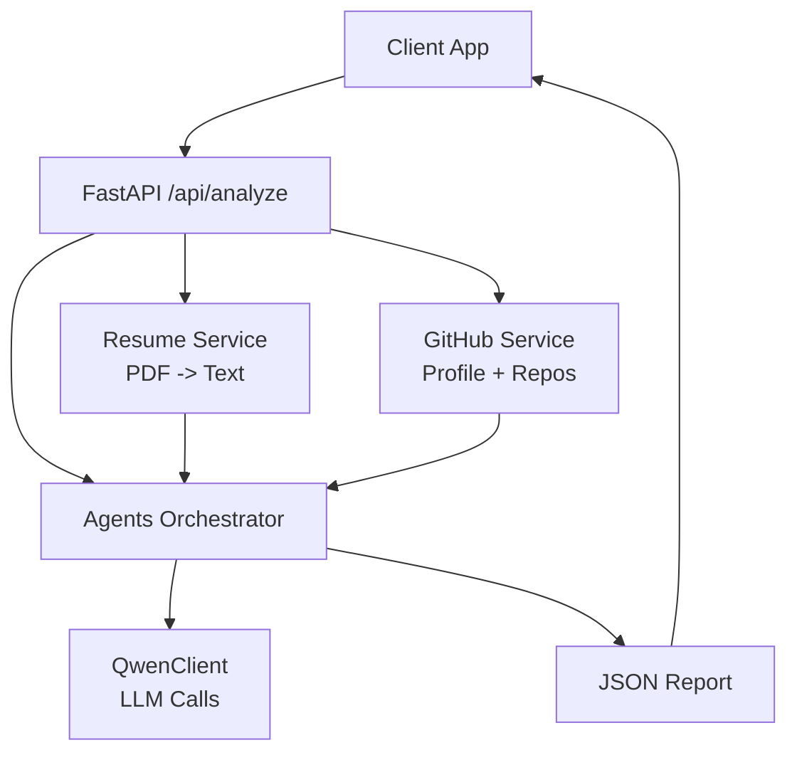
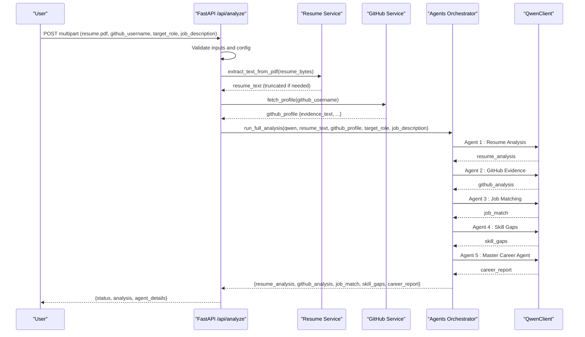
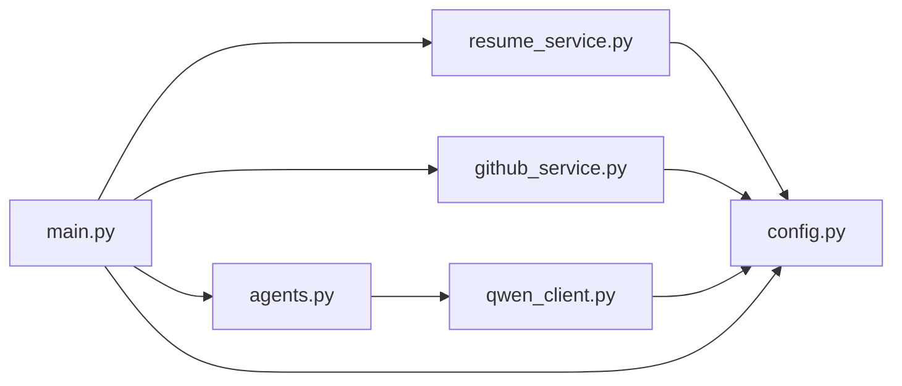

# Data Flow and Processing Pipeline

<cite>
**Referenced Files in This Document**
- [main.py](file://src/main.py)
- [agents.py](file://src/agents.py)
- [resume_service.py](file://src/resume_service.py)
- [github_service.py](file://src/github_service.py)
- [qwen_client.py](file://src/qwen_client.py)
- [config.py](file://src/config.py)
- [test_pipeline.py](file://tests/test_pipeline.py)
</cite>

## Table of Contents
1. Introduction
2. Project Structure
3. Core Components
4. Architecture Overview
5. Detailed Component Analysis
6. Dependency Analysis
7. Performance Considerations
8. Troubleshooting Guide
9. Conclusion

## Introduction
This document explains the end-to-end data flow of CareerOS AI from user input to the final career intelligence report. It covers FastAPI request handling, PDF resume parsing, GitHub profile fetching, multi-agent processing via Qwen, and response generation. It also details data transformations (resume text parsing, GitHub activity analysis, skill extraction, and report synthesis), input validation, error handling at each stage, and data format conversions between components. Finally, it addresses performance considerations for large PDFs, rate limiting for GitHub API calls, memory management during parallel processing, retry mechanisms, and fallback strategies when external services fail.

## Project Structure
CareerOS AI is organized into clear layers:
- API layer: FastAPI endpoints that validate inputs and orchestrate the pipeline.
- Services: Resume text extraction and GitHub profile fetching.
- Agents: Five specialized agents plus an orchestrator that coordinates the analysis.
- Client: A wrapper around the Qwen chat API with JSON output enforcement and retries.
- Configuration: Centralized settings loaded from environment variables.

**Diagram sources**
- [main.py:58-147](file://src/main.py#L58-L147)
- [resume_service.py:24-57](file://src/resume_service.py#L24-L57)
- [github_service.py:63-147](file://src/github_service.py#L63-L147)
- [agents.py:295-334](file://src/agents.py#L295-L334)
- [qwen_client.py:97-157](file://src/qwen_client.py#L97-L157)

**Section sources**
- [main.py:1-160](file://src/main.py#L1-L160)
- [README.md:173-202](file://README.md#L173-L202)

## Core Components
- FastAPI endpoint: Validates inputs, enforces file type and size limits, checks configuration, and triggers the agent pipeline.
- Resume service: Extracts plain text from uploaded PDFs using pypdf, truncates long resumes to control prompt size and cost, and raises domain-specific errors.
- GitHub service: Fetches public profile and repositories, builds a compact evidence summary, and converts raw API data into LLM-friendly text.
- Agents: Five specialized agents produce structured JSON outputs; the orchestrator sequences them to build the final report.
- Qwen client: Wraps the OpenAI-compatible API, enforces strict JSON responses, and includes one retry attempt if the first response is not valid JSON.
- Configuration: Loads all runtime settings from environment variables, including API keys, timeouts, and limits.

**Section sources**
- [main.py:58-147](file://src/main.py#L58-L147)
- [resume_service.py:17-57](file://src/resume_service.py#L17-L57)
- [github_service.py:22-173](file://src/github_service.py#L22-L173)
- [agents.py:28-334](file://src/agents.py#L28-L334)
- [qwen_client.py:27-157](file://src/qwen_client.py#L27-L157)
- [config.py:23-79](file://src/config.py#L23-L79)

## Architecture Overview
The system follows a sequential pipeline with two independent initial analyses (resume and GitHub), followed by dependent stages that compare requirements against evidence, identify gaps, and synthesize a final report.

**Diagram sources**
- [main.py:58-147](file://src/main.py#L58-L147)
- [resume_service.py:24-57](file://src/resume_service.py#L24-L57)
- [github_service.py:63-147](file://src/github_service.py#L63-L147)
- [agents.py:295-334](file://src/agents.py#L295-L334)
- [qwen_client.py:97-157](file://src/qwen_client.py#L97-L157)

## Detailed Component Analysis

### Request Handling and Input Validation
- Endpoint: POST /api/analyze accepts a PDF resume, GitHub username, target role, and optional job description.
- Validation:
  - Ensures required fields are present and trimmed.
  - Enforces .pdf extension and maximum file size based on configuration.
  - Checks that the Qwen model is configured before proceeding.
- Error handling:
  - Raises HTTP 400 for invalid inputs or empty files.
  - Raises HTTP 503 if the LLM provider is not configured.
  - Propagates service-level errors to appropriate HTTP status codes.

Data objects created here:
- resume_bytes: raw bytes read from the uploaded file.
- resume_text: extracted and truncated text from the PDF.
- github_profile: structured profile with evidence_text used by agents.

**Section sources**
- [main.py:58-147](file://src/main.py#L58-L147)
- [config.py:62-63](file://src/config.py#L62-L63)

### Resume Text Extraction
- Uses pypdf to parse PDF pages and concatenate text.
- Raises ResumeError for unreadable PDFs, empty pages, or no extractable text.
- Truncates very long resumes to a configurable character limit to control prompt size and cost.

Data transformation:
- Input: bytes (PDF).
- Output: string (resume_text), optionally truncated with a marker indicating truncation.

**Section sources**
- [resume_service.py:24-57](file://src/resume_service.py#L24-L57)

### GitHub Profile Fetching and Evidence Summary
- Fetches user profile and top repositories (non-forks) sorted by stars and recent activity.
- Builds a compact profile dict and an evidence_text block tailored for LLM consumption.
- Handles GitHub API errors:
  - 404: user not found.
  - 403 with zero remaining: rate limit reached; suggests adding a token.
  - Other errors: generic failure message.

Data transformation:
- Input: username string.
- Output: dict with metadata and evidence_text used by the GitHub Evidence Agent.

Rate limiting and retries:
- The service sets a timeout per request and surfaces rate limit errors to the caller.
- No built-in retry loop; callers can implement retries with backoff if desired.

**Section sources**
- [github_service.py:22-173](file://src/github_service.py#L22-L173)

### Multi-Agent Processing Pipeline
The orchestrator runs five agents in a defined order:
1. Resume Analysis Agent: extracts claimed skills, experience highlights, education, and quality notes.
2. GitHub Evidence Agent: derives verified skills from real repository activity.
3. Job Matching Agent: compares required skills (from target role or provided job description) against candidate’s claimed and verified skills.
4. Skill Gap Agent: identifies critical and moderate gaps and quick wins.
5. Master Career Agent: synthesizes all outputs into a final career report with scores, strengths, gaps, evidence, recommendations, and a 30-day roadmap.

Data objects flowing through the pipeline:
- resume_analysis: claims and resume quality insights.
- github_analysis: verified skills and project quality metrics.
- job_match: required skills, match percentage, matched/missing skills.
- skill_gaps: prioritized gaps and quick wins.
- career_report: final synthesized report with readiness score and actionable guidance.

Agent communication:
- Each agent receives structured prompts and returns strictly formatted JSON via QwenClient.chat_json.
- The orchestrator composes inputs for later agents using earlier outputs.

**Section sources**
- [agents.py:28-334](file://src/agents.py#L28-L334)

### Qwen Client and Retry Mechanisms
- Enforces strict JSON output rules across all prompts.
- Attempts one retry if the first response cannot be parsed as JSON, appending a correction message to the conversation.
- Wraps network and API errors into QwenError with context about the failing agent.

Retry behavior:
- One automatic retry for malformed JSON responses.
- Network/auth/rate-limit errors raise immediately without retry.

Fallback strategy:
- If both attempts fail, the client raises QwenError, which propagates up to the API layer as HTTP 502.

**Section sources**
- [qwen_client.py:27-157](file://src/qwen_client.py#L27-L157)

### Final Response Generation
- The API returns a success payload containing:
  - analysis: the headline career_report for UI rendering.
  - agent_details: raw outputs from each specialist agent for transparency and demos.
- All intermediate objects (resume_analysis, github_analysis, job_match, skill_gaps) are included for downstream use.

**Section sources**
- [main.py:120-147](file://src/main.py#L120-L147)

## Dependency Analysis
The following diagram shows how modules depend on each other and where data transforms occur.

**Diagram sources**
- [main.py:17-21](file://src/main.py#L17-L21)
- [agents.py:21-24](file://src/agents.py#L21-L24)
- [resume_service.py:9-14](file://src/resume_service.py#L9-L14)
- [github_service.py:12-17](file://src/github_service.py#L12-L17)
- [qwen_client.py:18-24](file://src/qwen_client.py#L18-L24)
- [config.py:23-79](file://src/config.py#L23-L79)

**Section sources**
- [main.py:17-21](file://src/main.py#L17-L21)
- [agents.py:21-24](file://src/agents.py#L21-L24)
- [resume_service.py:9-14](file://src/resume_service.py#L9-L14)
- [github_service.py:12-17](file://src/github_service.py#L12-L17)
- [qwen_client.py:18-24](file://src/qwen_client.py#L18-L24)
- [config.py:23-79](file://src/config.py#L23-L79)

## Performance Considerations
- Large PDF handling:
  - The resume service truncates very long resumes to a configurable character limit to reduce prompt size and cost while preserving key content.
  - Memory usage is bounded by reading only the necessary bytes and streaming page extraction.
- GitHub API rate limiting:
  - Unauthenticated requests are limited; authenticated requests raise the limit significantly.
  - The service surfaces rate limit errors clearly and suggests adding a token.
  - Implement client-side retry with exponential backoff at the API layer if you need resilience beyond the current behavior.
- Parallel processing:
  - The current pipeline runs agents sequentially to ensure correct dependency ordering.
  - Stage 1 and 2 (resume and GitHub evidence) could be parallelized since they are independent; however, the orchestrator currently executes them in sequence.
- Timeouts and resource controls:
  - Qwen and GitHub calls use configurable timeouts to prevent hanging requests.
  - Maximum resume size is enforced to avoid excessive memory usage.

[No sources needed since this section provides general guidance]

## Troubleshooting Guide
Common issues and their handling:
- Invalid or missing inputs:
  - Missing GitHub username or target role results in HTTP 400.
  - Non-PDF uploads or empty files result in HTTP 400.
- Resume parsing failures:
  - Unreadable PDFs or image-only scans raise ResumeError, mapped to HTTP 400.
- GitHub API errors:
  - User not found (404) or rate limit exceeded (403 with zero remaining) raise GitHubError, mapped to HTTP 502.
- LLM provider issues:
  - Missing API key leads to HTTP 503 before any agent calls.
  - Qwen API failures or invalid JSON responses raise QwenError, mapped to HTTP 502.

Retries and fallbacks:
- Qwen client automatically retries once for malformed JSON responses.
- For network or auth errors, the client raises immediately; consider implementing retry logic at the API layer with backoff for transient failures.

Validation and diagnostics:
- Use GET /health to verify app status, configured model, and whether Qwen/GitHub credentials are set.

**Section sources**
- [main.py:74-131](file://src/main.py#L74-L131)
- [resume_service.py:17-57](file://src/resume_service.py#L17-L57)
- [github_service.py:48-87](file://src/github_service.py#L48-L87)
- [qwen_client.py:120-157](file://src/qwen_client.py#L120-L157)

## Conclusion
CareerOS AI implements a robust, staged data pipeline that transforms user inputs into a comprehensive career intelligence report. The system validates inputs early, extracts and normalizes data from PDFs and GitHub, applies specialized agents to analyze and synthesize insights, and returns structured results suitable for both UI rendering and further processing. Error handling is explicit at each stage, and configuration-driven limits help manage performance and costs. Future enhancements could include parallelizing independent agent stages, adding resilient retries for external services, and caching strategies to reduce repeated API calls.

[No sources needed since this section summarizes without analyzing specific files]