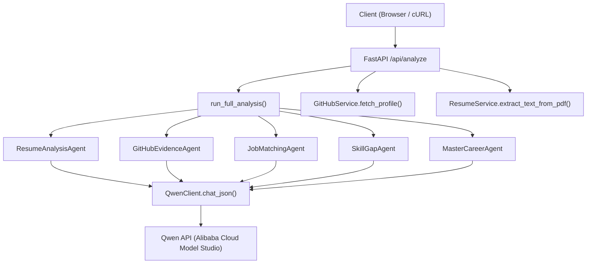
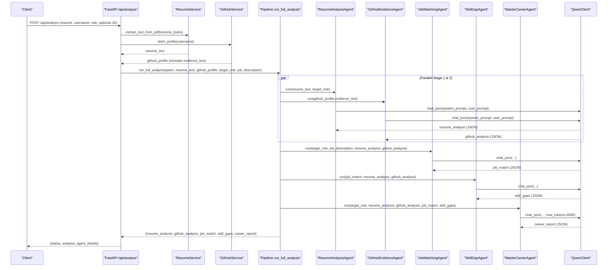
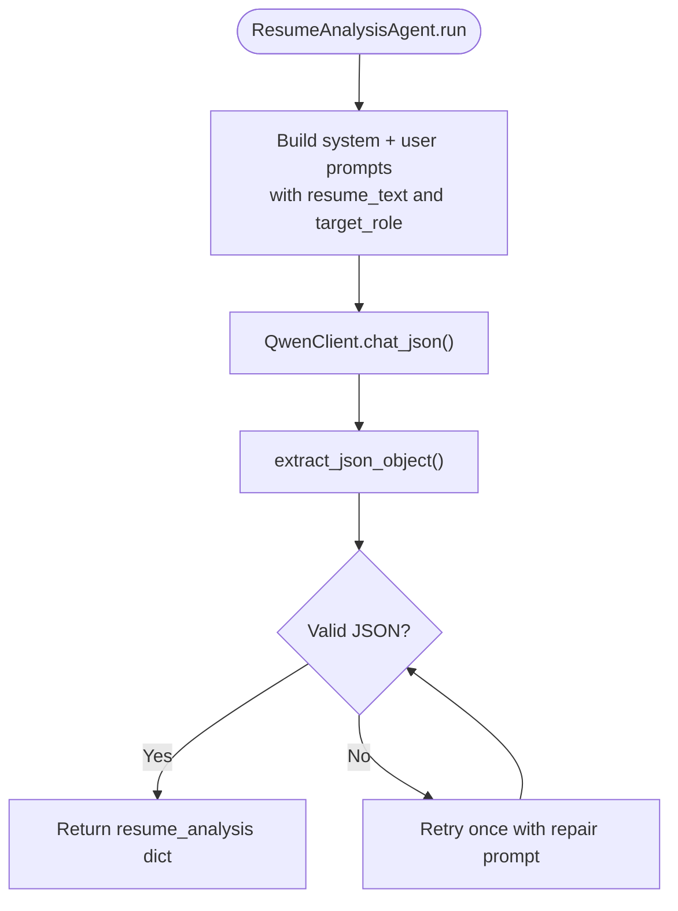
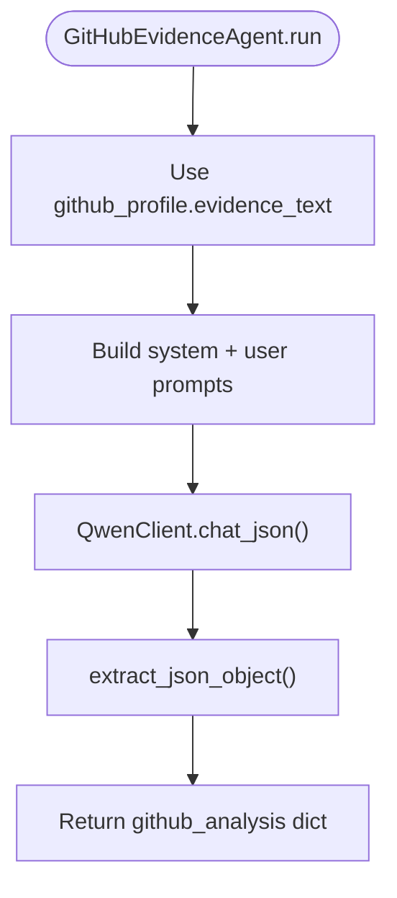
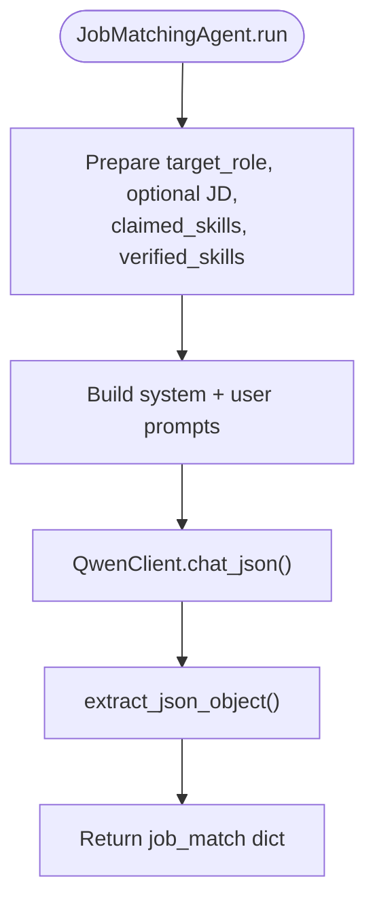
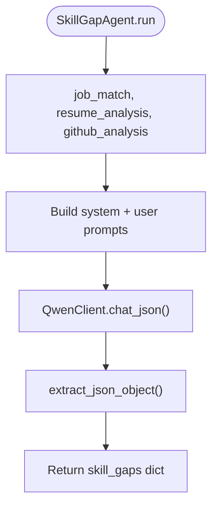
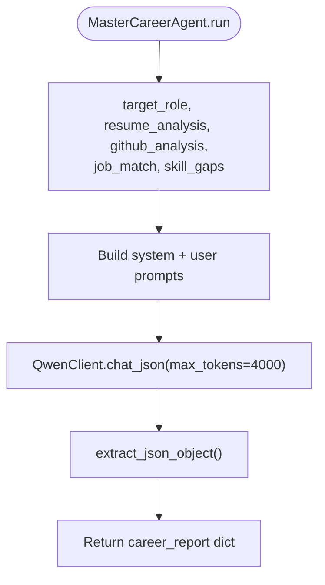
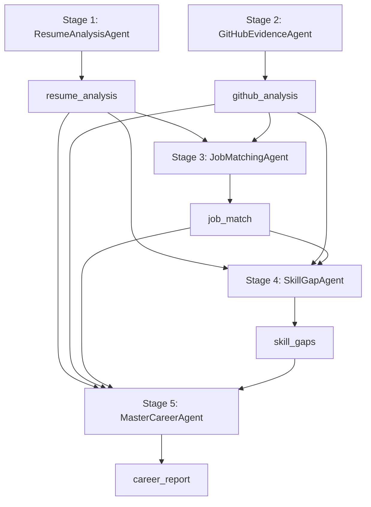
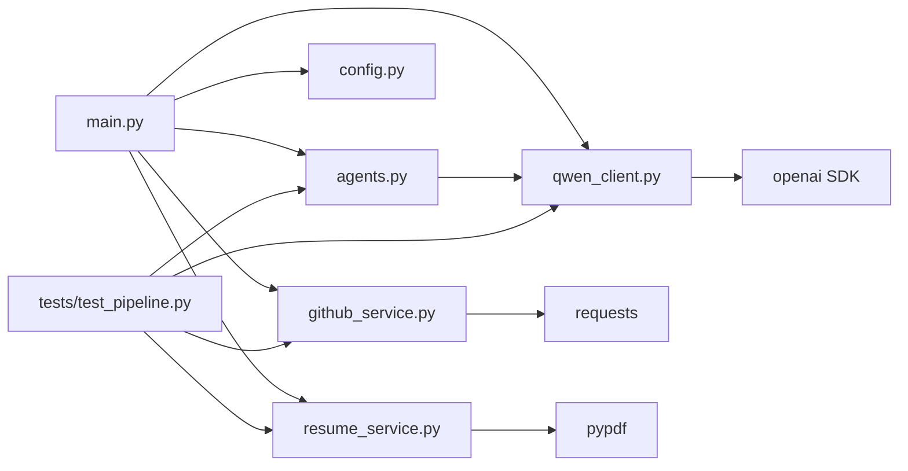

# Multi-Agent System Design

<cite>
**Referenced Files in This Document**
- [main.py](file://src/main.py)
- [agents.py](file://src/agents.py)
- [qwen_client.py](file://src/qwen_client.py)
- [github_service.py](file://src/github_service.py)
- [resume_service.py](file://src/resume_service.py)
- [config.py](file://src/config.py)
- [test_pipeline.py](file://tests/test_pipeline.py)
- [README.md](file://README.md)
</cite>

## Table of Contents
1. [Introduction](#introduction)
2. [Project Structure](#project-structure)
3. [Core Components](#core-components)
4. [Architecture Overview](#architecture-overview)
5. [Detailed Component Analysis](#detailed-component-analysis)
6. [Dependency Analysis](#dependency-analysis)
7. [Performance Considerations](#performance-considerations)
8. [Troubleshooting Guide](#troubleshooting-guide)
9. [Conclusion](#conclusion)
10. [Appendices](#appendices)

## Introduction
CareerOS AI is a multi-agent career intelligence platform that evaluates candidates using evidence-based analysis across two primary sources: resumes and GitHub profiles. It orchestrates five specialized agents to produce a comprehensive, actionable report including readiness scoring, skill gap identification, and a 30-day roadmap. The system emphasizes verifiable claims by cross-referencing resume assertions against real GitHub activity.

The design follows a clear orchestration pattern:
- Two independent parallel analyses: Resume Analysis Agent and GitHub Evidence Agent.
- Sequential dependency-based processing: Job Matching Agent and Skill Gap Agent consume outputs from the first stage.
- Final synthesis by the Master Career Agent, which reconciles verified vs unverified skills and produces a cohesive report.

This document explains the architecture, data flows, prompt engineering strategies, error handling, and scalability considerations for concurrent execution.

## Project Structure
The application is organized into focused modules:
- API entry point and request handling
- Agent definitions and pipeline orchestration
- LLM client wrapper for Qwen
- Data services for GitHub and resume extraction
- Configuration management via environment variables
- Tests validating pipeline behavior without external dependencies

**Diagram sources**
- [main.py:58-147](file://src/main.py#L58-L147)
- [agents.py:295-334](file://src/agents.py#L295-L334)
- [qwen_client.py:97-157](file://src/qwen_client.py#L97-L157)
- [github_service.py:63-89](file://src/github_service.py#L63-L89)
- [resume_service.py:24-57](file://src/resume_service.py#L24-L57)

**Section sources**
- [main.py:1-160](file://src/main.py#L1-L160)
- [README.md:173-202](file://README.md#L173-L202)

## Core Components
- FastAPI application exposing endpoints for health checks and full analysis.
- Five agent classes with single responsibilities and structured JSON contracts.
- QwenClient providing robust JSON parsing and retry logic for LLM calls.
- GitHub service fetching public profile data and building an evidence summary.
- Resume service extracting text from PDFs with validation and truncation.
- Centralized configuration loaded from environment variables.

Key responsibilities:
- Input validation and error mapping to HTTP status codes.
- Parallel extraction of resume text and GitHub profile.
- Orchestrated pipeline execution with dependency-aware ordering.
- Evidence-based synthesis distinguishing verified vs unverified skills.

**Section sources**
- [main.py:58-147](file://src/main.py#L58-L147)
- [agents.py:27-289](file://src/agents.py#L27-L289)
- [qwen_client.py:27-157](file://src/qwen_client.py#L27-L157)
- [github_service.py:22-173](file://src/github_service.py#L22-L173)
- [resume_service.py:17-57](file://src/resume_service.py#L17-L57)
- [config.py:23-79](file://src/config.py#L23-L79)

## Architecture Overview
The system implements a hybrid execution model:
- Stage 1 & 2: Independent parallel processing of resume and GitHub evidence.
- Stage 3 & 4: Sequential processing dependent on prior outputs for job matching and skill gaps.
- Stage 5: Master agent synthesizes all results into a final report.

**Diagram sources**
- [main.py:58-147](file://src/main.py#L58-L147)
- [agents.py:295-334](file://src/agents.py#L295-L334)
- [qwen_client.py:97-157](file://src/qwen_client.py#L97-L157)
- [github_service.py:63-89](file://src/github_service.py#L63-L89)
- [resume_service.py:24-57](file://src/resume_service.py#L24-L57)

## Detailed Component Analysis

### Resume Analysis Agent
Extracts claimed skills, experience, education, highlights, and quality notes from resume text. Uses a strict system prompt emphasizing skepticism and only reporting visible skills. Returns a structured JSON contract consumed by downstream agents.

**Diagram sources**
- [agents.py:30-63](file://src/agents.py#L30-L63)
- [qwen_client.py:97-157](file://src/qwen_client.py#L97-L157)

**Section sources**
- [agents.py:30-63](file://src/agents.py#L30-L63)

### GitHub Evidence Agent
Derives verified skills from public GitHub activity. Builds a compact evidence text from profile stats, languages, topics, and top repositories. Emphasizes distinguishing genuine evidence from noise like forks or empty repos.

**Diagram sources**
- [agents.py:69-103](file://src/agents.py#L69-L103)
- [github_service.py:92-173](file://src/github_service.py#L92-L173)
- [qwen_client.py:97-157](file://src/qwen_client.py#L97-L157)

**Section sources**
- [agents.py:69-103](file://src/agents.py#L69-L103)
- [github_service.py:63-173](file://src/github_service.py#L63-L173)

### Job Matching Agent
Matches candidate requirements against target role, optionally using a provided job description. Compares required skills with both claimed and verified skills to compute match percentage and identify missing skills.

**Diagram sources**
- [agents.py:109-163](file://src/agents.py#L109-L163)
- [qwen_client.py:97-157](file://src/qwen_client.py#L97-L157)

**Section sources**
- [agents.py:109-163](file://src/agents.py#L109-L163)

### Skill Gap Agent
Identifies and prioritizes skill gaps based on role requirements versus demonstrated skills. Produces critical and moderate gaps along with quick wins for rapid improvement.

**Diagram sources**
- [agents.py:169-209](file://src/agents.py#L169-L209)
- [qwen_client.py:97-157](file://src/qwen_client.py#L97-L157)

**Section sources**
- [agents.py:169-209](file://src/agents.py#L169-L209)

### Master Career Agent
Synthesizes outputs from four specialist agents into a final career report. Enforces evidence-based assessment by classifying skills as verified (resume claim + GitHub proof) or unverified (claim without proof). Produces scores, strengths, gaps, recommendations, and a 30-day roadmap.

**Diagram sources**
- [agents.py:215-289](file://src/agents.py#L215-L289)
- [qwen_client.py:97-157](file://src/qwen_client.py#L97-L157)

**Section sources**
- [agents.py:215-289](file://src/agents.py#L215-L289)

### Pipeline Orchestration
The pipeline coordinates agent execution with explicit dependency management:
- Stage 1 & 2: Resume and GitHub analyses run independently.
- Stage 3 & 4: Job matching and skill gap analyses depend on prior outputs.
- Stage 5: Master agent synthesizes all results.

**Diagram sources**
- [agents.py:295-334](file://src/agents.py#L295-L334)

**Section sources**
- [agents.py:295-334](file://src/agents.py#L295-L334)

## Dependency Analysis
Components and their relationships:
- main.py depends on agents, config, github_service, qwen_client, resume_service.
- agents.py depends on qwen_client for LLM interactions.
- qwen_client depends on openai SDK and config settings.
- github_service depends on requests and config settings.
- resume_service depends on pypdf and config settings.
- tests validate pipeline behavior using a FakeQwen and fixtures.

**Diagram sources**
- [main.py:17-21](file://src/main.py#L17-L21)
- [agents.py:21-24](file://src/agents.py#L21-L24)
- [qwen_client.py:18-24](file://src/qwen_client.py#L18-L24)
- [github_service.py:12-17](file://src/github_service.py#L12-L17)
- [resume_service.py:9-14](file://src/resume_service.py#L9-L14)
- [test_pipeline.py:21-25](file://tests/test_pipeline.py#L21-L25)

**Section sources**
- [main.py:17-21](file://src/main.py#L17-L21)
- [agents.py:21-24](file://src/agents.py#L21-L24)
- [qwen_client.py:18-24](file://src/qwen_client.py#L18-L24)
- [github_service.py:12-17](file://src/github_service.py#L12-L17)
- [resume_service.py:9-14](file://src/resume_service.py#L9-L14)
- [test_pipeline.py:21-25](file://tests/test_pipeline.py#L21-L25)

## Performance Considerations
- Concurrency: The current implementation runs resume and GitHub analyses sequentially within the pipeline function. To improve throughput, consider running these stages concurrently using async tasks or thread pools, since they are independent and do not share mutable state.
- LLM Calls: Each agent makes one call to Qwen; the master agent uses a higher token limit. Batch retries and caching can reduce latency and cost.
- Rate Limits: GitHub API rate limits are handled with informative errors; configure GITHUB_TOKEN to increase limits. Qwen timeouts and model selection are configurable via environment variables.
- Input Size Control: Resume text is truncated to a configured character limit to manage prompt size and cost.
- Server Threading: FastAPI runs sync endpoints in worker threads, preventing long LLM calls from blocking other requests.

[No sources needed since this section provides general guidance]

## Troubleshooting Guide
Common issues and resolutions:
- Missing Qwen API key: Raises a configuration error; ensure DASHSCOPE_API_KEY is set in .env.
- Invalid resume file: ResumeError indicates unreadable or image-only PDFs; require text-based PDFs.
- GitHub API failures: GitHubError handles 404 users and rate limits; add GITHUB_TOKEN to raise limits.
- Invalid LLM output: QwenClient attempts one retry with a repair prompt; persistent failures surface detailed raw output for debugging.

Operational checks:
- Use GET /health to verify app status, model configuration, and token presence.
- Validate inputs early to return appropriate HTTP status codes (400 for bad input, 502 for external service failures).

**Section sources**
- [main.py:74-131](file://src/main.py#L74-L131)
- [qwen_client.py:27-157](file://src/qwen_client.py#L27-L157)
- [github_service.py:48-60](file://src/github_service.py#L48-L60)
- [resume_service.py:17-57](file://src/resume_service.py#L17-L57)
- [config.py:76-79](file://src/config.py#L76-L79)

## Conclusion
CareerOS AI’s multi-agent architecture delivers evidence-based career assessments by combining resume analysis with verified GitHub activity. The orchestration pattern ensures efficient parallel processing where possible and sequential dependency handling when necessary. Structured JSON contracts between agents enable reliable communication, while robust error handling and configuration management support operational stability. Future enhancements can focus on concurrency improvements, caching strategies, and expanded integrations to further optimize performance and accuracy.

[No sources needed since this section summarizes without analyzing specific files]

## Appendices

### API Reference Summary
- POST /api/analyze: Accepts resume PDF, GitHub username, target role, and optional job description. Returns success status, analysis report, and per-agent details.
- GET /health: Returns application status, version, model, and configuration flags.

**Section sources**
- [main.py:45-55](file://src/main.py#L45-L55)
- [main.py:58-147](file://src/main.py#L58-L147)
- [README.md:286-326](file://README.md#L286-L326)

### Testing Strategy
- Offline unit tests replace LLM calls with a FakeQwen returning canned JSON.
- GitHub data is validated via pure functions using fixtures.
- Resume service error paths are tested with generated PDFs.
- Pipeline order and outputs are asserted to ensure correct agent sequencing.

**Section sources**
- [test_pipeline.py:28-39](file://tests/test_pipeline.py#L28-L39)
- [test_pipeline.py:79-118](file://tests/test_pipeline.py#L79-L118)
- [test_pipeline.py:124-136](file://tests/test_pipeline.py#L124-L136)
- [test_pipeline.py:141-203](file://tests/test_pipeline.py#L141-L203)