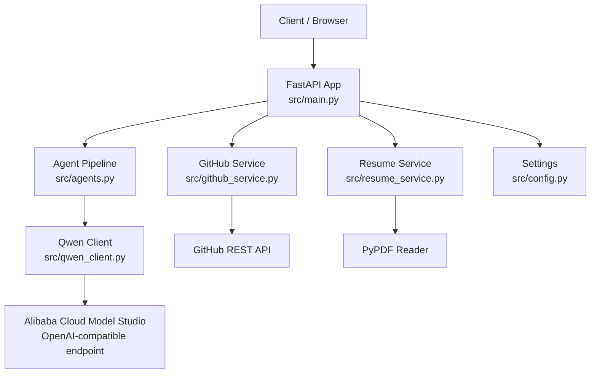
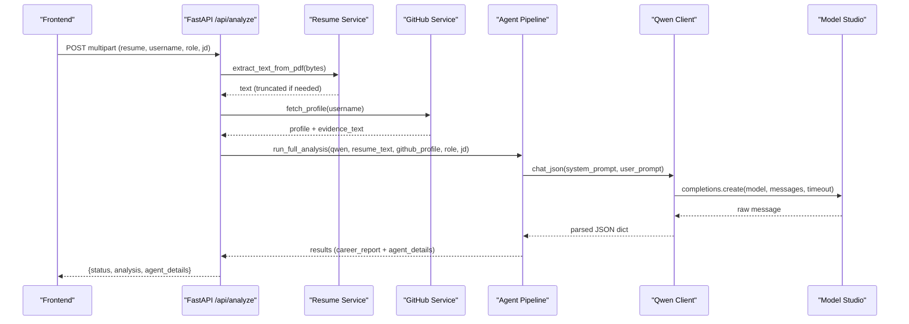
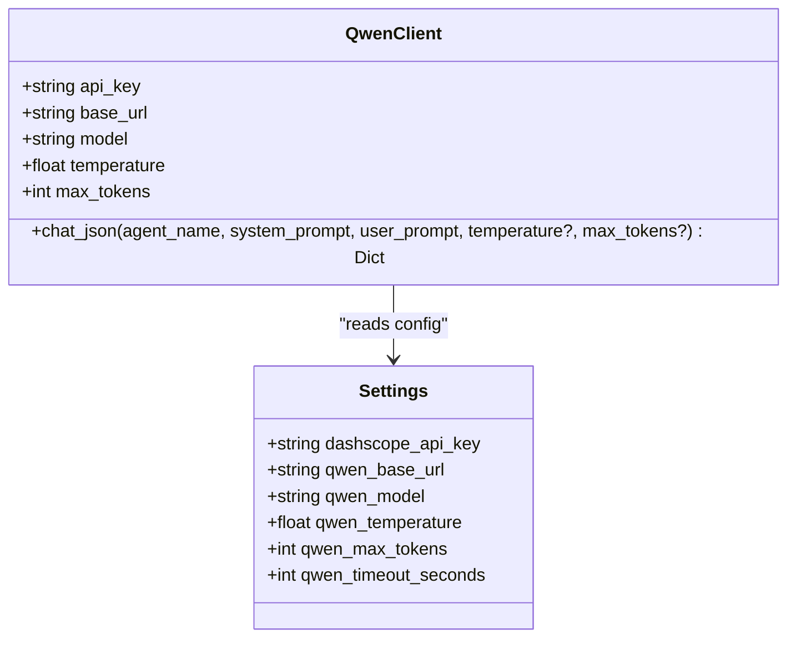
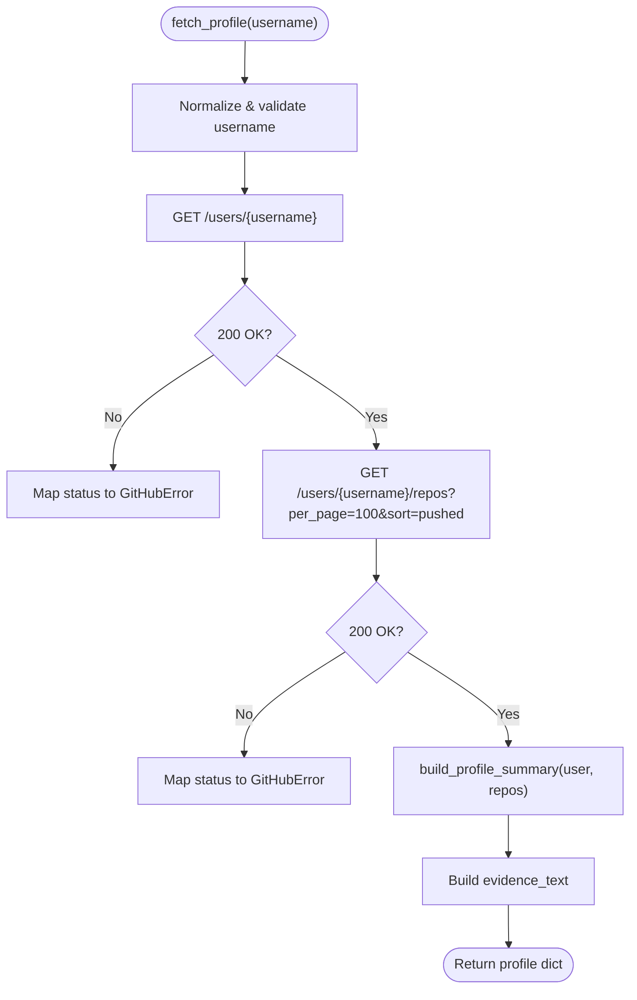
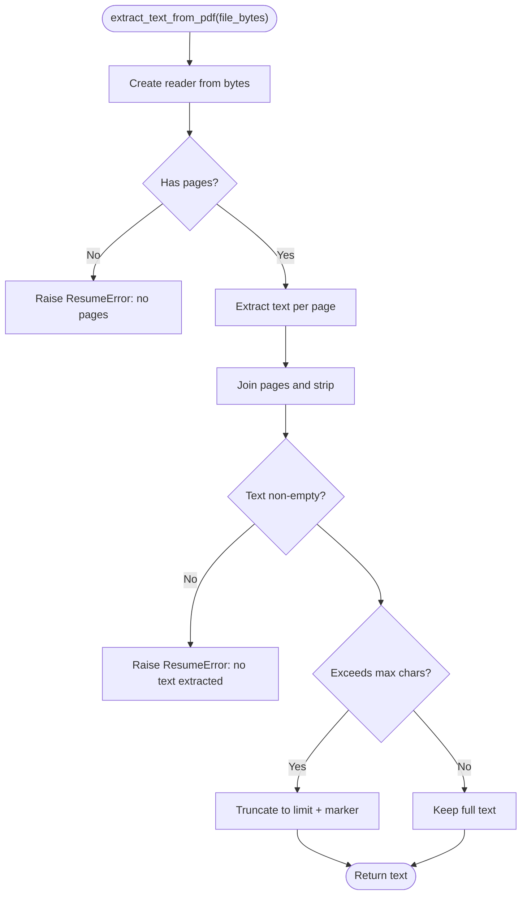
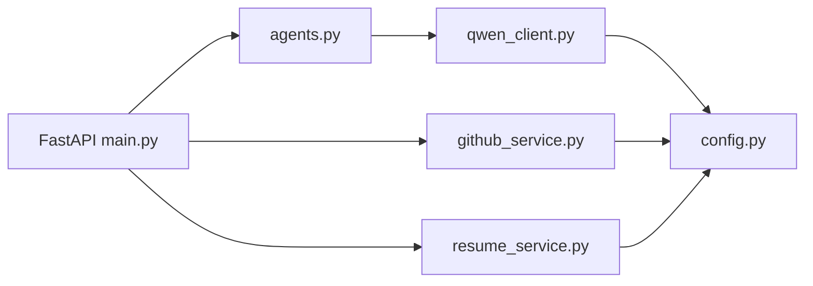

# Service Layer and External Integrations

<cite>
**Referenced Files in This Document**
- [main.py](file://src/main.py)
- [config.py](file://src/config.py)
- [qwen_client.py](file://src/qwen_client.py)
- [github_service.py](file://src/github_service.py)
- [resume_service.py](file://src/resume_service.py)
- [agents.py](file://src/agents.py)
- [README.md](file://README.md)
</cite>

## Table of Contents
1. [Introduction](#introduction)
2. [Project Structure](#project-structure)
3. [Core Components](#core-components)
4. [Architecture Overview](#architecture-overview)
5. [Detailed Component Analysis](#detailed-component-analysis)
6. [Dependency Analysis](#dependency-analysis)
7. [Performance Considerations](#performance-considerations)
8. [Troubleshooting Guide](#troubleshooting-guide)
9. [Conclusion](#conclusion)
10. [Appendices](#appendices)

## Introduction
This document explains the service layer design that encapsulates external integrations in CareerOS AI. It focuses on three core services:
- Qwen LLM client for Alibaba Cloud Model Studio integration
- GitHub REST API client for profile and repository analysis
- PDF resume processor for text extraction

The system follows a service-oriented architecture where each external dependency is wrapped in a dedicated service class or module with consistent interfaces. Configuration is centralized via environment variables, error handling is explicit and user-friendly, and timeouts are configured per service. The design supports swapping providers behind stable interfaces and includes security considerations for credentials, input validation, and output parsing.

## Project Structure
CareerOS AI organizes its backend around a FastAPI entry point that coordinates evidence gathering (resume and GitHub), then runs a multi-agent pipeline powered by an LLM client. Services are isolated into focused modules:
- Configuration management reads secrets and settings from environment variables
- Qwen client wraps the OpenAI-compatible SDK to call Alibaba Cloud Model Studio
- GitHub service fetches public profile data and builds structured summaries
- Resume service extracts text from uploaded PDFs
- Agents orchestrate the multi-step analysis using the Qwen client

**Diagram sources**
- [main.py:28-147](file://src/main.py#L28-L147)
- [resume_service.py:24-57](file://src/resume_service.py#L24-L57)
- [github_service.py:63-147](file://src/github_service.py#L63-L147)
- [agents.py:295-334](file://src/agents.py#L295-L334)
- [qwen_client.py:70-157](file://src/qwen_client.py#L70-L157)
- [config.py:23-73](file://src/config.py#L23-L73)

**Section sources**
- [main.py:28-147](file://src/main.py#L28-L147)
- [config.py:23-73](file://src/config.py#L23-L73)

## Core Components
- Qwen LLM client: Provides a typed interface to call the model, enforce JSON responses, and handle retries when formatting fails.
- GitHub service: Fetches public profile and repositories, computes summary statistics, and produces evidence text for agents.
- Resume service: Extracts plain text from PDFs, validates content, and truncates oversized resumes to control prompt size.
- Configuration: Centralized settings loaded from environment variables, including API keys, endpoints, timeouts, and limits.
- Agent pipeline: Orchestrates five specialized agents that consume the services’ outputs and produce a final career report.

Key responsibilities and boundaries:
- Services isolate external dependencies and translate their responses into domain-friendly structures.
- The API layer validates inputs and maps service errors to HTTP status codes.
- Agents focus on prompting and synthesis; they do not perform I/O directly.

**Section sources**
- [qwen_client.py:70-157](file://src/qwen_client.py#L70-L157)
- [github_service.py:63-147](file://src/github_service.py#L63-L147)
- [resume_service.py:24-57](file://src/resume_service.py#L24-L57)
- [agents.py:295-334](file://src/agents.py#L295-L334)
- [config.py:23-73](file://src/config.py#L23-L73)

## Architecture Overview
The service layer exposes stable interfaces to the agent pipeline and API layer:
- QwenClient.chat_json returns parsed JSON dicts, with retry logic for malformed responses.
- GitHubService.fetch_profile returns a compact profile dict with an evidence_text block.
- ResumeService.extract_text_from_pdf returns normalized text with safe truncation.

**Diagram sources**
- [main.py:58-147](file://src/main.py#L58-L147)
- [resume_service.py:24-57](file://src/resume_service.py#L24-L57)
- [github_service.py:63-147](file://src/github_service.py#L63-L147)
- [agents.py:295-334](file://src/agents.py#L295-L334)
- [qwen_client.py:97-157](file://src/qwen_client.py#L97-L157)

## Detailed Component Analysis

### Qwen LLM Client (Alibaba Cloud Model Studio)
Responsibilities:
- Initialize with API key, base URL, model, temperature, max tokens, and timeout from configuration.
- Enforce strict JSON output rules and parse LLM responses robustly.
- Retry once if the first response is not valid JSON, appending corrective instructions.

Error handling:
- Wraps SDK exceptions into a domain-specific exception with actionable messages.
- Raises a specific error after two failed attempts to return valid JSON.

Timeouts and rate limits:
- Timeout is set via configuration when creating the underlying client.
- Rate limit behavior is delegated to the provider; errors surface through the wrapper.

Extensibility:
- The client abstracts the provider via an OpenAI-compatible interface; swapping providers requires only changing the base URL and authentication setup while keeping the same method signatures.

Security:
- Reads secrets from environment variables; never hardcodes keys.
- Input sanitization is implicit via prompt construction and JSON enforcement.

**Diagram sources**
- [qwen_client.py:70-95](file://src/qwen_client.py#L70-L95)
- [config.py:37-48](file://src/config.py#L37-L48)

**Section sources**
- [qwen_client.py:27-157](file://src/qwen_client.py#L27-L157)
- [config.py:37-48](file://src/config.py#L37-L48)

### GitHub REST API Service
Responsibilities:
- Fetch user profile and repositories with optional token-based authentication.
- Build a compact summary including languages, topics, top repos, and total stars/forks.
- Generate an evidence_text string consumed by the GitHub Evidence Agent.

Error handling:
- Translates HTTP status codes into domain-specific errors (e.g., user not found, rate limit reached).
- Provides clear guidance to add a token to increase rate limits.

Timeouts and rate limits:
- Uses a configurable timeout for requests.
- Detects rate limit exhaustion via headers and raises a descriptive error.

Input validation:
- Normalizes usernames and rejects invalid inputs early.

**Diagram sources**
- [github_service.py:63-147](file://src/github_service.py#L63-L147)
- [github_service.py:150-172](file://src/github_service.py#L150-L172)

**Section sources**
- [github_service.py:22-60](file://src/github_service.py#L22-L60)
- [github_service.py:63-147](file://src/github_service.py#L63-L147)
- [github_service.py:150-172](file://src/github_service.py#L150-L172)
- [config.py:55-57](file://src/config.py#L55-L57)

### PDF Resume Processor
Responsibilities:
- Read bytes from an uploaded file and extract text using a PDF reader.
- Validate that the file is a readable PDF with at least one page and contains extractable text.
- Truncate long resumes to a configurable character limit to control prompt size and cost.

Error handling:
- Raises a domain-specific error for unreadable files, empty pages, or scanned/image-only PDFs.

Security and performance:
- Enforces maximum upload size at the API layer before processing.
- Limits text length to prevent excessive token usage.

**Diagram sources**
- [resume_service.py:24-57](file://src/resume_service.py#L24-L57)
- [config.py:62-63](file://src/config.py#L62-L63)

**Section sources**
- [resume_service.py:17-57](file://src/resume_service.py#L17-L57)
- [config.py:62-63](file://src/config.py#L62-L63)

### Configuration Management
Centralized settings object loads all secrets and service parameters from environment variables, with sensible defaults for non-secret values. A helper function checks whether the LLM provider is configured.

Key settings include:
- LLM: API key, base URL, model name, temperature, max tokens, timeout
- GitHub: optional token, timeout, max repos to analyze
- Upload limits: maximum resume size and character limit
- Server: host and port

Security:
- Secrets are read from environment variables and never committed to source.
- The .env file is excluded from version control.

**Section sources**
- [config.py:1-79](file://src/config.py#L1-L79)

### Agent Pipeline Integration
The agent pipeline orchestrates five specialized agents that consume the services’ outputs:
- Resume Analysis Agent: extracts claimed skills and experience
- GitHub Evidence Agent: derives verified skills from activity
- Job Matching Agent: matches requirements against candidate profile
- Skill Gap Agent: identifies gaps and quick wins
- Master Career Agent: synthesizes a final report with scores, strengths, gaps, roadmap, and recommendations

The pipeline ensures independent analyses run first, followed by comparative stages and final synthesis.

**Section sources**
- [agents.py:30-289](file://src/agents.py#L30-L289)
- [agents.py:295-334](file://src/agents.py#L295-L334)

## Dependency Analysis
External dependencies and their roles:
- QwenClient depends on the OpenAI-compatible SDK to call Alibaba Cloud Model Studio.
- GitHubService depends on the requests library to call GitHub REST endpoints.
- ResumeService depends on a PDF reader to extract text.
- All services depend on the centralized Settings object for configuration.

Coupling and cohesion:
- Each service encapsulates a single external concern, improving cohesion.
- The API layer composes services and agents, maintaining loose coupling between layers.

Potential circular dependencies:
- None observed; services depend on configuration and third-party libraries, not on each other.

Provider abstraction:
- QwenClient uses an OpenAI-compatible interface, enabling provider swaps by adjusting base URL and authentication without changing caller code.

**Diagram sources**
- [main.py:17-21](file://src/main.py#L17-L21)
- [agents.py:24-24](file://src/agents.py#L24-L24)
- [qwen_client.py:22-24](file://src/qwen_client.py#L22-L24)
- [github_service.py:15-17](file://src/github_service.py#L15-L17)
- [resume_service.py:12-14](file://src/resume_service.py#L12-L14)
- [config.py:23-73](file://src/config.py#L23-L73)

**Section sources**
- [main.py:17-21](file://src/main.py#L17-L21)
- [agents.py:24-24](file://src/agents.py#L24-L24)
- [qwen_client.py:22-24](file://src/qwen_client.py#L22-L24)
- [github_service.py:15-17](file://src/github_service.py#L15-L17)
- [resume_service.py:12-14](file://src/resume_service.py#L12-L14)
- [config.py:23-73](file://src/config.py#L23-L73)

## Performance Considerations
- Timeouts:
  - LLM calls use a configurable timeout to avoid hanging requests.
  - GitHub requests use a short timeout to fail fast under network issues.
- Rate limiting:
  - GitHub service detects rate limit exhaustion and suggests adding a token.
  - LLM provider rate limits surface as exceptions; consider implementing exponential backoff at higher layers if needed.
- Prompt size control:
  - Resume text is truncated to a configurable limit to reduce token usage and latency.
- Concurrency:
  - The API endpoint is synchronous but executed in a worker thread by FastAPI, preventing blocking of the event loop during long-running LLM calls.

[No sources needed since this section provides general guidance]

## Troubleshooting Guide
Common issues and resolutions:
- Missing LLM configuration:
  - Symptom: API returns a service unavailable status indicating missing API key.
  - Resolution: Set the required environment variable for the LLM provider and restart the server.
- Invalid or empty resume:
  - Symptom: Bad request due to unsupported file type, empty file, or unreadable PDF.
  - Resolution: Ensure the uploaded file is a text-based PDF within size limits.
- GitHub user not found or rate limited:
  - Symptom: Bad gateway status with details about user existence or rate limits.
  - Resolution: Verify the username and add a personal access token to increase rate limits.

Error mapping:
- Service-level exceptions are caught and converted to appropriate HTTP statuses:
  - Resume errors map to 400 Bad Request
  - GitHub errors map to 502 Bad Gateway
  - LLM errors map to 502 Bad Gateway

**Section sources**
- [main.py:74-131](file://src/main.py#L74-L131)
- [resume_service.py:17-57](file://src/resume_service.py#L17-L57)
- [github_service.py:22-60](file://src/github_service.py#L22-L60)
- [qwen_client.py:27-157](file://src/qwen_client.py#L27-L157)

## Conclusion
CareerOS AI’s service layer cleanly encapsulates external integrations behind stable interfaces:
- QwenClient standardizes LLM interactions with robust JSON parsing and retry logic
- GitHubService provides structured evidence from public profiles with clear error messaging
- ResumeService safely extracts and normalizes PDF text with size controls
- Centralized configuration manages secrets and service parameters securely
- The agent pipeline composes these services to deliver evidence-based career insights

This design enables easy extension with new external services by following established patterns: define a service class/module, configure via environment variables, implement consistent error handling, and integrate through the API and agent layers.

[No sources needed since this section summarizes without analyzing specific files]

## Appendices

### Extending the System with a New External Service
Follow these steps to add a new service:
- Create a new service module that encapsulates the external dependency
- Use environment variables for configuration (keys, endpoints, timeouts)
- Implement consistent error handling with domain-specific exceptions
- Add configuration entries in the centralized settings object
- Integrate into the API layer and/or agent pipeline as needed
- Update documentation and tests to cover the new service

Example pattern references:
- Service definition and error handling similar to existing services
- Configuration loading and usage consistent with current practices

**Section sources**
- [qwen_client.py:70-157](file://src/qwen_client.py#L70-L157)
- [github_service.py:63-147](file://src/github_service.py#L63-L147)
- [resume_service.py:24-57](file://src/resume_service.py#L24-L57)
- [config.py:23-73](file://src/config.py#L23-L73)
- [main.py:58-147](file://src/main.py#L58-L147)