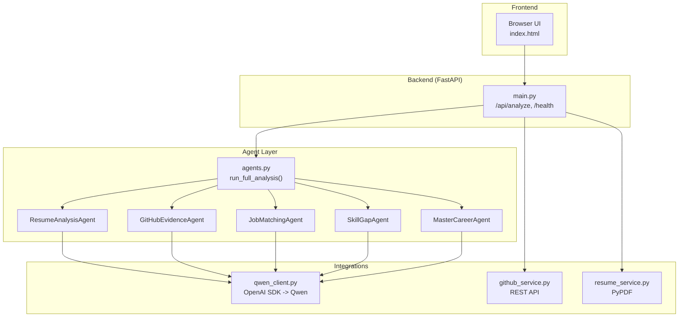
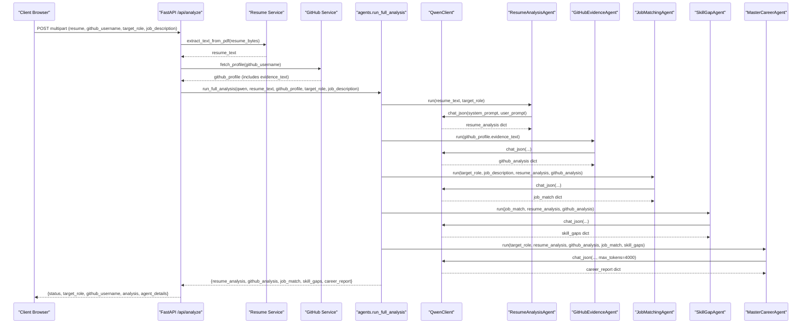
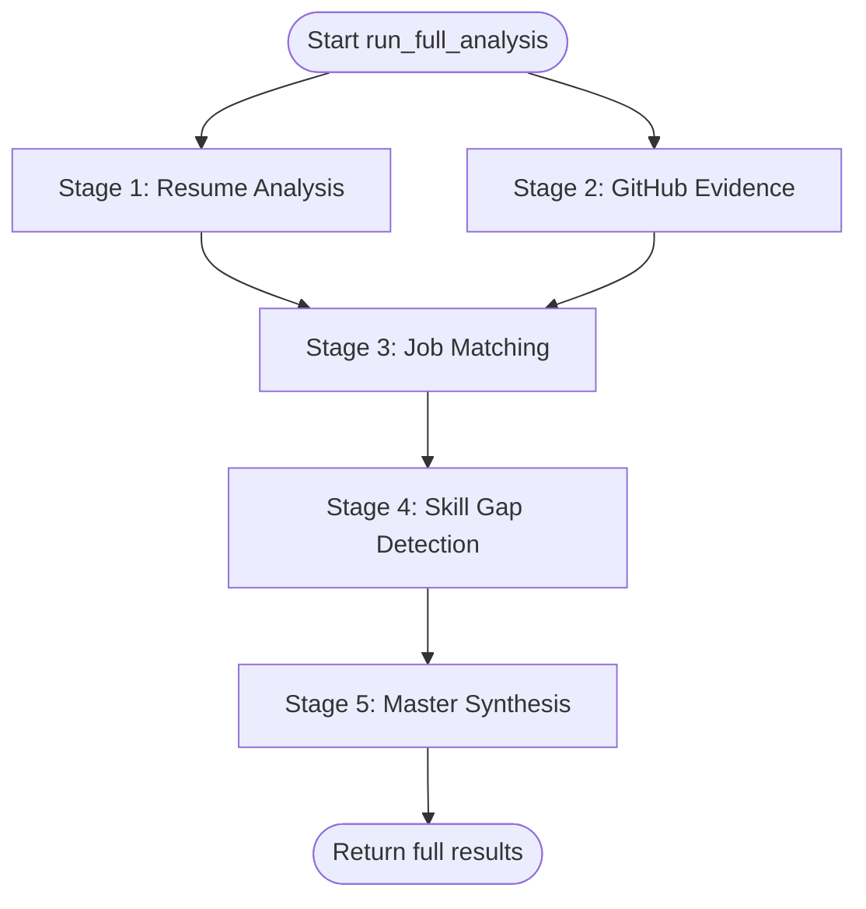
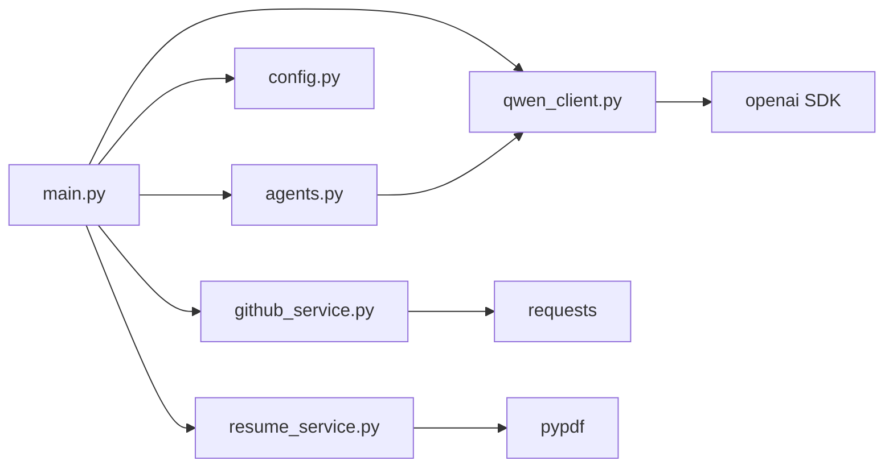

# System Architecture

<cite>
**Referenced Files in This Document**
- [main.py](file://src/main.py)
- [agents.py](file://src/agents.py)
- [config.py](file://src/config.py)
- [qwen_client.py](file://src/qwen_client.py)
- [github_service.py](file://src/github_service.py)
- [resume_service.py](file://src/resume_service.py)
- [index.html](file://src/static/index.html)
- [requirements.txt](file://requirements.txt)
- [README.md](file://README.md)
- [test_pipeline.py](file://tests/test_pipeline.py)
</cite>

## Table of Contents
1. [Introduction](#introduction)
2. [Project Structure](#project-structure)
3. [Core Components](#core-components)
4. [Architecture Overview](#architecture-overview)
5. [Detailed Component Analysis](#detailed-component-analysis)
6. [Dependency Analysis](#dependency-analysis)
7. [Performance Considerations](#performance-considerations)
8. [Troubleshooting Guide](#troubleshooting-guide)
9. [Conclusion](#conclusion)
10. [Appendices](#appendices)

## Introduction
CareerOS AI is a multi-agent career intelligence platform that evaluates a candidate’s readiness for a target role by combining evidence from two sources: the uploaded resume and the candidate’s public GitHub profile. Five specialized agents collaborate to analyze, match, and synthesize insights into an actionable report with scores, verified skills, gaps, recommendations, and a 30-day roadmap. The system uses Alibaba Cloud Model Studio (Qwen) via an OpenAI-compatible API, FastAPI for the web layer, PyPDF for resume text extraction, and the GitHub REST API for evidence gathering.

The orchestration pattern centers on a Master Career Agent that coordinates the pipeline execution and synthesizes outputs from four specialist agents: Resume Analyzer, GitHub Evidence Agent, Job Matcher, and Skill Gap Detector.

## Project Structure
The application is organized as a small service-oriented Python project:
- Application entry point and HTTP endpoints live in the FastAPI app.
- Agent logic and orchestration are encapsulated in a dedicated module.
- External integrations (LLM, GitHub, PDF parsing) are isolated in their own modules.
- Configuration is centralized and loaded from environment variables.
- A single-page frontend serves the UI and calls the backend API.

**Diagram sources**
- [main.py:28-147](file://src/main.py#L28-L147)
- [agents.py:295-335](file://src/agents.py#L295-L335)
- [qwen_client.py:70-158](file://src/qwen_client.py#L70-L158)
- [github_service.py:63-147](file://src/github_service.py#L63-L147)
- [resume_service.py:24-58](file://src/resume_service.py#L24-L58)
- [index.html:390-732](file://src/static/index.html#L390-L732)

**Section sources**
- [main.py:28-147](file://src/main.py#L28-L147)
- [README.md:173-202](file://README.md#L173-L202)

## Core Components
- FastAPI application layer: exposes endpoints for health checks and analysis; validates inputs; orchestrates external services and agent pipeline; returns structured results.
- Multi-agent system: five specialized agents implement focused prompts and return typed JSON structures consumed by subsequent stages.
- LLM client: thin wrapper around the OpenAI SDK configured to call Alibaba Cloud Model Studio (Qwen); enforces strict JSON output and includes retry logic for malformed responses.
- GitHub service: fetches user profile and repositories, filters forks, aggregates languages/topics, selects top repos, and builds an LLM-friendly evidence summary.
- Resume service: extracts text from PDFs using PyPDF, handles errors, and truncates long resumes to control prompt size and cost.
- Configuration: loads settings from environment variables including model credentials, timeouts, upload limits, and server bindings.

Key responsibilities and interactions:
- Input validation and error mapping occur at the API boundary.
- Evidence gathering runs before agent orchestration.
- Agents communicate through well-defined dictionaries; the Master agent synthesizes final outputs.
- All external calls are wrapped with timeouts and error handling.

**Section sources**
- [main.py:58-147](file://src/main.py#L58-L147)
- [agents.py:29-290](file://src/agents.py#L29-L290)
- [qwen_client.py:27-158](file://src/qwen_client.py#L27-L158)
- [github_service.py:22-173](file://src/github_service.py#L22-L173)
- [resume_service.py:17-58](file://src/resume_service.py#L17-L58)
- [config.py:23-79](file://src/config.py#L23-L79)

## Architecture Overview
The system follows a service-oriented architecture with clear boundaries:
- Presentation: static HTML served by FastAPI.
- API: request validation, input sanitization, and response formatting.
- Orchestration: pipeline coordinator that sequences agent calls and composes outputs.
- Integrations: LLM provider (Qwen), GitHub REST API, and PDF parser.

**Diagram sources**
- [main.py:58-147](file://src/main.py#L58-L147)
- [agents.py:295-335](file://src/agents.py#L295-L335)
- [qwen_client.py:97-158](file://src/qwen_client.py#L97-L158)
- [github_service.py:63-147](file://src/github_service.py#L63-L147)
- [resume_service.py:24-58](file://src/resume_service.py#L24-L58)

## Detailed Component Analysis

### FastAPI Application Layer
Responsibilities:
- Serve the single-page frontend.
- Provide a health endpoint reporting configuration status and model info.
- Validate incoming requests (file type, size, required fields).
- Gather evidence (resume text and GitHub profile).
- Execute the agent pipeline and map exceptions to appropriate HTTP statuses.
- Return both synthesized report and raw agent outputs for transparency.

Design notes:
- Sync endpoint used intentionally so long-running LLM calls do not block the event loop.
- Errors from integrations are converted to meaningful HTTP responses.

**Section sources**
- [main.py:28-147](file://src/main.py#L28-L147)

### Multi-Agent System and Orchestration
Agents:
- Resume Analysis Agent: extracts claimed skills, experience, education, and quality notes from resume text.
- GitHub Evidence Agent: derives verified skills from public activity, repo highlights, and language usage.
- Job Matching Agent: defines required skills for the target role and matches against candidate data.
- Skill Gap Agent: identifies critical and moderate gaps and quick wins based on requirements vs. demonstrated skills.
- Master Career Agent: synthesizes all outputs into a comprehensive report with scores, strengths, gaps, evidence, recommendations, and a 30-day roadmap.

Orchestration:
- Pipeline function constructs agents and executes them in dependency order.
- Stage 1 and 2 (resume and GitHub analyses) are independent and can be conceptually parallelized.
- Stage 3 and 4 depend on prior outputs.
- Stage 5 consumes all previous results to produce the final synthesis.

**Diagram sources**
- [agents.py:295-335](file://src/agents.py#L295-L335)

**Section sources**
- [agents.py:29-290](file://src/agents.py#L29-L290)
- [agents.py:295-335](file://src/agents.py#L295-L335)

### LLM Integration (Qwen via OpenAI-Compatible API)
Implementation:
- Thin client wraps the OpenAI SDK, pointing base_url to Alibaba Cloud Model Studio.
- Enforces strict JSON output rules across all prompts.
- Includes robust JSON extraction to handle markdown fences or chatter.
- Implements one retry attempt when initial JSON parsing fails.

Error handling:
- Network/auth/timeout issues raise a domain-specific exception.
- Invalid JSON after retry raises a descriptive error.

Configuration:
- Model, temperature, max tokens, and timeout are configurable via environment variables.

**Section sources**
- [qwen_client.py:27-158](file://src/qwen_client.py#L27-L158)
- [config.py:29-48](file://src/config.py#L29-L48)

### GitHub Evidence Service
Capabilities:
- Fetches user profile and repositories via GitHub REST API.
- Filters out forks to focus on original work.
- Aggregates languages, topics, stars, and forks.
- Selects top repositories by stars and recent activity.
- Builds an LLM-friendly evidence text summary.

Error handling:
- Maps 404 to “user not found.”
- Detects rate limiting and suggests adding a token.
- Wraps other failures with friendly messages.

**Section sources**
- [github_service.py:22-173](file://src/github_service.py#L22-L173)

### Resume Service
Capabilities:
- Extracts text from uploaded PDFs using PyPDF.
- Validates pages and content.
- Truncates very long resumes to manage prompt length and cost.

Error handling:
- Raises specific errors for unreadable files, empty PDFs, and scanned/image-only documents.

**Section sources**
- [resume_service.py:17-58](file://src/resume_service.py#L17-L58)

### Frontend
Features:
- Single-page UI with drag-and-drop file upload.
- Health check on load to warn if model is not configured.
- Progress steps indicating pipeline phases.
- Renders score ring, breakdown bars, verified/unverified skills, strengths, evidence, gaps, recommendations, roadmap, and recommended project.
- Exposes raw agent outputs for transparency.

Integration:
- Submits multipart form to /api/analyze.
- Displays errors with contextual hints.

**Section sources**
- [index.html:390-732](file://src/static/index.html#L390-L732)

## Dependency Analysis
High-level dependencies:
- main.py depends on agents, config, github_service, qwen_client, resume_service.
- agents.py depends on qwen_client.
- qwen_client.py depends on openai SDK and config.
- github_service.py depends on requests and config.
- resume_service.py depends on pypdf and config.
- index.html depends on backend endpoints.

**Diagram sources**
- [main.py:17-21](file://src/main.py#L17-L21)
- [agents.py:21-24](file://src/agents.py#L21-L24)
- [qwen_client.py:18-24](file://src/qwen_client.py#L18-L24)
- [github_service.py:12-17](file://src/github_service.py#L12-L17)
- [resume_service.py:9-14](file://src/resume_service.py#L9-L14)

**Section sources**
- [requirements.txt:1-8](file://requirements.txt#L1-L8)

## Performance Considerations
- Concurrency: The FastAPI endpoint is synchronous; long-running LLM calls run in worker threads, preventing blocking of the event loop. For higher concurrency, consider running multiple Uvicorn workers behind a reverse proxy.
- Latency: Each agent makes at least one LLM call; total latency is dominated by network round-trips and model inference time. The pipeline currently executes sequentially due to data dependencies.
- Parallelism opportunities: Stages 1 and 2 (Resume Analysis and GitHub Evidence) are independent and could be executed concurrently to reduce overall latency.
- Token budgeting: Max tokens and temperature are configurable; the Master agent uses a higher token limit for synthesis.
- Rate limits: GitHub API rate limits can be increased with a personal access token; LLM providers may enforce rate limits and quotas.
- Caching: Consider caching GitHub profiles per username for short periods to reduce repeated network calls during iterative analysis.
- Scaling: Horizontal scaling via containerization and load balancing; stateless design supports easy replication.

[No sources needed since this section provides general guidance]

## Troubleshooting Guide
Common issues and resolutions:
- Missing model configuration: Ensure DASHSCOPE_API_KEY is set; the health endpoint reports whether the model is configured.
- Invalid resume: Only text-based PDFs are supported; scanned images will raise an error.
- GitHub errors: User not found or rate-limited; add a token to increase limits or verify the username.
- LLM errors: Authentication, rate limits, or timeouts; check network and credentials; invalid JSON triggers a retry once.

Operational tips:
- Use /health to verify runtime configuration.
- Inspect agent_details in the API response to debug individual agent outputs.
- Adjust timeouts and token limits via environment variables.

**Section sources**
- [main.py:45-55](file://src/main.py#L45-L55)
- [main.py:74-131](file://src/main.py#L74-L131)
- [qwen_client.py:120-158](file://src/qwen_client.py#L120-L158)
- [github_service.py:48-60](file://src/github_service.py#L48-L60)
- [resume_service.py:31-58](file://src/resume_service.py#L31-L58)

## Conclusion
CareerOS AI implements a clear, modular architecture where a FastAPI application layer coordinates a five-agent pipeline powered by Qwen via an OpenAI-compatible API. Evidence from resumes and GitHub is combined to produce an objective, evidence-based assessment with actionable recommendations. The design emphasizes separation of concerns, robust error handling, and configurability. With straightforward deployment options and room for horizontal scaling, the system balances simplicity with extensibility.

[No sources needed since this section summarizes without analyzing specific files]

## Appendices

### Technology Stack
- Language and framework: Python 3.9+, FastAPI, Uvicorn
- LLM integration: OpenAI SDK configured to call Alibaba Cloud Model Studio (Qwen)
- Data sources: PyPDF for resume text extraction; Requests for GitHub REST API
- Configuration: python-dotenv for environment variables
- Frontend: Plain HTML/CSS/JS served statically

**Section sources**
- [requirements.txt:1-8](file://requirements.txt#L1-L8)
- [README.md:74-104](file://README.md#L74-L104)

### Infrastructure Requirements
- Environment variables:
  - DASHSCOPE_API_KEY (required)
  - QWEN_BASE_URL, QWEN_MODEL, QWEN_TEMPERATURE, QWEN_MAX_TOKENS, QWEN_TIMEOUT
  - GITHUB_TOKEN (optional)
  - MAX_RESUME_MB, MAX_RESUME_CHARS
  - API_HOST, API_PORT
- Compute: Any Python host capable of running Uvicorn; suitable for cloud VMs or containers.
- Networking: Outbound access to Alibaba Cloud Model Studio and GitHub APIs.

**Section sources**
- [config.py:29-69](file://src/config.py#L29-L69)
- [README.md:108-149](file://README.md#L108-L149)

### Deployment Topology Options
- Single-process development: Run Uvicorn directly for local testing.
- Production:
  - Containerize the application and deploy to a managed container service.
  - Place behind a reverse proxy (e.g., Nginx) for TLS termination and static asset caching.
  - Scale horizontally with multiple workers and replicas; stateless design supports easy replication.
  - Optionally introduce a message queue for asynchronous processing if analysis becomes a bottleneck.

[No sources needed since this section provides general guidance]

### Testing Strategy
- Offline unit tests replace the LLM with a fake client and use fixtures for GitHub data.
- Tests validate JSON extraction, error paths, and full pipeline ordering.
- No external network or API keys are required for test execution.

**Section sources**
- [test_pipeline.py:1-207](file://tests/test_pipeline.py#L1-L207)