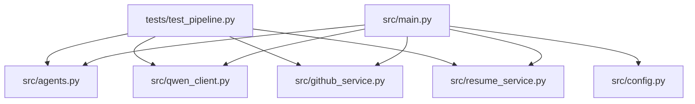
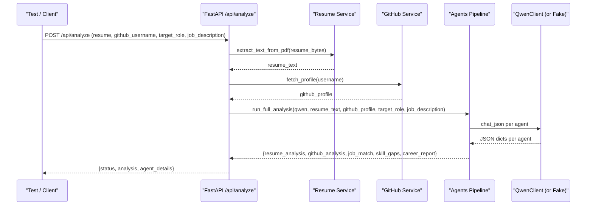
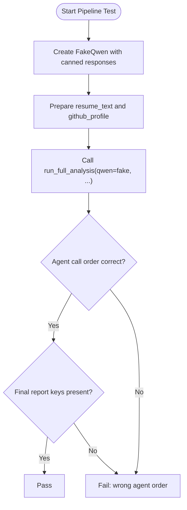
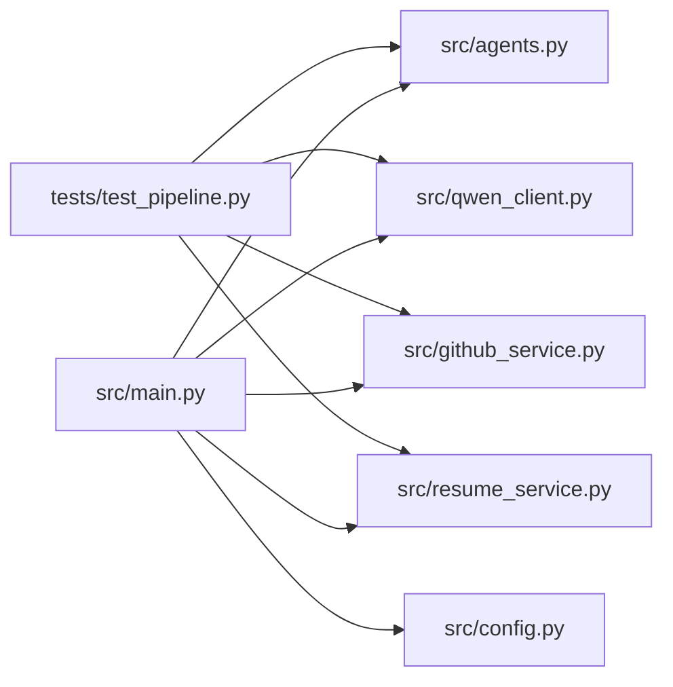

# Testing Strategy

<cite>
**Referenced Files in This Document**
- [README.md](file://README.md)
- [requirements.txt](file://requirements.txt)
- [tests/test_pipeline.py](file://tests/test_pipeline.py)
- [src/main.py](file://src/main.py)
- [src/config.py](file://src/config.py)
- [src/agents.py](file://src/agents.py)
- [src/qwen_client.py](file://src/qwen_client.py)
- [src/github_service.py](file://src/github_service.py)
- [src/resume_service.py](file://src/resume_service.py)
</cite>

## Table of Contents
1. Introduction
2. Project Structure
3. Core Components
4. Architecture Overview
5. Detailed Component Analysis
6. Dependency Analysis
7. Performance Considerations
8. Troubleshooting Guide
9. Conclusion
10. Appendices

## Introduction
This document describes the testing strategy and implementation for CareerOS AI. It explains how unit tests validate the multi-agent pipeline without requiring live API keys, how to mock external dependencies (Qwen API and GitHub services), and how to run and interpret tests. It also provides guidance on test coverage targets, best practices for multi-agent systems, asynchronous operation testing strategies, CI setup, performance testing, and maintaining high-quality tests with realistic fixtures.

## Project Structure
The repository organizes source code under src/, tests under tests/, and documentation/examples elsewhere. The current test suite focuses on offline validation of core logic using a fake LLM client and fixture data, ensuring deterministic and fast execution.

**Diagram sources**
- [tests/test_pipeline.py:1-207](file://tests/test_pipeline.py#L1-L207)
- [src/agents.py:1-335](file://src/agents.py#L1-L335)
- [src/qwen_client.py:1-158](file://src/qwen_client.py#L1-L158)
- [src/github_service.py:1-173](file://src/github_service.py#L1-L173)
- [src/resume_service.py:1-58](file://src/resume_service.py#L1-L58)
- [src/main.py:1-160](file://src/main.py#L1-L160)
- [src/config.py:1-79](file://src/config.py#L1-L79)

**Section sources**
- [README.md:173-202](file://README.md#L173-L202)
- [requirements.txt:1-8](file://requirements.txt#L1-L8)

## Core Components
- Agents orchestration: Five specialized agents execute sequentially within a single pipeline that produces a final career report.
- Qwen client: Wraps the OpenAI-compatible Qwen API, enforces JSON output rules, and retries once if parsing fails.
- GitHub service: Fetches public profile and repositories, then builds a compact summary used by the GitHub Evidence Agent.
- Resume service: Extracts text from uploaded PDFs with robust error handling and truncation limits.
- API layer: FastAPI endpoints validate inputs, gather evidence, invoke the agent pipeline, and return structured results.

Testing highlights:
- No network or API keys required for unit tests.
- Fake Qwen client records calls and returns canned responses.
- Pure functions are tested directly with fixture data.
- End-to-end pipeline is validated by asserting agent call order and final structure.

**Section sources**
- [src/agents.py:1-335](file://src/agents.py#L1-L335)
- [src/qwen_client.py:1-158](file://src/qwen_client.py#L1-L158)
- [src/github_service.py:1-173](file://src/github_service.py#L1-L173)
- [src/resume_service.py:1-58](file://src/resume_service.py#L1-L58)
- [tests/test_pipeline.py:1-207](file://tests/test_pipeline.py#L1-L207)

## Architecture Overview
The end-to-end analysis flow validates user input, gathers resume text and GitHub profile data, runs the five-agent pipeline, and returns a synthesized career report. Tests simulate this flow by injecting a fake Qwen client and prebuilt GitHub profile summaries.

**Diagram sources**
- [src/main.py:58-147](file://src/main.py#L58-L147)
- [src/agents.py:295-335](file://src/agents.py#L295-L335)
- [src/qwen_client.py:97-158](file://src/qwen_client.py#L97-L158)
- [src/github_service.py:63-89](file://src/github_service.py#L63-L89)
- [src/resume_service.py:24-58](file://src/resume_service.py#L24-L58)

## Detailed Component Analysis

### Unit Testing Approach with pytest
- Framework: pytest is documented as the runner; the existing test file uses unittest but can be executed via pytest.
- Coverage: Target is 80%+ code coverage, focusing on critical paths and agents.
- Execution: Run all tests with pytest; generate HTML coverage reports.

Recommended pytest usage:
- Run all tests: pytest tests/ -v
- Run specific suites: pytest tests/test_pipeline.py -v
- Generate coverage: pytest tests/ --cov=src --cov-report=html

**Section sources**
- [README.md:261-283](file://README.md#L261-L283)

### Test Organization and Mocking Strategies
- Fake Qwen client: Records which agents called it and returns canned JSON responses to simulate the full pipeline deterministically.
- Fixture-driven GitHub data: build_profile_summary is tested with pure functions using predefined user and repos data.
- Error path testing: Resume service error cases use generated PDF bytes to assert proper exceptions.

Key patterns:
- Inject a fake QwenClient-like object into agents.run_full_analysis to avoid network calls.
- Validate agent invocation order and final result shape to ensure correct orchestration.
- Use small, focused test classes per component for clarity and maintainability.

**Section sources**
- [tests/test_pipeline.py:28-65](file://tests/test_pipeline.py#L28-L65)
- [tests/test_pipeline.py:79-119](file://tests/test_pipeline.py#L79-L119)
- [tests/test_pipeline.py:124-136](file://tests/test_pipeline.py#L124-L136)
- [tests/test_pipeline.py:141-203](file://tests/test_pipeline.py#L141-L203)

### Pipeline Testing Methodology
- Objective: Validate end-to-end analysis workflows without real API keys.
- Technique: Provide a FakeQwen instance to run_full_analysis; supply minimal resume text and a synthetic GitHub profile summary.
- Assertions: Confirm all five agents run in order and the final report contains expected keys and values.

**Diagram sources**
- [tests/test_pipeline.py:141-203](file://tests/test_pipeline.py#L141-L203)
- [src/agents.py:295-335](file://src/agents.py#L295-L335)

**Section sources**
- [tests/test_pipeline.py:141-203](file://tests/test_pipeline.py#L141-L203)

### Qwen Client Testing
- Constructor validation: Ensure missing or blank API key raises QwenError.
- JSON extraction: Verify extract_json_object handles plain JSON, markdown fences, chatter around JSON, and invalid inputs.

Best practices:
- Keep these tests fast and deterministic.
- Add edge cases for malformed LLM outputs to improve resilience.

**Section sources**
- [tests/test_pipeline.py:44-65](file://tests/test_pipeline.py#L44-L65)
- [tests/test_pipeline.py:69-74](file://tests/test_pipeline.py#L69-L74)
- [src/qwen_client.py:27-68](file://src/qwen_client.py#L27-L68)
- [src/qwen_client.py:70-96](file://src/qwen_client.py#L70-L96)

### GitHub Service Testing
- Focus on pure function build_profile_summary: verify language ordering, fork exclusion, top repo selection, topics aggregation, and evidence text content.
- For integration-style tests, consider mocking requests.get to simulate rate limits and not-found scenarios.

**Section sources**
- [tests/test_pipeline.py:79-119](file://tests/test_pipeline.py#L79-L119)
- [src/github_service.py:92-173](file://src/github_service.py#L92-L173)

### Resume Service Testing
- Validate error paths: non-PDF bytes and blank PDFs should raise ResumeError.
- Consider adding tests for truncated resumes and very large files to enforce size limits.

**Section sources**
- [tests/test_pipeline.py:124-136](file://tests/test_pipeline.py#L124-L136)
- [src/resume_service.py:17-58](file://src/resume_service.py#L17-L58)

### API Layer Testing
- Input validation: Missing fields, non-PDF uploads, oversized files, empty files.
- Configuration checks: Unconfigured Qwen should return a 503 status.
- Integration: When running against a live server, test the full analyze endpoint; otherwise, rely on unit tests for business logic.

Suggested pytest approach:
- Use httpx or requests to send multipart form data to a local test server.
- Mock external calls (GitHub, Qwen) where appropriate to keep tests fast and deterministic.

**Section sources**
- [src/main.py:45-147](file://src/main.py#L45-L147)
- [src/config.py:76-79](file://src/config.py#L76-L79)

### Multi-Agent System Testing Best Practices
- Deterministic prompts and responses: Use fixed canned responses to stabilize assertions.
- Order-sensitive pipelines: Assert agent invocation sequence to catch regressions in orchestration.
- Schema validation: Validate each agent’s returned dict structure to prevent downstream breakage.
- Isolation: Keep tests independent; do not share mutable state between tests.

**Section sources**
- [src/agents.py:1-335](file://src/agents.py#L1-L335)
- [tests/test_pipeline.py:141-203](file://tests/test_pipeline.py#L141-L203)

### Asynchronous Operations Testing
- Current design: The analyze endpoint is synchronous; FastAPI runs sync handlers in worker threads to avoid blocking.
- If async endpoints are added later:
  - Use pytest-asyncio for async tests.
  - Mock async I/O (network calls) to avoid flakiness.
  - Prefer deterministic fixtures over live services.

[No sources needed since this section provides general guidance]

## Dependency Analysis
The test suite depends on the core modules to validate behavior without external services. The API layer depends on configuration and services, while the agents depend on the Qwen client.

**Diagram sources**
- [tests/test_pipeline.py:1-207](file://tests/test_pipeline.py#L1-L207)
- [src/main.py:1-160](file://src/main.py#L1-L160)
- [src/agents.py:1-335](file://src/agents.py#L1-L335)
- [src/qwen_client.py:1-158](file://src/qwen_client.py#L1-L158)
- [src/github_service.py:1-173](file://src/github_service.py#L1-L173)
- [src/resume_service.py:1-58](file://src/resume_service.py#L1-L58)
- [src/config.py:1-79](file://src/config.py#L1-L79)

**Section sources**
- [requirements.txt:1-8](file://requirements.txt#L1-L8)

## Performance Considerations
- Keep unit tests fast and deterministic by mocking external calls.
- Use small payloads for resume text and limited GitHub fixtures.
- For performance testing:
  - Measure time to complete the full pipeline under load using a local server and mocked services.
  - Track p95/p99 response times for the analyze endpoint.
  - Profile LLM prompt sizes and token usage to control cost and latency.

[No sources needed since this section provides general guidance]

## Troubleshooting Guide
Common issues and resolutions:
- Missing Qwen API key: Raises QwenError during client initialization; configure environment variables before running.
- Invalid resume PDF: ResumeError raised when file cannot be read or has no text; ensure valid, text-based PDFs.
- GitHub API errors: Rate limiting or not found; add GITHUB_TOKEN or verify username; handle HTTP status codes gracefully.
- Flaky tests: Ensure mocks are isolated per test; avoid shared mutable state; pin random seeds if randomness is introduced.

Debugging tips:
- Print or log agent call sequences to verify pipeline order.
- Inspect extracted JSON from LLM replies to understand parsing failures.
- Use verbose pytest output (-vv) to see detailed assertion failures.

**Section sources**
- [src/qwen_client.py:27-96](file://src/qwen_client.py#L27-L96)
- [src/resume_service.py:17-58](file://src/resume_service.py#L17-L58)
- [src/github_service.py:22-60](file://src/github_service.py#L22-L60)
- [tests/test_pipeline.py:44-74](file://tests/test_pipeline.py#L44-L74)

## Conclusion
CareerOS AI’s testing strategy centers on deterministic, offline unit tests that validate the multi-agent pipeline without external dependencies. By faking the Qwen client and using fixture data for GitHub summaries, tests remain fast, reliable, and focused on core logic. Extending the suite with API-level tests, more comprehensive fixtures, and performance benchmarks will further strengthen confidence in releases.

[No sources needed since this section summarizes without analyzing specific files]

## Appendices

### How to Run Tests
- Run all tests: pytest tests/ -v
- Run specific suite: pytest tests/test_pipeline.py -v
- Generate coverage: pytest tests/ --cov=src --cov-report=html

**Section sources**
- [README.md:261-283](file://README.md#L261-L283)

### Writing New Tests: Examples and Guidelines
- New agent: Create a test class that injects a FakeQwen with canned responses and asserts the agent’s output schema and behavior.
- API endpoint: Spin up a test server, send multipart form data, and assert status codes and response structure; mock GitHub and Qwen where possible.
- Service integration: Mock requests.get to simulate GitHub responses and cover error paths like rate limits and not found.

Guidelines:
- Keep tests small and focused.
- Use fixtures for reusable data (e.g., sample resumes, GitHub profiles).
- Validate both happy paths and error conditions.
- Avoid network calls in unit tests; reserve them for dedicated integration tests.

[No sources needed since this section provides general guidance]

### Continuous Integration and Automated Pipelines
- Recommended steps:
  - Install dependencies from requirements.txt.
  - Run unit tests with pytest and fail the build on any failure.
  - Generate coverage reports and enforce thresholds (e.g., 80%+).
  - Cache dependencies to speed up builds.
  - Optionally run linting and type checks.

[No sources needed since this section provides general guidance]

### Test Fixtures and Realistic Data
- Resume fixtures: Generate minimal PDFs with text for positive and negative cases.
- GitHub fixtures: Define representative users with varied languages, stars, forks, and topics; include edge cases like forks-only accounts.
- LLM responses: Maintain a library of canned JSON responses aligned with each agent’s expected schema.

[No sources needed since this section provides general guidance]