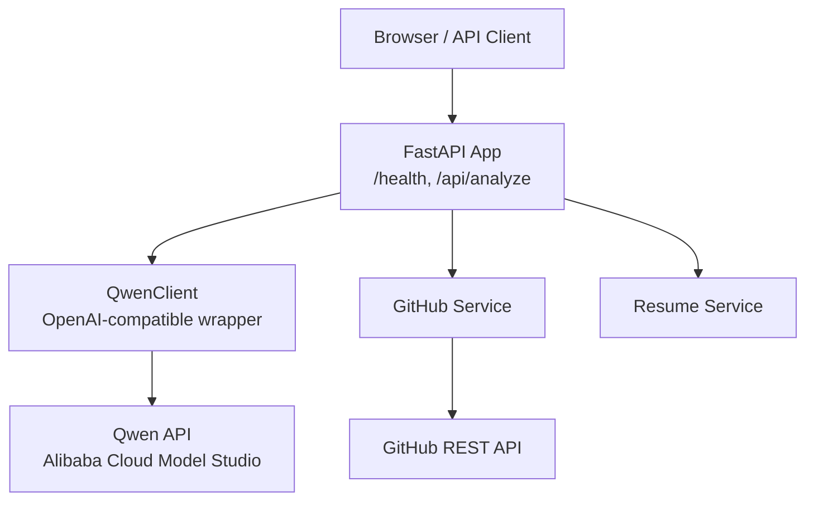
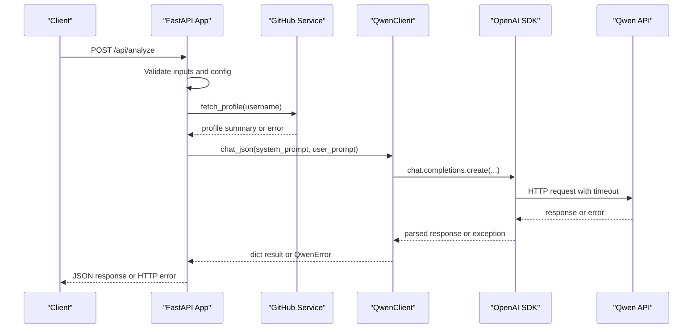
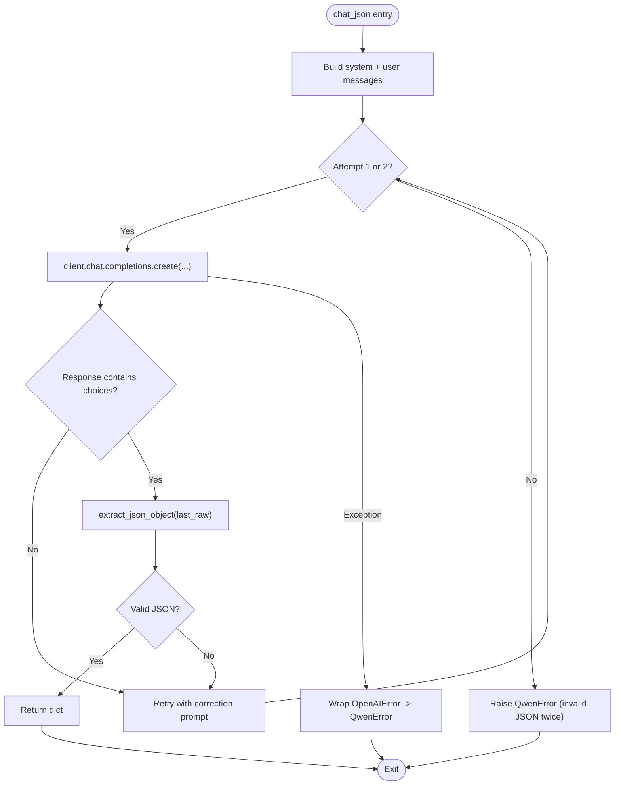
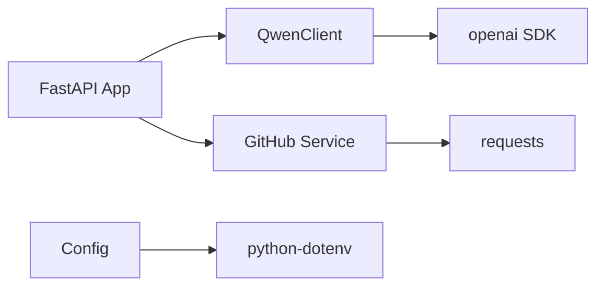

# API Connection Issues

<cite>
**Referenced Files in This Document**
- [qwen_client.py](file://src/qwen_client.py)
- [config.py](file://src/config.py)
- [main.py](file://src/main.py)
- [github_service.py](file://src/github_service.py)
- [resume_service.py](file://src/resume_service.py)
- [requirements.txt](file://requirements.txt)
- [README.md](file://README.md)
</cite>

## Table of Contents
1. [Introduction](#introduction)
2. [Project Structure](#project-structure)
3. [Core Components](#core-components)
4. [Architecture Overview](#architecture-overview)
5. [Detailed Component Analysis](#detailed-component-analysis)
6. [Dependency Analysis](#dependency-analysis)
7. [Performance Considerations](#performance-considerations)
8. [Troubleshooting Guide](#troubleshooting-guide)
9. [Conclusion](#conclusion)
10. [Appendices](#appendices)

## Introduction
This document explains how to diagnose and resolve API connection issues in CareerOS AI when communicating with the Qwen API via the OpenAI-compatible endpoint. It covers authentication errors, network timeouts, rate limiting, proxy configuration, SSL certificate problems, error messages from QwenError exceptions, timeout handling, retry strategies, connection pooling optimization, and monitoring techniques for API health checks and performance metrics.

## Project Structure
CareerOS AI is a FastAPI application that:
- Reads configuration from environment variables (including .env).
- Uses an OpenAI-compatible client to call Qwen through Alibaba Cloud Model Studio.
- Integrates GitHub REST API for evidence gathering.
- Serves a web UI and REST endpoints.

**Diagram sources**
- [main.py:28-55](file://src/main.py#L28-L55)
- [main.py:58-147](file://src/main.py#L58-L147)
- [qwen_client.py:70-95](file://src/qwen_client.py#L70-L95)
- [github_service.py:19-45](file://src/github_service.py#L19-L45)

**Section sources**
- [main.py:28-55](file://src/main.py#L28-L55)
- [main.py:58-147](file://src/main.py#L58-L147)
- [config.py:23-73](file://src/config.py#L23-L73)

## Core Components
- QwenClient: Thin wrapper around the OpenAI SDK to call Qwen’s OpenAI-compatible endpoint. Handles initialization, timeout, and JSON parsing of responses. Raises QwenError on failures.
- Config: Loads settings from environment variables (.env), including API key, base URL, model, temperature, max tokens, and timeouts.
- Main app: FastAPI endpoints for health checks and analysis; maps QwenError and other service errors to HTTP status codes.
- GitHub service: Fetches public GitHub data with timeouts and rate limit handling.
- Resume service: Extracts text from PDFs and enforces size limits.

Key responsibilities and failure points are concentrated in QwenClient and main.py, where external connectivity and configuration are validated.

**Section sources**
- [qwen_client.py:27-95](file://src/qwen_client.py#L27-L95)
- [config.py:23-73](file://src/config.py#L23-L73)
- [main.py:45-55](file://src/main.py#L45-L55)
- [main.py:58-147](file://src/main.py#L58-L147)
- [github_service.py:22-60](file://src/github_service.py#L22-L60)
- [resume_service.py:17-58](file://src/resume_service.py#L17-L58)

## Architecture Overview
The request flow for analysis involves validation, optional GitHub data retrieval, and multiple calls to Qwen. Errors from Qwen or GitHub are surfaced as HTTP errors with descriptive messages.

**Diagram sources**
- [main.py:58-147](file://src/main.py#L58-L147)
- [github_service.py:63-89](file://src/github_service.py#L63-L89)
- [qwen_client.py:97-157](file://src/qwen_client.py#L97-L157)

## Detailed Component Analysis

### QwenClient and QwenError
- Initialization validates the API key and sets base_url, model, temperature, max_tokens, and timeout from configuration.
- chat_json builds messages, attempts one call, and if the response is not valid JSON, retries once with a correction prompt.
- All OpenAI SDK exceptions are wrapped into QwenError with context about agent name and suggested checks.

**Diagram sources**
- [qwen_client.py:97-157](file://src/qwen_client.py#L97-L157)

Common error scenarios and resolutions:
- Authentication errors: Occur when DASHSCOPE_API_KEY is missing or invalid. The client raises QwenError during initialization or on API call. Ensure the key is set and correct.
- Network timeouts: Occur when requests exceed qwen_timeout_seconds. Increase timeout or investigate network stability.
- Rate limiting: Qwen may return rate limit errors; these are wrapped as QwenError. Reduce request frequency or adjust usage quotas.
- Invalid JSON output: If Qwen returns non-JSON, the client retries once with a correction prompt; otherwise raises QwenError with raw output snippet.

Resolution steps:
- Verify DASHSCOPE_API_KEY presence and correctness.
- Confirm QWEN_BASE_URL matches your region (international vs mainland China).
- Check network connectivity and firewall rules to the Qwen endpoint.
- Adjust QWEN_TIMEOUT if needed.
- Inspect raw output in QwenError messages for formatting issues.

**Section sources**
- [qwen_client.py:27-95](file://src/qwen_client.py#L27-L95)
- [qwen_client.py:97-157](file://src/qwen_client.py#L97-L157)

### Configuration and Environment Variables
Settings are loaded from environment variables and a local .env file at project root. Key variables:
- DASHSCOPE_API_KEY: Required for Qwen access.
- QWEN_BASE_URL: Endpoint for Qwen (international default; mainland China alternative documented).
- QWEN_MODEL, QWEN_TEMPERATURE, QWEN_MAX_TOKENS: Model tuning parameters.
- QWEN_TIMEOUT: Timeout in seconds for Qwen calls.
- GITHUB_TOKEN, GITHUB_TIMEOUT, GITHUB_MAX_REPOS: Optional GitHub integration settings.
- MAX_RESUME_MB, MAX_RESUME_CHARS: Upload constraints.
- API_HOST, API_PORT: Server binding.

Validation:
- is_qwen_configured() checks whether an API key is present.
- Health endpoint reports model and configuration status.

**Section sources**
- [config.py:23-73](file://src/config.py#L23-L73)
- [main.py:45-55](file://src/main.py#L45-L55)

### FastAPI Endpoints and Error Mapping
- GET /health: Returns app status, model, and whether Qwen is configured.
- POST /api/analyze: Validates inputs, extracts resume text, fetches GitHub profile, runs agents via QwenClient, and returns results.
- Error mapping:
  - Missing Qwen configuration: HTTP 503 with guidance to set DASHSCOPE_API_KEY.
  - QwenError: HTTP 502 with detailed message.
  - GitHubError: HTTP 502 with details.
  - ResumeError: HTTP 400 with user-friendly messages.

**Section sources**
- [main.py:45-55](file://src/main.py#L45-L55)
- [main.py:58-147](file://src/main.py#L58-L147)

### GitHub Service Integration
- Uses requests with configurable timeout.
- Adds Authorization header if GITHUB_TOKEN is set.
- Converts GitHub-specific errors (not found, rate limit) into GitHubError with actionable messages.

**Section sources**
- [github_service.py:22-60](file://src/github_service.py#L22-L60)
- [github_service.py:63-89](file://src/github_service.py#L63-L89)

### Resume Service Integration
- Extracts text from uploaded PDFs using pypdf.
- Enforces maximum size and character limits.
- Raises ResumeError for unreadable or empty content.

**Section sources**
- [resume_service.py:17-58](file://src/resume_service.py#L17-L58)

## Dependency Analysis
External dependencies relevant to API connections:
- openai: Provides the OpenAI SDK used by QwenClient to call Qwen’s compatible endpoint.
- requests: Used by GitHub service for HTTP calls.
- python-dotenv: Loads .env into environment variables.
- fastapi, uvicorn: Serve the API and run the server.

**Diagram sources**
- [requirements.txt:1-8](file://requirements.txt#L1-L8)
- [qwen_client.py:22-24](file://src/qwen_client.py#L22-L24)
- [github_service.py:15-17](file://src/github_service.py#L15-L17)
- [config.py:11-20](file://src/config.py#L11-L20)

**Section sources**
- [requirements.txt:1-8](file://requirements.txt#L1-L8)

## Performance Considerations
- Timeouts:
  - Qwen calls use qwen_timeout_seconds; increase if network latency is high or models take longer to respond.
  - GitHub calls use github_timeout_seconds; tune based on expected response times.
- Retries:
  - QwenClient performs one retry when JSON parsing fails, improving robustness against malformed outputs.
  - No automatic retry for transient network errors; consider adding exponential backoff at the application layer if needed.
- Connection pooling:
  - The OpenAI SDK manages underlying HTTP connections; ensure proxies and SSL settings are correctly configured if required by your environment.
  - For GitHub, requests sessions can be reused to improve performance; current implementation uses per-call requests.get with timeouts.

[No sources needed since this section provides general guidance]

## Troubleshooting Guide

### Step-by-step diagnostics

1. Verify DASHSCOPE_API_KEY configuration
   - Ensure .env exists at project root and includes DASHSCOPE_API_KEY.
   - Use GET /health to confirm qwen_configured is true.
   - If missing, initialize the client will raise QwenError indicating the key is not set.

2. Check QWEN_BASE_URL connectivity
   - Confirm the base URL matches your region:
     - International default endpoint is configured.
     - Mainland China accounts should use the documented alternative endpoint.
   - Test reachability from the server environment (e.g., curl or ping to the endpoint).

3. Validate network firewall settings
   - Ensure outbound HTTPS traffic to the Qwen endpoint is allowed.
   - If behind a corporate proxy, configure the OpenAI SDK to use the proxy (see below).

4. Diagnose authentication errors
   - Symptoms: QwenError raised during initialization or API call.
   - Resolution:
     - Confirm DASHSCOPE_API_KEY is correct and active.
     - Ensure no extra whitespace or hidden characters in the key.
     - Re-check account permissions and quotas in Alibaba Cloud Model Studio.

5. Diagnose network timeouts
   - Symptoms: QwenError mentioning timeout or network issues.
   - Resolution:
     - Increase QWEN_TIMEOUT to accommodate slower networks or heavier models.
     - Investigate DNS resolution and network stability.
     - Consider reducing max_tokens or temperature to shorten response time.

6. Diagnose rate limiting problems
   - Symptoms: QwenError indicating rate limit exceeded.
   - Resolution:
     - Reduce request frequency or batch requests.
     - Review usage quotas and billing settings in Alibaba Cloud Model Studio.
     - Implement application-level throttling or queuing.

7. OpenAI SDK integration issues
   - Ensure openai package is installed and up-to-date.
   - Confirm base_url and api_key are passed correctly to the SDK.
   - If using custom transports or proxies, verify they are compatible with the SDK.

8. Proxy configurations for enterprise environments
   - Configure the OpenAI SDK to route through your corporate proxy (environment variables like HTTP_PROXY/HTTPS_PROXY or SDK-specific options).
   - Ensure proxy allows outbound HTTPS to the Qwen endpoint.

9. SSL certificate problems
   - If SSL errors occur, verify CA certificates are installed on the server.
   - For internal proxies or intercepting firewalls, ensure proper certificate chains are trusted.
   - Avoid disabling SSL verification unless absolutely necessary and understood.

10. Error messages from QwenError exceptions
    - Initialization error: Indicates missing or invalid DASHSCOPE_API_KEY. Set the key in .env and restart.
    - API call error: Includes type and message from OpenAIError; check network, auth, rate limits, and base URL.
    - Invalid JSON twice: Raw output snippet included; refine prompts or adjust model parameters to enforce stricter JSON output.

11. Timeout handling and retry mechanisms
    - Current behavior: One retry on invalid JSON; no automatic retry on network errors.
    - Recommended enhancements:
      - Add exponential backoff for transient errors (network, rate limit).
      - Implement circuit breaker patterns for sustained failures.
      - Log and monitor retry attempts for observability.

12. Connection pooling optimization
    - Rely on OpenAI SDK’s built-in connection management.
    - Tune concurrency and worker threads in FastAPI/Uvicorn to match expected load.
    - Monitor connection pool utilization and adjust timeouts accordingly.

13. Monitoring techniques for API health checks and performance metrics
    - Use GET /health to report model and configuration status.
    - Instrument metrics:
      - Request latency for /api/analyze.
      - Success/failure rates for Qwen calls.
      - Timeout and rate limit counts.
    - Centralize logs:
      - Capture QwenError messages and stack traces.
      - Include correlation IDs for tracing requests across services.
    - Alerting:
      - Trigger alerts on elevated error rates or prolonged downtime.
      - Monitor upstream provider status pages for outages.

**Section sources**
- [qwen_client.py:27-95](file://src/qwen_client.py#L27-L95)
- [qwen_client.py:97-157](file://src/qwen_client.py#L97-L157)
- [config.py:23-73](file://src/config.py#L23-L73)
- [main.py:45-55](file://src/main.py#L45-L55)
- [main.py:58-147](file://src/main.py#L58-L147)

## Conclusion
CareerOS AI integrates with Qwen via an OpenAI-compatible endpoint and surfaces clear error signals through QwenError and HTTP status codes. Most connection issues stem from misconfiguration (missing or incorrect API key, wrong base URL), network constraints (timeouts, proxies, SSL), or provider-side limits (rate limiting). By validating environment variables, ensuring network reachability, tuning timeouts, and implementing robust retry and monitoring strategies, you can maintain reliable operation even in enterprise environments.

[No sources needed since this section summarizes without analyzing specific files]

## Appendices

### Environment variables reference
- DASHSCOPE_API_KEY: Required API key for Qwen.
- QWEN_BASE_URL: Qwen endpoint (international default; mainland China alternative documented).
- QWEN_MODEL: Model variant (e.g., qwen-plus).
- QWEN_TEMPERATURE: Sampling temperature.
- QWEN_MAX_TOKENS: Maximum tokens per response.
- QWEN_TIMEOUT: Timeout in seconds for Qwen calls.
- GITHUB_TOKEN: Optional token to increase GitHub API rate limit.
- GITHUB_TIMEOUT: Timeout in seconds for GitHub calls.
- GITHUB_MAX_REPOS: Number of repos to analyze.
- MAX_RESUME_MB: Maximum resume size in MB.
- MAX_RESUME_CHARS: Maximum resume characters.
- API_HOST, API_PORT: Server binding settings.

**Section sources**
- [config.py:23-73](file://src/config.py#L23-L73)
- [README.md:108-149](file://README.md#L108-L149)