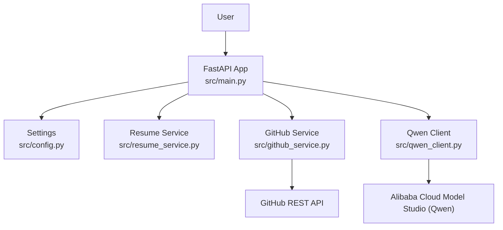
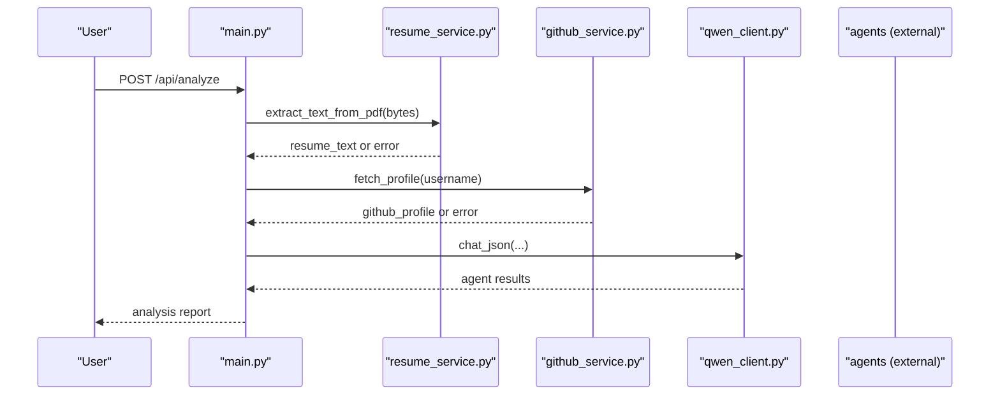
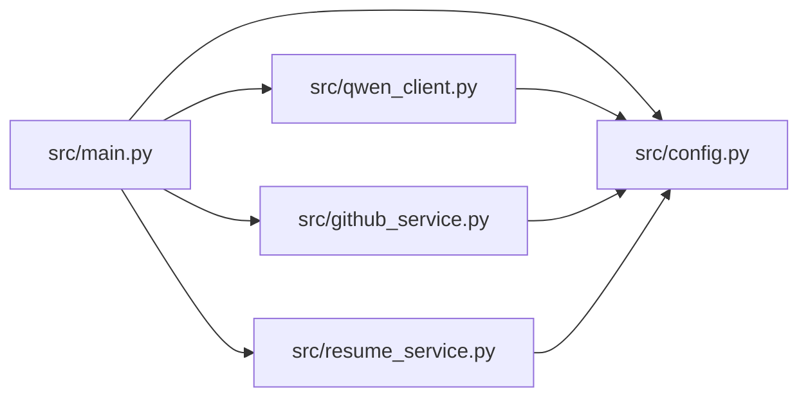

# Configuration and Setup Issues

<cite>
**Referenced Files in This Document**
- [README.md](file://README.md)
- [requirements.txt](file://requirements.txt)
- [.env.example](file://.env.example)
- [src/config.py](file://src/config.py)
- [src/main.py](file://src/main.py)
- [src/qwen_client.py](file://src/qwen_client.py)
- [src/github_service.py](file://src/github_service.py)
- [src/resume_service.py](file://src/resume_service.py)
</cite>

## Table of Contents
1. Introduction
2. Project Structure
3. Core Components
4. Architecture Overview
5. Detailed Component Analysis
6. Dependency Analysis
7. Performance Considerations
8. Troubleshooting Guide
9. Conclusion
10. Appendices

## Introduction
This document provides comprehensive troubleshooting guidance for configuration and setup issues in CareerOS AI. It focuses on environment variables, API keys, Python dependencies, virtual environments, server configuration, file system access, network connectivity, and validation procedures to help you diagnose and resolve common problems quickly.

## Project Structure
CareerOS AI is a FastAPI application that:
- Loads configuration from environment variables via a .env file
- Integrates with Alibaba Cloud Model Studio (Qwen) using an OpenAI-compatible client
- Fetches public GitHub profile data
- Extracts text from uploaded PDF resumes
- Serves a single-page web UI and REST endpoints

**Diagram sources**
- [src/main.py:28-55](file://src/main.py#L28-L55)
- [src/config.py:23-73](file://src/config.py#L23-L73)
- [src/resume_service.py:24-57](file://src/resume_service.py#L24-L57)
- [src/github_service.py:63-89](file://src/github_service.py#L63-L89)
- [src/qwen_client.py:70-95](file://src/qwen_client.py#L70-L95)

**Section sources**
- [README.md:108-149](file://README.md#L108-L149)
- [src/main.py:1-36](file://src/main.py#L1-L36)
- [src/config.py:1-20](file://src/config.py#L1-L20)

## Core Components
- Settings and environment loading: centralizes all configuration and loads .env automatically from the project root.
- Qwen client: validates API key presence and configures the OpenAI-compatible client.
- GitHub service: fetches public profile data with optional token-based rate limit increase.
- Resume service: extracts text from PDFs and enforces size/character limits.
- Main app: exposes health and analysis endpoints, validates inputs, and orchestrates services.

Key configuration variables include:
- DASHSCOPE_API_KEY (required)
- QWEN_BASE_URL, QWEN_MODEL, QWEN_TEMPERATURE, QWEN_MAX_TOKENS, QWEN_TIMEOUT
- GITHUB_TOKEN, GITHUB_TIMEOUT, GITHUB_MAX_REPOS
- MAX_RESUME_MB, MAX_RESUME_CHARS
- API_HOST, API_PORT

**Section sources**
- [src/config.py:23-73](file://src/config.py#L23-L73)
- [.env.example:10-51](file://.env.example#L10-L51)
- [src/qwen_client.py:70-95](file://src/qwen_client.py#L70-L95)
- [src/github_service.py:26-45](file://src/github_service.py#L26-L45)
- [src/resume_service.py:24-57](file://src/resume_service.py#L24-L57)
- [src/main.py:45-55](file://src/main.py#L45-L55)

## Architecture Overview
The application follows a layered architecture:
- Entry point (FastAPI) handles HTTP requests and input validation
- Services encapsulate external integrations (resume parsing, GitHub API)
- Qwen client abstracts LLM calls with retry logic for JSON formatting
- Settings module reads environment variables at startup

**Diagram sources**
- [src/main.py:58-147](file://src/main.py#L58-L147)
- [src/resume_service.py:24-57](file://src/resume_service.py#L24-L57)
- [src/github_service.py:63-89](file://src/github_service.py#L63-L89)
- [src/qwen_client.py:97-157](file://src/qwen_client.py#L97-L157)

## Detailed Component Analysis

### Environment Variables and Configuration
- The application loads .env from the project root automatically; ensure it exists and is not committed.
- Required variable: DASHSCOPE_API_KEY. Without it, the analysis endpoint returns a 503 error indicating missing configuration.
- Optional variables:
  - GitHub integration: GITHUB_TOKEN increases rate limits; without it, requests are limited.
  - Server binding: API_HOST and API_PORT control where the server listens.
  - Upload limits: MAX_RESUME_MB and MAX_RESUME_CHARS constrain resume size and length.
  - Qwen model tuning: QWEN_MODEL, QWEN_TEMPERATURE, QWEN_MAX_TOKENS, QWEN_TIMEOUT.

Common issues:
- Missing .env file or empty DASHSCOPE_API_KEY leads to immediate failure during analysis.
- Incorrect QWEN_BASE_URL causes connection errors or authentication failures.
- Invalid numeric values for timeouts or sizes cause type conversion errors at startup.

Validation tips:
- Use GET /health to check if Qwen is configured and which model is active.
- Confirm API_HOST/API_PORT by attempting to reach http://API_HOST:API_PORT/docs.

**Section sources**
- [src/config.py:16-20](file://src/config.py#L16-L20)
- [src/config.py:37-69](file://src/config.py#L37-L69)
- [src/main.py:45-55](file://src/main.py#L45-L55)
- [src/main.py:100-107](file://src/main.py#L100-L107)
- [.env.example:10-51](file://.env.example#L10-L51)

### Python Dependencies and Virtual Environments
- Dependencies are listed in requirements.txt and include FastAPI, Uvicorn, OpenAI SDK, python-dotenv, requests, pypdf, python-multipart, pydantic.
- Use a virtual environment to avoid conflicts with system packages.
- Install dependencies using pip install -r requirements.txt within the activated environment.

Common issues:
- Missing virtual environment activation leads to import errors or version mismatches.
- Outdated or incompatible package versions can cause runtime exceptions.
- Network restrictions may block pip installs or API calls.

Resolution steps:
- Create and activate a venv before installing requirements.
- Upgrade pip and reinstall dependencies if errors occur.
- Verify installed packages match expected versions.

**Section sources**
- [requirements.txt:1-8](file://requirements.txt#L1-L8)
- [README.md:123-132](file://README.md#L123-L132)

### Qwen Client and API Key Problems
- The Qwen client raises a specific error when DASHSCOPE_API_KEY is missing.
- Authentication, rate limits, timeouts, and network issues are wrapped into a unified error with actionable messages.
- The client attempts one retry if the initial response is not valid JSON.

Diagnostic steps:
- Ensure DASHSCOPE_API_KEY is set and correct.
- Confirm QWEN_BASE_URL matches your account region (international vs mainland China).
- Check QWEN_TIMEOUT if you experience slow responses or timeouts.
- Inspect network connectivity to the Qwen endpoint.

Error mapping:
- Missing API key: explicit error raised during client initialization.
- Auth/network errors: mapped to a descriptive error message including the underlying exception type.

**Section sources**
- [src/qwen_client.py:70-95](file://src/qwen_client.py#L70-L95)
- [src/qwen_client.py:120-157](file://src/qwen_client.py#L120-L157)
- [src/main.py:100-107](file://src/main.py#L100-L107)

### GitHub Integration and Rate Limits
- GitHub token is optional but recommended to avoid hitting rate limits.
- The service converts GitHub API errors into friendly messages, including rate limit notifications.
- Username validation ensures non-empty, whitespace-free input.

Common issues:
- 403 with zero remaining requests indicates rate limit reached; add GITHUB_TOKEN.
- 404 indicates user not found; verify username spelling and visibility.
- General failures return a generic error suggesting retry.

Diagnostics:
- Use GET /health to confirm whether a GitHub token is set.
- Test fetching profile manually with curl using your token if needed.

**Section sources**
- [src/github_service.py:26-60](file://src/github_service.py#L26-L60)
- [src/github_service.py:63-89](file://src/github_service.py#L63-L89)
- [src/main.py:45-55](file://src/main.py#L45-L55)

### Resume Upload and File System Access
- The resume service extracts text from PDFs using pypdf and enforces size and character limits.
- If the PDF contains no pages or no extractable text, a specific error is raised.
- Very long resumes are truncated to control prompt size and cost.

Common issues:
- Non-PDF uploads are rejected.
- Empty or scanned/image-only PDFs fail extraction.
- Oversized files exceed MAX_RESUME_MB and are rejected.

Diagnostics:
- Validate file extension and content before upload.
- Adjust MAX_RESUME_MB and MAX_RESUME_CHARS if necessary.
- Ensure the environment has read permissions for temporary buffers.

**Section sources**
- [src/resume_service.py:24-57](file://src/resume_service.py#L24-L57)
- [src/main.py:84-99](file://src/main.py#L84-L99)

### Server Binding, Ports, and Permissions
- The server binds to API_HOST and API_PORT from settings.
- Default host is 127.0.0.1 and port is 8000.
- Port conflicts will prevent the server from starting; choose an unused port or stop conflicting processes.
- Permission issues may arise if binding to privileged ports (<1024) or writing logs/uploads.

Diagnostics:
- Check for existing processes on the desired port.
- Change API_HOST/API_PORT in .env if needed.
- Run with elevated privileges only if required by your deployment policy.

**Section sources**
- [src/config.py:68-69](file://src/config.py#L68-L69)
- [src/main.py:150-159](file://src/main.py#L150-L159)
- [.env.example:45-51](file://.env.example#L45-L51)

## Dependency Analysis

**Diagram sources**
- [src/main.py:17-21](file://src/main.py#L17-L21)
- [src/qwen_client.py:24-24](file://src/qwen_client.py#L24-L24)
- [src/github_service.py:17-17](file://src/github_service.py#L17-L17)
- [src/resume_service.py:14-14](file://src/resume_service.py#L14-L14)
- [src/config.py:23-73](file://src/config.py#L23-L73)

**Section sources**
- [src/main.py:17-21](file://src/main.py#L17-L21)
- [src/config.py:23-73](file://src/config.py#L23-L73)

## Performance Considerations
- QWEN_TIMEOUT affects how long the client waits for LLM responses; adjust based on network conditions.
- QWEN_MAX_TOKENS controls output length; larger tokens increase latency and cost.
- GITHUB_MAX_REPOS limits the number of repositories analyzed; reduce for faster responses.
- MAX_RESUME_CHARS truncates very long resumes to keep prompts manageable.

[No sources needed since this section provides general guidance]

## Troubleshooting Guide

### Environment Variable Problems
Symptoms:
- 503 error on analysis endpoint stating the AI model is not configured.
- Health endpoint shows qwen_configured false.

Checklist:
- Ensure .env exists in the project root and is loaded automatically.
- Set DASHSCOPE_API_KEY to a valid key.
- Verify QWEN_BASE_URL matches your account region.
- Confirm QWEN_MODEL is supported.

Actions:
- Copy .env.example to .env and fill in required fields.
- Restart the application after changing .env.
- Use GET /health to validate configuration.

**Section sources**
- [src/config.py:16-20](file://src/config.py#L16-L20)
- [src/config.py:37-48](file://src/config.py#L37-L48)
- [src/main.py:45-55](file://src/main.py#L45-L55)
- [src/main.py:100-107](file://src/main.py#L100-L107)
- [.env.example:10-31](file://.env.example#L10-L31)

### API Key and Network Errors
Symptoms:
- Qwen client raises an error mentioning authentication or network issues.
- Requests time out or fail with status codes indicating auth or rate limits.

Checklist:
- Validate DASHSCOPE_API_KEY format and permissions.
- Confirm network access to the Qwen endpoint.
- Review QWEN_TIMEOUT and QWEN_MAX_TOKENS.

Actions:
- Re-enter the API key carefully (no extra spaces).
- Switch QWEN_BASE_URL if using a different region.
- Increase QWEN_TIMEOUT for slower networks.

**Section sources**
- [src/qwen_client.py:70-95](file://src/qwen_client.py#L70-L95)
- [src/qwen_client.py:120-157](file://src/qwen_client.py#L120-L157)

### GitHub Token and Rate Limiting
Symptoms:
- Error indicating rate limit reached.
- User not found or general request failure.

Checklist:
- Add GITHUB_TOKEN to .env to raise rate limits.
- Verify username correctness and public visibility.
- Check GITHUB_TIMEOUT and GITHUB_MAX_REPOS.

Actions:
- Generate a personal access token on GitHub and set GITHUB_TOKEN.
- Retry after some time if rate-limited.
- Reduce GITHUB_MAX_REPOS if needed.

**Section sources**
- [src/github_service.py:26-60](file://src/github_service.py#L26-L60)
- [src/github_service.py:63-89](file://src/github_service.py#L63-L89)
- [.env.example:33-42](file://.env.example#L33-L42)

### Python Dependency Conflicts and Installation Failures
Symptoms:
- Import errors or version mismatch exceptions.
- Pip installation fails due to network or dependency resolution issues.

Checklist:
- Activate virtual environment before installing.
- Ensure Python version meets requirements (Python 3.9+).
- Update pip and reinstall dependencies.

Actions:
- Recreate venv and run pip install -r requirements.txt.
- Pin versions if necessary by updating requirements.txt.
- Resolve network proxies or mirrors if behind corporate firewalls.

**Section sources**
- [requirements.txt:1-8](file://requirements.txt#L1-L8)
- [README.md:110-132](file://README.md#L110-L132)

### Docker Container Configuration
Note: No Dockerfile or container configuration was found in the repository. If deploying via Docker:
- Mount the project directory and .env into the container.
- Expose API_PORT and bind to API_HOST inside the container.
- Ensure environment variables are passed to the container process.

[No sources needed since this section provides general guidance]

### Virtual Environment Setup
Symptoms:
- ModuleNotFoundError or unexpected package versions.

Checklist:
- Create and activate venv prior to running the app.
- Install requirements within the activated environment.
- Verify interpreter path points to the venv.

Actions:
- Follow the quick start steps to create and activate venv.
- Reinstall dependencies if unsure about state.

**Section sources**
- [README.md:123-132](file://README.md#L123-L132)

### System Requirements Verification
Checklist:
- Python 3.9+ installed and accessible.
- Network access to required endpoints (Qwen, GitHub).
- Disk space for dependencies and temporary processing.

Actions:
- Confirm Python version with your shell.
- Test connectivity to external APIs from your environment.

[No sources needed since this section provides general guidance]

### Port Conflicts and Permission Issues
Symptoms:
- Server fails to start due to port already in use.
- Permission denied when binding to low-numbered ports.

Checklist:
- Choose an unused API_PORT.
- Avoid privileged ports unless necessary.
- Ensure write permissions for logs and uploads if used.

Actions:
- Stop conflicting processes or change API_PORT.
- Run with appropriate privileges if required.

**Section sources**
- [src/config.py:68-69](file://src/config.py#L68-L69)
- [src/main.py:150-159](file://src/main.py#L150-L159)
- [.env.example:45-51](file://.env.example#L45-L51)

### File Path Problems Across Operating Systems
Notes:
- The application loads .env from the project root regardless of launch directory.
- Static assets are served from src/static/index.html.

Checklist:
- Keep .env in the project root.
- Do not move or rename src/static/index.html.

Actions:
- Launch from the project root or ensure .env is present at the resolved project root.

**Section sources**
- [src/config.py:16-20](file://src/config.py#L16-L20)
- [src/main.py:23-42](file://src/main.py#L23-L42)

### Database Connection Issues
Note: There is no database layer in the current codebase. If adding persistence later, configure connection strings via environment variables and validate connectivity at startup.

[No sources needed since this section provides general guidance]

### File System Access Problems
Symptoms:
- Errors reading or writing files during resume processing or logging.

Checklist:
- Ensure readable/writable directories for any future uploads/logs.
- Avoid scanning/image-only PDFs; they cannot be extracted.

Actions:
- Adjust MAX_RESUME_MB and MAX_RESUME_CHARS as needed.
- Provide text-based PDFs for reliable extraction.

**Section sources**
- [src/resume_service.py:24-57](file://src/resume_service.py#L24-L57)

### Network Configuration Errors
Symptoms:
- Timeouts or connection errors to external APIs.

Checklist:
- Verify firewall/proxy settings allow outbound connections.
- Confirm QWEN_BASE_URL and GITHUB endpoints are reachable.

Actions:
- Configure proxy settings if required by your environment.
- Increase timeouts for unstable networks.

[No sources needed since this section provides general guidance]

### Validation Tools and Automated Setup Verification
Recommended checks:
- GET /health to verify application status and configuration flags.
- Validate .env contents against .env.example to ensure all required variables are present.
- Confirm dependencies are installed and compatible.

Automated script ideas:
- Read .env and assert required keys exist.
- Attempt a lightweight call to Qwen and GitHub endpoints to validate connectivity.
- Check Python version and installed packages against requirements.txt.

[No sources needed since this section provides general guidance]

### Migration Procedures for Configuration Updates
Guidelines:
- Back up the current .env before making changes.
- Update variables incrementally and restart the service.
- Use GET /health to confirm new settings take effect.
- Roll back to the previous .env if issues arise.

Backup restoration:
- Restore the backed-up .env file.
- Restart the application to revert to previous configuration.

[No sources needed since this section provides general guidance]

## Conclusion
Most setup issues in CareerOS AI stem from environment configuration, dependency management, and network access. By ensuring a valid .env, correct API keys, proper virtual environment usage, and appropriate server bindings, you can reliably run the application. Use the health endpoint and targeted diagnostics to quickly identify and resolve problems across Qwen integration, GitHub access, resume processing, and server configuration.

[No sources needed since this section summarizes without analyzing specific files]

## Appendices

### Quick Reference: Common Endpoints and Checks
- GET /health: Returns application status and configuration flags.
- GET /docs: Interactive API documentation.
- POST /api/analyze: Runs the full multi-agent analysis.

**Section sources**
- [src/main.py:39-55](file://src/main.py#L39-L55)
- [src/main.py:58-147](file://src/main.py#L58-L147)