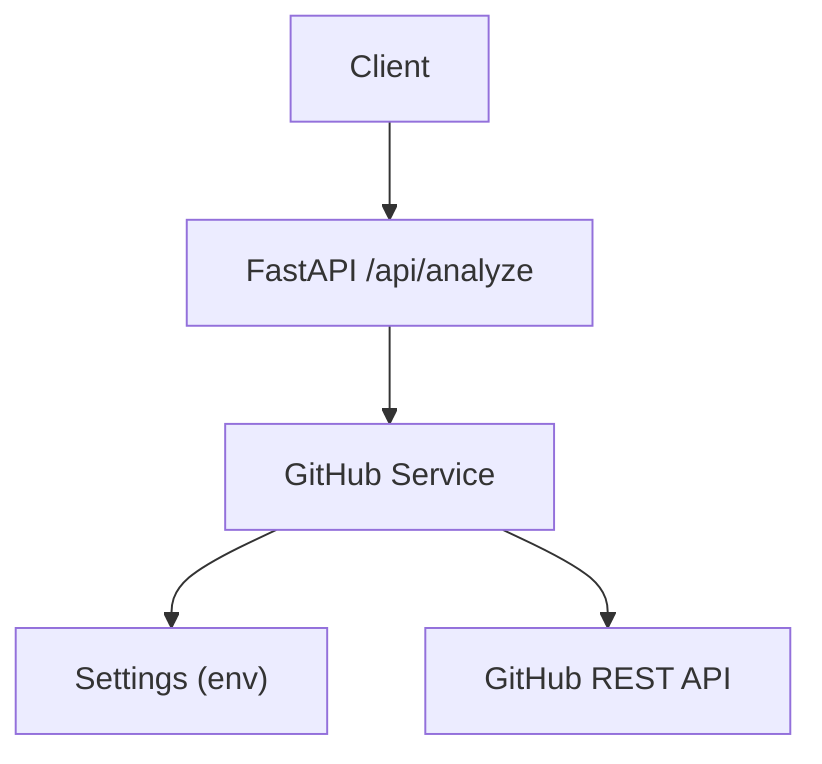
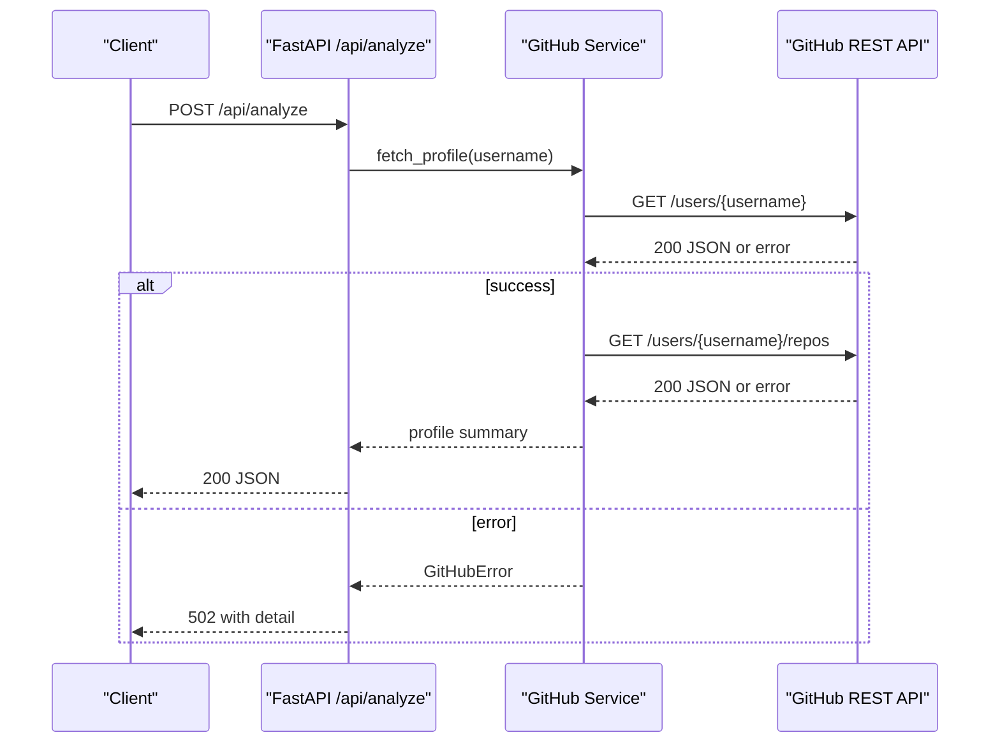
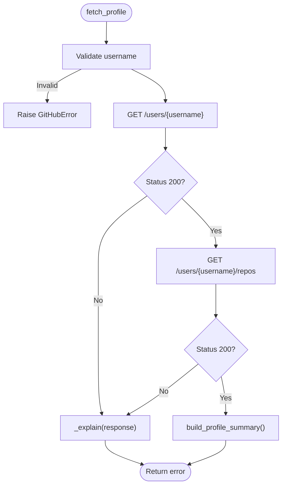
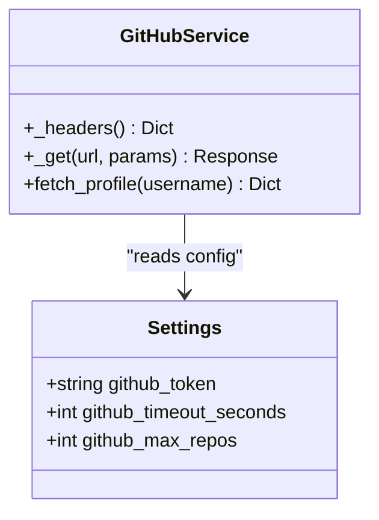
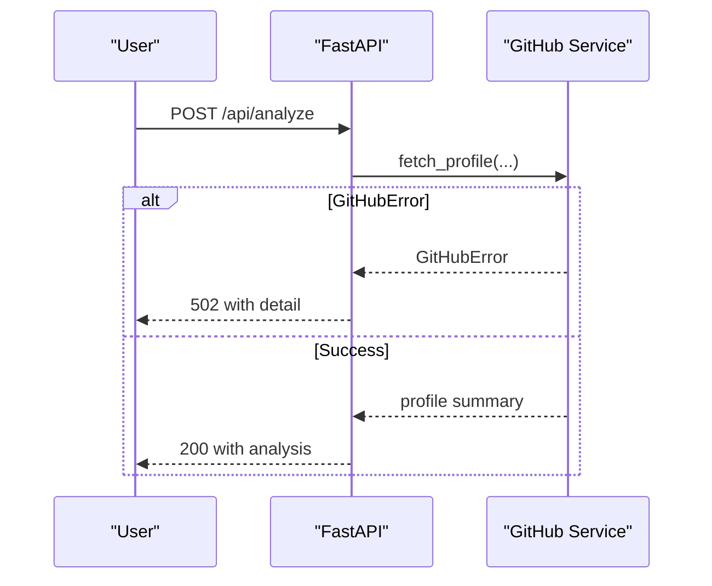
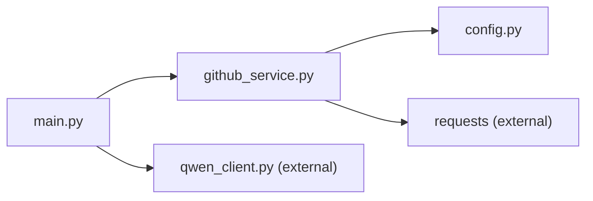

# GitHub API Errors

<cite>
**Referenced Files in This Document**
- [github_service.py](file://src/github_service.py)
- [config.py](file://src/config.py)
- [main.py](file://src/main.py)
- [README.md](file://README.md)
- [requirements.txt](file://requirements.txt)
</cite>

## Table of Contents
1. [Introduction](#introduction)
2. [Project Structure](#project-structure)
3. [Core Components](#core-components)
4. [Architecture Overview](#architecture-overview)
5. [Detailed Component Analysis](#detailed-component-analysis)
6. [Dependency Analysis](#dependency-analysis)
7. [Performance Considerations](#performance-considerations)
8. [Troubleshooting Guide](#troubleshooting-guide)
9. [Conclusion](#conclusion)
10. [Appendices](#appendices)

## Introduction
This document provides detailed troubleshooting guidance for GitHub API integration issues in CareerOS AI. It focuses on common error scenarios such as rate limit exceeded responses, authentication failures, and repository access permissions. It also includes diagnostic steps to verify configuration, validate user profile accessibility and repository visibility, and outlines strategies for handling rate limits, implementing retry logic, and managing token refresh cycles. Additional coverage includes private repositories, deleted accounts, network connectivity issues, GitHub Enterprise Server compatibility, custom domain configurations, proxy settings, and monitoring approaches for usage tracking and quota management.

## Project Structure
CareerOS AI integrates with the public GitHub REST API to fetch a developer’s profile and repositories for evidence-based analysis. The relevant components are:
- GitHub service module that performs HTTP requests and maps API errors to application exceptions.
- Configuration module that loads environment variables including the GitHub token and timeouts.
- Main FastAPI application that orchestrates the analysis pipeline and surfaces errors to clients.

**Diagram sources**
- [main.py:58-131](file://src/main.py#L58-L131)
- [github_service.py:26-89](file://src/github_service.py#L26-L89)
- [config.py:50-57](file://src/config.py#L50-L57)

**Section sources**
- [main.py:58-131](file://src/main.py#L58-L131)
- [github_service.py:26-89](file://src/github_service.py#L26-L89)
- [config.py:50-57](file://src/config.py#L50-L57)

## Core Components
- GitHubError exception is raised for invalid usernames, not found users, and rate limit conditions.
- Headers include Accept and API version; Authorization header is set when a token is present.
- GET requests use a configurable timeout from settings.
- Error mapping translates specific status codes into user-friendly messages.
- Profile fetching retrieves user info and repositories, then builds a summary used by downstream agents.

Key responsibilities:
- Validate inputs and normalize usernames.
- Make authenticated or unauthenticated requests based on token presence.
- Convert API responses into structured summaries.
- Surface meaningful errors to the API layer.

**Section sources**
- [github_service.py:22-89](file://src/github_service.py#L22-L89)
- [config.py:50-57](file://src/config.py#L50-L57)

## Architecture Overview
The request flow for GitHub data retrieval:
1. The FastAPI endpoint validates inputs and calls the GitHub service.
2. The GitHub service constructs headers and issues GET requests to the GitHub REST API.
3. Responses are checked; non-200 responses trigger error mapping.
4. Successful responses are transformed into a compact profile summary.
5. Errors are propagated back to the client via HTTPException.

**Diagram sources**
- [main.py:58-131](file://src/main.py#L58-L131)
- [github_service.py:63-89](file://src/github_service.py#L63-L89)

## Detailed Component Analysis

### GitHub Service Error Handling
- Username validation ensures non-empty and well-formed input.
- Requests use standard headers and optional authorization via token.
- Non-200 responses are mapped to friendly errors:
  - 404 indicates user not found.
  - 403 with zero remaining requests indicates rate limit reached.
  - Other errors return a generic failure message.

**Diagram sources**
- [github_service.py:63-89](file://src/github_service.py#L63-L89)
- [github_service.py:48-60](file://src/github_service.py#L48-L60)

**Section sources**
- [github_service.py:22-89](file://src/github_service.py#L22-L89)

### Configuration and Token Usage
- Settings load environment variables for GitHub token, timeout, and max repos.
- The token is optional; without it, requests are unauthenticated with lower rate limits.
- Timeout is applied to all GitHub API requests.

**Diagram sources**
- [config.py:50-57](file://src/config.py#L50-L57)
- [github_service.py:26-45](file://src/github_service.py#L26-L45)

**Section sources**
- [config.py:50-57](file://src/config.py#L50-L57)
- [github_service.py:26-45](file://src/github_service.py#L26-L45)

### API Layer Integration
- The analyze endpoint raises HTTPException with 502 status for GitHub-related errors.
- Health endpoint reports whether a GitHub token is configured.

**Diagram sources**
- [main.py:58-131](file://src/main.py#L58-L131)
- [github_service.py:63-89](file://src/github_service.py#L63-L89)

**Section sources**
- [main.py:58-131](file://src/main.py#L58-L131)

## Dependency Analysis
- The GitHub service depends on the requests library and reads configuration from the settings object.
- The main application imports GitHubError and uses it to convert service errors into HTTP responses.
- Dependencies are declared in requirements.txt.

**Diagram sources**
- [main.py:17-21](file://src/main.py#L17-L21)
- [github_service.py:12-17](file://src/github_service.py#L12-L17)
- [requirements.txt:1-8](file://requirements.txt#L1-L8)

**Section sources**
- [main.py:17-21](file://src/main.py#L17-L21)
- [github_service.py:12-17](file://src/github_service.py#L12-L17)
- [requirements.txt:1-8](file://requirements.txt#L1-L8)

## Performance Considerations
- Use a reasonable timeout for GitHub API requests to avoid hanging connections.
- Limit the number of repositories analyzed to reduce payload size and processing time.
- Prefer authenticated requests to increase rate limits and reduce throttling delays.
[No sources needed since this section provides general guidance]

## Troubleshooting Guide

### Common GitHub API Errors and Causes
- Rate limit exceeded:
  - Symptom: 403 response with zero remaining requests.
  - Cause: Unauthenticated requests limited to a low hourly quota.
  - Resolution: Set GITHUB_TOKEN in environment to raise limits significantly.
- Authentication failures:
  - Symptom: 401 or 403 responses indicating invalid or missing credentials.
  - Cause: Missing or malformed token; token may be revoked or scoped incorrectly.
  - Resolution: Ensure GITHUB_TOKEN is present and valid; verify token scopes if accessing restricted resources.
- Repository access permissions:
  - Symptom: Public endpoints succeed but expected data is missing or empty.
  - Cause: Repositories are private or user has hidden activity; only public data is fetched.
  - Resolution: Confirm repository visibility; note that the current implementation accesses public endpoints.

Diagnostic steps:
- Verify GITHUB_TOKEN configuration:
  - Check that the environment variable is loaded and non-empty.
  - Confirm the health endpoint reports the token is set.
- Check user profile accessibility:
  - Ensure the username exists and is publicly visible.
  - Validate that the account is not deleted or suspended.
- Validate repository visibility:
  - Confirm repositories are public; private repositories will not be included in public API responses.

**Section sources**
- [github_service.py:48-60](file://src/github_service.py#L48-L60)
- [main.py:45-55](file://src/main.py#L45-L55)
- [config.py:50-57](file://src/config.py#L50-L57)

### Handling Rate Limits
- Implement retry logic with exponential backoff:
  - Detect rate limit responses (status 403 with zero remaining).
  - Wait for a period before retrying; respect any Retry-After header if present.
  - Cap retries to avoid infinite loops.
- Manage token refresh cycles:
  - If using short-lived tokens, refresh before making requests.
  - Cache refreshed tokens securely and reuse within their validity window.
- Monitor usage and quotas:
  - Track X-RateLimit-Remaining and X-RateLimit-Reset headers to anticipate limits.
  - Log usage metrics and alert when nearing thresholds.

[No sources needed since this section provides general guidance]

### Managing Private Repositories and Deleted Accounts
- Private repositories:
  - The current service fetches public endpoints; private repositories are not included.
  - To access private data, implement authenticated endpoints with appropriate scopes and adjust logic to handle private repo visibility.
- Deleted accounts:
  - Expect 404 responses for non-existent or deleted users.
  - Provide clear feedback to users and allow them to correct the username.

**Section sources**
- [github_service.py:48-60](file://src/github_service.py#L48-L60)

### Network Connectivity Issues
- Symptoms: Timeouts, connection errors, DNS resolution failures.
- Actions:
  - Increase timeout if necessary; ensure network path to api.github.com is open.
  - Configure proxies if required by your environment.
  - Validate firewall rules and corporate proxy settings.

[No sources needed since this section provides general guidance]

### GitHub Enterprise Server Compatibility and Custom Domains
- Current implementation targets the public GitHub API base URL.
- For GitHub Enterprise Server:
  - Adjust the base URL to point to your enterprise instance.
  - Ensure the API version header matches supported versions on your server.
- Custom domains:
  - Update the base URL accordingly.
  - Verify TLS certificates and trust chains for internal domains.

[No sources needed since this section provides general guidance]

### Proxy Settings
- If operating behind a proxy:
  - Configure the requests library to use your proxy settings.
  - Ensure proxy authentication is handled if required.
  - Test connectivity to the GitHub API endpoint through the proxy.

[No sources needed since this section provides general guidance]

### Monitoring Approaches
- Track API usage:
  - Parse rate limit headers to monitor remaining requests and reset times.
  - Log successful and failed requests with timestamps and statuses.
- Quota management:
  - Alert when approaching limits to proactively throttle or pause operations.
  - Rotate tokens if multiple tokens are available to distribute load.
- Observability:
  - Expose metrics via health or dedicated endpoints for dashboards.
  - Integrate with logging and alerting systems for real-time insights.

[No sources needed since this section provides general guidance]

## Conclusion
CareerOS AI integrates with the GitHub REST API to gather evidence for career analysis. Most integration issues stem from rate limits, authentication misconfiguration, and repository visibility constraints. By verifying token configuration, validating user profiles, and ensuring repositories are public, most problems can be resolved. For robust operation, implement retry logic with backoff, manage token lifecycles, and monitor rate limit headers. When deploying in enterprise environments, adjust base URLs and proxy settings accordingly.

## Appendices

### Environment Variables Reference
- GITHUB_TOKEN: Optional personal access token to increase rate limits.
- GITHUB_TIMEOUT: Request timeout in seconds for GitHub API calls.
- GITHUB_MAX_REPOS: Maximum number of repositories to analyze per user.

**Section sources**
- [config.py:50-57](file://src/config.py#L50-L57)

### Quick Checks
- Health endpoint shows whether a GitHub token is configured.
- Ensure the username is valid and publicly accessible.
- Confirm repositories are public for inclusion in analysis.

**Section sources**
- [main.py:45-55](file://src/main.py#L45-L55)
- [github_service.py:63-89](file://src/github_service.py#L63-L89)