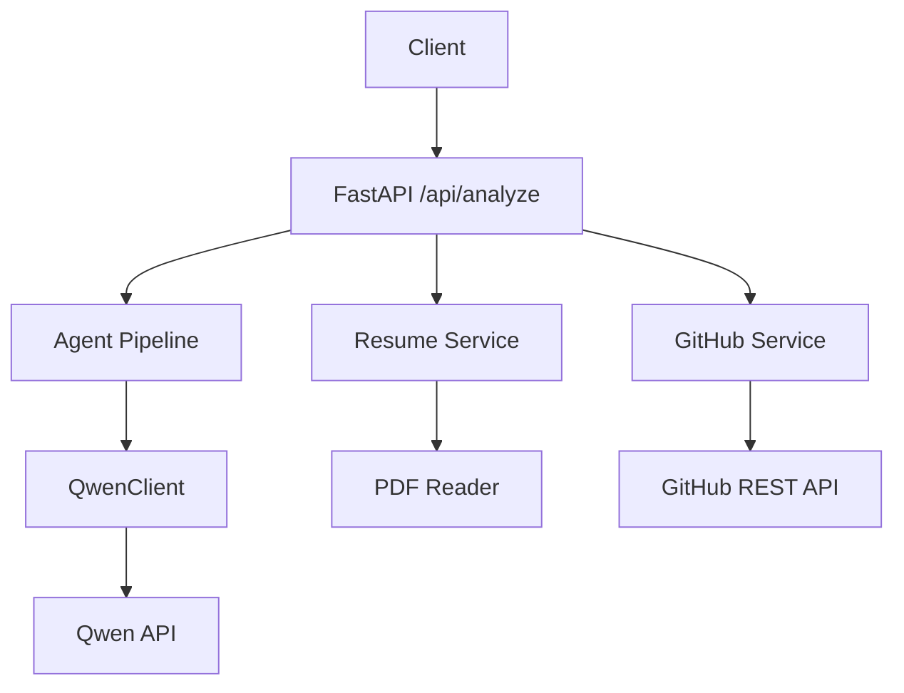
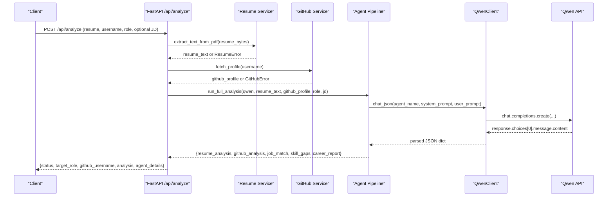
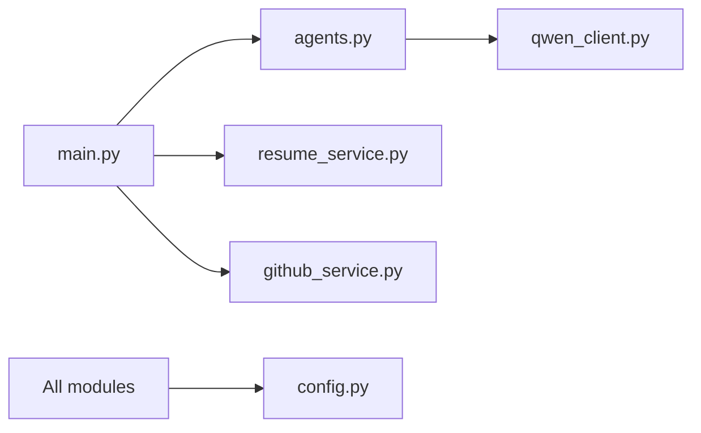

# Multi-Agent Pipeline Errors

<cite>
**Referenced Files in This Document**
- [main.py](file://src/main.py)
- [agents.py](file://src/agents.py)
- [qwen_client.py](file://src/qwen_client.py)
- [github_service.py](file://src/github_service.py)
- [resume_service.py](file://src/resume_service.py)
- [config.py](file://src/config.py)
- [test_pipeline.py](file://tests/test_pipeline.py)
</cite>

## Table of Contents
1. [Introduction](#introduction)
2. [Project Structure](#project-structure)
3. [Core Components](#core-components)
4. [Architecture Overview](#architecture-overview)
5. [Detailed Component Analysis](#detailed-component-analysis)
6. [Dependency Analysis](#dependency-analysis)
7. [Performance Considerations](#performance-considerations)
8. [Troubleshooting Guide](#troubleshooting-guide)
9. [Conclusion](#conclusion)
10. [Appendices](#appendices)

## Introduction
This document provides comprehensive troubleshooting guidance for multi-agent pipeline failures in CareerOS AI. It focuses on common orchestration issues such as agent communication failures, data format mismatches between agents, and pipeline execution timeouts. It also includes diagnostic procedures to identify failing stages, analyze inter-agent data flow, debug JSON schema validation errors, handle partial pipeline failures, implement rollback strategies, manage state persistence, address memory leaks during long-running analyses, resolve concurrent processing conflicts, and mitigate resource exhaustion scenarios. Finally, it covers error propagation through the pipeline, logging strategies for multi-stage debugging, performance bottleneck identification, recovery procedures for interrupted analyses, data consistency checks, and pipeline restart protocols.

## Project Structure
CareerOS AI is a FastAPI application that orchestrates five specialized LLM-powered agents to produce a career readiness report from a resume PDF and a GitHub profile. The key modules are:
- API entry point and request handling
- Agent definitions and pipeline orchestration
- Qwen client wrapper with JSON parsing and retry logic
- GitHub service for evidence gathering
- Resume service for PDF text extraction
- Configuration via environment variables

**Diagram sources**
- [main.py:58-147](file://src/main.py#L58-L147)
- [agents.py:295-335](file://src/agents.py#L295-L335)
- [qwen_client.py:70-158](file://src/qwen_client.py#L70-L158)
- [github_service.py:63-147](file://src/github_service.py#L63-L147)
- [resume_service.py:24-58](file://src/resume_service.py#L24-L58)

**Section sources**
- [main.py:1-160](file://src/main.py#L1-L160)
- [agents.py:1-335](file://src/agents.py#L1-L335)
- [qwen_client.py:1-158](file://src/qwen_client.py#L1-L158)
- [github_service.py:1-173](file://src/github_service.py#L1-L173)
- [resume_service.py:1-58](file://src/resume_service.py#L1-L58)
- [config.py:1-79](file://src/config.py#L1-L79)

## Core Components
- API layer validates inputs, gathers evidence (resume text and GitHub profile), constructs a Qwen client, and runs the full analysis pipeline.
- Agent pipeline executes five sequential stages: Resume Analysis, GitHub Evidence, Job Matching, Skill Gap, and Master Career synthesis.
- Qwen client handles chat calls, JSON extraction, and retry on invalid JSON.
- GitHub service fetches user profile and repositories, builds a compact summary with an evidence text block.
- Resume service extracts text from PDFs and truncates long resumes to control prompt size.
- Configuration centralizes settings including model parameters, timeouts, and upload limits.

Key responsibilities and failure points:
- Input validation and size limits can raise HTTP 400 errors early.
- External services (GitHub, Qwen) can fail due to network or rate limiting; these propagate as HTTP 502 or custom exceptions.
- JSON parsing failures in Qwen client lead to retries and eventual QwenError.
- Agent data contracts must be respected; mismatches cause downstream parsing or logic errors.

**Section sources**
- [main.py:58-147](file://src/main.py#L58-L147)
- [agents.py:295-335](file://src/agents.py#L295-L335)
- [qwen_client.py:42-158](file://src/qwen_client.py#L42-L158)
- [github_service.py:63-147](file://src/github_service.py#L63-L147)
- [resume_service.py:24-58](file://src/resume_service.py#L24-L58)
- [config.py:23-79](file://src/config.py#L23-L79)

## Architecture Overview
The pipeline follows a strict sequence where each stage depends on outputs from prior stages. Understanding this flow is essential for diagnosing failures and isolating problematic stages.

**Diagram sources**
- [main.py:58-147](file://src/main.py#L58-L147)
- [agents.py:295-335](file://src/agents.py#L295-L335)
- [qwen_client.py:97-158](file://src/qwen_client.py#L97-L158)
- [github_service.py:63-147](file://src/github_service.py#L63-L147)
- [resume_service.py:24-58](file://src/resume_service.py#L24-L58)

## Detailed Component Analysis

### API Layer Diagnostics (/api/analyze)
- Validates inputs: missing fields or non-PDF uploads result in HTTP 400.
- Enforces resume size limits based on configuration.
- Checks Qwen configuration before proceeding; otherwise returns HTTP 503.
- Gathers evidence: resume text extraction and GitHub profile fetching; errors map to appropriate HTTP status codes.
- Orchestrates the agent pipeline and returns structured results.

Common issues:
- Empty or malformed resume file leads to ResumeError and HTTP 400.
- Invalid GitHub username or rate limit triggers GitHubError and HTTP 502.
- Missing Qwen API key yields HTTP 503.

Recovery steps:
- Ensure valid PDF upload within size limits.
- Provide a correct GitHub username and consider adding a token to avoid rate limits.
- Configure DASHSCOPE_API_KEY and verify network connectivity.

**Section sources**
- [main.py:58-147](file://src/main.py#L58-L147)
- [resume_service.py:24-58](file://src/resume_service.py#L24-L58)
- [github_service.py:63-147](file://src/github_service.py#L63-L147)
- [config.py:23-79](file://src/config.py#L23-L79)

### Agent Pipeline Orchestration
The pipeline runs five agents sequentially:
1. Resume Analysis Agent: extracts claimed skills and experience.
2. GitHub Evidence Agent: derives verified skills from public activity.
3. Job Matching Agent: matches required skills against candidate’s claims and evidence.
4. Skill Gap Agent: identifies gaps and prioritizes development actions.
5. Master Career Agent: synthesizes final report with scores, strengths, gaps, roadmap, and recommendations.

Failure isolation:
- If any agent raises an exception (e.g., invalid JSON from LLM), the pipeline stops at that stage.
- Downstream agents depend on specific keys; missing or malformed keys cause runtime errors.

Partial failure handling:
- Wrap each agent call in try/except to capture stage-specific errors and return detailed diagnostics.
- Implement rollback by discarding partial results and returning a consistent error payload.

State persistence:
- Persist intermediate results per stage to allow resuming after interruptions.
- Use a unique analysis ID to correlate logs and stored states.

**Section sources**
- [agents.py:295-335](file://src/agents.py#L295-L335)
- [agents.py:30-290](file://src/agents.py#L30-L290)

### Qwen Client and JSON Validation
The Qwen client wraps chat completions and enforces strict JSON output rules. It attempts to parse the raw response and, if invalid, performs one repair attempt by feeding back the broken output and requesting corrected JSON.

JSON extraction behavior:
- Strips markdown fences and chatter around JSON.
- Raises ValueError when no JSON object is found.
- Retries once with a repair message before raising QwenError.

Diagnostics:
- Inspect last_raw content to understand formatting issues.
- Check shared JSON rules appended to prompts to ensure compliance.
- Validate model parameters (temperature, max_tokens) and timeout settings.

Recovery:
- Adjust temperature to reduce randomness if JSON instability occurs.
- Increase max_tokens if responses are truncated.
- Verify base URL and API key configuration.

**Section sources**
- [qwen_client.py:42-158](file://src/qwen_client.py#L42-L158)
- [config.py:23-79](file://src/config.py#L23-L79)

### GitHub Service
Fetches user profile and repositories, then builds a compact summary with an evidence text block used by the GitHub Evidence Agent.

Failure modes:
- Invalid username raises GitHubError.
- Rate limiting (403 with zero remaining) suggests adding a token.
- Network errors or unexpected status codes raise GitHubError.

Diagnostics:
- Log headers and status codes for failed requests.
- Confirm token presence and rate limit headers.
- Validate username normalization (strip @, slashes).

Recovery:
- Add GITHUB_TOKEN to increase rate limits.
- Retry with exponential backoff for transient network issues.

**Section sources**
- [github_service.py:22-90](file://src/github_service.py#L22-L90)
- [github_service.py:92-173](file://src/github_service.py#L92-L173)

### Resume Service
Extracts text from uploaded PDFs and truncates long resumes to control prompt size.

Failure modes:
- Non-PDF files or unreadable PDFs raise ResumeError.
- Empty pages or scanned/image-only PDFs raise ResumeError.

Diagnostics:
- Validate file type and size before upload.
- Check extracted text length and truncation behavior.

Recovery:
- Encourage users to upload text-based PDFs.
- Adjust MAX_RESUME_CHARS if necessary.

**Section sources**
- [resume_service.py:17-58](file://src/resume_service.py#L17-L58)

### Configuration and Timeouts
Settings include model parameters, timeouts, upload limits, and server bindings.

Key settings affecting reliability:
- QWEN_TIMEOUT controls LLM call timeouts.
- GITHUB_TIMEOUT controls external API timeouts.
- MAX_RESUME_MB and MAX_RESUME_CHARS control input sizes.
- QWEN_MODEL, QWEN_TEMPERATURE, QWEN_MAX_TOKENS influence response quality and stability.

Diagnostics:
- Log effective settings at startup.
- Monitor timeout-related failures and adjust thresholds accordingly.

**Section sources**
- [config.py:23-79](file://src/config.py#L23-L79)

## Dependency Analysis
The pipeline has clear dependencies:
- API depends on services and agents.
- Agents depend on Qwen client.
- Services depend on external APIs and configuration.

Potential coupling issues:
- Tight coupling between agents via shared dictionaries; changes in one agent’s output schema can break downstream agents.
- External service dependencies introduce latency and failure points.

Mitigation:
- Define explicit schemas for inter-agent data contracts.
- Add validation layers to enforce expected structures.
- Isolate external calls behind resilient wrappers with retries and fallbacks.

**Diagram sources**
- [main.py:17-21](file://src/main.py#L17-L21)
- [agents.py:21-25](file://src/agents.py#L21-L25)
- [qwen_client.py:18-25](file://src/qwen_client.py#L18-L25)
- [github_service.py:12-18](file://src/github_service.py#L12-L18)
- [resume_service.py:9-15](file://src/resume_service.py#L9-L15)
- [config.py:11-21](file://src/config.py#L11-L21)

**Section sources**
- [main.py:17-21](file://src/main.py#L17-L21)
- [agents.py:21-25](file://src/agents.py#L21-L25)
- [qwen_client.py:18-25](file://src/qwen_client.py#L18-L25)
- [github_service.py:12-18](file://src/github_service.py#L12-L18)
- [resume_service.py:9-15](file://src/resume_service.py#L9-L15)
- [config.py:11-21](file://src/config.py#L11-L21)

## Performance Considerations
- LLM calls dominate latency; tune temperature, max_tokens, and timeout to balance speed and reliability.
- Resume truncation reduces prompt size and cost; monitor effectiveness.
- GitHub API rate limits can stall pipelines; use tokens and consider caching profiles.
- Avoid excessive retries to prevent cascading delays; implement bounded retries with backoff.
- Monitor memory usage during long PDF parsing and large prompt construction.

[No sources needed since this section provides general guidance]

## Troubleshooting Guide

### Identifying the Failing Agent Stage
- Inspect logs around each agent call to see which stage fails first.
- Use unique analysis IDs to correlate logs across stages.
- Validate inter-agent data contracts; missing keys often indicate upstream failures.

Diagnostic procedure:
- Start with API-level logs to confirm input validation and evidence gathering succeeded.
- Proceed to agent pipeline logs; check each agent’s input and output structure.
- For JSON parsing errors, inspect last_raw content from Qwen client.

**Section sources**
- [agents.py:295-335](file://src/agents.py#L295-L335)
- [qwen_client.py:120-158](file://src/qwen_client.py#L120-L158)

### Analyzing Inter-Agent Data Flow
- Map expected keys for each agent’s output and validate them before passing downstream.
- Use test fixtures to simulate agent outputs and verify pipeline robustness.
- Log both inputs and outputs at each stage for traceability.

Validation tips:
- Ensure lists and dicts conform to expected shapes.
- Guard against None values and empty strings.
- Normalize data types (e.g., convert strings to integers where needed).

**Section sources**
- [agents.py:30-290](file://src/agents.py#L30-L290)
- [test_pipeline.py:141-203](file://tests/test_pipeline.py#L141-L203)

### Debugging JSON Schema Validation Errors
- Review shared JSON rules appended to prompts to ensure strict output compliance.
- Check for markdown fences or chatter in LLM responses; the client strips these but may still fail if structure is incorrect.
- Adjust temperature to reduce variability; increase max_tokens if responses are truncated.

Recovery steps:
- Trigger repair attempt by feeding back invalid JSON to the model.
- If persistent, switch models or adjust prompt templates.

**Section sources**
- [qwen_client.py:31-68](file://src/qwen_client.py#L31-L68)
- [qwen_client.py:97-158](file://src/qwen_client.py#L97-L158)

### Handling Partial Pipeline Failures and Rollback
- Wrap each agent call in try/except to capture stage-specific errors.
- Discard partial results and return a consistent error payload with stage details.
- Implement rollback by clearing persisted state for the failed analysis ID.

Best practices:
- Use idempotent operations where possible.
- Store checkpoints after each successful stage to enable resumption.

**Section sources**
- [agents.py:295-335](file://src/agents.py#L295-L335)

### Managing State Persistence
- Persist intermediate results keyed by analysis ID.
- On interruption, resume from the last checkpoint rather than restarting from scratch.
- Clean up stale states periodically to avoid storage bloat.

**Section sources**
- [agents.py:295-335](file://src/agents.py#L295-L335)

### Memory Leaks During Long-Running Analyses
- Avoid holding references to large objects beyond their scope.
- Use streaming or chunked processing for large PDFs if applicable.
- Monitor process memory and restart workers proactively if needed.

**Section sources**
- [resume_service.py:24-58](file://src/resume_service.py#L24-L58)

### Concurrent Processing Conflicts
- FastAPI runs sync endpoints in worker threads; ensure thread safety for shared resources.
- Avoid global mutable state; prefer request-scoped contexts.
- Use locks or queues to serialize access to shared resources like caches.

**Section sources**
- [main.py:58-147](file://src/main.py#L58-L147)

### Resource Exhaustion Scenarios
- Tune timeouts and limits to prevent hanging or excessive resource consumption.
- Implement circuit breakers for external services to fail fast under load.
- Monitor CPU, memory, and network usage; scale horizontally if needed.

**Section sources**
- [config.py:23-79](file://src/config.py#L23-L79)

### Error Propagation Through the Pipeline
- Convert service exceptions to HTTP status codes at the API boundary.
- Preserve error context (stage, message, raw output) for debugging.
- Avoid swallowing exceptions; log and surface meaningful errors.

**Section sources**
- [main.py:58-147](file://src/main.py#L58-L147)
- [github_service.py:22-90](file://src/github_service.py#L22-L90)
- [qwen_client.py:27-158](file://src/qwen_client.py#L27-L158)

### Logging Strategies for Multi-Stage Debugging
- Log at each stage with correlation IDs and timestamps.
- Include inputs and outputs (sanitized) for traceability.
- Capture stack traces for exceptions and external service responses.

**Section sources**
- [agents.py:295-335](file://src/agents.py#L295-L335)
- [qwen_client.py:120-158](file://src/qwen_client.py#L120-L158)

### Performance Bottlenecks Identification
- Profile LLM calls to measure latency and token usage.
- Identify slow external API calls and optimize retries/backoff.
- Reduce prompt sizes by truncating inputs and optimizing templates.

**Section sources**
- [config.py:23-79](file://src/config.py#L23-L79)
- [resume_service.py:24-58](file://src/resume_service.py#L24-L58)

### Recovery Procedures for Interrupted Analyses
- Save checkpoints after each successful stage.
- On restart, detect incomplete analyses and resume from the last checkpoint.
- Validate data consistency before resuming.

**Section sources**
- [agents.py:295-335](file://src/agents.py#L295-L335)

### Data Consistency Checks
- Validate inter-agent data contracts at boundaries.
- Use tests to assert expected structures and values.
- Log discrepancies and alert on schema violations.

**Section sources**
- [test_pipeline.py:141-203](file://tests/test_pipeline.py#L141-L203)

### Pipeline Restart Protocols
- Clear partial state for failed analyses.
- Re-run only failed stages if possible; otherwise restart from beginning.
- Notify clients of restart status and progress.

**Section sources**
- [agents.py:295-335](file://src/agents.py#L295-L335)

## Conclusion
CareerOS AI’s multi-agent pipeline is robust but susceptible to common orchestration issues such as agent communication failures, data format mismatches, and timeouts. By implementing rigorous validation, structured logging, resilient error handling, and state persistence, you can diagnose and recover from failures effectively. Focus on inter-agent data contracts, external service reliability, and performance tuning to maintain pipeline stability and responsiveness.

[No sources needed since this section summarizes without analyzing specific files]

## Appendices

### Quick Reference: Common Errors and Fixes
- ResumeError: Invalid or empty PDF; fix by uploading a text-based PDF within size limits.
- GitHubError: Invalid username or rate limit; fix by correcting username and adding a token.
- QwenError: Invalid JSON or API failure; fix by adjusting model parameters and verifying configuration.

**Section sources**
- [resume_service.py:17-58](file://src/resume_service.py#L17-L58)
- [github_service.py:22-90](file://src/github_service.py#L22-L90)
- [qwen_client.py:27-158](file://src/qwen_client.py#L27-L158)