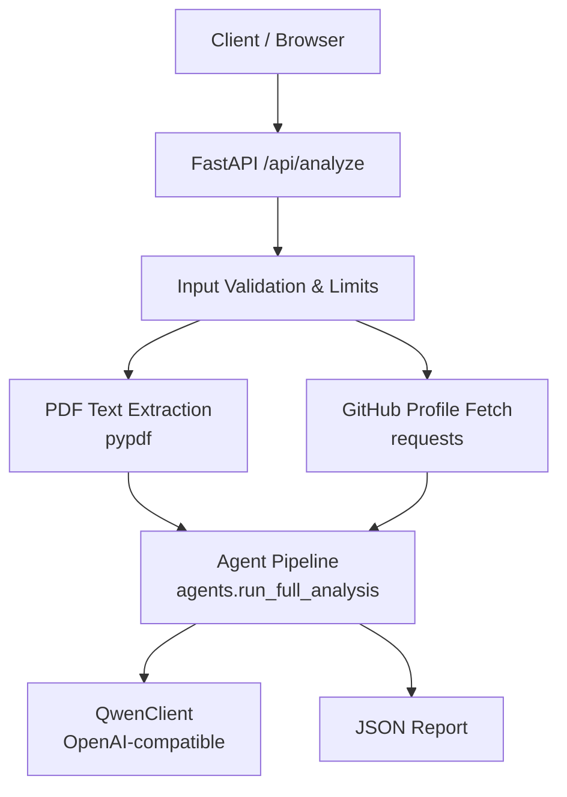
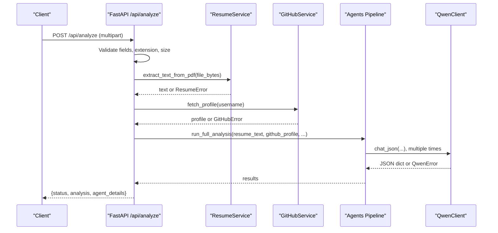
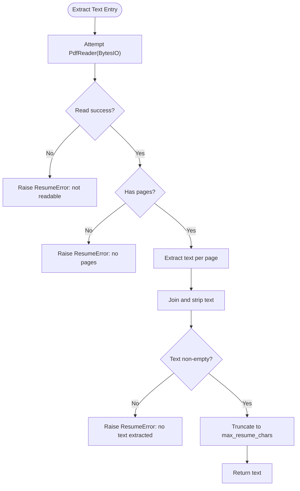
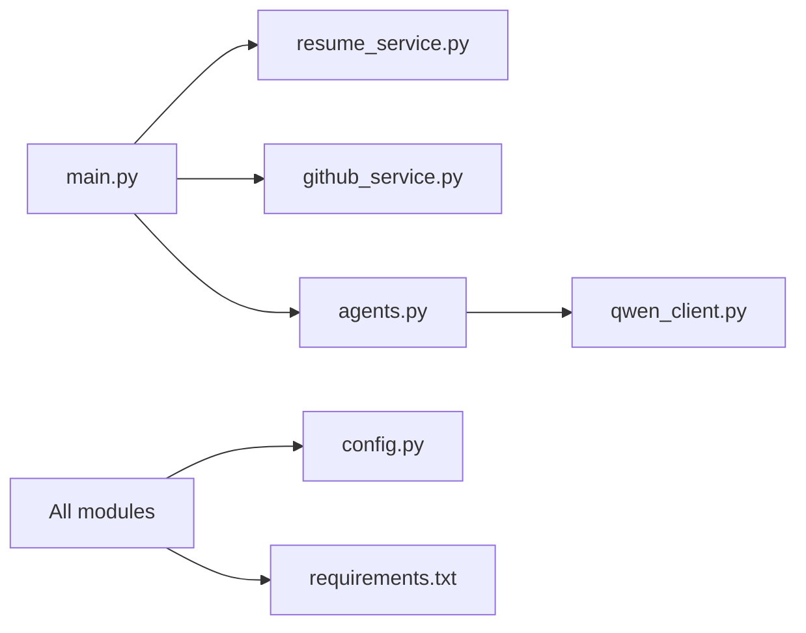

# Resume Processing Failures

<cite>
**Referenced Files in This Document**
- [main.py](file://src/main.py)
- [resume_service.py](file://src/resume_service.py)
- [config.py](file://src/config.py)
- [qwen_client.py](file://src/qwen_client.py)
- [github_service.py](file://src/github_service.py)
- [agents.py](file://src/agents.py)
- [requirements.txt](file://requirements.txt)
- [README.md](file://README.md)
- [test_pipeline.py](file://tests/test_pipeline.py)
</cite>

## Table of Contents
1. Introduction
2. Project Structure
3. Core Components
4. Architecture Overview
5. Detailed Component Analysis
6. Dependency Analysis
7. Performance Considerations
8. Troubleshooting Guide
9. Conclusion
10. Appendices

## Introduction
This document provides comprehensive troubleshooting guidance for resume processing failures in CareerOS AI, focusing on PDF parsing errors, file size and memory constraints, encoding and text extraction issues, malformed or scanned PDFs, timeout handling, disk space management, validation and MIME detection problems, temporary file cleanup, recovery procedures for failed uploads and batch processing, and performance optimization techniques for high-volume resume processing.

## Project Structure
CareerOS AI is a FastAPI application that:
- Accepts multipart form uploads containing a resume PDF and metadata (GitHub username, target role, optional job description).
- Validates inputs and enforces upload limits.
- Extracts text from the uploaded PDF using pypdf.
- Fetches GitHub profile evidence via the GitHub REST API.
- Runs a multi-agent analysis pipeline powered by Qwen through an OpenAI-compatible client.
- Returns a structured career readiness report.

**Diagram sources**
- [main.py:58-147](file://src/main.py#L58-L147)
- [resume_service.py:24-57](file://src/resume_service.py#L24-L57)
- [github_service.py:63-89](file://src/github_service.py#L63-L89)
- [agents.py:295-334](file://src/agents.py#L295-L334)
- [qwen_client.py:70-157](file://src/qwen_client.py#L70-L157)

**Section sources**
- [main.py:1-160](file://src/main.py#L1-L160)
- [README.md:173-202](file://README.md#L173-L202)

## Core Components
- Input validation and upload enforcement occur at the API layer before any heavy processing begins.
- PDF text extraction uses pypdf; it raises specific errors for unreadable or empty PDFs and when no text can be extracted.
- GitHub evidence fetching uses requests with timeouts and rate-limit handling.
- The agent pipeline orchestrates five specialized agents and a master synthesis step.
- Configuration is environment-driven, including upload limits and model settings.

Key responsibilities and failure points:
- File type and size validation in the API endpoint.
- PDF parsing and text extraction robustness.
- Network timeouts and rate limits for GitHub and Qwen calls.
- Memory usage during large PDF reads and long prompts.
- Error propagation to user-friendly HTTP responses.

**Section sources**
- [main.py:74-118](file://src/main.py#L74-L118)
- [resume_service.py:17-57](file://src/resume_service.py#L17-L57)
- [github_service.py:22-89](file://src/github_service.py#L22-L89)
- [agents.py:295-334](file://src/agents.py#L295-L334)
- [config.py:23-79](file://src/config.py#L23-L79)

## Architecture Overview
The end-to-end flow for resume analysis includes:
- Multipart form submission with resume PDF and metadata.
- Validation checks for required fields, file extension, and size.
- PDF text extraction with error handling for corrupted or unsupported content.
- GitHub profile retrieval with timeout and rate limit handling.
- Multi-agent analysis pipeline calling Qwen with JSON output rules and retry logic.
- Aggregated response returned to the client.

**Diagram sources**
- [main.py:58-147](file://src/main.py#L58-L147)
- [resume_service.py:24-57](file://src/resume_service.py#L24-L57)
- [github_service.py:63-89](file://src/github_service.py#L63-L89)
- [agents.py:295-334](file://src/agents.py#L295-L334)
- [qwen_client.py:97-157](file://src/qwen_client.py#L97-L157)

## Detailed Component Analysis

### PDF Parsing and Text Extraction
- The PDF reader attempts to open the uploaded bytes; if it fails, a ResumeError is raised indicating the file could not be read as a PDF.
- If the PDF has no pages, a ResumeError indicates missing pages.
- Text is extracted per page; if the combined result is empty, a ResumeError indicates scanned/image-only resumes are not supported yet.
- Long resumes are truncated to a configured character limit to control prompt size and cost.

Common causes of failure:
- Corrupted or invalid PDF files.
- Password-protected documents (reader cannot open).
- Scanned/image-only PDFs without embedded text.
- Extremely large files exceeding configured limits.

Mitigations and diagnostics:
- Ensure the file extension is .pdf and the content is a valid PDF.
- For scanned resumes, convert to text-based PDFs before uploading.
- Adjust MAX_RESUME_MB and MAX_RESUME_CHARS to balance capacity and performance.
- Log the exact error message from ResumeError to identify root cause.

**Diagram sources**
- [resume_service.py:24-57](file://src/resume_service.py#L24-L57)

**Section sources**
- [resume_service.py:17-57](file://src/resume_service.py#L17-L57)
- [config.py:60-63](file://src/config.py#L60-L63)

### Upload Validation and MIME Type Handling
- The API enforces that the uploaded filename ends with ".pdf".
- It reads all bytes into memory and checks against a maximum size derived from MAX_RESUME_MB.
- Empty files are rejected.

Notes on MIME type detection:
- The code validates by filename extension rather than MIME type inspection.
- Clients should ensure correct Content-Type headers, but server-side acceptance relies on the extension check.

Diagnostics:
- If users receive a “not a PDF” error, verify the actual file content matches a PDF structure.
- If size errors occur, reduce file size or increase MAX_RESUME_MB cautiously.

**Section sources**
- [main.py:84-98](file://src/main.py#L84-L98)
- [config.py:60-63](file://src/config.py#L60-L63)

### GitHub Evidence Retrieval and Timeouts
- The GitHub service fetches profile and repositories with explicit timeouts based on configuration.
- Rate limiting is handled by checking X-RateLimit-Remaining; if zero, a friendly error suggests adding a token.
- Non-200 responses are translated into user-friendly GitHubError messages.

Diagnostics:
- If rate-limited, add GITHUB_TOKEN to raise the limit.
- If network timeouts occur, adjust GITHUB_TIMEOUT_SECONDS.

**Section sources**
- [github_service.py:22-89](file://src/github_service.py#L22-L89)
- [config.py:50-57](file://src/config.py#L50-L57)

### Agent Pipeline and LLM Integration
- The pipeline runs five agents sequentially: resume analysis, GitHub evidence, job matching, skill gaps, and master synthesis.
- Each agent calls QwenClient.chat_json, which enforces strict JSON output rules and retries once if the first response is invalid.
- QwenClient wraps OpenAI SDK calls with configurable base URL, model, temperature, max tokens, and timeout.

Failure modes:
- Missing or invalid DASHSCOPE_API_KEY leads to initialization errors.
- Network issues, rate limits, or timeouts raise QwenError.
- Invalid JSON responses trigger a repair attempt; persistent failures raise QwenError with raw output snippet.

Diagnostics:
- Verify QWEN_BASE_URL and QWEN_MODEL match your region and provider setup.
- Increase QWEN_MAX_TOKENS if outputs are truncated.
- Adjust QWEN_TIMEOUT for slow networks.

**Section sources**
- [agents.py:295-334](file://src/agents.py#L295-L334)
- [qwen_client.py:70-157](file://src/qwen_client.py#L70-L157)
- [config.py:29-48](file://src/config.py#L29-L48)

### Configuration and Environment Variables
- Settings are loaded from environment variables with defaults.
- Key variables include API keys, timeouts, upload limits, and server binding.

Important variables for troubleshooting:
- DASHSCOPE_API_KEY: Required for Qwen access.
- QWEN_BASE_URL, QWEN_MODEL, QWEN_TEMPERATURE, QWEN_MAX_TOKENS, QWEN_TIMEOUT.
- GITHUB_TOKEN, GITHUB_TIMEOUT_SECONDS, GITHUB_MAX_REPOS.
- MAX_RESUME_MB, MAX_RESUME_CHARS.
- API_HOST, API_PORT.

**Section sources**
- [config.py:23-79](file://src/config.py#L23-L79)

## Dependency Analysis
External dependencies relevant to resume processing:
- FastAPI and uvicorn for the web server.
- pypdf for PDF text extraction.
- requests for GitHub API calls.
- openai SDK for Qwen integration.
- python-dotenv for loading environment variables.
- python-multipart for handling multipart uploads.
- pydantic for request/response models (used by FastAPI).

**Diagram sources**
- [main.py:17-21](file://src/main.py#L17-L21)
- [requirements.txt:1-8](file://requirements.txt#L1-L8)

**Section sources**
- [requirements.txt:1-8](file://requirements.txt#L1-L8)

## Performance Considerations
- PDF reading loads entire file into memory; very large resumes increase memory usage.
- Text truncation prevents excessively long prompts to the LLM.
- GitHub and Qwen calls have timeouts to avoid hanging requests.
- Batch processing should consider concurrency limits and resource quotas.

Recommendations:
- Tune MAX_RESUME_MB and MAX_RESUME_CHARS to fit your deployment’s memory and cost constraints.
- Use appropriate QWEN_MAX_TOKENS to avoid truncating important content while controlling costs.
- Monitor GitHub rate limits and configure GITHUB_TOKEN to improve throughput.
- Scale horizontally if serving many concurrent uploads; FastAPI endpoints run in worker threads.

[No sources needed since this section provides general guidance]

## Troubleshooting Guide

### Common PDF Parsing Errors
- Corrupted or invalid PDF:
  - Symptom: ResumeError indicating the file could not be read as a PDF.
  - Cause: File is not a valid PDF or is corrupted.
  - Action: Re-export or re-save the resume as a text-based PDF; validate with a PDF viewer.
- Password-protected documents:
  - Symptom: Reader fails to open; ResumeError raised.
  - Cause: Encrypted PDF requires a password.
  - Action: Remove password protection before uploading.
- Unsupported formats:
  - Symptom: Filename does not end with .pdf or content is not a PDF.
  - Cause: Wrong file type uploaded.
  - Action: Convert to PDF and ensure extension is .pdf.
- Scanned/image-only PDFs:
  - Symptom: ResumeError indicating no text could be extracted.
  - Cause: PDF contains images only; OCR is not implemented.
  - Action: Use OCR tools to produce a text-based PDF before uploading.

**Section sources**
- [resume_service.py:24-57](file://src/resume_service.py#L24-L57)
- [test_pipeline.py:124-135](file://tests/test_pipeline.py#L124-L135)

### File Size Limitations and Memory Consumption
- Symptoms:
  - HTTP 400 with “Resume is too large.”
  - High memory usage or OOM during processing.
- Causes:
  - Uploaded file exceeds MAX_RESUME_MB.
  - Large PDFs load entirely into memory.
- Actions:
  - Reduce file size or increase MAX_RESUME_MB cautiously.
  - Optimize PDFs to remove unnecessary images or compress content.
  - Monitor server memory and scale workers accordingly.

**Section sources**
- [main.py:90-98](file://src/main.py#L90-L98)
- [config.py:60-63](file://src/config.py#L60-L63)

### Encoding Issues and Text Extraction Failures
- Symptoms:
  - Empty text after extraction; ResumeError about no text extracted.
  - Garbled characters in downstream analysis.
- Causes:
  - Scanned PDFs without embedded text.
  - Unusual encodings or fonts preventing extraction.
- Actions:
  - Convert scanned PDFs to text-based PDFs using OCR.
  - Ensure PDFs use standard encodings and embed fonts.
  - Validate PDF integrity and re-export if necessary.

**Section sources**
- [resume_service.py:39-57](file://src/resume_service.py#L39-L57)

### Malformed PDFs and Complex Layouts
- Symptoms:
  - Reader fails or returns no pages; ResumeError raised.
  - Text extraction yields partial or disordered content.
- Causes:
  - Malformed structure or non-standard layouts.
  - Complex tables or graphics that hinder extraction.
- Actions:
  - Rebuild the PDF from a clean source (e.g., export from Word or LaTeX).
  - Simplify layout where possible; prefer text over images.
  - Validate PDF with external tools prior to upload.

**Section sources**
- [resume_service.py:31-41](file://src/resume_service.py#L31-L41)

### Timeout Handling for Slow Uploads and External Calls
- Symptoms:
  - Requests hang or fail due to timeouts.
- Causes:
  - Slow client uploads or network conditions.
  - GitHub or Qwen API latency or throttling.
- Actions:
  - Configure GITHUB_TIMEOUT_SECONDS and QWEN_TIMEOUT appropriately.
  - Implement client-side retries with backoff for uploads.
  - Monitor network health and adjust timeouts based on environment.

**Section sources**
- [github_service.py:38-45](file://src/github_service.py#L38-L45)
- [qwen_client.py:91-95](file://src/qwen_client.py#L91-L95)
- [config.py:44-57](file://src/config.py#L44-L57)

### Disk Space Management and Temporary File Cleanup
- Observations:
  - The current implementation reads uploaded files directly into memory; no temporary files are written to disk by default.
  - Therefore, disk space pressure typically arises from other services or logs.
- Recommendations:
  - If you modify the system to persist uploads temporarily, implement cleanup policies and monitor disk usage.
  - Ensure log rotation and artifact retention policies are in place.

[No sources needed since this section provides general guidance]

### File Validation Errors and MIME Type Detection Problems
- Symptoms:
  - “Please upload your resume as a PDF file.”
- Causes:
  - Filename does not end with .pdf.
  - MIME type mismatch between client and server expectations.
- Actions:
  - Ensure clients set correct Content-Type and filename extensions.
  - If stricter validation is needed, add MIME type inspection or magic number checks.

**Section sources**
- [main.py:84-88](file://src/main.py#L84-L88)

### Recovery Procedures for Failed Uploads and Data Corruption
- Failed uploads:
  - Retry with a smaller or recompressed PDF.
  - Validate file integrity using a PDF validator tool.
- Data corruption scenarios:
  - If intermediate artifacts exist, regenerate them from original sources.
  - Re-run the pipeline after fixing input issues.
- Batch processing failures:
  - Isolate failing items; process valid ones first.
  - Implement idempotent processing and checkpointing to resume after failures.

[No sources needed since this section provides general guidance]

### Performance Optimization Techniques for High-Volume Resume Processing
- Tune configuration:
  - Adjust MAX_RESUME_MB and MAX_RESUME_CHARS to balance capacity and cost.
  - Set appropriate QWEN_MAX_TOKENS and QWEN_TIMEOUT.
- Concurrency and scaling:
  - Run multiple Uvicorn workers to handle concurrent requests.
  - Use a reverse proxy with connection pooling and timeouts.
- Input optimization:
  - Pre-validate and compress PDFs before upload.
  - Reject non-text PDFs early to save resources.
- Monitoring and alerting:
  - Track error rates, latency percentiles, and memory usage.
  - Alert on rate limits and timeout spikes.

[No sources needed since this section provides general guidance]

## Conclusion
CareerOS AI’s resume processing pipeline is straightforward but sensitive to input quality and environment configuration. Most failures stem from invalid or scanned PDFs, oversized uploads, and external API limitations. By validating inputs, configuring timeouts and limits appropriately, and ensuring PDFs contain extractable text, most issues can be resolved quickly. For high-volume deployments, tune concurrency, monitor resources, and implement robust retry and cleanup strategies.

[No sources needed since this section summarizes without analyzing specific files]

## Appendices

### Error Mapping Summary
- ResumeError:
  - Not a readable PDF.
  - No pages in PDF.
  - No text extracted (scanned/image-only).
- GitHubError:
  - User not found.
  - Rate limit reached.
  - Generic API failure.
- QwenError:
  - Missing API key.
  - Network/auth/rate limit/timeouts.
  - Invalid JSON responses after retry.

**Section sources**
- [resume_service.py:17-57](file://src/resume_service.py#L17-L57)
- [github_service.py:22-89](file://src/github_service.py#L22-L89)
- [qwen_client.py:27-157](file://src/qwen_client.py#L27-L157)

### Configuration Reference
- Upload limits:
  - MAX_RESUME_MB: Maximum resume size in MB.
  - MAX_RESUME_CHARS: Maximum resume text length for analysis.
- GitHub:
  - GITHUB_TOKEN: Optional token to increase rate limits.
  - GITHUB_TIMEOUT_SECONDS: Request timeout for GitHub API.
  - GITHUB_MAX_REPOS: Number of top repos to analyze.
- Qwen:
  - DASHSCOPE_API_KEY: Required API key.
  - QWEN_BASE_URL: Endpoint for Model Studio.
  - QWEN_MODEL: Model name (e.g., qwen-plus).
  - QWEN_TEMPERATURE: Sampling temperature.
  - QWEN_MAX_TOKENS: Max tokens per response.
  - QWEN_TIMEOUT: Request timeout.
- Server:
  - API_HOST, API_PORT: Bind address and port.

**Section sources**
- [config.py:23-79](file://src/config.py#L23-L79)