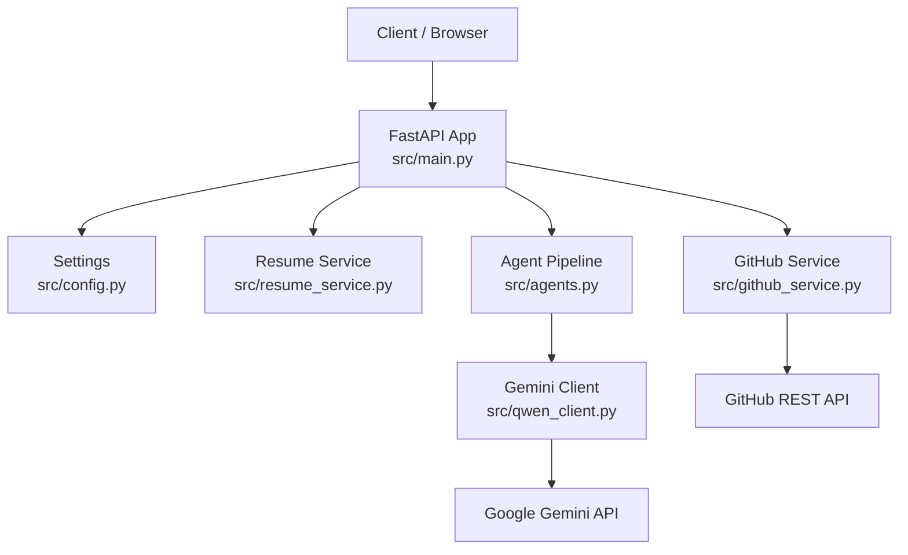
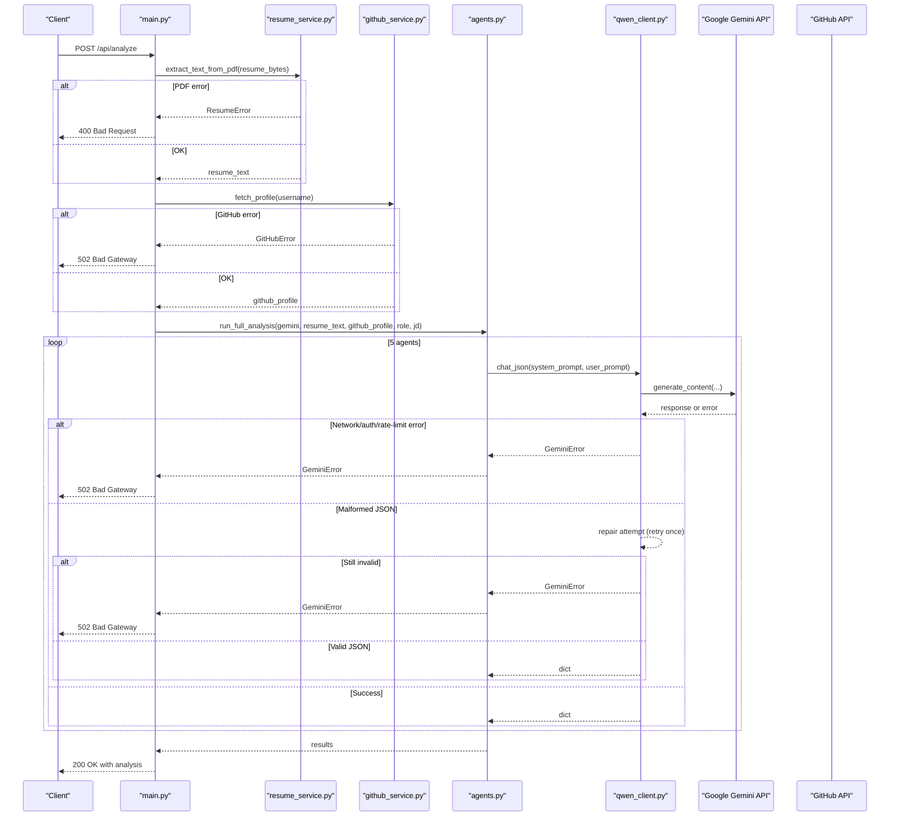
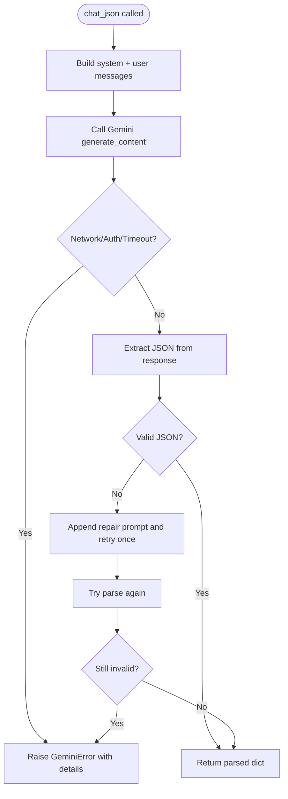
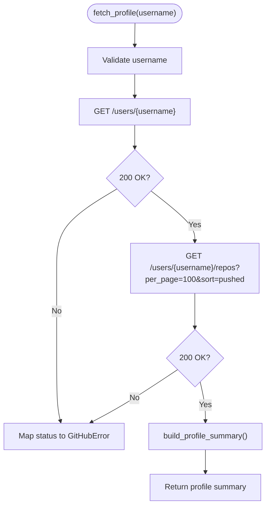
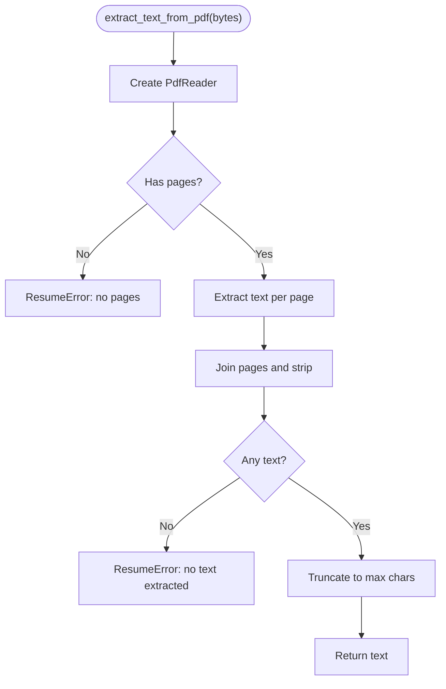
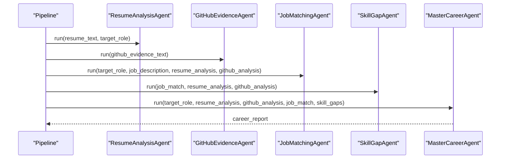
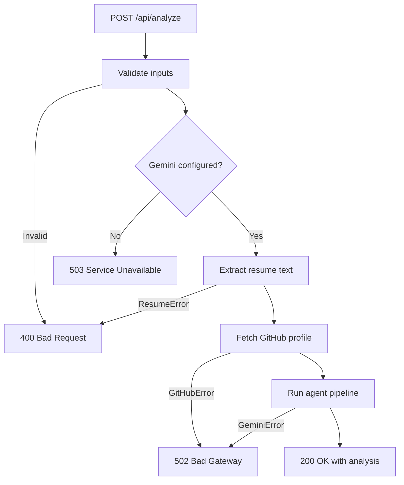
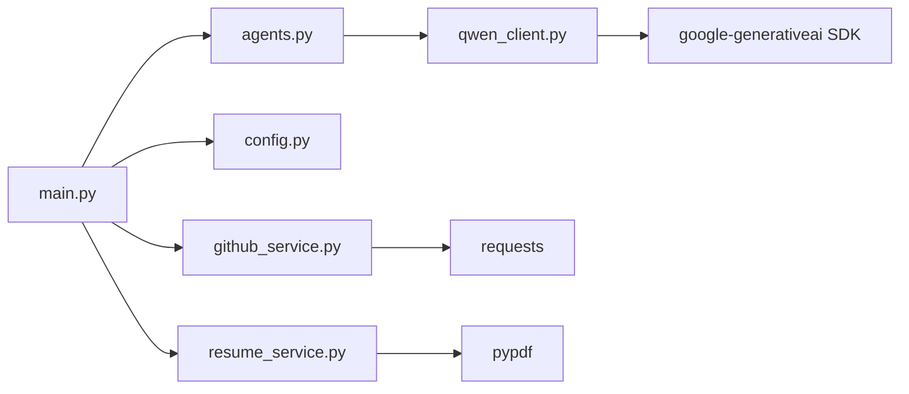

# Troubleshooting Guide

<cite>
**Referenced Files in This Document**
- [README.md](file://README.md)
- [requirements.txt](file://requirements.txt)
- [src/main.py](file://src/main.py)
- [src/config.py](file://src/config.py)
- [src/qwen_client.py](file://src/qwen_client.py)
- [src/github_service.py](file://src/github_service.py)
- [src/resume_service.py](file://src/resume_service.py)
- [src/agents.py](file://src/agents.py)
- [tests/test_pipeline.py](file://tests/test_pipeline.py)
</cite>

## Update Summary
**Changes Made**
- Updated all references from Qwen API to Google Gemini API throughout the document
- Revised configuration sections to reflect new environment variables (GOOGLE_API_KEY, GEMINI_MODEL, etc.)
- Updated error handling and diagnostic steps for Gemini-specific issues
- Enhanced troubleshooting procedures for multi-agent pipeline failures with Gemini
- Added specific guidance for Google AI Studio setup and configuration
- Updated network connectivity troubleshooting for Google endpoints

## Table of Contents
1. [Introduction](#introduction)
2. [Project Structure](#project-structure)
3. [Core Components](#core-components)
4. [Architecture Overview](#architecture-overview)
5. [Detailed Component Analysis](#detailed-component-analysis)
6. [Dependency Analysis](#dependency-analysis)
7. [Performance Considerations](#performance-considerations)
8. [Troubleshooting Guide](#troubleshooting-guide)
9. [Monitoring and Alerting](#monitoring-and-alerting)
10. [Recovery Procedures](#recovery-procedures)
11. [Escalation and Support](#escalation-and-support)
12. [Conclusion](#conclusion)

## Introduction
This guide helps you diagnose and resolve common issues in CareerOS AI, including Google Gemini API connection failures, GitHub API rate limits, PDF parsing errors, configuration problems, multi-agent pipeline failures, performance bottlenecks, network connectivity issues, and recovery procedures. It also provides monitoring and alerting recommendations to detect issues proactively.

## Project Structure
CareerOS AI is a FastAPI application that orchestrates five specialized agents to analyze a resume and GitHub profile using Google Gemini via the google-generativeai SDK. The main entry point exposes a web UI and an analysis API. Configuration is loaded from environment variables (including .env). External integrations include the Google Gemini chat API and GitHub REST API. PDF text extraction uses pypdf.

**Diagram sources**
- [src/main.py:28-147](file://src/main.py#L28-L147)
- [src/config.py:23-72](file://src/config.py#L23-L72)
- [src/resume_service.py:24-58](file://src/resume_service.py#L24-L58)
- [src/github_service.py:63-147](file://src/github_service.py#L63-L147)
- [src/agents.py:295-335](file://src/agents.py#L295-L335)
- [src/qwen_client.py:74-161](file://src/qwen_client.py#L74-L161)

**Section sources**
- [README.md:173-202](file://README.md#L173-L202)
- [src/main.py:1-160](file://src/main.py#L1-L160)
- [src/config.py:1-72](file://src/config.py#L1-L72)

## Core Components
- FastAPI app and endpoints: health check and full analysis pipeline orchestration.
- Configuration loader for secrets and runtime settings.
- Gemini client wrapper with JSON output enforcement and retry on malformed responses.
- GitHub service for fetching public profile data and building evidence summaries.
- Resume service for extracting text from PDFs with size and content validation.
- Agent pipeline orchestrating five specialized agents and synthesizing final report.

Key responsibilities and failure points are mapped below to support targeted troubleshooting.

**Section sources**
- [src/main.py:45-147](file://src/main.py#L45-L147)
- [src/config.py:23-72](file://src/config.py#L23-L72)
- [src/qwen_client.py:74-161](file://src/qwen_client.py#L74-L161)
- [src/github_service.py:22-147](file://src/github_service.py#L22-L147)
- [src/resume_service.py:17-58](file://src/resume_service.py#L17-L58)
- [src/agents.py:29-335](file://src/agents.py#L29-L335)

## Architecture Overview
The analysis flow validates inputs, extracts resume text, fetches GitHub evidence, runs five agents in sequence, and returns a synthesized career report. Errors at each stage are raised as domain-specific exceptions and converted to appropriate HTTP status codes by the API layer.

**Diagram sources**
- [src/main.py:58-147](file://src/main.py#L58-L147)
- [src/resume_service.py:24-58](file://src/resume_service.py#L24-L58)
- [src/github_service.py:63-147](file://src/github_service.py#L63-L147)
- [src/agents.py:295-335](file://src/agents.py#L295-L335)
- [src/qwen_client.py:98-161](file://src/qwen_client.py#L98-L161)

## Detailed Component Analysis

### Google Gemini Integration (qwen_client.py)
**Updated** - Now uses Google Gemini API instead of Qwen API

- Purpose: Wraps the Google Gemini API through the google-generativeai SDK, enforces strict JSON output, and retries once if the model returns non-JSON content.
- Common failures:
  - Missing or invalid GOOGLE_API_KEY: raises a specific error during client initialization.
  - Network errors, timeouts, auth failures, rate limits: wrapped into a single exception type with actionable messages.
  - Malformed JSON: attempts one repair call; if still invalid, raises an error including raw output snippet.
- Diagnostics:
  - Check GOOGLE_API_KEY validity and GEMINI_MODEL availability.
  - Inspect agent name included in error messages to identify which agent failed.
  - Validate that the Gemini model supports the requested parameters.

**Diagram sources**
- [src/qwen_client.py:98-161](file://src/qwen_client.py#L98-L161)

**Section sources**
- [src/qwen_client.py:74-161](file://src/qwen_client.py#L74-L161)

### GitHub Service (github_service.py)
- Purpose: Fetches public GitHub profile and repositories, builds a compact summary and evidence text for the GitHub Evidence Agent.
- Common failures:
  - Invalid username: explicit validation raises a friendly error.
  - Rate limiting: detects zero remaining requests and instructs adding a token to increase limits.
  - Network errors or unexpected status codes: translated into a generic error message.
- Diagnostics:
  - Verify GITHUB_TOKEN presence and validity.
  - Confirm network reachability to api.github.com.
  - Reduce concurrent calls or add backoff if hitting limits.

**Diagram sources**
- [src/github_service.py:63-147](file://src/github_service.py#L63-L147)

**Section sources**
- [src/github_service.py:22-173](file://src/github_service.py#L22-L173)

### Resume Service (resume_service.py)
- Purpose: Extracts plain text from uploaded PDFs, enforcing size limits and handling unreadable or image-only PDFs.
- Common failures:
  - Non-PDF file: caught and reported as a readable error.
  - Empty pages or no extractable text: indicates scanned/image-based resumes not supported.
  - Oversized resumes: truncated to configured character limit to control cost and latency.
- Diagnostics:
  - Ensure the file is a valid PDF with selectable text.
  - Adjust MAX_RESUME_MB and MAX_RESUME_CHARS if needed.

**Diagram sources**
- [src/resume_service.py:24-58](file://src/resume_service.py#L24-L58)

**Section sources**
- [src/resume_service.py:17-58](file://src/resume_service.py#L17-L58)

### Agent Pipeline (agents.py)
- Purpose: Orchestrates five agents in a defined order: Resume Analysis, GitHub Evidence, Job Matching, Skill Gap, and Master synthesis. Each agent calls Gemini with structured prompts and expects JSON outputs.
- Failure propagation:
  - Any agent failure raises GeminiError, which bubbles up to the API layer and becomes a 502 response.
  - The Master agent depends on all prior outputs; missing or malformed data can cause downstream failures.
- Diagnostics:
  - Identify failing agent from error messages.
  - Validate input sizes (e.g., job description truncation) and ensure required fields exist.

**Diagram sources**
- [src/agents.py:29-335](file://src/agents.py#L29-L335)

**Section sources**
- [src/agents.py:29-335](file://src/agents.py#L29-L335)

### API Layer (main.py)
- Responsibilities:
  - Serve static frontend and health endpoint.
  - Validate inputs (PDF format, size, required fields).
  - Orchestrate services and agent pipeline.
  - Map service and client exceptions to HTTP status codes.
- Error mapping:
  - ResumeError -> 400 Bad Request.
  - GitHubError -> 502 Bad Gateway.
  - GeminiError -> 502 Bad Gateway.
  - Missing Gemini configuration -> 503 Service Unavailable.

**Diagram sources**
- [src/main.py:58-147](file://src/main.py#L58-L147)

**Section sources**
- [src/main.py:45-147](file://src/main.py#L45-L147)

## Dependency Analysis
External dependencies and their roles:
- fastapi, uvicorn: Web server and framework.
- google-generativeai: SDK used to call Google Gemini API.
- python-dotenv: Loads .env for secrets.
- requests: Used to call GitHub REST API.
- pypdf: PDF text extraction.
- python-multipart, pydantic: Form parsing and validation helpers.

**Diagram sources**
- [requirements.txt:1-8](file://requirements.txt#L1-L8)
- [src/main.py:14-21](file://src/main.py#L14-L21)
- [src/agents.py:21-24](file://src/agents.py#L21-L24)
- [src/qwen_client.py:22-28](file://src/qwen_client.py#L22-L28)
- [src/github_service.py:12-17](file://src/github_service.py#L12-L17)
- [src/resume_service.py:9-14](file://src/resume_service.py#L9-L14)

**Section sources**
- [requirements.txt:1-8](file://requirements.txt#L1-L8)

## Performance Considerations
- Analysis time: The pipeline makes multiple sequential LLM calls; total time depends on model and network latency.
- Memory usage: Large PDFs and large job descriptions increase memory and token usage; resume text is truncated to a configured limit.
- Timeouts:
  - Gemini calls use configurable temperature and token limits; adjust GEMINI_TEMPERATURE and GEMINI_MAX_TOKENS for different models.
  - GitHub calls use a configurable timeout; tune GITHUB_TIMEOUT accordingly.
- Rate limits:
  - GitHub unauthenticated rate limit is low; set GITHUB_TOKEN to raise limits significantly.
  - Gemini rate limits depend on your Google AI Studio plan; consider retries/backoff at higher layers if needed.
- Concurrency:
  - The current pipeline is synchronous; under high load, consider async processing or queuing to avoid blocking workers.

## Troubleshooting Guide

### Google Gemini API Connection Failures
**Updated** - Now covers Google Gemini instead of Qwen API

Symptoms:
- 502 Bad Gateway on /api/analyze.
- Error mentions Gemini API call failed with authentication, rate limit, timeout, or network issues.
- Agent names included in error messages help locate the failing step.

Diagnostic steps:
- Verify GOOGLE_API_KEY is set and valid from Google AI Studio.
- Confirm GEMINI_MODEL is available and compatible (default: gemini-3.6-flash).
- Check GEMINI_TEMPERATURE and GEMINI_MAX_TOKENS settings.
- Increase timeout or adjust token limits if experiencing transient slowness.
- Validate network access to Google Gemini endpoints.

Resolution steps:
- Set or refresh GOOGLE_API_KEY from https://aistudio.google.com/apikey.
- Use correct model name for your account capabilities.
- If rate limited, wait or upgrade Google AI Studio plan; implement exponential backoff at higher layers.
- For persistent auth errors, regenerate API key and reconfigure.

References:
- [src/qwen_client.py:77-96](file://src/qwen_client.py#L77-L96)
- [src/qwen_client.py:123-161](file://src/qwen_client.py#L123-L161)
- [src/config.py:34-41](file://src/config.py#L34-L41)
- [src/main.py:100-107](file://src/main.py#L100-L107)

### GitHub API Rate Limits
Symptoms:
- 502 Bad Gateway with message indicating rate limit reached.
- Frequent failures when fetching profile or repositories.

Diagnostic steps:
- Check X-RateLimit-Remaining header behavior in logs (handled internally).
- Verify GITHUB_TOKEN presence and validity.
- Monitor request volume against limits.

Resolution steps:
- Add GITHUB_TOKEN to .env to raise limits from 60 to 5000 requests/hour.
- Reduce concurrent requests or add delays between calls.
- Cache repeated queries if applicable.

References:
- [src/github_service.py:26-60](file://src/github_service.py#L26-L60)
- [src/config.py:48-50](file://src/config.py#L48-L50)

### PDF Parsing Errors
Symptoms:
- 400 Bad Request stating the file could not be read as a PDF, contains no pages, or has no extractable text.

Diagnostic steps:
- Confirm the uploaded file is a PDF with selectable text (not image-only scans).
- Check file size and ensure it is within MAX_RESUME_MB.
- Validate that the PDF is not corrupted.

Resolution steps:
- Re-export the resume as a text-based PDF.
- Adjust MAX_RESUME_MB and MAX_RESUME_CHARS if necessary.
- For scanned resumes, integrate OCR before extraction.

References:
- [src/resume_service.py:24-58](file://src/resume_service.py#L24-L58)
- [src/main.py:84-98](file://src/main.py#L84-L98)
- [src/config.py:55-56](file://src/config.py#L55-L56)

### Configuration Issues
**Updated** - Now covers Google Gemini configuration

Symptoms:
- 503 Service Unavailable indicating Gemini not configured.
- Unexpected behavior due to wrong model or temperature settings.

Diagnostic steps:
- Ensure .env exists and includes GOOGLE_API_KEY.
- Verify GEMINI_MODEL, GEMINI_TEMPERATURE, and GEMINI_MAX_TOKENS values.
- Confirm API_HOST and API_PORT for server binding.

Resolution steps:
- Copy .env.example to .env and fill credentials.
- Restart the application after changing environment variables.
- Use GET /health to verify configuration state.

References:
- [src/config.py:16-20](file://src/config.py#L16-L20)
- [src/config.py:34-41](file://src/config.py#L34-L41)
- [src/config.py:61-62](file://src/config.py#L61-L62)
- [src/main.py:45-55](file://src/main.py#L45-L55)
- [src/main.py:100-107](file://src/main.py#L100-L107)

### Multi-Agent Pipeline Failures
**Updated** - Now covers Gemini-specific pipeline issues

Symptoms:
- 502 Bad Gateway with GeminiError referencing a specific agent.
- Incomplete results where some agent outputs are missing.

Diagnostic steps:
- Identify the failing agent from error messages.
- Validate inputs passed to each agent (e.g., job description length, resume text length).
- Check for malformed JSON responses from the model; the client retries once automatically.

Resolution steps:
- Improve prompts or reduce input size to fit model constraints.
- Adjust GEMINI_MAX_TOKENS if outputs are truncated.
- Implement retry logic at the API layer for transient failures.
- Verify model compatibility with complex prompts.

References:
- [src/agents.py:295-335](file://src/agents.py#L295-L335)
- [src/qwen_client.py:123-161](file://src/qwen_client.py#L123-L161)
- [src/main.py:120-131](file://src/main.py#L120-L131)

### Network Connectivity Issues (Enterprise Environments)
**Updated** - Now covers Google API endpoints

Symptoms:
- Timeouts or connection errors to Google Gemini or GitHub endpoints.
- Intermittent failures depending on network conditions.

Diagnostic steps:
- Test outbound connectivity to Google AI Studio endpoints and https://api.github.com.
- Check firewall rules and proxy configurations.
- Validate DNS resolution and TLS certificates.

Resolution steps:
- Configure proxy settings at the OS or application level if required.
- Whitelist Google AI Studio domains in corporate firewalls.
- Increase timeouts for unstable networks.

References:
- [src/config.py:34-41](file://src/config.py#L34-L41)
- [src/config.py:48-50](file://src/config.py#L48-L50)

### Recovery Procedures for Failed Analyses
- Immediate recovery:
  - Retry the request after transient errors; implement exponential backoff.
  - Use GET /health to confirm service readiness before retrying.
- Data corruption scenarios:
  - If PDF parsing fails repeatedly, validate file integrity and re-export as text-based PDF.
  - If GitHub data appears stale or incomplete, clear any caches and re-run.
- Service restart protocols:
  - Restart the FastAPI process after updating .env or configuration changes.
  - Ensure dependencies are installed and compatible versions are present.

References:
- [src/main.py:45-55](file://src/main.py#L45-L55)
- [src/main.py:150-159](file://src/main.py#L150-L159)
- [requirements.txt:1-8](file://requirements.txt#L1-L8)

## Monitoring and Alerting
Recommended practices:
- Health checks:
  - Expose GET /health and monitor uptime and configuration flags (Gemini configured, GitHub token set).
- Metrics collection:
  - Track request latency, error rates (4xx, 5xx), and agent call durations.
  - Log counts of retries and failed JSON extractions.
- Alerts:
  - Alert on sustained 5xx errors, especially GeminiError and GitHubError spikes.
  - Alert on high latency percentiles (p95/p99) exceeding thresholds.
- Observability:
  - Centralize logs with correlation IDs per request.
  - Capture key stages: input validation, PDF extraction, GitHub fetch, agent calls, synthesis.

## Escalation and Support
- Internal escalation:
  - If Gemini errors persist across regions or models, engage Google AI Studio support with logs and timestamps.
  - For GitHub rate limit issues, verify token permissions and consider enterprise plans.
- Community resources:
  - Use project documentation and issue trackers for known limitations and feature requests.
  - Engage discussions for best practices and shared experiences.

References:
- [README.md:398-408](file://README.md#L398-L408)

## Conclusion
This guide maps common failures to their root causes and provides actionable diagnostics and resolutions. By validating Google Gemini configuration, monitoring external APIs, tuning performance parameters, and implementing robust error handling and retries, you can maintain reliable operation of the CareerOS AI multi-agent pipeline.